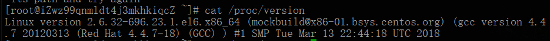

# linux常用命令

<font style="color:rgb(0, 0, 0);background-color:rgb(254, 254, 242);">yum update：升级所有包同时也升级软件和系统内核</font>

<font style="color:rgb(0, 0, 0);background-color:rgb(254, 254, 242);">yum upgrade：只升级所有包，不升级软件和系统内核</font>

```bash
#查询某个文件安装位置与安装文件
rpm -qla|grep nginx
```


```bash
###查看centos版本
 cat /proc/version 
 cat /etc/issue
```



```bash
#Linux查看cpu相关信息，包括型号、主频、内核信息等: 
cat /proc/cpuinfo
```

查看centos正在跑的服务

```bash
systemctl | grep running
```


> 更新: 2024-07-01 16:37:59  
> 原文: <https://www.yuque.com/lixinsi/gpngnc/gcalqe>