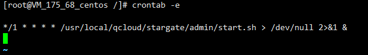
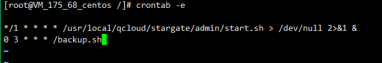
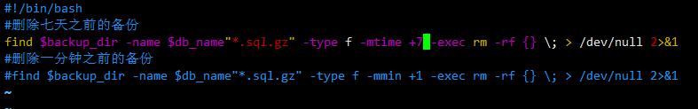

# redhat7.3操作手册

# 安装MySQL
开启sshd服务

 nano /etc/ssh/ssh_config 

<font style="color:rgb(51, 51, 51);">把port 22前面的#删除，然后Ctrl+x保存</font>

<font style="color:rgb(51, 51, 51);">service sshd start  开启sshd服务</font>


//检查并且卸载

rpm -qa | grep subscription-manager

rpm -e subscription-manager-1.17.15-1.el7.x86_64


<font style="color:rgb(77, 77, 77);">清除缓存： yum clean all</font>

<font style="color:rgb(77, 77, 77);">上传安装文件</font>

<font style="color:rgb(77, 77, 77);">mkdir app</font>

<font style="color:rgb(77, 77, 77);">app 目录下面分别有mysql文件夹，nignx文件夹，tomat文件夹</font>

<font style="color:rgb(77, 77, 77);">进入mysql文件夹解压mysql</font>

 rpm -qa |grep mariadb

rpm -e --nodeps mariadb-libs-5.5.52-1.el7.x86_64

rpm -ivh mysql-community-common-5.7.26-1.el7.x86_64.rpm 

rpm -ivh mysql-community-libs-5.7.26-1.el7.x86_64.rpm 

rpm -ivh mysql-community-client-5.7.26-1.el7.x86_64.rpm 

rpm -ivh mysql-community-server-5.7.26-1.el7.x86_64.rpm 


此时mysql已经安装完成

<font style="color:rgb(0, 0, 0);">启动</font><font style="color:rgb(0, 0, 0);">mysql</font>

<font style="color:rgb(0, 0, 0);">systemctl start mysqld</font>

<font style="color:rgb(0, 0, 0);">cat /var/log/mysqld.log | grep password --</font><font style="color:rgb(0, 0, 0);">查找密码，并且需要记录密码。</font>

<font style="color:rgb(0, 0, 0);"> </font>

<font style="color:rgb(0, 0, 0);">mysql -uroot -p --</font><font style="color:rgb(0, 0, 0);">登入</font>

<font style="color:rgb(0, 0, 0);">修改密码</font>

<font style="color:rgb(0, 0, 0);">vim /etc/my.cnf</font>

<font style="color:rgb(0, 0, 0);">validate_password=off</font>

<font style="color:rgb(0, 0, 0);">无需密码登入</font>

 skip-grant-tables


然后重新启动mysql服务就可以了

systemctl restart mysqld

<font style="color:rgb(0, 0, 0);"> </font>

<font style="color:rgb(0, 0, 0);">systemctl restart mysqld ---</font><font style="color:rgb(0, 0, 0);">重启</font><font style="color:rgb(0, 0, 0);">mysql</font>

<font style="color:rgb(0, 0, 0);">alter user 'root'@'localhost' identified by 'sa123'; --</font><font style="color:rgb(0, 0, 0);">修改密码</font>

<font style="color:rgb(0, 0, 0);">配置远程连接</font>

<font style="color:rgb(0, 0, 0);">vi /etc/my.cnf ---</font><font style="color:rgb(0, 0, 0);">修改配置文件</font>

<font style="color:rgb(0, 0, 0);">character-set-server=utf8</font>

<font style="color:rgb(0, 0, 0);">collation-server=utf8_general_ci</font>


<font style="color:rgb(0, 0, 0);"></font>

<font style="color:rgb(0, 0, 0);">default-character-set=utf8</font>

<font style="color:rgb(0, 0, 0);"> </font>

<font style="color:rgb(0, 0, 0);">mysql -u root -p --</font><font style="color:rgb(0, 0, 0);">登入</font><font style="color:rgb(0, 0, 0);">mysql</font>

<font style="color:rgb(0, 0, 0);">set password=password('sa123');</font>

<font style="color:rgb(0, 0, 0);">MySQL </font><font style="color:rgb(128, 0, 128);">8</font><font style="color:rgb(0, 0, 0);">.0</font><font style="color:rgb(0, 0, 0);">已经不支持下面这种命令写法</font>

<font style="color:rgb(0, 0, 0);">grant all privileges on </font><font style="color:rgb(0, 0, 0);">*.* to root</font><font style="color:rgb(128, 0, 0);">@"%"</font><font style="color:rgb(0, 0, 0);"> identified by </font><font style="color:rgb(128, 0, 0);">"."</font><font style="color:rgb(0, 0, 0);">;</font>

<font style="color:rgb(0, 0, 0);">正确的写法是</font>

<font style="color:rgb(0, 0, 0);">grant all privileges on </font><font style="color:rgb(0, 0, 0);">*.* to </font><font style="color:rgb(128, 0, 0);">‘root‘</font><font style="color:rgb(0, 0, 0);">@</font><font style="color:rgb(128, 0, 0);">‘%‘</font><font style="color:rgb(0, 0, 0);"> </font>

<font style="color:rgb(0, 0, 0);">登入</font><font style="color:rgb(0, 0, 0);">mysql</font><font style="color:rgb(0, 0, 0);">后</font>

<font style="color:rgb(0, 0, 0);">创建数据库</font>

<font style="color:rgb(0, 0, 0);">create database +</font><font style="color:rgb(0, 0, 0);">数据库名字；</font>

<font style="color:rgb(0, 0, 0);">使用</font><font style="color:rgb(0, 0, 0);">mysql -uroot -p+</font><font style="color:rgb(0, 0, 0);">数据库密码 </font><font style="color:rgb(0, 0, 0);">-e "source +sql</font><font style="color:rgb(0, 0, 0);">文件当前路径</font><font style="color:rgb(0, 0, 0);">"</font>

1、首先建空数据库

mysql> create database abc;


2、导入数据库

（1）选择数据库

mysql>use abc;

（2）设置数据库编码

mysql>set names utf8;

创建数据库

<font style="color:rgb(167, 29, 93);">create</font><font style="color:rgb(51, 51, 51);background-color:rgb(243, 244, 245);"> database 数据库名字 charset</font><font style="color:rgb(51, 51, 51);">=</font><font style="color:rgb(51, 51, 51);background-color:rgb(243, 244, 245);">utf8;</font>

（3）导入数据（注意sql文件的路径）

mysql>source /home/abc/abc.sql;

<font style="color:rgb(0, 0, 0);"></font>

<font style="color:rgb(0, 0, 0);">一、开放</font><font style="color:rgb(0, 0, 0);">3306</font><font style="color:rgb(0, 0, 0);">端口</font>

<font style="color:rgb(0, 0, 0);">1.</font><font style="color:rgb(0, 0, 0);">开启端口</font><font style="color:rgb(0, 0, 0);">3306</font>

<font style="color:rgb(0, 0, 0);">firewall-cmd --zone=public --add-port=3306/tcp --permanent</font>

<font style="color:rgb(0, 0, 0);">2.</font><font style="color:rgb(0, 0, 0);">重启防火墙</font>

<font style="color:rgb(0, 0, 0);">firewall-cmd --reload</font>

<font style="color:rgb(0, 0, 0);">3.</font><font style="color:rgb(0, 0, 0);">查看已经开放的端口</font>

<font style="color:rgb(0, 0, 0);">firewall-cmd --list-ports</font>

<font style="color:rgb(51, 51, 51);">service network restart</font>

# <font style="color:rgb(51, 51, 51);">安装nginx</font>
cd nginx/

 tar -zxvf nginx-1.16.1.tar.gz 

 cd nginx-1.16.1/

./configure 

<font style="color:rgb(0, 0, 0);">1.开启端口80</font>

<font style="color:rgb(0, 0, 0);">firewall-cmd --zone=public --add-port=80/tcp --permanent</font>

<font style="color:rgb(0, 0, 0);">2.</font><font style="color:rgb(0, 0, 0);">重启防火墙</font>

<font style="color:rgb(0, 0, 0);">firewall-cmd --reload</font>

<font style="color:rgb(0, 0, 0);">3.</font><font style="color:rgb(0, 0, 0);">查看已经开放的端口</font>

<font style="color:rgb(0, 0, 0);">firewall-cmd --list-ports</font>

<font style="color:rgb(51, 51, 51);">service network restart</font>

<font style="color:rgb(0, 0, 0);">4.关闭防火墙</font>  
<font style="color:rgb(0, 0, 0);">systemctl stop firewalld.service #停止firewall</font>  
<font style="color:rgb(0, 0, 0);">systemctl disable firewalld.service #禁止firewall开机启动</font>

<font style="color:rgb(77, 77, 77);">查看</font>[nginx](https://so.csdn.net/so/search?q=nginx&spm=1001.2101.3001.7020)<font style="color:rgb(77, 77, 77);">运行状态</font>

| <font style="color:rgb(79, 79, 79);">$</font><font style="color:rgb(79, 79, 79);"> </font><font style="color:rgb(79, 79, 79);">ps  -ef |</font><font style="color:rgb(79, 79, 79);"> </font>[grep](https://so.csdn.net/so/search?q=grep&spm=1001.2101.3001.7020)<font style="color:rgb(79, 79, 79);"> </font><font style="color:rgb(79, 79, 79);">nginx</font> |
| :--- |


<font style="color:rgb(61, 70, 77);">1、安装pcre</font>

<font style="color:rgb(61, 70, 77);">解压：tar -zxvf pcre2-10.35.tar.gz  
</font><font style="color:rgb(61, 70, 77);">进入解压目录  
</font><font style="color:rgb(61, 70, 77);">配置： ./configure  
</font><font style="color:rgb(61, 70, 77);">编译： make  
</font><font style="color:rgb(61, 70, 77);">安装：make install</font>

<font style="color:rgb(61, 70, 77);">2、安装OpenSSL</font>

<font style="color:rgb(61, 70, 77);">解压：tar -zxvf openssl-1.1.1g.tar.gz  
</font><font style="color:rgb(61, 70, 77);">进入解压目录：cd openssl-1.1.1g  
</font><font style="color:rgb(61, 70, 77);">配置： ./config  
</font><font style="color:rgb(61, 70, 77);">编译： make  
</font><font style="color:rgb(61, 70, 77);">安装：make install</font>

<font style="color:rgb(61, 70, 77);">如果输入openssl version</font>

<font style="color:rgb(61, 70, 77);">在root用户下执行：</font>

<font style="color:rgb(61, 70, 77);">ln -s /usr/local/lib64/libssl.so.1.1 /usr/lib64/libssl.so.1.1</font>

<font style="color:rgb(61, 70, 77);">ln -s /usr/</font><font style="color:rgb(61, 70, 77);">local/lib64/libcrypto.so.1.1 /usr/lib64/libcrypto.so.1.1</font>

<font style="color:rgb(61, 70, 77);">3、安装zlib</font>

<font style="color:rgb(61, 70, 77);">解压：tar -zxvf zlib-1.2.11.tar.gz  
</font><font style="color:rgb(61, 70, 77);">进入解压目录：cd zlib-1.2.11  
</font><font style="color:rgb(61, 70, 77);">配置： ./configure  
</font><font style="color:rgb(61, 70, 77);">编译： make  
</font><font style="color:rgb(61, 70, 77);">安装：make install</font>

<font style="color:rgb(61, 70, 77);">4、安装nginx-1.16.1.tar.gz</font>

<font style="color:rgb(61, 70, 77);">解压：tar -zxvf nginx-1.16.1.tar.gz  
</font><font style="color:rgb(61, 70, 77);">进入解压目录：cd nginx-1.16.1  
</font><font style="color:rgb(61, 70, 77);">配置： ./configure（如果不行可以忽略依赖 ./configure --without-http_rewrite_module）  
</font><font style="color:rgb(61, 70, 77);">编译： make  
</font><font style="color:rgb(61, 70, 77);">安装：make install</font>

<font style="color:rgb(61, 70, 77);">cd </font> /usr/local/nginx/sbin

启动nginx

./nginx

# 安装tomcat
  rpm -ivh jdk-8u333-linux-i586.rpm 

  tar -zxvf apache-tomcat-10.0.21.tar.gz 

 cd apache-tomcat-10.0.21

<font style="color:rgb(0, 0, 0);">cd bin</font>

<font style="color:rgb(0, 0, 0);">sh startup.sh或者./startup.sh</font>

<font style="color:rgb(35, 38, 41);">看起来您在 /opt/ 中解压了一个 tar.gz 文件。这个版本显然是在尝试使用 32bits /lib/ld-linux.so.2。（64位链接器是/usr/lib64/ld-linux-x86-64.so.2 -> ld-2.17.so）</font>

<font style="color:rgb(35, 38, 41);"> EL7，请使用“rpm”8u </font>**<font style="color:rgb(35, 38, 41);">162 </font>**[http://www.oracle.com/technetwork/java/javase/downloads/jdk8-downloads-2133151.html](http://www.oracle.com/technetwork/java/javase/downloads/jdk8-downloads-2133151.html)<font style="color:rgb(35, 38, 41);"> → </font>**<font style="color:rgb(35, 38, 41);">jdk-8u162-linux-x64.rpm</font>**<font style="color:rgb(35, 38, 41);">：</font>

# <font style="color:rgb(0, 0, 0);">mysql备份脚本</font>
```shell
mysqldump -uroot -p --all-databases > /backup/xabank_questiondb_$(date +%Y%m%d%H%M%S).sql
mysqldump -uroot -p --all-databases > /backup/xabank_resourcedb_$(date +%Y%m%d%H%M%S).sql
mysqldump -uroot -p --all-databases > /backup/xabank_systemdb_$(date +%Y%m%d%H%M%S).sql
```

注：

username、password、database_name替换为自己的数据库用户名、密码、需要备份的数据库名

database_name_$(date +%Y%m%d%H%M%S)为生成的备份文件名称，可自定义，这里文件名是数据库名 + 下划线 + 具体时间，$(date +%Y%m%d%H%M%S)可获取到当前日期，%Y %m %d %H %M %S 分别对应年、月、日、时、分

3. 赋予可执行权限

chmod u+x backup.sh 或chmod +x backup.sh

这个命令要在文件存在的路径下执行才行，或者

chmod u+x /direction/backup.sh

chmod +x /direction/backup.sh

[  
](https://blog.csdn.net/SWPU_Lipan/article/details/80752480)

## <font style="color:rgb(79, 79, 79);">创建定时备份任务需要使用 crontab</font>
<font style="color:rgb(77, 77, 77);">执行 crontab 命令，如果输出 command not found，就表明没有安装  
</font><font style="color:rgb(77, 77, 77);">这是要先安装crontab，网上有教程，这里不再赘述  
</font><font style="color:rgb(77, 77, 77);">我的Linux服务器系统为Centos7，crontab 已经安装好  
</font><font style="color:rgb(77, 77, 77);">执行命令：</font>

```shell
crontab -e
```



<font style="color:rgb(77, 77, 77);">这里已经存在一个定时任务了</font>  
<font style="color:rgb(77, 77, 77);">和 vim 编辑一样，英文输入下按 i 进入insert模式，就可以添加定时任务了</font>



Crontab 格式

分　时　日　月　周　执行命令

第 1 列分钟 1～59，每分钟用 *或者*/1表示，整点分钟数为00或0

第 2 列小时 1～23（0 表示 0 点）

第 3 列日 1～31

第 4 列月 1～12

第 5 列星期 0～6（0 表示星期天）

第 6 列要运行的命令

0 3 * * * /backup.sh，此命令表示在每天的凌晨三点执行一次脚本，可自行调整

## <font style="color:rgb(79, 79, 79);">6. 定期删除备份文件</font>
<font style="color:rgb(77, 77, 77);">只是一味地备份是不行的，磁盘再大，也有用完的时候，况且保存很久以前的数据也没有任何意义，我们需要备份的是近期最新的数据，所以定期删除文件就很有必要了  
</font><font style="color:rgb(77, 77, 77);">定期删除，我们只需要在脚本文件中添加以下命令</font>

```shell
#删除七天之前的备份
find $backup_dir -name $db_name"*.sql.gz" -type f -mtime +7 -exec rm -rf {} \; > /dev/null 2>&1
#删除一分钟之前的备份
find $backup_dir -name $db_name"*.sql.gz" -type f -mmin +1 -exec rm -rf {} \; > /dev/null 2>&1
```

-type f 表示查找普通类型的文件，f 表示普通文件，可不写

-mtime +7 按照文件的更改时间来查找文件，+7表示文件更改时间距现在7天以前;如果是-mmin +7表示文件更改时间距现在7分钟以前

-exec rm {} ; 表示执行一段shell命令，exec选项后面跟随着所要执行的命令或脚本，然后是一对{ }，一个空格和一个\，最后是一个分号;

/dev/null 2>&1 把标准出错重定向到标准输出，然后扔到/DEV/NULL下面去。通俗的说，就是把所有标准输出和标准出错都扔到垃圾桶里面；其中的& 表示让该命令在后台执行




————————————————

[  
](https://blog.csdn.net/SWPU_Lipan/article/details/80752480)

[https://blog.csdn.net/SWPU_Lipan/article/details/80752480](https://blog.csdn.net/SWPU_Lipan/article/details/80752480)


#   
 


> 更新: 2022-08-23 15:24:46  
> 原文: <https://www.yuque.com/lixinsi/gpngnc/ehepvi>