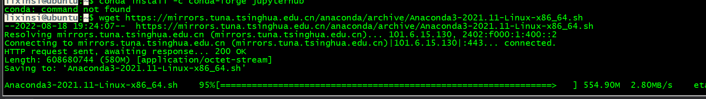

# ubantu安装jupyter hub

# 安装基础
```shell

sudo su root

```

# 1.<font style="color:rgb(18, 18, 18);">下载 Anaconda</font>
```shell
sudo apt-get install net-tools wget openssh-server
```

<font style="color:rgb(18, 18, 18);">进入 Ubuntu，自己新建下载路径，输入以下命令开始下载</font>

```shell
wget https://mirrors.tuna.tsinghua.edu.cn/anaconda/archive/Anaconda3-2021.11-Linux-x86_64.sh
```



# 2.<font style="color:rgb(18, 18, 18);">安装 Anaconda</font>
<font style="color:rgb(18, 18, 18);">输入命令</font>

```shell
bash Anaconda3-2021.11-Linux-x86_64.sh
```

```shell
sudo su root #切换root权限
```

<font style="color:rgb(51, 51, 51);">要使用 conda 安装此软件包，请运行以下命令</font>

```shell
conda install -c conda-forge jupyterhub
```

1️⃣For changes to take effect, close and re-open your current shell.，翻译过来就是：关闭当前命令行，并重新打开，刚刚安装和初始化Anaconda设置才可以生效，重新打开一个命令行后直接就进入了conda的base环境，如下：


# 3.生成配置文件
```shell
jupyterhub --generate-config
```

# 4.修改配置文件
```shell
c.JupyterHub.ip = '192.168.24.***'
c.JupyterHub.port = 445
c.PAMAuthenticator.encoding = 'utf-8'
c.LocalAuthenticator.create_system_users = False
c.Authenticator.whitelist = {'dada','haha',‘name’}
c.JupyterHub.statsd_prefix = 'jupyterhub'
#c.Authenticator.admin_users = {'famu'}
#c.Spawner.env_keep.append('LD_LIBRARY_PATH')

JupyterHub.ip是你本机局域网的ip，记得是局域网
JupyterHub.port是我们指定的端口，随便指定一个不和其他服务冲突的端口就行
Authenticator.whitelist 比较重要，这里面需要将linux的用户名添加进入，这样该用户就可以通过浏览器利用linux的用户名和密码登录自己的账户，jupyterhub采用和linux系统相同的认证方式，所以我们不需要另外建立用户，只需要登录linux的用户和密码即可。
c.Spawner.env_keep.append('LD_LIBRARY_PATH')这行是我们踩的坑，因为用了GPU版的tensorflow，这个目的是将LD_LIBRARY_PATH的路径放到jupyterhub中，这样才能正确使用GPU版的tensorflow。

```

```shell
# 用户名单设置，默认身份验证方式PAM与NUIX系统用户管理层一致，root用户可以添加用户test1,test2等等，非root用户，sudo useradd test1/test2 不起作用，目前我不知道sudo useradd 和 root下 useradd本质区别*（没有特意学过linux，一切只靠用时百度）
# c.Authenticator.allowed_users = {'test1', 'test2'}
c.Authenticator.admin_users = {'root'}  # 管理员用户
c.DummyAuthenticator.password = "xs301302"  # 初始密码设置
c.JupyterHub.admin_access = True  # 则管理员有权在各自计算机上以其他用户身份登录，以进行调试
c.LocalAuthenticator.create_system_users=True  # 此选项通常用于 JupyterHub 的托管部署，以避免在启动服务之前手动创建所有用户

# 设置每个用户的 book类型 和 工作目录（创建.ipynb文件自动保存的地方）
c.Spawner.notebook_dir = '~'
c.Spawner.default_url = '/lab'
c.Spawner.args = ['--allow-root'] 

# 为jupyterhub 添加额外服务，用于处理闲置用户进程。使用时不好使安装一下：pip install jupyterhub-ilde-culler
c.JupyterHub.services = [
    {
        'name': 'idle-culler',
        'command': ['python3', '-m', 'jupyterhub_idle_culler', '--timeout=3600'],
        'admin':True # 1.5.0 需要服务管理员权限，去kill 部分闲置的进程notebook, 2.0版本已经改了，可以只赋给 idel-culler 部分特定权限，roles
    }
```

# 5.启动jupyterhub
```shell
jypyterhub
```

```shell
#查看是否开启3306端口
netstat -an | grep 3306

#修改Mysql配置文件（注意路径，跟之前网上的很多版本位置都不一样）
root@node1:~# vim /etc/mysql/mysql.conf.d/mysqld.cnf

#找到
bind-address            = 127.0.0.1
前面加#注释掉

#重新启动mysql服务
sudo /etc/init.d/mysql restart
```


> 更新: 2022-08-22 08:29:19  
> 原文: <https://www.yuque.com/lixinsi/gpngnc/ztt3cv>