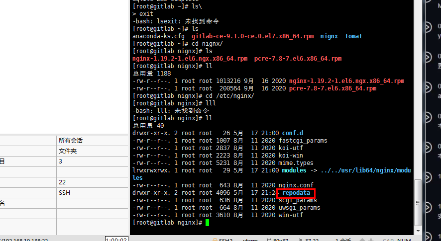
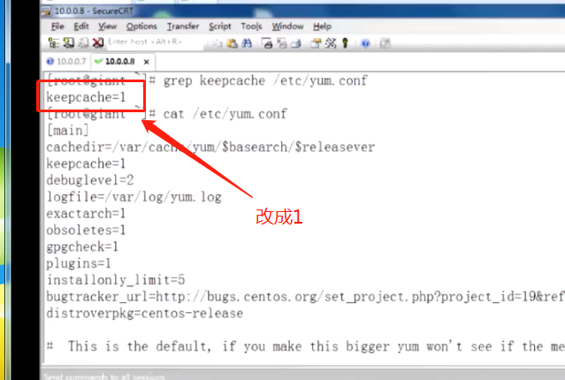

# 企业级yum源

首先查看centos版本

```shell
//1.指定下载
cat /etc/centos-release --查看系统版本
yum install -y createrepo --安装yum源
rpm -qa createrepo    --查看createrepo版本
--创建目录
mkdir -p /application/yum/centos/x86_64
--下载需要的依赖包
yumdownloader pcre-devel openssl-devel zlib-devel
--解压
tar -xf +包名.tar.gz
--统计一共有多少个包
*.rpm | wc -l
--查看下载安装包
ll
//2.修改配置文件
vi /etc/yum.conf 
sed -i 's#keepcache=0#keepcache=1#g' /etc/yum.conf ---0改成1
grep keecache /etc/yum.conf                        --查看修改成功

//打包流程
//1.上传二进制包
```

```shell
//打包
createrepo -pdo /etc/nginx/ /etc/nginx/
关闭nignx
 pkill nignx
关闭httpd
/etc/init.d/httpd stop
查看80端口是否被占用
netstat -tunlp | grep :80

```



```shell
1）yum简介

//yum（全称为 Yellow dog Updater Modified）
	是一个在Fedora、RedHat和CentOS中的Shell前端软件包管理器。基于RPM包管理，能够从指定的服务器自动下载RPM包并且安装，可以自动处理依赖性关系，并且一次安装所有依赖的软件包，无须繁琐地一次次下载、安装。
	注意：（Redhat/CentOS/Fedora同门兄弟）
	
//YUM源是什么
	YUM主要用于自动升级、安装、移除rpm软件包，它能自动查找并解决rpm包之间的依赖关系，要成功的使用YUM工具更新系统和软件，需要有一个包含各种rpm软件包的repository[rɪˈpɒzətri]（软件仓库），提供软件仓库的服务器。	
	习惯上成为“源”服务器。网络上有大量的源服务器，但是，由于受到网络连接速度、带宽的限制，导致软件安装耗时过长甚至失败。特别是当有大量服务器大量软件包需要升级时，更新的缓慢程序令人难以忍受。
	相比较而言，本地YUM源服务器最大优点在局域网的快速网络连接和稳定性。有了局域网中的YUM源服务器，即便在Internet连接中断的情况下，也不会影响其他YUM客户端的软件升级和安装。

2）yum工作原理
//搭建yum源工作原理（实质：更换下载地址）
	目的：增加自主性（不要的版本去掉glusterfs），灵活性（增加openstack、glusternfs）
		  主动性（中断互联网，也不影响yum软件的安装）

 

3）配置yum仓库
# yum install -y httpd      //安装httpd网站服务（本节采用Python的http模块）
# rpm -qa httpd
	httpd-2.2.15-69.el6.centos.x86_64
# sed -i 's#\#ServerName www.example.com:80#ServerName 127.0.0.1:80#' /etc/httpd/conf/httpd.conf
# /etc/init.d/httpd start
	正在启动 httpd：                                           [确定]

//紧接上章的环境...

【.8】yum仓库服务器端

# cat /etc/redhat-release 
	CentOS release 6.7 (Final)

重要提示：
	自建yum源之后，无需修改*.repo文件内mirrors.aliyun.com地址成为内网地址
		只需更改hosts文件，例如echo '10.0.0.8 mirrors.aliyun.com' >> /etc/hosts
# grep mirrors.aliyun.com /etc/yum.repos.d/*.repo | wc -l             //回显：18

//安装createrepo工具即可
	（理解：create + repo 即创建yum仓库）

# yum install -y createrepo
# rpm -qa createrepo       
	createrepo-0.9.9-28.el6.noarch

//创建yum仓库目录
# mkdir -p /application/yum/centos6/x86_64
# cd /application/yum/centos6/x86_64

1)获取rpm软件包三种方式

a) 自己制作rpm包（第1种）
# rz 
	Transferring nginx_yum.tar.gz...                  //上节‘定制rpm包’遗留
	Transferring nginx-1.6.3-1.x86_64.rpm...          //上节‘定制rpm包’遗留
# tar -xf nginx_yum.tar.gz
# ll | wc -l                              //回显：20包

b)只下载软件不安装（第2种）
	（测试：不操作！）（同时下载了32位和64位软件包）（double）
# cd
# yumdownloader pcre-devel openssl-devel zlib-devel
-rw-r--r-- 1 root root 1.2M Aug 15 22:09 openssl-devel-1.0.1e-58.el6_10.i686.rpm
-rw-r--r-- 1 root root 1.2M Aug 15 22:09 openssl-devel-1.0.1e-58.el6_10.x86_64.rpm
-rw-r--r-- 1 root root 321K Jul 25  2015 pcre-devel-7.8-7.el6.i686.rpm
-rw-r--r-- 1 root root 321K Jul 25  2015 pcre-devel-7.8-7.el6.x86_64.rpm
-rw-r--r-- 1 root root  44K Feb 24  2013 zlib-devel-1.2.3-29.el6.i686.rpm
-rw-r--r-- 1 root root  44K Feb 24  2013 zlib-devel-1.2.3-29.el6.x86_64.rpm

# ll /application/yum/centos6/x86_64        //直接下载在本地，否则被分类保存（四个目录）
	-rw-r--r-- 1 root root 1227724 3月  23 2017 openssl-devel-1.0.1e-57.el6.i686.rpm
	-rw-r--r-- 1 root root 1227684 3月  23 2017 openssl-devel-1.0.1e-57.el6.x86_64.rpm
	-rw-r--r-- 1 root root  327952 7月  25 2015 pcre-devel-7.8-7.el6.i686.rpm
	-rw-r--r-- 1 root root  327960 7月  25 2015 pcre-devel-7.8-7.el6.x86_64.rpm

c)平时yum安装软件时，不删除安装包（第3种）   
	（上章已经完成配置...）

# cp /etc/yum.conf /etc/yum.conf.ori
# cat /etc/yum.conf 
[main]
cachedir=/var/cache/yum/$basearch/$releasever           # 默认rpm包下载后保存目录
keepcache=0
debuglevel=2
logfile=/var/log/yum.log
exactarch=1
obsoletes=1
gpgcheck=1
plugins=1
installonly_limit=5
bugtracker_url=http://bugs.centos.org/set_project.php?project_id=19&ref=http://bugs.centos.org/bug_report_page.php?category=yum
distroverpkg=centos-release

# sed -i 's#keepcache=0#keepcache=1#g' /etc/yum.conf          //不删除rpm包
# grep keepcache /etc/yum.conf
	keepcache=1

2)更换保存地址
# sed -i 's#/var/cache/yum/$basearch/$releasever#/application/yum/centos7/x86_64#g' \
/etc/yum.conf        

# diff /etc/yum.conf.ori /etc/yum.conf
2,3c2,3
< cachedir=/var/cache/yum/$basearch/$releasever      默认rpm包下载后保存目录
< keepcache=0                                      	 默认安装软件后删除
---
> cachedir=/application/yum/centos6/x86_64      	 更改安装包存储目录
> keepcache=1                                      	 不删除安装包（保留*.rpm）


3)分目录存放和指定存放rpm包测试
# cd /application/yum/centos6/x86_64
# rm -rf *
# yum install -y unix2dos 
# ll                                               //新增四个目录分别存放rpm包
drwxr-xr-x 3 root root 4096 Dec 15 11:11 base   （当下保存）
drwxr-xr-x 3 root root 4096 Dec 15 11:11 epel
drwxr-xr-x 3 root root 4096 Dec 15 11:11 extras
drwxr-xr-x 3 root root 4096 Dec 15 11:11 updates
-rw-r--r-- 1 root root  107 Dec 15 11:11 timedhosts.txt
# cat timedhosts.txt 
mirrors.aliyuncs.com 99999999999
mirrors.cloud.aliyuncs.com 99999999999
mirrors.aliyun.com 0.0727958679199

# pwd
	/application/yum/centos6/x86_64
# find ./ -name *.rpm
	./base/packages/unix2dos-2.2-35.el6.x86_64.rpm      //被分类保存

# yumdownloader unix2dos
# ll unix2dos-2.2-35.el6.x86_64.rpm                      //当下保存
	-rw-r--r-- 1 root root 14588 Jul  3  2011 unix2dos-2.2-35.el6.x86_64.rpm
# \rm unix2dos-2.2-35.el6.x86_64.rpm

4)初始化repodata索引文件（即给rpm包做目录）
# cd /application/yum/centos6/x86_64
# \rm * -rf
# rz 
	Transferring nginx_yum.tar.gz...                  //上节‘定制rpm包’遗留
	Transferring nginx-1.6.3-1.x86_64.rpm...          //上节‘定制rpm包’遗留
# tar -xf nginx_yum.tar.gz
# ll
# createrepo -pdo /application/yum/centos6/x86_64 /application/yum/centos6/x86_64   
Spawning worker 0 with 18 pkgs                    //初始化成功
Workers Finished
...

//查看新增repodata文件，生产yum仓库索引文件
	如果重新初始化，需要先删除此目录！（# createrepo -pdo /...）
		如果添加/删除rpm包之后，需要更新操作！（# createrepo -update /...）

# cd /application/yum/centos6/x86_64
# ll repodata/ -d             
	drwxr-xr-x 2 root root 4096 8月   6 09:42 repodata/
# createrepo -update /application/yum/centos6/x86_64             //更新操作


4）采用Python的http模块搭建仓库
	（亦使用apache或nginx提供Web服务-自行测试）

# /etc/init.d/httpd stop            //首先关闭80端口服务
# pkill nginx                       //或者关闭80端口服务
# netstat -tunlp | grep :80         //检测80端状况！

# cd /application/yum/centos6/x86_64                //注意：在当下目录才能够发布出去
# python -m SimpleHTTPServer 80 &>/dev/null &       //在后台运行
	[1] 12015
# netstat -tunlp | grep 80
	tcp        0      0 0.0.0.0:80        0.0.0.0:*         LISTEN      3676/python         
# ps -ef | grep python | grep -v grep
	root       3676   1460  0 04:48 pts/0    00:00:00 python -m SimpleHTTPServer 80
# curl 10.0.0.8          //自行查看结果

# 浏览器：http://10.0.0.8/
 

# curl 10.0.0.8         //【.8】

5）移除客户端公网yum源，配置内网yum源
参考网页：
	http://www.mamicode.com/info-detail-1468331.html
		《yum,仓库搭建》

【.7】客户端
# cd /etc/yum.repos.d/
# mkdir yum_bak
# mv *.repo yum_bak/
# ll
# vim giant_edu.repo
[giant_edu]
name=Server
baseurl=http://10.0.0.8
enable=1
gpgcheck=0

# cat >>giant_edu.repo<<EOF
[giant_edu]
name=Server
baseurl=http://10.0.0.8
enable=1
gpgcheck=0
EOF
# cat giant_edu.repo

# ll 
-rw-r--r-- 1 root root   67 Dec 15 15:35 giant_edu.repo
drwxr-xr-x 2 root root 4096 Dec 15 15:35 yum_bak
# yum clean all                                //清除yum源缓存文件
# yum makecache                                //更新本地yum缓存文件
# yum repolist                                 //查看可用yum源
	repo id                         repo name                     status
	giant_edu                        Server                        18
		repolist: 18

# yum list         //列表显示yum仓库（除了18软件包之外，还有好多！），红色是曾经安装软件？
	可安装的软件包（21包）；红色中的白色：表示版本可以升级（和已经下载的升级包比较）！
	...
	openssh.x86_64                  5.3p1-111.el6（过去的版本）
	openssl.x86_64                  1.0.1e-42.el6            
	...
	openssl.x86_64                  1.0.1e-57.el6            giant_edu                               
	openssl-devel.x86_64            1.0.1e-57.el6            giant_edu                               
	pcre-devel.x86_64               7.8-7.el6                giant_edu                               
	zlib-devel.x86_64               1.2.3-29.el6             giant_edu    

 

 


# cat ~/anaconda-ks.cfg       //安装过程记录文件，在kickstart或Cobbler
# cat ~/install.log           //查看：记录曾经安装的软件包log日志
	...
	Installing libgcc-4.4.7-16.el6.i686
	Installing compat-libstdc++-296-2.96-144.el6.i686
	*** FINISHED INSTALLING PACKAGES ***

# yum list | grep openssl     //查看曾经安装软件包

//技巧（后期需要练习）：
	上面展示的需要新建文件等等操作，简单的方法是：将服务端或客户端的操作，做成*.rpm包
 

6）测试使用本地yum安装nginx v1.6.3
【.7】
# yum list | grep nginx
	nginx.x86_64            1.6.3-1         giant_edu          //上节自行制作的rpm包

【.7】
# yum install -y nginx         //客户端报错（问题在服务器端！！！）
Error Downloading Packages:
  libcom_err-1.41.12-24.el6.x86_64: 
	failed to retrieve libcom_err-1.41.12-24.el6.x86_64.rpm from giant_edu
	error was [Errno 2] Local file does not exist: 
		/root/pdate/libcom_err-1.41.12-24.el6.x86_64.rpm

【.8】
	服务端（如果客户端报错，就重新执行以下操作！）！！！！

# cd /application/yum/centos6/x86_64
# rm -fr repodata/
# createrepo -pdo /application/yum/centos6/x86_64 /application/yum/centos6/x86_64 
# createrepo -update /application/yum/centos6/x86_64    //重新生成了reopdata文件

【.7】
# yum clean all 
# yum makecache 
# yum repolist  

【.7】
# yum install -y nginx                  //安装成功！（上述执行成功，不需要重复安装）
# rpm -qa nginx
	nginx-1.6.3-1.x86_64
# /application/nginx/sbin/nginx -c /application/nginx/conf/nginx.conf    //启动nginx
# netstat -tunlp | grep nginx                     # 启动nginx
	tcp 0      0 0.0.0.0:80    0.0.0.0:*     LISTEN      11806/nginx  

# ll /application/
	lrwxrwxrwx  1 root root   25 Dec 15 15:37 nginx -> /application/nginx-1.6.3/
	drwxr-xr-x 11 root root 4096 Dec 15 15:38 nginx-1.6.3
# id nginx
	uid=501(nginx) gid=501(nginx) 组=501(nginx)

# pkill nginx                                    //优雅停止
# ps -ef | grep nginx | grep -v grep

7）测试使用本地yum安装MySQL v5.7.28

【.8】
# cd /application/yum/centos6/x86_64
# rz
	Transferring mysql-5.7.28-1.x86_64.rpm...        //上节‘自制rpm包’完成
# ll -h mysql-5.7.28-1.x86_64.rpm 
	-rw-r--r-- 1 root root 434M Dec 14 10:19 mysql-5.7.28-1.x86_64.rpm
# createrepo -update /application/yum/centos6/x86_64    //重新生成了reopdata文件（升级方式）
	Spawning worker 0 with 19 pkgs                      //确定添加成功（后期安装容易出错）

备注：
	如果升级repodata成功，就无需重启httpd服务，只需客户端清除缓存即可！
		本人主张先清除reopdata文件后重新建立新文件，或者在重启httpd服务

【.7】
# yum list | grep mysql            //不见MySQL 5.7.28版本
	mysql-libs.x86_64       5.1.73-5.el6_6  @anaconda-CentOS-201508042137.x86_64/6.7
# yum clean all               //如果不刷新就显示v5.1.73-5.el6_6曾经记录版本
# yum makecache               //刷新后就显示：v5.7.28-1最新版本
# yum repolist                //但是不刷新也不影响‘实际’安装
# yum list | grep mysql
mysql-libs.x86_64       5.1.73-5.el6_6  @anaconda-CentOS-201508042137.x86_64/6.7
mysql.x86_64            5.7.28-1        giant_edu   

# yum install -y mysql
# rpm -qa mysql
	mysql-5.7.28-1.x86_64
# source /etc/profile
# /etc/init.d/mysql start
# mysql -uroot -pmysql
mysql> show databases;
mysql> quit;

8）卸载当前mysql v5.7.28软件包，重新指定安装版本v5.6.34
【.7】
# rpm -qa mysql
	mysql-5.7.28-1.x86_64
# rpm -e mysql
# rpm -qa mysql
# /etc/init.d/mysql status

【.8】
# cd /application/yum/centos6/x86_64
# rz
	Transferring mysql-5.6.34-1.x86_64.rpm...                     //上节遗留

# ll mysql* -h      //两个或多个版本共存在一个yum源中，客户端可以通过指定版本安装
-rw-r--r-- 1 root root 299M Dec 15 10:07 mysql-5.6.34-1.x86_64.rpm
-rw-r--r-- 1 root root 434M Dec 14 10:19 mysql-5.7.28-1.x86_64.rpm
# rm -fr repodata              //吸取经验，还是老老实实先删除再生成吧，无需重新发布？
# createrepo -pdo /application/yum/centos6/x86_64 /application/yum/centos6/x86_64 
	Spawning worker 0 with 20 pkgs
# pkill python                                        //关闭web服务（重启）
# python -m SimpleHTTPServer 80 &>/dev/null &         //启动web服务（重启）

【.7】
# yum list | grep mysql
# yum clean all           //如果不刷新就显示v5.1.73-5.el6_6曾经记录版本
# yum makecache           //刷新后就显示：v5.7.28-1最新版本
# yum repolist                        //但是不刷新也不影响‘实际’安装
# yum list mysql
# yum list | grep mysql
mysql-libs.x86_64       5.1.73-5.el6_6  @anaconda-CentOS-201508042137.x86_64/6.7（曾经）
mysql.x86_64            5.7.28-1        giant_edu（卸载）
mysql.x86_64            5.6.34-1        @giant_edu（未安装的）                               
# curl 10.0.0.8 | grep mysql
	...
<li><a href="mysql-5.6.34-1.x86_64.rpm">mysql-5.6.34-1.x86_64.rpm</a>
<li><a href="mysql-5.7.28-1.x86_64.rpm">mysql-5.7.28-1.x86_64.rpm</a>

# yum install -y mysql-5.6.34          //指定安装版本
# rpm -qa mysql
	mysql-5.6.34-1.x86_64

# pkill mysql
# /etc/init.d/mysqld start
# /application/mysql/bin/mysql
	Server version: 5.6.34 MySQL Community Server (GPL)
mysql> show databases;
mysql> quit

9）详解yum配置文件和yum主要命令

# cat /etc/yum.conf
[main]
cachedir=/var/cache/yum/$basearch/$releasever
keepcache=0
debuglevel=2
logfile=/var/log/yum.log
exactarch=1
obsoletes=1
gpgcheck=1
plugins=1
installonly_limit=5
bugtracker_url=http://bugs.centos.org/set_project.php?project_id=19&ref=http://bugs.centos.org/bug_report_page.php?category=yum
distroverpkg=centos-release

[main]
cachedir=/var/cache/yum
　　# yum 缓存的目录，yum 在此存储下载的rpm 包和数据库，默认设置为/var/cache/yum
keepcache=0
　　# 安装完成后是否保留软件包，0为不保留（默认为0），1为保留
debuglevel=2
　　# Debug 信息输出等级，范围为0-10，缺省为2
logfile=/var/log/yum.log
　　# yum 日志文件位置。用户可以到/var/log/yum.log 文件去查询过去所做的更新。
exactarch=1
	# 有1和0两个选项，设置为1，则yum知会安装和系统架构匹配的软件包。例如，yum 不会将i686的软件包安装在适合i386的系统中。默认为1。
obsoletes=1
　　# 这是一个update 的参数，具体请参阅yum(8)，简单的说就是相当于upgrade，允许更新陈旧的RPM包。
gpgcheck=1
	# 有1和0两个选择，分别代表是否是否进行gpg(GNU Private Guard) 校验，以确定rpm 包的来源是有效和安全的。这个选项如果设置在[main]部分，则对每个repository 都有效。默认值为0。
plugins=1
　　# 是否启用插件，默认1为允许，0表示不允许。我们一般会用yum-fastestmirror这个插件。
metadata_expire=1h
installonly_limit = 5
bugtracker_url=http:# bugs.centos.org/set_project.php?project_id=16&ref=http:# bugs.centos.org/bug_report_page.php?category=yum
distroverpkg=redhat-release
　　# 指定一个软件包，yum 会根据这个包判断你的发行版本，默认是redhat-release，也可以是安装的任何针对自己发行版的rpm 包。
pkgpolicy=newest
　　# 包的策略。一共有两个选项，newest 和last，这个作用是如果你设置了多个repository，而同一软件在不同的repository 中同时存在，yum 应该安装哪一个，如果是newest，则yum 会安装最新的那个版本。如果是last，则yum 会将服务器id 以字母表排序，并选择最后的那个服务器上的软件安装。一般都是选newest。
tolerant=1
　　# 有1和0两个选项，表示yum 是否容忍命令行发生与软件包有关的错误，比如你要安装1,2,3三个包，而其中3此前已经安装了，如果你设为1,则yum 不会出现错误信息。默认是0。
retries=6
　　# 网络连接发生错误后的重试次数，如果设为0，则会无限重试。默认值为6.
distroverpkg=CentOS-release
	# 指定一个软件包，yum会根据这个包判断你的发行版本，默认是RedHat-release，也可以是安装的任何针对自己发行版的rpm包
　　
//版本v2
[main]
cachedir=/var/cache/yum/$basearch/$releasever   #yum缓存的目录，存储下载的rpm包和数据库
keepcache=0  #安装完成后是否保留软件包，0为不保留（默认为0）1为 保留
debuglevel=2  #Debug信息输出等级，范围为0-10缺省为2
logfile=/var/log/yum.log  #日志文件位置
exactarch=1  #有1和0两个选项，设置为1则yum只会安装和系统架构匹配的软件包
obsoletes=1  #update的参数相当于upgrade允许更新陈旧的RPM包；有2个选项1和0分别表示首是否进行gpg校验以确定每个rpm的来源是有效和安全的。这个选项如果设置在[main]部分则对每个repository都有效，默认为0
gpgcheck=1
plugins=1  #是否启动插件，默认1为允许，0表示不允许
installonly_limit=5
bugtracker_url=http://bugs.centos.org/set_project.php?project_id=19&ref=http://bugs.centos.org/bug_report_page.php?category=yum
distroverpkg=centos-release  #指定一个软件包，yum会根据这个包判断发行版本

//yum命令功能集合
功能	命令
安装软件包	# yum install httpd       //查看相关单不安装
# yum -y install httpd
列出软件包	# yum list httpd       （精确匹配+版本号）
    使用list函数，可以搜索带名称的指定软件包
搜索软件包	# yum search http      （模糊匹配）
    不记得软件包确切的名字
查找某个特定文件属于哪个软件包	# yum provides /etc/my.cnf
列出所有可用的群组	# yum grouplist
安装群组软件包	# yum groupinstall 'MySQL Database'
列出启动的软件库	# yum repolist
列出所有软件库	# yum repolist all （包括禁用的也列出）
安装来自特定软件的软件包	# yum --enablerepo=local install LNMP
    想安装来自某个启用或禁用软件库的某个软件包，
必须在yum命令中使用-enablerepo选项
不安装来自特定软件的软件包	# yum --enablerepo=local \
--disablerepo=base,extras,updates install LNMP
清理yum缓存内容	# yum clean all
查看yum历史记录	# yum history

# yum grouplist              //【.8】公用yum有提示
Loaded plugins: fastestmirror, security
Setting up Group Process
Determining fastest mirrors
 * base: mirrors.aliyun.com
 * extras: mirrors.aliyun.com
 * updates: mirrors.aliyun.com

# yum grouplist              //【.7】自建yum提示错误
Loaded plugins: fastestmirror, security
Setting up Group Process
Loading mirror speeds from cached hostfile
Error: No group data available for configured repositories

10）镜像同步公网yum源（终极目标）

1)企业自建yum源的意义
	企业需求搭建yum仓，有以下几个方面：
	在企业实际使用中，如果所有的机器都使用公网yum安装，会消耗大量的公网流量，增加成本；也能保证内网服务器安全。
	在使用相关软件如PHP、saltstack等，需要从国外的镜像源下载，速度较慢，影响效率。
	添加定制的rpm到自建yum仓，能更方便的使用

2)镜像同步公网yum源地址
	上游yum源必须要支持rsync协议，否则不能使用rsync进行同步。
		http://mirrors.ustc.edu.cn/status/        中国科技大学

 
//拖到底可见...！
 

//建议同步源（两个）
	http://mirrors.ustc.edu.cn/         # 源头活水_站点（重要）
		CentOS官方标准源：rsync://mirrors.ustc.edu.cn/centos/       常用（1/2）
		          epel源：rsync://mirrors.ustc.edu.cn/epel/         常用（2/2）

//同步命令
# 使用rsync同步yum源，为了节省带宽、磁盘和下载时间，只同步了CentOS 6的rpm包，这样所有的rpm包只占用了21G，全部同步需要300G左右（包括v5.x和v6.x和v7.x版本合计）。
# 同步base源，小技巧，我们安装系统的光盘镜像含有部分rpm包，大概3G，这些就不用重新下载。

 

（休息：12/15/2019 5:29:50 PM）

3)重建规划yum服务器配置
 

# yum install -y createrepo
# rpm -qa createrepo       
	createrepo-0.9.9-28.el6.noarch

# reboot                                            //再添加60G硬盘
# python -m SimpleHTTPServer 80 &>/dev/null &       //在后台运行
# netstat -tunlp | grep 80

# fdisk -l | grep dev/sd
Disk /dev/sda: 32.2 GB, 32212254720 bytes
/dev/sda1   *           1        3917    31456256   83  Linux
Disk /dev/sdb: 53.7 GB, 53687091200 bytes                 //尚未格式化
Disk /dev/sdc: 64.4 GB, 64424509440 bytes                 //尚未格式化

//目录挂载磁盘
# mkdir -p /yum/yum6/test6
# mkdir -p /yum/yum7/test7
# tree /yum/

# mkfs -t ext4 -c /dev/sdb                          //格式化
# mount /dev/sdb /yum/yum6                          //挂载

# mkfs -t ext4 -c /dev/sdc                          //格式化
# mount /dev/sdc /yum/yum7                          //挂载

# df -h
Filesystem      Size  Used Avail Use% Mounted on
/dev/sda1        30G  2.6G   26G  10% /
tmpfs           932M     0  932M   0% /dev/shm
/dev/sdb         50G   52M   47G   1% /yum/yum6         # 新挂载
/dev/sdc         59G   52M   56G   1% /yum/yum7         # 新挂载

11）同步CentOS v 6.x版本Base和epel源

//同步v 6版本源
# mkdir -p /yum/yum6/centos/6/os/x86_64/
# mkdir -p /yum/yum6/centos/6/extras/x86_64/
# mkdir -p /yum/yum6/centos/6/updates/x86_64/
# mkdir -p /yum/yum6/epel/6/x86_64/
# tree /yum/yum6/

	（开始同步日期：12/17/2019 4:39:28 PM）（1.有事没事可以刷一下...）

/usr/bin/rsync -av rsync://mirrors.ustc.edu.cn/centos/6/os/x86_64/ /yum/yum6/centos/6/os/x86_64/
/usr/bin/rsync -av rsync://mirrors.ustc.edu.cn/centos/6/extras/x86_64/ /yum/yum6/centos/6/extras/x86_64/
/usr/bin/rsync -av rsync://mirrors.ustc.edu.cn/centos/6/updates/x86_64/ /yum/yum6/centos/6/updates/x86_64/
/usr/bin/rsync -av --exclude=debug rsync://mirrors.ustc.edu.cn/epel/6/x86_64/ /yum/yum6/epel/6/x86_64/


//中国科技大学（开放源）
_______________________________________________________________
|         University of Science and Technology of China         |
|           Open Source Mirror  (mirrors.ustc.edu.cn)           |
|===============================================================|
|    We mirror a great many OSS projects & Linux distros.       |
| Currently we don't limit speed. To prevent overload, Each IP  |
| is only allowed to start upto 2 concurrent rsync connections. |
| This site also provides http/https/ftp access.                |
| Supported by USTC Network Information Center                  |
|          and USTC Linux User Group (http://lug.ustc.edu.cn/). |
|    Sync Status:  https://mirrors.ustc.edu.cn/status/          |
|           News:  https://servers.ustclug.org/                 |
|        Contact:  lug@ustc.edu.cn                              |
|_______________________________________________________________|

//错误提示：
	rsync: failed to connect to mirrors.ustc.edu.cn: Network is unreachable (101)
		rsync error: error in socket IO (code 10) at clientserver.c(124) [receiver=3.0.6]

//完成提示
	sent 71794 bytes  received 17702588694 bytes  794393.43 bytes/sec
		total size is 17697855125  speedup is 1.00

mirrorlist.centos.org
mirrors.mysite.com

# cd /yum/yum6
# du -lh --max-depth=3
17G     ./centos/6/updates
14M     ./centos/6/extras
6.1G    ./centos/6/os
23G     ./centos/6
23G     ./centos
12G     ./epel/6/x86_64
12G     ./epel/6
12G     ./epel
16K     ./lost+found
	34G                        # 最终结果（每天可能变化一点）
-------------------------------------

12）同步CentOS v 7.x版本Base和epel源

//同步v 7版本源
# mkdir -p /yum/yum7/centos/7/os/x86_64/
# mkdir -p /yum/yum7/centos/7/extras/x86_64/
# mkdir -p /yum/yum7/centos/7/updates/x86_64/
# mkdir -p /yum/yum7/epel/7/x86_64/

//（同步日期：12/17/2019 4:39:28 PM）（2.有事没事可以刷一下...）
/usr/bin/rsync -av rsync://mirrors.ustc.edu.cn/centos/7/os/x86_64/ /yum/yum7/centos/7/os/x86_64/
/usr/bin/rsync -av rsync://mirrors.ustc.edu.cn/centos/7/extras/x86_64/ /yum/yum7/centos/7/extras/x86_64/
/usr/bin/rsync -av rsync://mirrors.ustc.edu.cn/centos/7/updates/x86_64/ /yum/yum7/centos/7/updates/x86_64/
/usr/bin/rsync -av --exclude=debug rsync://mirrors.ustc.edu.cn/epel/7/x86_64/ /yum/yum7/epel/7/x86_64/

# cd /yum/yum7
# du -lh --max-depth=3
7.1G    ./centos/7/updates
409M    ./centos/7/extras
11G     ./centos/7/os
19G     ./centos/7
19G     ./centos
16G     ./epel/7/x86_64
16G     ./epel/7
16G     ./epel
16K     ./lost+found
	34/35 G                       # 最终结果（每天可能变化一点）
-------------------------------------
# df -h 
Filesystem      Size  Used Avail Use% Mounted on
/dev/sda1        30G  2.6G   26G  10% /
tmpfs           932M     0  932M   0% /dev/shm
/dev/sdb         50G   34G   13G  73% /yum/yum6
/dev/sdc         59G   34G   22G  61% /yum/yum7

# tree /yum/ -dL 2
/yum/
├── yum6
│   ├── centos
│   ├── epel
│   └── lost+found
└── yum7
   ├── centos
   ├── epel
   └── lost+found

-------------------------------------

12）同步CentOS v 5.x版本Base和epel源

//目录同步错误！（以下无需操作...）
	（科技大学已经不提供镜像服务了）2018年8月8日星期三（测试）
# mkdir -p /yum/yum5/centos/5/os/x86_64/
# mkdir -p /yum/yum5/centos/5/extras/x86_64/
# mkdir -p /yum/yum5/centos/5/updates/x86_64/
# mkdir -p /yum/yum5/epel/5/x86_64/

/usr/bin/rsync -av rsync://mirrors.ustc.edu.cn/centos/5/os/x86_64/ /yum/yum5/centos/5/os/x86_64/
/usr/bin/rsync -av rsync://mirrors.ustc.edu.cn/centos/5/extras/x86_64/ /yum/yum5/centos/5/extras/x86_64/
/usr/bin/rsync -av rsync://mirrors.ustc.edu.cn/centos/5/updates/x86_64/ /yum/yum5/centos/5/updates/x86_64/
/usr/bin/rsync -av --exclude=debug rsync://mirrors.ustc.edu.cn/epel/5/x86_64/ /yum/yum5/epel/5/x86_64/

# cat readme
	This directory (and version of CentOS) is deprecated.  For normal users,
you should use /5/ and not /5.0/ in your path. Please see this FAQ
concerning the CentOS release scheme:
	
	https://wiki.centos.org/FAQ/General

	If you know what you are doing, and absolutely want to remain at the 5.0
level, go to http://vault.centos.org/ for packages.
-------------------------------------

13）创建自建yum源目录和发布目录
【.8】

1)创建6.x版本源目录和发布目录
//发布v 6.x版本repodata（15:12~15：41 = 19 MIN）
# createrepo -pdo /yum/yum6 /yum/yum6
	Spawning ['spɔ:niŋ] worker 0 with 20147 pkgs
# ll /yum/yum6
	
# cd /yum/yum6                                        //发布当下目录
# netstat -tunlp | grep 80
# pkill python                                        //关闭web服务（重启）
# python -m SimpleHTTPServer 80 &>/dev/null &         //启动web服务（重启）
# netstat -tunlp | grep 80
	tcp        0      0 0.0.0.0:80      0.0.0.0:*       LISTEN      1339/python       

# curl 10.0.0.8                                       //查看发布

2)创建7.x版本源目录和发布目录
//发布v 7.x版本repodata（15:12~15：41 = 19 MIN）
# createrepo -pdo /yum/yum7 /yum/yum7
	Spawning worker 0 with 24958 pkgs
# ll /yum/yum7

# cd /yum/yum7                                        //发布当下目录
# pkill python                                        //关闭web服务（重启）
# python -m SimpleHTTPServer 80 &>/dev/null &         //启动web服务（重启）

# curl 10.0.0.8                                       //查看发布

【.8】更新repodata操作
# rm -fr /yum/yum6/repodata/
# createrepo -pdo /yum/yum6 /yum/yum6
# createrepo -update /yum/yum6             //重新生成了reopdata文件？

# rm -fr /yum/yum7/repodata/
# createrepo -pdo /yum/yum7 /yum/yum7
# createrepo -update /yum/yum7             //重新生成了reopdata文件？


14）测试6.x版本自建基础和扩展源

1)发布6.x版本，安装httpd服务

【.8】
	发布目录repodata
# cd /yum/yum6                                        //发布当下目录
# netstat -tunlp | grep 80
# pkill python                                        //关闭web服务（重启）
# python -m SimpleHTTPServer 80 &>/dev/null &         //启动web服务（重启）
# netstat -tunlp | grep 80
	tcp        0      0 0.0.0.0:80      0.0.0.0:*       LISTEN      1339/python       

# curl 10.0.0.8                                       //查看发布
 

2)更新客户端hosts地址，做内网解析

【.7】
# cat /etc/redhat-release 
	CentOS release 6.7 (Final)                   //6版本客户端
# grep aliyun /etc/yum.repos.d/* | wc -l         //回显：28处（mirrors.aliyun.com）
# echo '10.0.0.8    mirrors.aliyun.com' >>/etc/hosts
# cat /etc/hosts
# ping mirrors.aliyun.com -c 4                   //检查域名解析
# ping mirrors.aliyun.com -c 4  
	PING mirrors.aliyun.com (111.3.87.243) 56(84) bytes of data.    //证实地址

# yum clean all                                //清除yum源缓存文件
# yum makecache                                //更新本地yum缓存文件
# yum repolist         //查看可用yum源  repolist: 19320（同时间：aliyun 19219）完胜！
repo id    repo name                                          status
base       CentOS-6 - Base - mirrors.aliyun.com                6,713
epel       Extra Packages for Enterprise Linux 6 - x86_64     12,581
extras     CentOS-6 - Extras - mirrors.aliyun.com                 47
updates    CentOS-6 - Updates - mirrors.aliyun.com               781
	repolist: 20,122

# yum install -y httpd
--------------------------------------------------------------------
Total                               4.9 MB/s | 932 kB     00:00    （内网速度...）
# rpm -qa httpd
	httpd-2.2.15-69.el6.centos.x86_64
# sed -i 's#\#ServerName www.example.com:80#ServerName 127.0.0.1:80#' /etc/httpd/conf/httpd.conf
# /etc/init.d/httpd restart
	Stopping httpd:                                            [  OK  ]
	Starting httpd:                                            [  OK  ]
# netstat -tunlp | grep :80
	tcp        0      0 :::80          :::*           LISTEN      8290/httpd          

15）发布7版本，安装Nginx服务
【.8】

1)发布6.x版本目录repodata，安装nginx服务

# cd /yum/yum7                                        //发布当下目录
# netstat -tunlp | grep 80
# pkill python                                        //关闭web服务（重启）
# python -m SimpleHTTPServer 80 &>/dev/null &         //启动web服务（重启）
# netstat -tunlp | grep 80
	tcp        0      0 0.0.0.0:80      0.0.0.0:*       LISTEN      1339/python       

# curl 10.0.0.8                                       //查看发布
 

2)更新客户端hosts地址，做内网解析

【.7】
# cat /etc/redhat-release 
	CentOS release 7.3.1611 (Core)               //7版本客户端
# grep aliyun /etc/yum.repos.d/* | wc -l         //回显：28处（mirrors.aliyun.com）
# ping mirrors.aliyun.com -c 4                   //检查域名解析(111.3.87.243)
# echo '10.0.0.8    mirrors.aliyun.com' >>/etc/hosts
# cat /etc/hosts
# ping mirrors.aliyun.com -c 4                   //检查域名解析

# yum clean all                                //清除yum源缓存文件
# yum makecache                                //更新本地yum缓存文件
# yum repolist         //查看可用yum源  repolist: 19320（同时间：aliyun 19219）完胜！
repo id          repo name                                    status
base/7/x86_64    CentOS-7 - Base - mirrors.aliyun.com         10,097
epel/x86_64      Extra Packages for Enterprise Linux 7 - x86_ 13,499
extras/7/x86_64  CentOS-7 - Extras - mirrors.aliyun.com          307
updates/7/x86_64 CentOS-7 - Updates - mirrors.aliyun.com         997
	repolist: 24,900

# yum install -y nginx
--------------------------------------------------------------------
Total                               5.4 MB/s | 932 kB     00:00    （内网速度...）
# rpm -qa nginx
	nginx-1.16.1-1.el7.x86_64
# netstat -tunlp | grep 80
# nginx
# netstat -tunlp | grep 80
	tcp        0      0 0.0.0.0:80     0.0.0.0:*       LISTEN      2118/nginx: master  
	tcp6       0      0 :::80          :::*            LISTEN      2118/nginx: master  

（休息：12/20/2019 5:41:59 PM）

16）给CentOS v 6.x版本，添加glusterfs源（全量下载）
【.8】
# mkdir -p /yum/yum6/gluster-3.7
# /usr/bin/rsync -av rsync://buildlogs.centos.org/centos/6/storage/x86_64/gluster-3.7/ /yum/yum6/gluster-3.7/

	rsync: failed to connect to buildlogs.centos.org: Connection refused (111)
		rsync error: error in socket IO (code 10) at clientserver.c(124) [receiver=3.0.6]

//全量下载命令（全量下载，非增量下载）
	有些镜像源不支持Rsync协议（Rsync协议：支持增量下载）
		比如阿里云、Zabbix官方glusterfs等源，解决办法：全量下载

# cd /yum/yum6/gluster-3.7
# wget -r -p -np -k https://buildlogs.centos.org/centos/6/storage/x86_64/gluster-3.7/
# ll /yum/yum6/gluster-3.7/buildlogs.centos.org/centos/6/storage/x86_64/gluster-3.7/ \
| grep .rpm | wc -l              //回显：180


//测试：（12/21/2019 7:11:49 AM）
# wget -r -l 0 -A rpm -np https://buildlogs.centos.org/centos/6/storage/x86_64/gluster-3.7/

//下载某个网站下的所有网页
# wget -c -r -np -k -L -l 3 -p \
http://vault.centos.org/7.2.1511/cloud/x86_64/openstack-newton/-c   断点续传
	-r   递归下载，下载指定网页某一目录下（包括子目录）的所有文件
	-np 递归下载时不搜索上层目录，如wget -c -r www.xxx.org/pub/path/，没有加参数-np，就会同时下载path的上一级目录pub下的其它文件
	-k 将绝对链接转为相对链接，下载整个站点后脱机浏览网页，最好加上这个参数
	-L 递归时不进入其它主机，如 wget -c -r www.xxx.org/ 如果网站内有一个这样的链接：www.yyy.org，不加参数-L，就会像大火烧山一样，会递归下载www.yyy.org网站；但是现在很多的css、js、img都不在项目的目录下保存，而是在html页面中src一个http引用，所以如果想要一并download当前页面引用的http资源，比如js，css，img，那么这个参数就需要省略
	-l 下载层级，默认最大为5级，一般情况下3级就够了
	-p 下载网页所需的所有文件，如图片等

# cd /yum/yum6
# mv repodata repodata_centos+epel_6
# mv repodata_centos+epel_6 /tmp/
# ll /tmp/
drwxr-xr-x 2 root root 4096 Dec 20 15:40 repodata_centos+epel_6
drwxr-xr-x 2 root root 4096 Dec 20 15:41 repodata_centos+epel_7   # 后面添加

//重新发布包括glusterfs的源
# createrepo -pdo /yum/yum6 /yum/yum6
	Spawning ['spɔ:niŋ] worker 0 with 20147 pkgs（之前）
	Spawning            worker 0 with 20327 pkgs（当下）差额：180（7:25~7:37）20分钟

//重新发布目录repodata
# cd /yum/yum6                                        //发布当下目录
# netstat -tunlp | grep 80
# pkill python                                        //关闭web服务（重启）
# python -m SimpleHTTPServer 80 &>/dev/null &         //启动web服务（重启）
# netstat -tunlp | grep 80
	tcp        0      0 0.0.0.0:80      0.0.0.0:*       LISTEN      1339/python       
# curl 10.0.0.8                                       //查看发布
 

17）给CentOS v 7.x版本，添加openstack-newton源（增量同步）
# mkdir -p /yum/yum7/openstack-newton
# cd /yum/yum7/openstack-newton

# /usr/bin/rsync \
 -av rsync://archive.kernel.org/centos-vault/7.2.1511/cloud/x86_64/openstack-newton/ \
/yum/yum7/openstack-newton
# ll /yum/yum7/openstack-newton | grep .rpm | wc -l    //回显：547

# mv repodata/ repodata_centos+epel_7                    //改名保存
# mv repodata_centos+epel/ /tmp/
# ll /tmp/repodata_centos+epel/ -d
	drwxr-xr-x 2 root root 4096 Dec 20 15:41 repodata_centos+epel_7

//重新发布包括openstack的源
# createrepo -pdo /yum/yum7 /yum/yum7
	Spawning worker 0 with 24958 pkgs         # 之前的数量
	Spawning worker 0 with 26157 pkgs         # 当前：差额1199（耗时：16:03~16:19）

//重新发布目录repodata
# cd /yum/yum7                                        //发布当下目录
# netstat -tunlp | grep 80
# pkill python                                        //关闭web服务（重启）
# python -m SimpleHTTPServer 80 &>/dev/null &         //启动web服务（重启）
# netstat -tunlp | grep 80
	tcp        0      0 0.0.0.0:80      0.0.0.0:*       LISTEN      1339/python       
# curl 10.0.0.8                                       //查看发布

 

18）完全采用自建yum源安装openstack_Newton版（云计算）
（继续）
	重新恢复‘原生态’
【.10】

1)重建repo文件
# mv /etc/yum.repos.d/* /tmp
# ll /tmp
-rw-r--r--. 1 root root 2523 Jun 16  2018 CentOS-Base.repo
-rw-r--r--. 1 root root  664 May 11  2018 epel.repo
-rw-r--r--. 1 root root  111 Nov 16 16:28 openstack-Newton-7.2.repo

# cat /tmp/openstack-Newton-7.2.repo 
[openstack]
name=openstack
baseurl=http://vault.centos.org/7.2.1511/cloud/x86_64/openstack-newton/
gpgcheck=0

# vim /etc/yum.repos.d/self-built.repo
[openstack_newton]
name=Openstack_Base_epel_openstack
baseurl=http://10.0.0.8/
gpgcheck=0

# curl 10.0.0.8

# yum clean all
# yum makecache
# yum repolist
repo id                           Openstack_Base_epel         status
openstack_newton                  openstack                   26,157
	repolist: 26,157

2)安装控制节点所有软件包
【.6】
	控制节点（从快照‘环境初始化’）

# yum install -y python-openstackclient             # openstack客户端
# rpm -qa python-openstackclient
	python-openstackclient-3.2.0-2.el7.noarch

# yum install -y openstack-selinux                  # 能够自动关闭SELinux功能
# rpm -qa openstack-selinux
	openstack-selinux-0.7.4-2.el7.noarch

# yum install -y mariadb mariadb-server python2-PyMySQL   # 安装mariadb数据库
# rpm -qa mariadb mariadb-server python2-PyMySQL
	mariadb-server-10.1.17-1.el7.x86_64
	mariadb-10.1.17-1.el7.x86_64
	python2-PyMySQL-0.9.2-2.el7.noarch

# yum install -y rabbitmq-server       # 安装消息队列：负责各组件或模块之前的通信
# rpm -qa rabbitmq-server
	rabbitmq-server-3.6.5-1.el7.noarch

# yum install -y openstack-keystone httpd mod_wsgi       # 负责各组件的注册认证
# rpm -qa openstack-keystone httpd mod_wsgi
	mod_wsgi-3.4-18.el7.x86_64
	httpd-2.4.6-90.el7.centos.x86_64
	openstack-keystone-10.0.0-1.el7.noarch

# yum install -y openstack-glance                   # 虚拟机成品‘镜像’管理
# rpm -qa openstack-glance
	openstack-glance-13.0.0-1.el7.noarch

# yum install -y openstack-nova-api openstack-nova-conductor \
openstack-nova-console openstack-nova-novncproxy \
openstack-nova-scheduler                               //安装NOVA控制节点
# rpm -qa openstack-nova-api openstack-nova-conductor openstack-nova-console \
openstack-nova-novncproxy openstack-nova-scheduler
	openstack-nova-api-14.0.0-1.el7.noarch
openstack-nova-console-14.0.0-1.el7.noarch
openstack-nova-conductor-14.0.0-1.el7.noarch
openstack-nova-novncproxy-14.0.0-1.el7.noarch
openstack-nova-scheduler-14.0.0-1.el7.noarch

# yum install -y openstack-neutron openstack-neutron-ml2 \
openstack-neutron-linuxbridge ebtables                       //安装网络管理节点
# rpm -qa openstack-neutron openstack-neutron-ml2 \
openstack-neutron-linuxbridge ebtables 
	ebtables-2.0.10-16.el7.x86_64
openstack-neutron-linuxbridge-9.0.0-1.el7.noarch
openstack-neutron-ml2-9.0.0-1.el7.noarch
openstack-neutron-9.0.0-1.el7.noarch

# yum install memcached python-memcached -y
# rpm -qa memcached python-memcached
	python-memcached-1.54-3.el7.noarch
	memcached-1.4.25-1.el7.x86_64

# yum install openstack-cinder -y
# rpm -qa openstack-cinder
	openstack-cinder-9.0.0-1.el7.noarch

# yum install lvm2 -y
# rpm -qa lvm2
	lvm2-2.02.185-2.el7_7.2.x86_64

# yum install openstack-cinder targetcli python-keystone -y
# rpm -qa openstack-cinder targetcli python-keystone
	python-keystone-10.0.0-1.el7.noarch
	targetcli-2.1.fb49-1.el7.noarch
	openstack-cinder-9.0.0-1.el7.noarch

# yum install -y qemu-kvm libvirt virt-install      //软件包23/23
# rpm -qa qemu-kvm* libvirt virt-install
	virt-install-1.5.0-7.el7.noarch
qemu-kvm-ev-2.3.0-31.0.el7_2.21.1.x86_64
qemu-kvm-common-ev-2.3.0-31.0.el7_2.21.1.x86_64
libvirt-4.5.0-23.el7_7.1.x86_64

# yum install -y openstack-nova-compute  //软件包（187 & 222）（稍后安装！）（doing）
#  rpm -qa openstack-nova-compute           //其实不用装（不安装在[.6]原因是：预防包版本的冲突！）
	openstack-nova-compute-14.0.0-1.el7.noarch

（以上软件包全部安装完成：12/26/2019 8:23:57 PM）

19）完全采用自建yum源安装glusterfs 3.7（分布式存储）
【.6】

1) 重建repo文件
# \rm /tmp/*
# ll /tmp
-rw-r--r--. 1 root root 2523 Jun 16  2018 CentOS-Base.repo
-rw-r--r--. 1 root root  664 May 11  2018 epel.repo

# vim /etc/yum.repos.d/self-built.repo
[Base_epel_glusterfs]
name= Base_epel_glusterfs
baseurl=http://10.0.0.8/
gpgcheck=0

# curl 10.0.0.8

# yum clean all
# yum makecache
# yum repolist
repo id                          repo name                       status
Openstack_Base_epel_glusterfs    Openstack_Base_epel_glusterfs   20,327
	repolist: 20,327

2) 安装控制节点所有软件包
# yum install -y glusterfs-server*     
# yum install -y glusterfs-geo-replication
# rpm -qa glusterfs* | wc -l                       //回显：8

3) 解决多版本冲突
# yum install -y glusterfs-rdma*                   //多个源中，多个版本冲突
	You could try using --skip-broken to work around the problem
	You could try running: rpm -Va --nofiles --nodigest

//解决方式（指定版本安装，或关闭多余yum源）
# yum install -y glusterfs-rdma-3.7.20             //指定版本安装
# rpm -qa glusterfs* | wc -l                       //合计9个

# rpm -qa glusterfs*                   //合计9个（必须），升级版本v3.7.20 
glusterfs-3.7.20-1.el6.x86_64
glusterfs-fuse-3.7.20-1.el6.x86_64
glusterfs-libs-3.7.20-1.el6.x86_64
glusterfs-client-xlators-3.7.20-1.el6.x86_64
glusterfs-api-3.7.20-1.el6.x86_64
glusterfs-server-3.7.20-1.el6.x86_64
glusterfs-cli-3.7.20-1.el6.x86_64
glusterfs-geo-replication-3.7.20-1.el6.x86_64
glusterfs-rdma-3.7.20-1.el6.x86_64

# glusterfs -V                              //查看当前gluster版本
	glusterfs 3.7.20 built on Jan 30 2017 15:39:27

（安装完成：12/27/2019 7:53:47 AM）

4) 保存repodata目录文件
# cd /tmp/
# ll
# tar -czvf repodata.tar.gz repodata_centos+epel_*             //压缩命令
# ll -h
	total 376M
drwxr-xr-x 2 root root 4.0K Dec 20 15:40 repodata_centos+epel_6
drwxr-xr-x 2 root root 4.0K Dec 20 15:41 repodata_centos+epel_7
drwxr-xr-x 2 root root 4.0K Dec 27 07:55 repodata_centos+epel_gluster_6
drwxr-xr-x 2 root root 4.0K Dec 27 07:56 repodata_centos+epel_openstack_7
-rw-r--r-- 1 root root 376M Dec 27 08:02 repodata.tar.gz

# tar -zvxf repodata.tar.gz                                     //解包命令

 
================================= 《附录》 =======================
//简单快捷搭建yum源
# yum install -y createrepo httpd 
# rpm -qa createrepo httpd
	createrepo-0.9.9-28.el6.noarch
	httpd-2.2.15-69.el6.centos.x86_64

# sed -i 's#\#ServerName www.example.com:80#ServerName 127.0.0.1:80#' \
/etc/httpd/conf/httpd.conf
# /etc/init.d/httpd start
# /etc/init.d/httpd stop                          //测试一下

# python -m SimpleHTTPServer 80 &>/dev/null &       //后台运行
	[1] 12015
# netstat -tunlp | grep 80
	tcp        0      0 0.0.0.0:80        0.0.0.0:*         LISTEN      3676/python         
# ps -ef | grep python | grep -v grep
	root       3676   1460  0 04:48 pts/0    00:00:00 python -m SimpleHTTPServer 80

# curl 10.0.0.89                    //自己查看效果
# 浏览器：http://10.0.0.89/

================
//简单快捷搭建yum源
# yum install -y createrepo httpd 
# rpm -qa createrepo httpd
	createrepo-0.9.9-28.el6.noarch
	httpd-2.2.15-69.el6.centos.x86_64

# sed -i 's#\#ServerName www.example.com:80#ServerName 127.0.0.1:80#' \
/etc/httpd/conf/httpd.conf
# /etc/init.d/httpd start
# /etc/init.d/httpd stop                          //测试一下

# python -m SimpleHTTPServer 80 &>/dev/null &       //后台运行
	[1] 12015
# netstat -tunlp | grep 80
	tcp        0      0 0.0.0.0:80        0.0.0.0:*         LISTEN      3676/python         
# ps -ef | grep python | grep -v grep
	root       3676   1460  0 04:48 pts/0    00:00:00 python -m SimpleHTTPServer 80

# curl 10.0.0.8                  //自己查看效果

//参考以下网页内容，可以测试gluster 3.7下载源
https://www.cnblogs.com/guigujun/p/7868748.html
	《方法1利用"Downloadonly"插件下载 RPM 软件包及其所有依赖包》
	《方法 2 使用 "Yumdownloader"工具来下载 RPM 软件包及其所有依赖包》


//下载命令（全量下载，非增量下载）
	有些镜像源不支持Rsync协议，比如阿里云、Zabbix官方源，解决办法：
# wget -r -p -np -k http://repo.zabbix.com/non-supported/rhel/6/x86_64/

//镜像yum源
	上面只是将自己制作的rpm包，放入yum源。但还有一种企业需求，说的更具体一点，平时学生上课yum安装软件都是从公网下载的，占用带宽，因此在学校里搭建一个内网yum服务器，但又考虑到学生回家也要使用yum安装软件，如果yum软件的数据库文件repodata不一样，就会有问题。因此我想到的解决方法就是直接使用公网yum源的repodata。


//【.99】
# ll ~/wujz*
	-rw-r--r-- 1 root root 441 8月   8 16:28 /root/wujz6.sh         //更新6源
	-rw-r--r-- 1 root root 148 8月   8 15:33 /root/wujz-all.sh      //更新all源

# vim wujz-all.sh 
/usr/bin/rsync -av rsync://mirrors.ustc.edu.cn/centos/ /yum/centos/
/usr/bin/rsync -av --exclude=debug rsync://mirrors.ustc.edu.cn/epel/ /yum/epel/

# vim wujz6.sh 
/usr/bin/rsync -av rsync://mirrors.ustc.edu.cn/centos/6/os/x86_64/ /yum/yum6/centos/6/os/x86_64/
/usr/bin/rsync -av rsync://mirrors.ustc.edu.cn/centos/6/extras/x86_64/ /yum/yum6/centos/6/extras/
x86_64/
/usr/bin/rsync -av rsync://mirrors.ustc.edu.cn/centos/6/updates/x86_64/ /yum/yum6/centos/6/update
s/x86_64/
/usr/bin/rsync -av --exclude=debug rsync://mirrors.ustc.edu.cn/epel/6/x86_64/ /yum/yum6/epel/6/x8
6_64/
createrepo -update /yum/yum6
# chmod 755 wujz6.sh

# vim wujz7.sh
/usr/bin/rsync -av rsync://mirrors.ustc.edu.cn/centos/7/os/x86_64/ /yum/yum7/centos/7/os/x86_64/
/usr/bin/rsync -av rsync://mirrors.ustc.edu.cn/centos/7/extras/x86_64/ /yum/yum7/centos/7/extras/x86_64/
/usr/bin/rsync -av rsync://mirrors.ustc.edu.cn/centos/7/updates/x86_64/ /yum/yum7/centos/7/updates/x86_64/
/usr/bin/rsync -av --exclude=debug rsync://mirrors.ustc.edu.cn/epel/7/x86_64/ /yum/yum7/epel/7/x86_64/
createrepo -update /yum/yum7
# chmod 755 wujz7.sh

//客户端
# yum clean all                                //清除yum源缓存文件
# yum makecache                                //更新本地yum缓存文件
# yum repolist                                 //查看可用yum源19320个（和服务端相同）
# yum list | grep nginx | wc -l                //列表显示yum仓库12个

# vim /var/spool/cron/root          //每天下午5点执行更新脚本（未成功！）
# time sync by wujz at 2017-12-10
*/5 * * * * /usr/sbin/ntpdate ntp1.aliyun.com > /dev/null 2>&1
* 17 * * * /root/wujz6.sh
30 06 * * * root /root/wujz6.sh >> /root/wjw.txt   - 测试！

# vim /etc/crontab                     //每天下午5点整，开始同步yum源
SHELL=/bin/bash
PATH=/sbin:/bin:/usr/sbin:/usr/bin
MAILTO=root
HOME=/

# For details see man 4 crontabs

# Example of job definition:
# .---------------- minute (0 - 59)
# |  .------------- hour (0 - 23)
# |  |  .---------- day of month (1 - 31)
# |  |  |  .------- month (1 - 12) OR jan,feb,mar,apr ...
# |  |  |  |  .---- day of week (0 - 6) (Sunday=0 or 7) OR sun,mon,tue,wed,thu,fri,sat
# |  |  |  |  |
# *  *  *  *  * user-name command to be executed
00 17 * * * root /root/wujz6.sh >> /root/wujz.txt


# crontab -l
# time sync by wujz at 2017-12-10
*/5 * * * * /usr/sbin/ntpdate ntp1.aliyun.com > /dev/null 2>&1


//【.99】yum7和openstack-yum源的配置
# cd /yum/yum7
# createrepo -pdo /yum/yum7 /yum/yum7
# createrepo -update /yum/yum7            //更新执行，不用重新初始化

# pkill python              //重启web服务，在那个目录下，就通过Web发布那个
# python -m SimpleHTTPServer 80 &>/dev/null &
# ll
	drwxrwxrwx 3 root root  4096 8月   7 06:08 centos    之前的同步
	drwxrwxrwx 3 root root  4096 8月   7 06:08 epel      之前的同步
	drwxr-xr-x 3 root root 40960 7月  19 2017 repo       直接解压在此（openstack的源）
	drwxr-xr-x 2 root root  4096 8月   9 12:04 repodata  需要不断更新的目录

//【.11】&【.31】                 - 新增红色部分分类
# vim wujz.repo 
[wujingzhong]
name=Server
baseurl=http://10.0.0.89/
enable=1
gpgcheck=0

[openstack]
name=openstack
baseurl=http://10.0.0.89/repo/
gpgcheck=0

# yum clean all
# yum makecache                                //更新本地yum缓存文件
# yum repolist                        //达到预期效果！
	源标识               源名称             状态
	openstack            openstack              598           - 新增的openstack的源！
	wujingzhong          Server              24,586
		repolist: 25,184
# yum list                                     //列表显示yum仓库（内容带多！）


# vim /etc/rc.local           //启动后挂载硬盘，且到指定目录中，开启Web网页服务！
...
> /etc/udev/rules.d/70-persistent-net.rules
mount /dev/sdb1 /yum
cd /yum/yum7
python -m SimpleHTTPServer 80 &>/dev/null &

# /usr/bin/rsync -av rsync://mirrors.ustc.edu.cn/centos/7/extras/x86_64/ \
/yum/yum7/centos/7/extras/x86_64/

//不支持rsync协议
# /usr/bin/rsync -av rsync://vault.centos.org/7.2.1511/cloud/x86_64/openstack-newton/ \
/yum/yum7/newton/

http://vault.centos.org/7.2.1511/cloud/x86_64/openstack-newton/

# wget -r -p -np -k http://repo.zabbix.com/non-supported/rhel/6/x86_64/
# wget -r -p -np -k http://vault.centos.org/7.2.1511/cloud/x86_64/openstack-mitaka/
# wget -r -p -np -k http://vault.centos.org/7.2.1511/cloud/x86_64/openstack-newton/

//下载某个网站下的所有网页
# wget -c -r -np -k -L -l 3 -p \
http://vault.centos.org/7.2.1511/cloud/x86_64/openstack-newton/-c   断点续传
	-r   递归下载，下载指定网页某一目录下（包括子目录）的所有文件
	-np 递归下载时不搜索上层目录，如wget -c -r www.xxx.org/pub/path/，没有加参数-np，就会同时下载path的上一级目录pub下的其它文件
	-k 将绝对链接转为相对链接，下载整个站点后脱机浏览网页，最好加上这个参数
	-L 递归时不进入其它主机，如 wget -c -r www.xxx.org/ 如果网站内有一个这样的链接：www.yyy.org，不加参数-L，就会像大火烧山一样，会递归下载www.yyy.org网站；但是现在很多的css、js、img都不在项目的目录下保存，而是在html页面中src一个http引用，所以如果想要一并download当前页面引用的http资源，比如js，css，img，那么这个参数就需要省略
	-l 下载层级，默认最大为5级，一般情况下3级就够了
	-p 下载网页所需的所有文件，如图片等 

http://mirrors.163.com/centos/7.5.1804/cloud/x86_64/openstack-ocata/

//成功下载
# /usr/bin/rsync -av rsync://mirrors.163.com/centos/7.5.1804/cloud/x86_64/openstack-ocata/ /yum/yum7/ocata/


# /usr/bin/rsync -av rsync://vault.centos.org/7.1.1503/cloud/x86_64/openstack-liberty/ \
 /yum/yum7/ocata/

# wget -r -p -np -k http://vault.centos.org/7.1.1503/cloud/x86_64/openstack-liberty/


# du /yum/ -lh --max-depth=1
34G     /yum/yum6
35G     /yum/yum7
69G     /yum/
```

### 搭建企业级yum仓库实战指导
#### 查看yum源
```shell
ll /etc/yum.repos.d 
```


> 更新: 2022-06-18 11:35:53  
> 原文: <https://www.yuque.com/lixinsi/gpngnc/vuey4a>