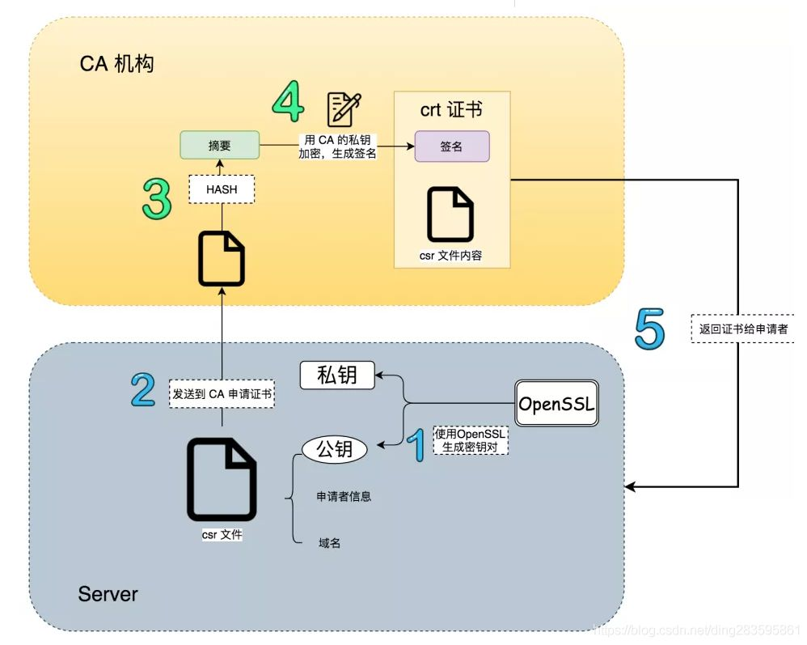
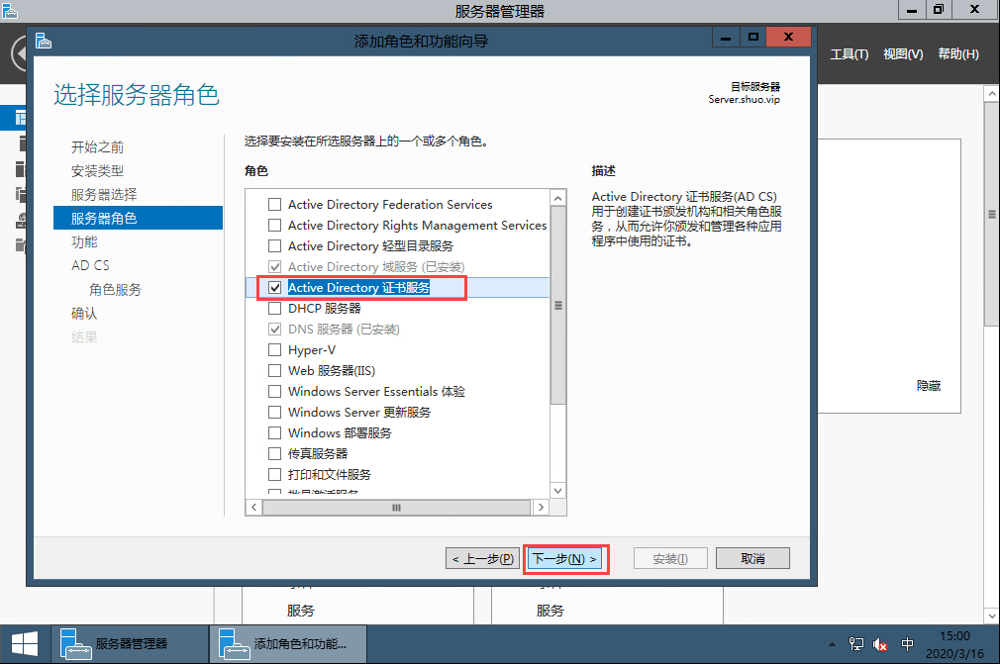
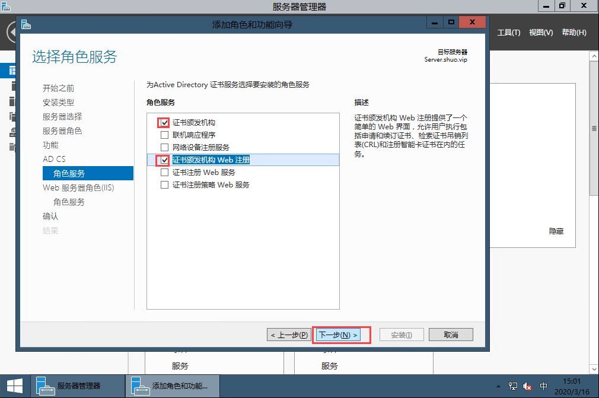
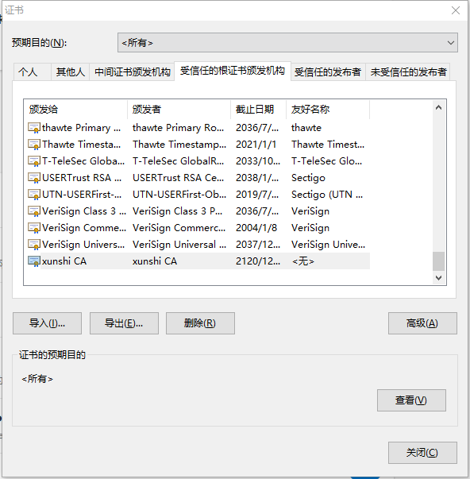
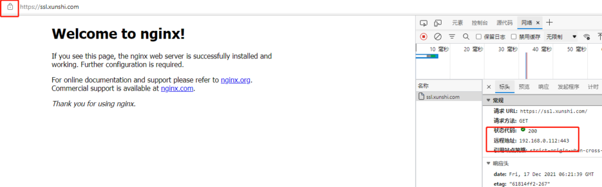
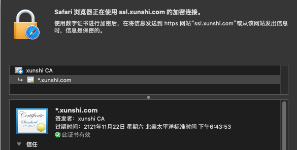
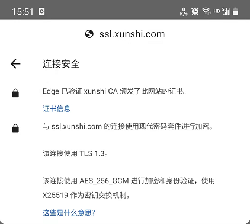

# 局域网内搭建浏览器可信任的SSL证书

首先是为什么要干这个事情，你可能会说随便搞个自签名证书难道不能用吗？答案是还真的不能用，的确对于开发来说搞个自签名的证书就行了。但是一旦放到生产环境浏览器对证书有效性进行验证的时候便是不可信状态，这时就必须要用户点击一下继续访问，但是对于我们即将实施项目的自动化要求来说没法这样干。你可能又会说了现在这个环境在阿里云、华为云这些平台上随便申请一个免费的证书难道不行吗？答案是真的不行，因为项目的特殊要求最终我们部署的环境是完全没有外网访问的，就只能在局域网环境下运行及意味着不光是SSL证书的问题我们连DNS服务器都要自己建。这时候你可能又要说了那么直接用http访问就可以了，干嘛要用ssl证书呀？答案是这个项目需要使用WebRTC进行音视频多人会议，而WebRTC只能在https下运行。

其实上面的说法有一个点需要更正一下，自签名证书其实也可以但是一旦对超过100个客户端进行分发简直是要命的事情，所以我们通过Windows域控的方式统一对下属计算机进行证书分发保证可用

## <font style="color:#000000;background-color:rgba(255, 255, 255, 0);">1.原理</font>
<font style="color:#000000;background-color:rgba(255, 255, 255, 0);">SSL证书的信任机制其实是非常简单的，第一需要一个机构证书，第二是需要服务端证书，一般来说机构证书被称为CA证书，而服务端证书就称为服务器证书吧。那么为啥</font><font style="color:#000000;background-color:rgba(255, 255, 255, 0);">https</font><font style="color:#000000;background-color:rgba(255, 255, 255, 0);">非常安全呢？答案其实不复杂，下面就是一段逻辑性描述来说明为啥</font><font style="color:#000000;background-color:rgba(255, 255, 255, 0);">https</font><font style="color:#000000;background-color:rgba(255, 255, 255, 0);">是安全的。</font>

<font style="color:#000000;background-color:rgba(255, 255, 255, 0);">通常情况下我们在给Nginx、Tomcat、IIS上配置的证书便是服务器证书，那么它是怎么保证客户端访问的地址绝对没有被拦截修改的呢？其实也不复杂，当我们的浏览器发起一个请求的时候到服务端上时，对应web服务器会通过证书的秘钥将http响应值进行一次加密，然后将密文与明文同时返回出来，客户端浏览器接收到响应之后会将密文对称解码然后和明文进行对比，这样一来便可以保证响应值没有被串改。</font>

<font style="color:#000000;background-color:rgba(255, 255, 255, 0);">这个时候逻辑上稍微厉害一点都会发现一个问题，客户端是怎么解码的？这里的答案就是服务端在响应的时候同时会将证书的公钥也返回，这个公钥只能解码对应私钥加密的信息，同时这个公钥无法加密只能解密，这样一来如果如果某人想要拦截http请求便必须知道对应的私钥才行，否则浏览器一旦发现解密信息对不上便知道了响应数据已经被拦截修改过了。</font>

<font style="color:#000000;background-color:rgba(255, 255, 255, 0);">如果你反应过来了你会发现一个新的问题，那么假设拦截这自己搞了一对有效的私钥和公钥然后伪装为服务器不就行了，恭喜你盲生发现了华点。这里就需要CA证书来处理了。其实服务器证书的公钥是由CA证书的秘钥配对加密来的，这样一来当请求返回的服务器公钥和通过CA证书进行验证时便会发现这个公钥是不是由机构签发的公钥，一旦对应不上则说明服务器不是原来CA证书签发服务器证书，这就证明你的请求被第三方拦截了。同时CA证书对于浏览器而言只有公钥，也就是说安装证书时本质上就是将CA证书的公钥导入到你的电脑上了，至此除开CA机构的证书发放者没有知道CA证书的秘钥是什么这样一来便可以保证下面几个非常关键的安全性：</font>

+ <font style="color:#000000;background-color:rgba(255, 255, 255, 0);">你请求的服务绝对是官方的服务器，绝对不是黑客自建的服务器。</font>
+ <font style="color:#000000;background-color:rgba(255, 255, 255, 0);">服务器响应给你的数据绝对是正确的，期间黑客绝对无法对其进行修改。</font>

<font style="color:#000000;background-color:rgba(255, 255, 255, 0);">证书的结构如下：</font>



<font style="color:#000000;background-color:#FFFFFF;">这里还有一个问题便是这些CA证书是哪来的，自己的电脑上又重来没有导入过什么证书。这里便是一个非常无耻躺着赚钱的商业模式了，微软、谷歌、苹果等公司提供了操作系统和浏览器，他们便是第一方的CA机构，他们的系统自己肯定信任自己对吧？所以系统安装的时候他们的CA公钥已经安装到你们的系统里面了，然后这几家巨头合伙说那么这些CA公钥在每种系统都有，然后就是一写第三方公司和这些巨头打成了合作，这些公司的机构证书也被巨头们信任所以理所当然的入库了，这些三方机构便是大名鼎鼎的Symantec、GeoTrust几个巨头，这些机构一个单域名的签名证书都敢直接拿出来卖，一年好几千，对他们而言无法就是给下发的证书进行一次签名而已，真正的躺着赚钱。</font>

## <font style="color:#000000;background-color:#FFFFFF;">2.开始制作证书</font>
<font style="color:#000000;background-color:#FFFFFF;">这里我使用的证书工具是openssl，经典工具，坦白的说非常难用。</font>

<font style="color:#000000;background-color:#FFFFFF;"></font>

### <font style="color:#000000;background-color:#FFFFFF;">2.1创建CA证书</font>
<font style="color:#000000;background-color:#FFFFFF;">首先第一步肯定是制作一个机构证书也就是CA证书出来，这里有两种方案，第一是直接用</font><font style="color:#000000;background-color:#FFFFFF;">openssl</font><font style="color:#000000;background-color:#FFFFFF;">创建CA证书，另一种是windows域控生成域组织的CA证书，我们分开说。</font>

#### <font style="color:#000000;background-color:#FFFFFF;">2.1.1通过</font><font style="color:#000000;background-color:#FFFFFF;">openssl</font><font style="color:#000000;background-color:#FFFFFF;">创建CA证书</font>
<font style="color:#000000;background-color:#FFFFFF;">第一步是创建一个秘钥，这个便是CA证书的根本，之后所有的东西都来自这个秘钥：</font>

<font style="color:#000000;background-color:#FFFFFF;"># 通过rsa算法生成2048位长度的秘钥</font>

<font style="color:#000000;background-color:#FFFFFF;">openssl genrsa -out myCA.key </font><font style="color:#000000;background-color:#FFFFFF;">2048</font>

<font style="color:#000000;background-color:#FFFFFF;">第二步是通过秘钥加密机构信息形成公钥：</font>

<font style="color:#000000;background-color:#FFFFFF;"># 公钥包含了机构信息，在输入下面的指令之后会有一系列的信息输入，这些信息便是机构信息，公司名称地址什么的</font>

<font style="color:#000000;background-color:#FFFFFF;"># 这里还有一个过期信息，CA证书也会过期，openssl默认是一个月，我们直接搞到100年</font>

<font style="color:#000000;background-color:#FFFFFF;">openssl req -new -x509 -key myCA.key -out myCA.cer -days </font><font style="color:#000000;background-color:#FFFFFF;">36500</font>

<font style="color:#000000;background-color:#FFFFFF;">这一步需要输入的机构信息有点，分别说一下：</font>


| <font style="color:#FFFFFF;background-color:#000000;">参数名称</font> | <font style="color:#FFFFFF;background-color:#000000;">参数值</font> |
| --- | --- |
| <font style="color:#FFFFFF;background-color:#000000;">Country Name</font> | <font style="color:#FFFFFF;background-color:#000000;">国家代码，比如中国就是CN</font> |
| <font style="color:#FFFFFF;background-color:#000000;">State or Province Name</font> | <font style="color:#FFFFFF;background-color:#000000;">省名称</font> |
| <font style="color:#FFFFFF;background-color:#000000;">Locality Name</font> | <font style="color:#FFFFFF;background-color:#000000;">城市名称</font> |
| <font style="color:#FFFFFF;background-color:#000000;">Organization Name</font> | <font style="color:#FFFFFF;background-color:#000000;">机构名称</font> |
| <font style="color:#FFFFFF;background-color:#000000;">Organizational Unit Name</font> | <font style="color:#FFFFFF;background-color:#000000;">机构单位名称</font> |
| <font style="color:#FFFFFF;background-color:#000000;">Common Name</font> | **<font style="color:#FFFFFF;background-color:#000000;">重点参数</font>**<font style="color:#FFFFFF;background-color:#000000;">：授权给什么，因为机构是根节点所以是授权给自己</font> |
| <font style="color:#FFFFFF;background-color:#000000;">Email Address</font> | <font style="color:#FFFFFF;background-color:#000000;">邮件地址</font> |


#### <font style="color:#000000;background-color:#FFFFFF;">2.1.2通过windows域控创建CA证书</font>
<font style="color:#000000;background-color:#FFFFFF;">这种便是我采用的方案，执行上比直接用</font><font style="color:#000000;background-color:#FFFFFF;">openssl</font><font style="color:#000000;background-color:#FFFFFF;">创建证书复杂多了，但是好处也非常多，一方面域控下级的所有计算机天然对域控服务就是信任状态，第二是域控制器能够通过组策略域内同步CA证书，本质上来讲相对于多了一个CA证书同步与分发的机制。我这边使用的Windows Server 2016，其他版本区别也不大。</font>

**<font style="color:#000000;background-color:#FFFFFF;">第一步是在域控上启用证书服务</font>**





**<font style="background-color:#FFFFFF;">第二步是安装完毕之后配置证书</font>**

<font style="background-color:#FFFFFF;">这里非常简单，我都不想说了，直接根据提示输入相关信息就行了，在过期时间那一步最好将时间拉长，我还是使用的100年。</font>

**<font style="background-color:#FFFFFF;">第三步是通过组策略进行分发</font>**

<font style="background-color:#FFFFFF;">策略路径是：</font><font style="background-color:#FFFFFF;">计算机策略/Windows设置/安全设置/公钥策略/受信任的根证书颁发机构</font><font style="background-color:#FFFFFF;">和</font><font style="background-color:#FFFFFF;">计算机策略/Windows设置/安全设置/公钥策略/受信任的发布者证书</font><font style="background-color:#FFFFFF;">。将上面创建的证书导出之后，在这里导入即可。</font>

### <font style="background-color:#FFFFFF;">2.2创建服务器证书</font>
<font style="background-color:#FFFFFF;">在得到CA证书之后，需要通过</font><font style="background-color:#FFFFFF;">openssl</font><font style="background-color:#FFFFFF;">工具对证书进行转换得到公钥（</font><font style="background-color:#FFFFFF;">.crt文件</font><font style="background-color:#FFFFFF;">）和密钥（</font><font style="background-color:#FFFFFF;">.key文件</font><font style="background-color:#FFFFFF;">），无论CA证书是怎么来的到这里之后就没有任何区别了，服务器证书的制作流程相较CA证书要复杂一点点。</font>

**<font style="background-color:#FFFFFF;">第一步通过</font>****<font style="background-color:#FFFFFF;">openssl</font>****<font style="background-color:#FFFFFF;">工具创建服务器的秘钥：</font>**

<font style="background-color:#FFFFFF;"># 通过RSA算法生成长度2048位的秘钥</font>

<font style="background-color:#FFFFFF;">openssl genrsa -out server.key </font><font style="background-color:#FFFFFF;">2048</font>

**<font style="background-color:#FFFFFF;">第二步这里是创建一个签名请求</font>**

<font style="background-color:#FFFFFF;">需要将服务器信息写入到请求文件之中，然后通过CA机构证书对请求签名形成服务器证书公钥，这一步要复杂一些，很多网上的教程在这里都GG了主要原因没有把原理搞清楚。</font>

<font style="background-color:#FFFFFF;">首先</font><font style="background-color:#FFFFFF;">https</font><font style="background-color:#FFFFFF;">证书的公钥不同于自定义情况下的加密证书，这里需要安装浏览器标准进行配置，首先</font><font style="background-color:#FFFFFF;">openssl</font><font style="background-color:#FFFFFF;">默认的证书版本是V1，V1在支持</font><font style="background-color:#FFFFFF;">https</font><font style="background-color:#FFFFFF;">时部分浏览器依旧会认为不安全，所以需要使用V3版本；同时</font><font style="background-color:#FFFFFF;">openssl</font><font style="background-color:#FFFFFF;">即便是使用V3版本依旧没有附带V3的</font><font style="background-color:#FFFFFF;">subjectAltName</font><font style="background-color:#FFFFFF;">字段数据（这里是证书对应的IP地址或者域名，可以用通配符）。但是这些东西命令行没法指定所以需要配置文件，我这里准备了一个：</font>

```plain
tsa_policy2 =1.2.3.4.5.6
tsa_policy3 =1.2.3.4.5.7
[ ca ]
default_ca = CA_default # The default ca section
[ CA_default ]
dir = ./demoCA # Where everything is kept
certs = $dir/certs # Where the issued certs are kept
crl_dir = $dir/crl # Where the issued crl are kept
database = $dir/index.txt # database index file.
new_certs_dir = $dir/newcerts # default place for new certs.
certificate = $dir/cacert.pem # The CA certificate
serial = $dir/serial # The current serial number
crlnumber = $dir/crlnumber # the current crl number
crl = $dir/crl.pem # The current CRL
private_key = $dir/private/cakey.pem# The private key
RANDFILE = $dir/private/.rand # private random number file
x509_extensions = usr_cert # The extentions to add to the cert
name_opt = ca_default # Subject Name options
cert_opt = ca_default # Certificate field options
default_days = 365 # how long to certify for
default_crl_days= 30 # how long before next CRL
default_md = default # use public key default MD
preserve =no# keep passed DN ordering
policy = policy_match
[ policy_match ]
countryName = match
stateOrProvinceName = match
organizationName = match
organizationalUnitName = optional
commonName = supplied
emailAddress = optional
[ policy_anything ]
countryName = optional
stateOrProvinceName = optional
localityName = optional
organizationName = optional
organizationalUnitName = optional
commonName = supplied
emailAddress = optional
[ req ]
default_bits = 1024
default_keyfile = privkey.pem
distinguished_name = req_distinguished_name
attributes = req_attributes
x509_extensions = v3_ca # The extentions to add to the self signed cert
string_mask = utf8only
req_extensions = v3_req # The extensions to add to a certificate request
[ req_distinguished_name ]
countryName = Country Name (2 letter code)
countryName_default = CN
countryName_min = 2
countryName_max = 2
stateOrProvinceName = State or Province Name (full name)
stateOrProvinceName_default = BeiJing
localityName = Locality Name (eg, city)
0.organizationName = Organization Name (eg, company)
0.organizationName_default = myca
organizationalUnitName = Organizational Unit Name (eg, section)
commonName = Common Name (e.g. server FQDN or YOUR name)
commonName_max = 64
emailAddress = Email Address
emailAddress_max = 64
[ req_attributes ]
challengePassword = A challenge password
challengePassword_min = 4
challengePassword_max = 20
unstructuredName = An optional company name
[ usr_cert ]
basicConstraints=CA:FALSE
nsCertType = client, email, objsign
keyUsage = nonRepudiation, digitalSignature, keyEncipherment
nsComment ="OpenSSL Generated Certificate"
subjectKeyIdentifier=hash
authorityKeyIdentifier=keyid,issuer
[ svr_cert ]
basicConstraints=CA:FALSE
nsCertType = server
keyUsage = nonRepudiation, digitalSignature, keyEncipherment, dataEncipherment, keyAgreement
subjectKeyIdentifier=hash
authorityKeyIdentifier=keyid,issuer
extendedKeyUsage = serverAuth,clientAuth
[ v3_req ]
subjectAltName = @alt_names
# 这里是重点，需要将里面配置为最终服务端需要的域名或者IP
# 这里可以写多个，能够自行添加DNS.X = XXXXXX
[ alt_names ]
DNS.1 = xunshi.com
DNS.2 = *.xunshi.com
IP.1 =192.168.0.2
IP.2 =192.168.0.3
[ v3_ca ]
subjectKeyIdentifier=hash
authorityKeyIdentifier=keyid:always,issuer
basicConstraints = CA:true
[ crl_ext ]
authorityKeyIdentifier=keyid:always
[ proxy_cert_ext ]
basicConstraints=CA:FALSE
nsComment ="OpenSSL Generated Certificate"
subjectKeyIdentifier=hash
authorityKeyIdentifier=keyid,issuer
proxyCertInfo=critical,language:id-ppl-anyLanguage,pathlen:3,policy:foo
[ tsa ]
default_tsa = tsa_config1 # the default TSA section
[ tsa_config1 ]
dir = ./demoCA # TSA root directory
serial = $dir/tsaserial # The current serial number (mandatory)
crypto_device = builtin # OpenSSL engine to use for signing
signer_cert = $dir/tsacert.pem # The TSA signing certificate
# (optional)
certs = $dir/cacert.pem # Certificate chain to include in reply
# (optional)
signer_key = $dir/private/tsakey.pem # The TSA private key (optional)
default_policy = tsa_policy1 # Policy if request did not specify it
# (optional)
other_policies = tsa_policy2, tsa_policy3 # acceptable policies (optional)
digests = md5, sha1 # Acceptable message digests (mandatory)
accuracy = secs:1, millisecs:500, microsecs:100 # (optional)
clock_precision_digits = 0 # number of digits after dot. (optional)
ordering =yes# Is ordering defined for timestamps?
# (optional, default: no)
tsa_name =yes# Must the TSA name be included in the reply?
# (optional, default: no)
ess_cert_id_chain =no# Must the ESS cert id chain be included?
# (optional, default: no)
```

<font style="background-color:#FFFFFF;">将上面的配置内容保存为</font><font style="background-color:#FFFFFF;">openssl.cnf</font><font style="background-color:#FFFFFF;">放到生成的服务器证书文件的目录下（</font>**<font style="background-color:#FFFFFF;">注意</font>**<font style="background-color:#FFFFFF;">：修改alt_names里面的域名或者IP为最终部署需要的地址，支持通配符），然后执行创建签名申请文件即可，执行运行：</font>

```plain
# 和创建CA时一样这里需要输入一堆服务器信息，输入项也是相同的。
# 不过在输入Common Name（CN）最好直接输入服务器的IP地址或者域名。
openssl req -config openssl.cnf -new -out server.req -key server.key 
```

<font style="background-color:#FFFFFF;">PS：上述配置文件使用sha1算法生产的证书，部分浏览器已经已经不信任该算法了，如果你使用的时候遇到sha1相关的问题，可以参考评论区的</font>**<font style="background-color:#FFFFFF;">kevin</font>**<font style="background-color:#FFFFFF;">同学提供的</font>[<font style="background-color:#FFFFFF;">方案</font>](https://www.tangyuecan.com/2021/12/17/%e5%b1%80%e5%9f%9f%e7%bd%91%e5%86%85%e6%90%ad%e5%bb%ba%e6%b5%8f%e8%a7%88%e5%99%a8%e5%8f%af%e4%bf%a1%e4%bb%bb%e7%9a%84ssl%e8%af%81%e4%b9%a6/comment-page-1/#comment-3121)<font style="background-color:#FFFFFF;">。</font>

<font style="background-color:#FFFFFF;">如果你遇到sha1问题，用稍微新一点的openssl.cnf文件 </font>[<font style="background-color:#FFFFFF;">https://github.com/openssl/openssl/blob/master/apps/openssl.cnf</font>](https://github.com/openssl/openssl/blob/master/apps/openssl.cnf)<font style="background-color:#FFFFFF;">  
</font><font style="background-color:#FFFFFF;">同时还要在这个文件里稍微改一下，把下述的配置加入进去  
</font>

```plain
“`
[ v3_req ]
subjectAltName = @alt_names
# 这里是重点，需要将里面配置为最终服务端需要的域名或者IP
# 这里可以写多个，能够自行添加DNS.X = XXXXXX
[ alt_names ]
DNS.1 = xunshi.com
DNS.2 = *.xunshi.com
“`
```

<font style="background-color:#FFFFFF;">  
</font><font style="background-color:#FFFFFF;">加上。  
</font><font style="background-color:#FFFFFF;">最后用请求生成密钥的时候 用下面这个指令 使用sha384代替默认的sha1。</font>

**<font style="background-color:#FFFFFF;">第三步通过CA机构证书对服务器证书进行签名认证</font>**

<font style="color:#000000;background-color:#FFFFFF;"># 这里没有什么需要说的，本质上就是将签名请求文件进行签名最终得到服务器的公钥</font>

```plain
openssl x509 -req -extfile openssl.cnf -extensions v3_req -in server.req -out server.cer -CAkey myCA.key -CA myCA.cer -days 36500 -CAcreateserial -CAserial serial
```

**<font style="color:#000000;background-color:#FFFFFF;">第四步部署证书</font>**

<font style="color:#000000;background-color:#FFFFFF;">这里应该没有什么需要说的了，我们通过Nginx部署，最终得到server.key就是秘钥，server.cer文件就是公钥只需要配置给Nginx就行了。</font>

<font style="color:#000000;background-color:#FFFFFF;"></font>

## <font style="color:#000000;background-color:#FFFFFF;">3.信任CA机构证书</font>
<font style="color:#000000;background-color:#FFFFFF;">如果通过Windows域控创建的CA证书，其证书本身通过组策略便可以给每一个域下计算机添加机构信任。如果你没有域控只是通过openssl创建的CA证书也没有关系，只需要将CA证书的公钥（myCA.cer文件）导入到系统信任的根证书颁发机构里面就行了：</font>



<font style="color:#000000;background-color:#FFFFFF;">这个界面在windows的internet选型->内容->证书可以打开，导入即可，也可以直接双击cer文件进行证书安装，最终不光是windows系统，任何操作系统都可以安装证书来进行对CA机构的进行信任操作。</font>

<font style="color:#000000;background-color:#FFFFFF;">在对证书进行信任之后通过https打开浏览器进入内网DNS或者host配置的域名便可以得到没有任何警告的内容的安全连接：</font>



<font style="color:#000000;background-color:#FFFFFF;">如果是Mac系统访问逻辑也是一样的通过安装CA证书并且在钥匙串内添加信任之后依然可以正常访问：</font>



<font style="color:#000000;background-color:#FFFFFF;">在Android手机上也是一样，安装并且信任证书之后可以正常访问：</font>



## <font style="color:#000000;background-color:#FFFFFF;">4.总结</font>
<font style="color:#000000;background-color:#FFFFFF;">本来对我对</font><font style="color:#000000;background-color:#FFFFFF;">https</font><font style="color:#000000;background-color:#FFFFFF;">的认证逻辑其实理解没有多深入，以前也只是用过SSL证书进行TCP传输加密而已，经过对</font><font style="color:#000000;background-color:#FFFFFF;">openssl</font><font style="color:#000000;background-color:#FFFFFF;">的学习现在至少在理解上达到了及格水平，不过这次学习论证与探索的过程我个人极其不愉快，本来这东西在有了理解之后大家都看得出来不是什么很难的东西，事实上我也只用了一天半就搞定了。但是网上充斥大量垃圾内容，不光没有什么正向内容甚至不少内容还TM起了误导的作用，整个中文互联网检索体系下就没有找到一篇文章稍微详细描述整个搭建逻辑与流程，简直了，最终我只能从</font><font style="color:#000000;background-color:#FFFFFF;">https</font><font style="color:#000000;background-color:#FFFFFF;">原理和</font><font style="color:#000000;background-color:#FFFFFF;">openssl</font><font style="color:#000000;background-color:#FFFFFF;">的官方文档开始看起，过于离谱了。基本上可以得到一个结论现在天天写一些所谓干货的博主简直就是滥竽充数，其内容千篇一律大多数也是抄袭来的基本上什么都没有说清楚简直浪费时间。</font>

<font style="color:#000000;background-color:#FFFFFF;">最后说一下https的原理，在解释清楚之后其实不是绝对上的安全，结合本文各位可以想一下怎样去伪造一个页面出来？假设我是黑客来搞入侵其实只需要一个小小的脚本就可以了，我们自行制作CA和服务证书之后，通过修改HOST文件对域名解析进行劫持将其引导到我们自己的服务器，然后将我们自己制作CA证书注入目标电脑的受信任证书组，这样一来对于被入侵者已经看到是安全连接但是其请求已经被我们拦截了。所以各位不要看到https就以为安全了，一旦你的电脑本身就被入侵了那么https也是形同虚设的，所以在执行高风险操作的时候最好还是点开站点的证书看看对应的CA机构是不是被修改过。</font>

<font style="color:rgb(206, 206, 206);background-color:rgb(39, 43, 51);">  
</font>


> 更新: 2024-03-04 09:40:56  
> 原文: <https://www.yuque.com/lixinsi/gpngnc/aeqkiunl8awmkwoh>