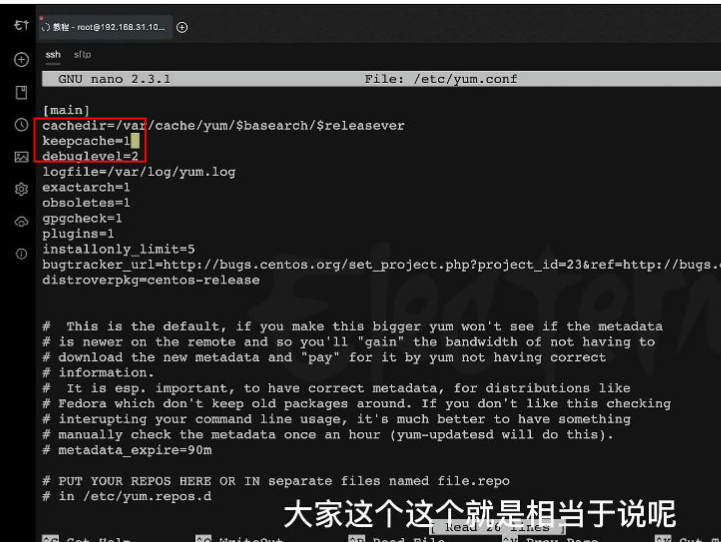
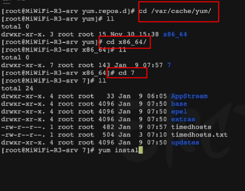
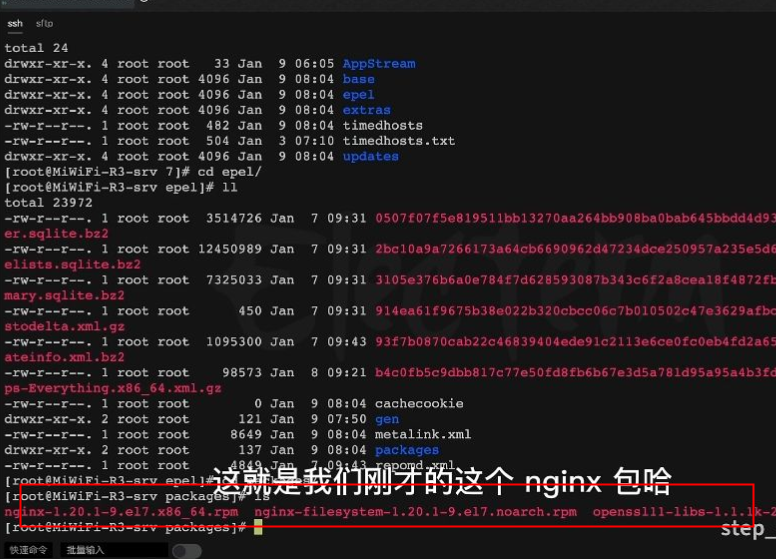

# 获取制作离线安装包环境

### 有网环境
yum install nginx

nano /etc/yum.conf

cd /var/cache/yum/

cd x86_64

cd 7

安装

yum install nginx -y

cd /epel/packages

ll

> 更新: 2022-05-25 19:55:16  
> 原文: <https://www.yuque.com/lixinsi/gpngnc/ldepr8>