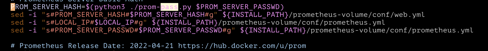
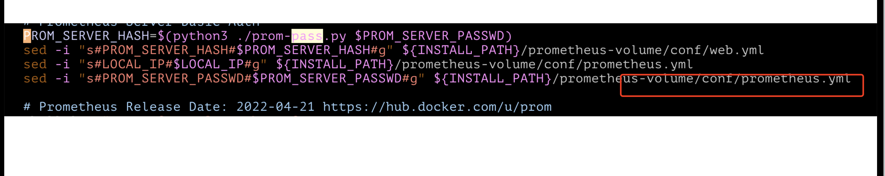
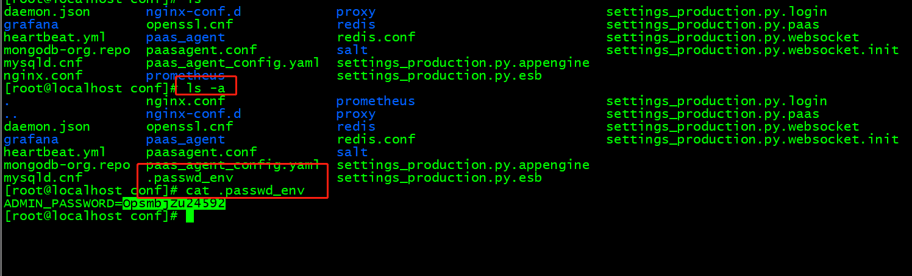
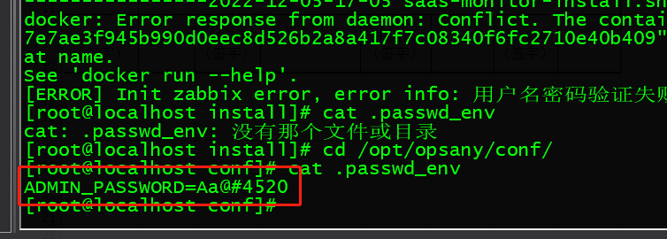
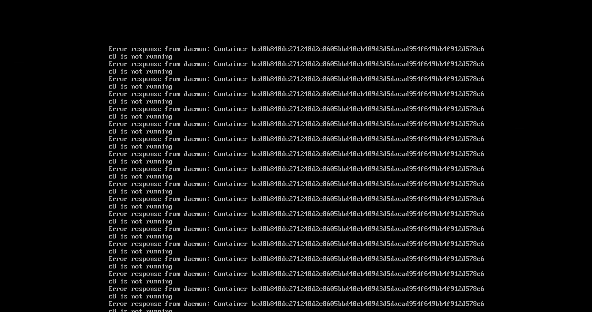
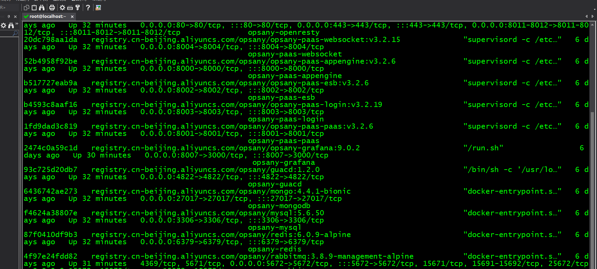

# 部署opsany

<font style="color:rgba(0, 0, 0, 0.87);"></font>

<font style="color:rgba(0, 0, 0, 0.87);">OpsAny默认使用Docker进行容器化部署，如果服务器可以访问外网，可以直接从镜像仓库拉取镜像。如果无法访问外网，需要部署内网的制品仓库，或者直接拷贝Docker镜像，本地导入。</font>

## <font style="color:rgba(0, 0, 0, 0.87);">部署主机配置</font>
<font style="color:rgba(0, 0, 0, 0.87);">OpsAny社区版部署，使用一台虚拟机即可部署，推荐使用4CPU和16G内存的主机，硬盘根据纳管的服务器数量综合考虑，例如100台主机，一年需要至少500G空间存储监控数据，日志数据另计。</font>

| 配置推荐 | 操作系统 | 主机配置 | 备注 |
| --- | --- | --- | --- |
| <font style="color:rgba(0, 0, 0, 0.87);">体验配置</font> | <font style="color:rgba(0, 0, 0, 0.87);">CentOS 7.8</font> | <font style="color:rgba(0, 0, 0, 0.87);">2C、8G、50G</font> | <font style="color:rgba(0, 0, 0, 0.87);">关闭SELinux和防火墙，仅安装基础平台。</font> |
| <font style="color:rgba(0, 0, 0, 0.87);">生产配置</font> | <font style="color:rgba(0, 0, 0, 0.87);">CentOS 7.8</font> | <font style="color:rgba(0, 0, 0, 0.87);">4C、16G、100G</font> | <font style="color:rgba(0, 0, 0, 0.87);">关闭SELinux和防火墙，可以安装监控平台。</font> |


**<font style="color:rgba(0, 0, 0, 0.87);">测试通过系统：</font>**

+ <font style="color:rgba(0, 0, 0, 0.87);">CentOS 7.x所有版本</font>
+ <font style="color:rgba(0, 0, 0, 0.87);">CentOS 8.x所有版本</font>
+ <font style="color:rgba(0, 0, 0, 0.87);">Ubuntu 16.04、18.04、20.04</font>
+ <font style="color:rgba(0, 0, 0, 0.87);">UOS v20</font>
+ <font style="color:rgba(0, 0, 0, 0.87);">麒麟 v10</font>

**<font style="color:rgba(0, 0, 0, 0.87);">Agent支持系统列表：</font>**

+ <font style="color:rgba(0, 0, 0, 0.87);">CentOS 6.x 7.x 8.x版本</font>
+ <font style="color:rgba(0, 0, 0, 0.87);">Ubuntu 16.04、18.04、20.04</font>
+ <font style="color:rgba(0, 0, 0, 0.87);">Windows 2010 Server以上版本</font>
+ <font style="color:rgba(0, 0, 0, 0.87);">UOS v20</font>
+ <font style="color:rgba(0, 0, 0, 0.87);">中标麒麟、银河麒麟</font>
+ <font style="color:rgba(0, 0, 0, 0.87);">其它还未测试，但是可以允许的系统</font>

## <font style="color:rgba(0, 0, 0, 0.87);">平台部署场景</font>
### <font style="color:rgba(0, 0, 0, 0.87);">内网部署，内网访问</font>
**<font style="color:rgba(0, 0, 0, 0.87);">部署场景介绍：</font>**<font style="color:rgba(0, 0, 0, 0.87);"> </font><font style="color:rgba(0, 0, 0, 0.87);">平台部署在内网，仅管理内网主机，无法上公网。  
</font>**<font style="color:rgba(0, 0, 0, 0.87);">部署需求：</font>**<font style="color:rgba(0, 0, 0, 0.87);">  
</font><font style="color:rgba(0, 0, 0, 0.87);">需要内网受管主机可以访问到OpsAny平台的80、443、4505、4506、10051端口。</font>

### <font style="color:rgba(0, 0, 0, 0.87);">内网部署，公网访问</font>
**<font style="color:rgba(0, 0, 0, 0.87);">部署场景介绍</font>**<font style="color:rgba(0, 0, 0, 0.87);">：平台部署在内网，管理内网主机，同时也需要管理外网主机。  
</font>**<font style="color:rgba(0, 0, 0, 0.87);">部署需求</font>**<font style="color:rgba(0, 0, 0, 0.87);">：  
</font>

+ <font style="color:rgba(0, 0, 0, 0.87);">需要公网IP地址和域名，需要内网和公网均可以访问到OpsAny平台的80、443、4505、4506、10051。云主机请提前设置好安全组，再开始部署。</font>
+ <font style="color:rgba(0, 0, 0, 0.87);">在【管控平台】-【采控中心】中需要设置外网和内网控制器地址。但是访问平台的地址只能三选一（域名、公网IP、内网IP），为了安全性，不支持内外网混合访问。建议使用域名。</font>

## <font style="color:rgba(0, 0, 0, 0.87);">Docker容器在线部署</font>
### <font style="color:rgba(0, 0, 0, 0.87);">部署OpsAny PaaS平台</font>
<font style="color:rgba(0, 0, 0, 0.87);">1.安装Docker和初始化使用的软件包</font>

**CentOS 7.x部署**

<font style="color:rgba(0, 0, 0, 0.87);">1.1安装Docker和MySQL</font>

curl -o /etc/yum.repos.d/epel.repo http://mirrors.aliyun.com/repo/epel-7.repo curl -o /etc/yum.repos.d/docker-ce.repo https://mirrors.aliyun.com/docker-ce/linux/centos/docker-ce.repo yum install -y git wget docker-ce mariadb jq python3 python3-pip ntpdate systemctl enable --now docker ln -sf /usr/share/zoneinfo/Asia/Shanghai /etc/localtime ntpdate time1.aliyun.com 

**CentOS 8.x部署****Ubuntu部署**

<font style="color:rgba(0, 0, 0, 0.87);">2.克隆代码</font>

**Gitee**

cd /opt && git clone https://gitee.com/unixhot/opsany-paas.git 

**Github**

<font style="color:rgba(0, 0, 0, 0.87);">3.修改安装配置【必须修改】</font>

**<font style="color:rgba(0, 0, 0, 0.87);">Tip</font>**

<font style="color:rgba(0, 0, 0, 0.87);">注意！注意！注意！如果域名不能解析请设置为IP地址，修改hosts文件无法完成安装。</font>

#从配置模板生成配置文件 cd /opt/opsany-paas/install && cp install.config.example install.config #设置访问的域名或公网IP，或内网IP。如果是域名，域名一定需要解析，如果不能解析，需要手工修改所有容器，手工增加域名解析，不然无法安装成功。 DOMAIN_NAME=demo.opsany.com #设置本机的内网IP地址 LOCAL_IP=192.168.56.11 #批量修改访问域名和IP地址 sed -i "s/demo.opsany.com/${DOMAIN_NAME}/g" install.config sed -i "s/192.168.56.11/${LOCAL_IP}/g" install.config #可以自行修改其它的设置 vim /opt/opsany-paas/install/install.config 

域名一定需要解析，真实域名或者内网DNS解析，修改/etc/hosts无用，如为测试部署，请设置DOMAIN_NAME为IP地址。

+ <font style="color:rgba(0, 0, 0, 0.87);">配置文件主要配置介绍</font>

#安装OpsAny的本机内网IP地址。 LOCAL_IP="192.168.56.11" #访问OpsAny的域名，域名必须可以解析，只使用hosts解析不够，因为容器里也需要解析这个域名，如果是在内网访问请修改为和LOCAL_IP一样，如果是外网访问，请修改为真实访问的域名或者公网IP。 安装后暂不支持修改，此配置会作为Cookie的作用域的域名，所以如果配置的和访问的不同，会导致无法通过验证。 DOMAIN_NAME="demo.opsany.com" 

请确定修改模版文件中所有的192.168.56.11为部署本机的内网IP地址。

<font style="color:rgba(0, 0, 0, 0.87);">4.执行安装脚本进行PAAS平台部署</font>

cd /opt/opsany-paas/install/ ./paas-install.sh  

拉取较慢，请耐心等待。如果安装失败，可以执行uninstall.sh，然后重新执行paas-install.sh

<font style="color:rgba(0, 0, 0, 0.87);">5.访问域名测试，默认用户名admin 密码admin，在未安装SaaS应用之前，请勿修改admin密码，请部署完毕再修改。</font>

+ <font style="color:rgba(0, 0, 0, 0.87);">https://DOMAIN_NAME/ 请注意，这里访问的是你设置的DOMAIN_NAME！！！，而不是你认为的这个主机的其它访问方式。</font>
+ <font style="color:rgba(0, 0, 0, 0.87);">【不要相信自己，要相信计算机，它说你错了。那么你真实的错误几率高达99%。- OpsAny】</font>

此时仅仅是部署了PaaS平台，还未部署任何的应用，需要部署应用之后才可以使用。

### <font style="color:rgba(0, 0, 0, 0.87);">部署OpsAny基础SaaS应用</font>
<font style="color:rgba(0, 0, 0, 0.87);">1.下载OpsAny软件包：</font><font style="color:rgba(0, 0, 0, 0.87);"> </font>[下载申请](https://www.opsany.com/#/download)

申请完毕之后，请查看邮件，软件包下载地址和验证密钥会发送到您申请时填写的邮箱中。

<font style="color:rgba(0, 0, 0, 0.87);">2.根据邮件内容下载软件包，解压并执行安装操作。</font>

注意解压到opsany-paas同级目录，例如/opt/opsany-paas和/opt/opsany-saas。

cd /opt/ tar zxf opsany-saas.tar.gz cd /opt/opsany-paas/install/ #安装基础平台 ./saas-base-install.sh 

<font style="color:rgba(0, 0, 0, 0.87);">3.解压并部署opsany-agent，将agent目录放置在uploads下面，提供下载。</font>

cd /opt/ tar zxf opsany-agent.tar.gz mv agent /opt/opsany/uploads/ 

<font style="color:rgba(0, 0, 0, 0.87);">4.安装完毕之后，访问平台，访问会提示设置License，请填写邮件中的授权人和授权密钥即可。</font>

<font style="color:rgba(0, 0, 0, 0.87);">5.现在就可以正式使用OpsAny了，有任何问题，可以在交流群提问。</font>

**<font style="color:rgba(0, 0, 0, 0.87);">Tip</font>**

<font style="color:rgba(0, 0, 0, 0.87);">注意！如果您的本地环境内存是8G，请不要部署监控平台和应用平台，会因为内存不足，导致平台无法访问。部署监控平台和应用平台生产建议配置为8C，16G内存。如果你有安装问题，请仔细查看本文档，如还不能解决，请将install.config配置，完整的安装步骤和输出贴到微信交流群中。</font>

### <font style="color:rgba(0, 0, 0, 0.87);">部署服务明细</font>[¶](https://docs.opsany.com/deploy/base-install/#_5)
| 序号 | 服务名称 | 监听端口 | 备注 |
| :--- | :--- | :--- | :--- |
| <font style="color:rgba(0, 0, 0, 0.87);">基础服务</font> | <font style="color:rgba(0, 0, 0, 0.87);">OpenResty</font> | <font style="color:rgba(0, 0, 0, 0.87);">80、443</font> | <font style="color:rgba(0, 0, 0, 0.87);">提供Web访问</font> |
| | <font style="color:rgba(0, 0, 0, 0.87);">MySQL</font> | <font style="color:rgba(0, 0, 0, 0.87);">3306</font> | <font style="color:rgba(0, 0, 0, 0.87);">提供数据存储</font> |
| | <font style="color:rgba(0, 0, 0, 0.87);">MongoDB</font> | <font style="color:rgba(0, 0, 0, 0.87);">27017</font> | <font style="color:rgba(0, 0, 0, 0.87);">提供文档型数据存储</font> |
| | <font style="color:rgba(0, 0, 0, 0.87);">RabbitMQ</font> | <font style="color:rgba(0, 0, 0, 0.87);">5672、15672</font> | <font style="color:rgba(0, 0, 0, 0.87);">提供消息队列服务</font> |
| | <font style="color:rgba(0, 0, 0, 0.87);">Redis</font> | <font style="color:rgba(0, 0, 0, 0.87);">6379</font> | <font style="color:rgba(0, 0, 0, 0.87);">提供缓存服务</font> |
| | <font style="color:rgba(0, 0, 0, 0.87);">Elasticsearch</font> | <font style="color:rgba(0, 0, 0, 0.87);">9200</font> | <font style="color:rgba(0, 0, 0, 0.87);">提供日志存储和搜索</font> |
| <font style="color:rgba(0, 0, 0, 0.87);">平台服务</font> | <font style="color:rgba(0, 0, 0, 0.87);">appengine</font> | <font style="color:rgba(0, 0, 0, 0.87);">8000</font> | <font style="color:rgba(0, 0, 0, 0.87);">SAAS服务支持</font> |
| | <font style="color:rgba(0, 0, 0, 0.87);">paas</font> | <font style="color:rgba(0, 0, 0, 0.87);">8001</font> | <font style="color:rgba(0, 0, 0, 0.87);">开发中心服务</font> |
| | <font style="color:rgba(0, 0, 0, 0.87);">esb</font> | <font style="color:rgba(0, 0, 0, 0.87);">8002</font> | <font style="color:rgba(0, 0, 0, 0.87);">企业服务总线</font> |
| | <font style="color:rgba(0, 0, 0, 0.87);">login</font> | <font style="color:rgba(0, 0, 0, 0.87);">8003</font> | <font style="color:rgba(0, 0, 0, 0.87);">统一登陆</font> |
| | <font style="color:rgba(0, 0, 0, 0.87);">WebSocket</font> | <font style="color:rgba(0, 0, 0, 0.87);">8004</font> | <font style="color:rgba(0, 0, 0, 0.87);">为堡垒机提供websocket</font> |
| <font style="color:rgba(0, 0, 0, 0.87);">应用服务</font> | <font style="color:rgba(0, 0, 0, 0.87);">Saltapi</font> | <font style="color:rgba(0, 0, 0, 0.87);">8005</font> | <font style="color:rgba(0, 0, 0, 0.87);">提供远程执行和文件分发</font> |
| | <font style="color:rgba(0, 0, 0, 0.87);">Zabbix</font> | <font style="color:rgba(0, 0, 0, 0.87);">8006</font> | <font style="color:rgba(0, 0, 0, 0.87);">提供监控服务</font> |
| | <font style="color:rgba(0, 0, 0, 0.87);">Grafana</font> | <font style="color:rgba(0, 0, 0, 0.87);">8007</font> | <font style="color:rgba(0, 0, 0, 0.87);">提供可视化图表</font> |
| | <font style="color:rgba(0, 0, 0, 0.87);">paasagent</font> | <font style="color:rgba(0, 0, 0, 0.87);">4245、8085</font> | <font style="color:rgba(0, 0, 0, 0.87);">SAAS服务部署</font> |
| | <font style="color:rgba(0, 0, 0, 0.87);">RDP-websocket</font> | <font style="color:rgba(0, 0, 0, 0.87);">4822</font> | <font style="color:rgba(0, 0, 0, 0.87);">连接Windows服务器</font> |
| | <font style="color:rgba(0, 0, 0, 0.87);">saltstack</font> | <font style="color:rgba(0, 0, 0, 0.87);">4505、4506</font> | <font style="color:rgba(0, 0, 0, 0.87);">管控平台</font> |
| <font style="color:rgba(0, 0, 0, 0.87);">备注</font> | <font style="color:rgba(0, 0, 0, 0.87);">管理外网主机，平台需要独立地址并对外端口：80、443、4505、4506、10051</font> | | |


### 开始部署
<font style="color:rgb(51, 51, 51);">vi /etc/sysconfig/network-scripts/ifcfg-ens33 </font>

查看服务器内存

```shell
free -m
```

### 查看操作系统
```shell
cat /etc/redhat-release
```

### 检查selinux是否关闭
```shell
getsebool
```

### 检查防火墙
```shell
iptables -vnL
iptable -t nat -vnL
```

### 正式部署
```shell
#关闭防火墙
systemctl stop firewalld
#临时关闭selinux
setenforce 0
#永久关闭selinux
vi /etc/selinux/config
#重启网络服务
service network restart
#安装ops框架
curl -o /etc/yum.repos.d/epel.repo http://mirrors.aliyun.com/repo/epel-7.repo
curl -o /etc/yum.repos.d/docker-ce.repo https://mirrors.aliyun.com/docker-ce/linux/centos/docker-ce.repo
yum install -y git wget docker-ce mariadb jq python3 python3-pip ntpdate
#开机启动docker
systemctl enable --now docker
#同步时间
ln -sf /usr/share/zoneinfo/Asia/Shanghai /etc/localtime
ntpdate time1.aliyun.com
#git克隆代码
cd /opt && git clone https://gitee.com/unixhot/opsany-paas.git
#从配置模板生成配置文件
cd /opt/opsany-paas/install && cp install.config.example install.config
#设置访问的域名或公网IP，或内网IP。如果是域名，域名一定需要解析，如果不能解析，需要手工修改所有容器，手工增加域名解析，不然无法安装成功。
 DOMAIN_NAME=demo.opsany.com
 #设置本机的内网IP地址
 LOCAL_IP=192.168.56.11
 #批量修改访问域名和IP地址
 sed -i "s/demo.opsany.com/${DOMAIN_NAME}/g" install.config
 sed -i "s/192.168.56.11/${LOCAL_IP}/g" install.config
 #可以自行修改其它的设置
 vim /opt/opsany-paas/install/install.config174
 #查看IP地址
 ifconfig
 #编辑配置文件
 vim /opt/opsany-paas/install/install.config
 #编译安装
 cd /opt/opsany-paas/install/ 
 ./paas-install.sh install
 cd /opt/ 
 wget https://opsany-saas.oss-cn-beijing.aliyuncs.com/opsany-saas-ce-1.5.0.tar.gz
 tar zxf opsany-saas-ce-1.5.0.tar.gz
 wget https://opsany-saas.oss-cn-beijing.aliyuncs.com/opsany-agent-1.3.0.tar.gz
 tar zxf opsany-agent.tar.gz
 cd /opt/ 
 wget https://opsany-saas.oss-cn-beijing.aliyuncs.com/opsany-saas-ce-1.5.0.tar.gz
 #强制删除目录
 rm -rf opsany-saas-ce-1.5.0.tar.gz
 rm -rf opsany-agent-1.3.0.tar.gz 
 rm -rf opsany
 rm -rf opsany-saas/
 cd /opt/ 
 wget https://opsany-saas.oss-cn-beijing.aliyuncs.com/opsany-saas-ce-1.5.0.tar.gz
 tar zxf opsany-saas-ce-1.5.0.tar.gz
 wget https://opsany-saas.oss-cn-beijing.aliyuncs.com/opsany-agent-1.3.0.tar.gz
 tar zxf opsany-agent.tar.gz

 cd /opt/opsany-paas/install/
 #安装完毕PaaS之后，可以安装基础平台
 ./saas-base-install.sh install
 #卸载
  
  ./paas-install.sh install
 #安装zabbix监控
  cd install/
 ./saas-monitor-install.sh zabbix
 #安装agent
 tar zvf opsany-agent-1.3.0.tar.gz 
 tar zxf opsany-agent-1.3.0.tar.gz 
 cd agent/
 cd ../
 mv agent/ /opt/opsany/uploads/

```


```plsql
查看ip地址
ip addr show ens33
```


### 安装zabbix监控
saas-monitor-install.sh zabbix

如果修改了管理员密码

```shell
在执行安装前，请注意，你是否修改过admin的密码，默认情况下会从$INSTALL_PATH/conf/.passwd_env获取，如果你修改过密码，请修改下面的安装脚本。设置变量：ADMIN_PASSWORD="修改后的密码"
cd /opt/opsany-paas/install/
./saas-monitor-install.sh zabbix
```

### 断电重启
cd opsany

需要重启SaaS服务。./saas-restart.sh

### 下载agent不支持对应地址
Windows server2008

https://mirrors.sdwu.edu.cn/saltstack/windows/archive/

2015和2016 的都行

### 查看管理员密码
dyjy!@#$%^.100

一般都是有prometheus 的用户，因为目前需要安装监控exporter 组件。



查看路径

  cd opsany/ prometheus-volume/conf/

 vim prometheus.yml 




查看opsany的admin的密码

在目录安装目录/opt/opsany/conf

ls -a查看隐藏文件截图如下

cat .passwd_env




安装zabbix认证报错

在目录安装目录/opt/opsany/conf

ls -a查看隐藏文件截图如下

cat .passwd_env

vi  .passwd_env

修改认证密码



这里看下密码

  username: admin

   password: OpsAny@2020





```dockerfile
docker ps 
docker ps -a
docker start opsany-paas-paasagent
./saas-restart.sh
```


> 更新: 2023-07-17 18:01:48  
> 原文: <https://www.yuque.com/lixinsi/gpngnc/fqp8cq>