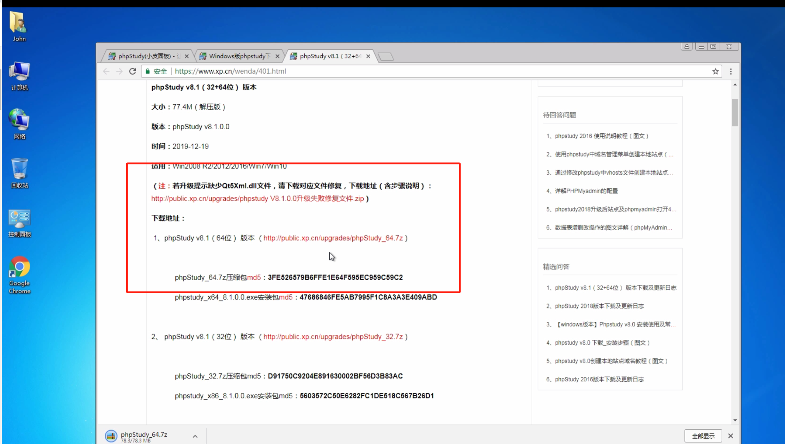
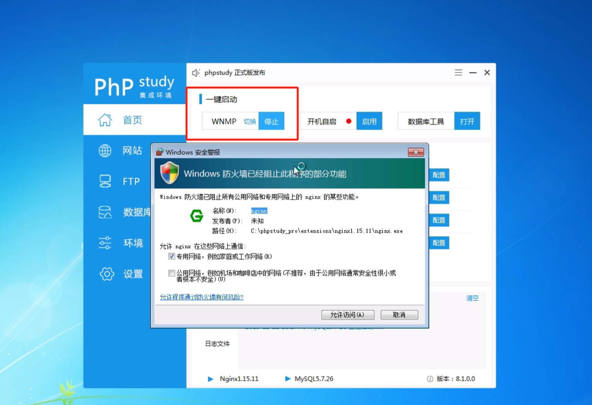
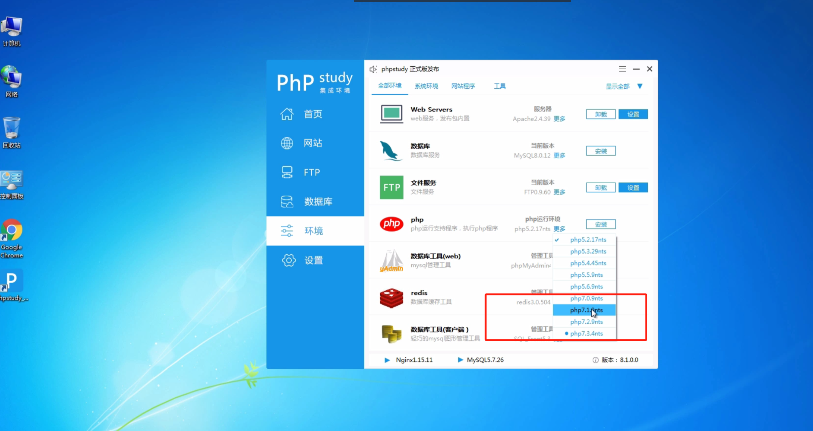
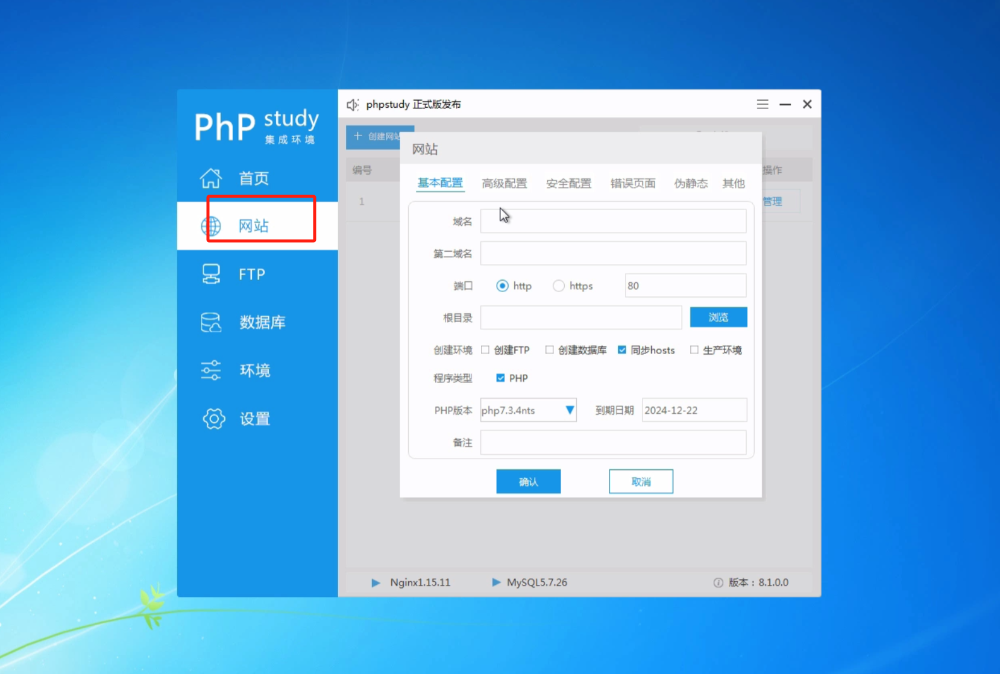
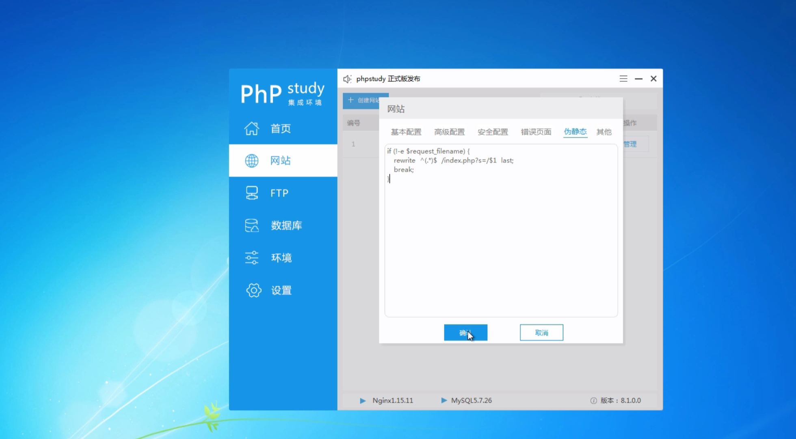
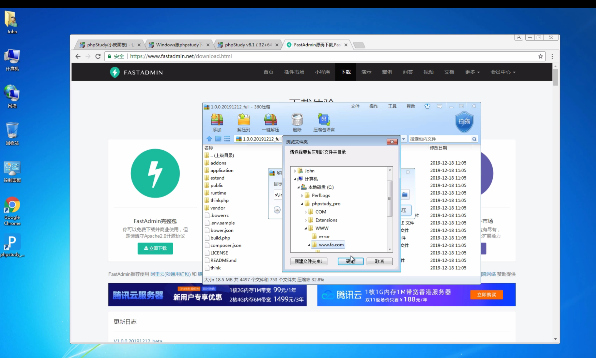

# Fastadmin在Windows下面使用phpstudy安装FastAdmin

[https://www.fastadmin.net/video/install/39.html](https://www.fastadmin.net/video/install/39.html)

### 1.打开 www.xp.cn 下载 windows 版本 64 位，双击进行安装，立即安装



### 2.启动 wnmp


### 3.安装环境 PHP7.1



### 4.新增网站，创建网站，创建数据库



### 5.添加伪静态


```php

if (!-e $request_filename)
{
  rewrite  ^(.*)$  /index.php?s=$1  last;
  break;
}
```


### 6.打开 https://www.fastadmin.net/download.html 下载完整包





> 更新: 2024-12-18 17:51:57  
> 原文: <https://www.yuque.com/lixinsi/edztzi/prpamsxmkzz4poe9>