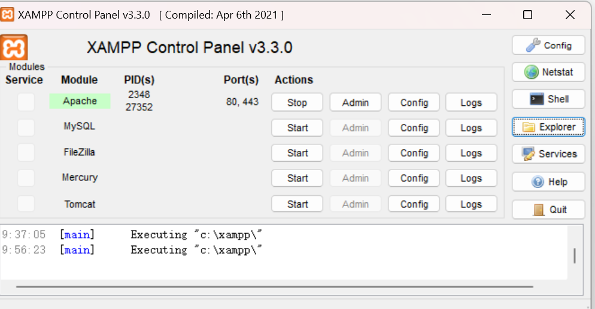
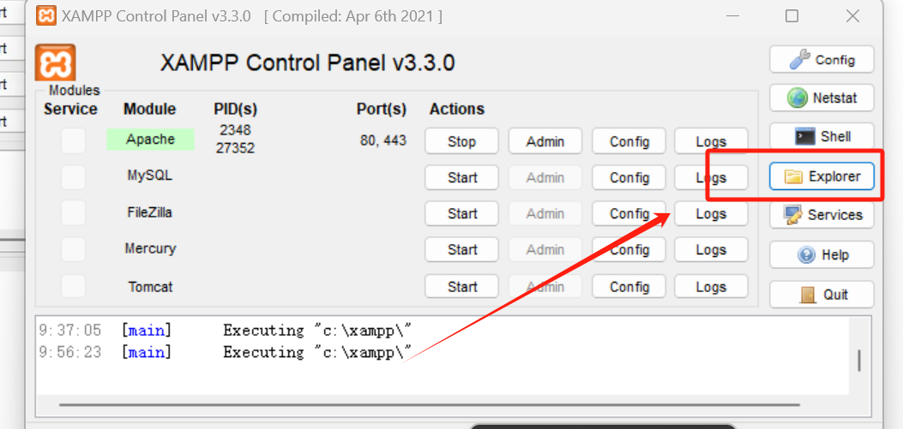
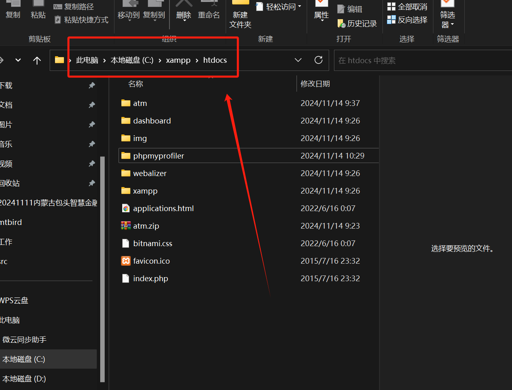

# PHP环境配置

### 1.配置 php 环境首先安装服务器
#### xampp 下载网址[https://www.apachefriends.org](https://www.apachefriends.org/)/   

### 2.部署程序比如 PHPAdmin

> 更新: 2024-11-14 10:50:33  
> 原文: <https://www.yuque.com/lixinsi/edztzi/ksvqbx69tacmgst2>