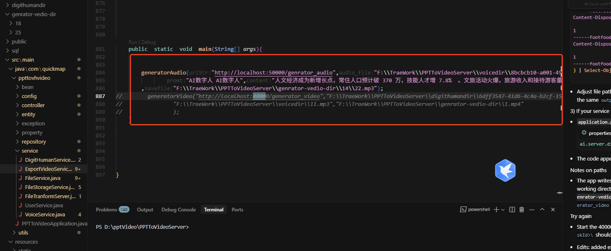

# PPT-VideoServer

```python
"将copui-aiTTS服务（地址：http://192.168.40.32:5002/，目录：D:\daima\LXShuman\PPTToVideoServer\TTS\）和Sadtalker服务（地址：http://192.168.40.32:7860，目录：D:\daima\LXShuman\PPTToVideoServer\SadTalker）集成到当前项目中。请根据项目实际架构合理调整集成方案，确保实现以下功能：1) TTS语音合成服务调用；2) 视频生成服务调用；3) 服务间通信协调。
```

### 数据库启动

```plain
java -jar "PPTToVideoServer\target\ppttovhvideo-0.0.1-SNAPSHOT.jar" --spring.datasource.url="jdbc:mysql://192.168.20.7:3306/ppttovideodb?useSSL=false&allowPublicKeyRetrieval=true&serverTimezone=UTC&createDatabaseIfNotExist=true" --spring.datasource.username=remote_user --spring.datasource.password="YourStrongPassword123!"
```

```plain
 java -jar target/ppttovhvideo-0.0.1-SNAPSHOT.jar                                                                                                                               
```

### java 打包

```plain
mvn clean package
```

### java 运行

```plain
mvn clean spring-boot:run
mvn spring-boot:run
mvn clean compile -q   

 mvn clean package -q -DskipTests      
```

### mysql 数据库无法访问问题

```plain
   CREATE DATABASE IF NOT EXISTS ppttovideodb;
   GRANT ALL PRIVILEGES ON ppttovideodb.* TO 'root'@'%';
   FLUSH PRIVILEGES;
```

#### 还需要更改配置



````python


          
我来帮你熟悉当前项目并查找免费的数字人和语音服务。首先让我了解一下这个项目的结构和功能。
        
            
toolName: todo_write
            
status: success
          
Todos updated: 5 items
          

        
            
toolName: todo_write
            
status: success
          
Todos updated: 5 items
          
让我先查看项目的主要文档和配置文件来了解这个项目：
        
            
toolName: view_files
            
status: success
          
            
filePath: d:\daima\pptlist\README.md
          

        
            
toolName: view_files
            
status: success
          
            
filePath: d:\daima\pptlist\README_zh.md
          
现在让我查看AI相关的配置和功能：
        
            
toolName: view_files
            
status: success
          
            
filePath: d:\daima\pptlist\doc\AIPPT.md
          

        
            
toolName: search_codebase
            
status: success
          
query: AI相关的配置、服务、API调用代码
          

        
            
toolName: todo_write
            
status: success
          
Todos updated: 5 items
          
现在让我查看前端的AI相关代码：
        
            
toolName: view_files
            
status: success
          
            
filePath: d:\daima\pptlist\src\hooks\useAIPPT.ts
          

        
            
toolName: view_files
            
status: success
          
            
filePath: d:\daima\pptlist\src\services\config.ts
          

        
            
toolName: todo_write
            
status: success
          
Todos updated: 5 items
          
现在让我搜索免费的数字人服务：
        
            
toolName: web_search
            
status: success
          
query: 免费数字人API服务 虚拟主播 AI数字人 2024
          

        
            
toolName: web_search
            
status: success
          
query: 免费AI数字人生成 开源数字人项目 HeyGen替代品
          

        
            
toolName: web_search
            
status: success
          
query: "Fay数字人" "SadTalker" "Wav2Lip" 开源数字人项目 免费API
          

        
            
toolName: todo_write
            
status: success
          
Todos updated: 5 items
          

        
            
toolName: web_search
            
status: success
          
query: 免费TTS语音合成API 开源语音合成 Edge-TTS 微软语音合成
          

        
            
toolName: web_search
            
status: success
          
query: 免费语音合成API 开源TTS项目 PaddleSpeech VITS 阿里云语音合成
          

        
            
toolName: todo_write
            
status: success
          
Todos updated: 5 items
          
基于我对PPTist项目的深入分析和对免费数字人、语音服务的调研，现在为您提供详细的集成建议和实现方案：

## 项目概况总结

PPTist是一个基于Vue 3.x和TypeScript的在线演示文稿应用，已经集成了AI功能（支持OpenAI DeepSeek和字节跳动豆包），具备AI生成PPT大纲、内容和写作辅助功能。

## 免费数字人服务推荐

### 1. 开源数字人项目
- **SadTalker**: 基于图片+音频生成头部动作和唇形同步的2D数字人 <mcreference link="https://zhuanlan.zhihu.com/p/685186002" index="3">3</mcreference>
- **Wav2Lip**: 基于视频+音频生成新的唇形动作 <mcreference link="https://zhuanlan.zhihu.com/p/685186002" index="3">3</mcreference>
- **Fay数字人助理版**: 开源智能数字助理解决方案，支持情感分析、NLP和语音合成 <mcreference link="https://zhuanlan.zhihu.com/p/685186002" index="3">3</mcreference>

### 2. 商业化免费服务
- **阿里云虚拟数字人**: 提供24/7虚拟主播直播服务 <mcreference link="https://zhuanlan.zhihu.com/p/685186002" index="1">1</mcreference>
- **飞影**: 数字人视频制作工具 <mcreference link="https://zhuanlan.zhihu.com/p/685186002" index="2">2</mcreference>
- **anylang**: HeyGen的低成本替代方案，支持数字人头像、声音克隆和视频翻译 <mcreference link="https://zhuanlan.zhihu.com/p/685186002" index="2">2</mcreference>

## 免费语音合成服务推荐

### 1. Edge-TTS (强烈推荐)
- **优势**: 完全免费，支持20+种中文声音，音质优秀 <mcreference link="https://zhuanlan.zhihu.com/p/685186002" index="1">1</mcreference>
- **特点**: 基于微软Azure语音服务，支持语速、音调、语音风格调节 <mcreference link="https://github.com/wangwangit/tts" index="3">3</mcreference>
- **API兼容**: 兼容OpenAI TTS API格式 <mcreference link="https://github.com/wangwangit/tts" index="3">3</mcreference>

### 2. 微软Azure语音服务
- **免费额度**: 每月50万字符语音合成，5小时语音识别 <mcreference link="https://blog.csdn.net/u010522887/article/details/143731710" index="2">2</mcreference>
- **优势**: 官方服务，稳定可靠，支持REST API调用 <mcreference link="https://blog.csdn.net/u010522887/article/details/143731710" index="2">2</mcreference>

### 3. 开源TTS项目
- **PaddleSpeech**: 百度开源的流式语音合成系统，基于FastSpeech2和HiFiGAN <mcreference link="https://blog.csdn.net/guigenyi/article/details/130614717" index="2">2</mcreference>
- **Uni-TTS**: 统一多种语音合成引擎的适配器项目 <mcreference link="https://github.com/X-T-E-R/Uni-TTS" index="1">1</mcreference>
- **VITS**: 高质量的端到端语音合成模型 <mcreference link="https://blog.csdn.net/guigenyi/article/details/130614717" index="2">2</mcreference>

## 集成实现方案

### 方案一：Edge-TTS集成（推荐）

#### 后端集成
1. **安装Edge-TTS依赖**
```bash
npm install edge-tts-node
````

2. **在AI服务中添加TTS功能**
   在 `backend/src/services/ai.ts` 中添加：

```typescript
import { EdgeTTS } from 'edge-tts-node';

export class TTSService {
  private edgeTTS: EdgeTTS;

  constructor() {
    this.edgeTTS = new EdgeTTS();
  }

  async textToSpeech(text: string, voice: string = 'zh-CN-XiaoxiaoNeural'): Promise<Buffer> {
    return await this.edgeTTS.synthesize(text, voice);
  }

  getAvailableVoices() {
    return [
      { id: 'zh-CN-XiaoxiaoNeural', name: '晓晓(温柔)' },
      { id: 'zh-CN-YunxiNeural', name: '云希(清朗)' },
      // 更多声音选项...
    ];
  }
}
```

3. **添加TTS API端点**
   在 `backend/src/controllers/aiController.ts` 中添加：

```typescript
export const generateSpeech = async (req: Request, res: Response) => {
  try {
    const { text, voice } = req.body;
    const ttsService = new TTSService();
    const audioBuffer = await ttsService.textToSpeech(text, voice);
    
    res.setHeader('Content-Type', 'audio/mpeg');
    res.send(audioBuffer);
  } catch (error) {
    res.status(500).json({ error: 'TTS generation failed' });
  }
};
```

#### 前端集成

1. **在前端添加语音播放功能**
   创建 `src/hooks/useTTS.ts`：

```typescript
import { ref } from 'vue';
import { api } from '@/api';

export const useTTS = () => {
  const isPlaying = ref(false);
  const currentAudio = ref<HTMLAudioElement | null>(null);

  const playText = async (text: string, voice: string = 'zh-CN-XiaoxiaoNeural') => {
    try {
      isPlaying.value = true;
      const response = await api.post('/ai/tts', { text, voice }, {
        responseType: 'blob'
      });
      
      const audioBlob = new Blob([response.data], { type: 'audio/mpeg' });
      const audioUrl = URL.createObjectURL(audioBlob);
      
      currentAudio.value = new Audio(audioUrl);
      currentAudio.value.play();
      
      currentAudio.value.onended = () => {
        isPlaying.value = false;
        URL.revokeObjectURL(audioUrl);
      };
    } catch (error) {
      console.error('TTS播放失败:', error);
      isPlaying.value = false;
    }
  };

  const stopPlaying = () => {
    if (currentAudio.value) {
      currentAudio.value.pause();
      currentAudio.value = null;
      isPlaying.value = false;
    }
  };

  return {
    isPlaying,
    playText,
    stopPlaying
  };
};
```

2. **在PPT编辑器中添加语音播放按钮**
   在文本元素旁边添加播放按钮，点击即可播放该文本内容。

### 方案二：数字人集成

#### 使用SadTalker集成

1. **部署SadTalker服务**

```bash
# 克隆SadTalker项目
git clone https://github.com/OpenTalker/SadTalker.git
cd SadTalker

# 安装依赖并启动服务
pip install -r requirements.txt
python app.py
```

2. **在后端添加数字人生成API**

```typescript
export const generateDigitalHuman = async (req: Request, res: Response) => {
  try {
    const { text, avatarImage, voice } = req.body;
    
    // 1. 先生成语音
    const ttsService = new TTSService();
    const audioBuffer = await ttsService.textToSpeech(text, voice);
    
    // 2. 调用SadTalker API生成数字人视频
    const formData = new FormData();
    formData.append('source_image', avatarImage);
    formData.append('driven_audio', audioBuffer);
    
    const response = await fetch('http://localhost:7860/api/predict', {
      method: 'POST',
      body: formData
    });
    
    const result = await response.json();
    res.json({ videoUrl: result.data[0] });
  } catch (error) {
    res.status(500).json({ error: 'Digital human generation failed' });
  }
};
```

### 方案三：PPT演示增强

#### 1. 自动语音播报

* 在PPT播放模式下，自动读取每页内容
* 支持暂停、继续、跳过功能
* 可选择不同的语音角色

#### 2. 数字人主播模式

* 为PPT添加虚拟主播功能
* 支持自定义主播形象
* 结合语音合成实现完整的数字人演示

#### 3. 多语言支持

* 利用Edge-TTS的多语言能力
* 支持PPT内容的多语言播报
* 便于国际化演示

## 实施建议

### 第一阶段：基础TTS集成

1. 集成Edge-TTS到现有AI服务中
2. 在前端添加文本播放功能
3. 为PPT元素添加语音播报能力

### 第二阶段：增强功能

1. 添加语音设置面板（声音选择、语速调节等）
2. 实现PPT自动播报模式
3. 添加语音导出功能

### 第三阶段：数字人集成

1. 集成开源数字人项目
2. 实现虚拟主播功能
3. 支持自定义数字人形象

这个方案充分利用了免费的开源资源，既能快速实现基础功能，又为后续扩展留下了空间。Edge-TTS作为主要的语音合成方案，具有免费、高质量、易集成的优势，非常适合PPTist项目的需求。

toolName: todo\_write

status: success

Todos updated: 5 items

## 总结

我已经完成了对PPTist项目的全面分析，并为您提供了详细的免费数字人和语音服务集成方案：

### 🎯 项目现状

* PPTist是一个功能完善的在线演示文稿应用
* 已集成AI功能（OpenAI DeepSeek + 字节跳动豆包）
* 具备良好的技术架构，便于扩展新功能

### 🎤 推荐的免费语音服务

1. **Edge-TTS**（首选）- 完全免费，20+中文声音，API兼容性好
2. **微软Azure语音服务** - 每月50万字符免费额度
3. **开源项目** - PaddleSpeech、VITS等

### 🤖 推荐的免费数字人服务

1. **开源项目** - SadTalker、Wav2Lip、Fay数字人
2. **商业免费服务** - 阿里云虚拟数字人、飞影、anylang

### 🚀 实施路线图

* **第一阶段**: 集成Edge-TTS实现基础语音播报
* **第二阶段**: 增强语音功能和PPT自动播报
* **第三阶段**: 集成数字人实现虚拟主播功能

这个方案充分利用免费资源，既能快速见效，又为未来扩展预留了空间。建议从Edge-TTS开始实施，它是目前最成熟、最易集成的免费语音合成解决方案。

您希望我协助实施其中的哪个部分呢？

```
```


> 更新: 2025-10-29 17:17:20  
> 原文: <https://www.yuque.com/lixinsi/dtxgrg/sungwlg9hz3d7gle>