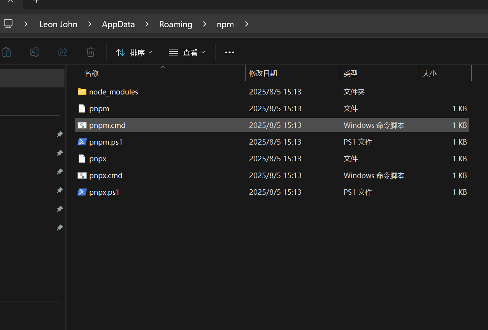

# web添加mcp服务京东轻量级超级智能体

### 开源地址[https://github.com/skyconnfig/joyagent-jdgenie/](https://github.com/skyconnfig/joyagent-jdgenie/)
### 1. 克隆代码
```plain
git clone https://github.com/jd-opensource/joyagent-jdgenie.git
```

### 2.手工更新配置文件
```plain
2. 手动更新 genie-backend/src/main/resources/application.yml中 base_url、apikey、model、max_tokens、model_name等配置
使用DeepSeek时: 注意deepseek-chat 为max_tokens: 8192

手动更新 genie-tool/.env_template 中的 OPENAI_API_KEY、OPENAI_BASE_URL、DEFAULT_MODEL、SERPER_SEARCH_API_KEY
使用DeepSeek时: 设置DEEPSEEK_API_KEY、DEEPSEEK_API_BASE，DEFAULT_MODEL 设置为 deepseek/deepseek-chat，所有 ${DEFAULT_MODEL} 也都改成deepseek/deepseek-chat
```

### 3.用 AIIDE 自动配置配置文件提示词
```plain
熟悉检查文件夹配置文件，帮我配置base_url= https://api.deepseek.com ，apikey=sk-08090b8782904fc09cee9da664a187c2，DEFAULT_MODEL=deepseek/deepseek-chat， ${DEFAULT_MODEL} 也都改成deepseek/deepseek-chat
```

### 4.编译 dockerfile
```plain
docker build -t genie:latest .
```

### 5.启动 Dockerfile
```plain
docker run -d -p 3000:3000 -p 8080:8080 -p 1601:1601 --name genie-app genie:latest
```

 浏览器输入 localhost:3000 访问genie

```plain
genie-backend/src/main/resources/application.yml
```

```plain
熟悉检查文件夹配置文件，帮我配置base_url= https://api.deepseek.com ，apikey=sk-08090b8782904fc09cee9da664a187c2，DEFAULT_MODEL=deepseek/deepseek-chat， ${DEFAULT_MODEL} 也都改成deepseek/deepseek-chat
```

开

```plain
我想搭建一个网站\                                                                                                                                                     │
│   我想要搭建一个网站                                                                                                                                                  │
│   1.技术栈：next.js+TypeScript+Rect+Tailwind CSS v4+shadcn/ui+SQLlite。                                                                                                         │
│   2.克隆功能通过fish audio提供的接口来完成实现的。                                                                                                                              │
│   3.关于接口的详细使用方式优先参考'.md'，'/home/lixinsi/Voice-Clone/fish_audio_platform_introduction.md'。                │
│   4.我主要想实现声音克隆和文本转语音功能。                                                                                                                                      │
│   5.这个网站只有我自己使用网站部署在本地电脑上的。\                                                                                                                             │
│   接下来我们一步步规划，我使用的技术栈是否合理，你是否有更合适的技术栈推荐。ultra think   
```

```plain
当你不知道怎么实现时候，使用context7来查询https://github.com/CherryHQ/cherry-studio，并且保存在本地，然后链接获得更详细更准确的信息。
在项目根目录我创建了一个todo文件，每次在开发之前，你都应该先将我们商量好的代办任务添加到这个文件夹中，每完成一个任务时，记得把对应的任务标记为已完成，这样可以是我们实时跟踪开发进度。
合理使用 Task 工具创建多个子代理来提高开发效率，每个子代理负责一个独立的任务，互不干扰，支持并行开发。

```

```plain
我们一起规划一下这个网站应该具有那些功能  
我感觉你设计的太复杂了，你就围绕着核心LLM服务支持
- [ ] OpenAI GPT系列模型
- [ ] Anthropic Claude系列
- [ ] Google Gemini系列
- [ ] 硅基流动等国产模型
- [ ] Ollama本地模型支持
- [ ] 流行AI Web服务集成以及能助手系统
- [ ] 300+预配置助手导入
- [ ] 自定义助手创建
- [ ] 助手分类和管理
- [ ] 多模型同时对话
- [ ] 全局搜索功能
- [ ] 话题管理系统
- [ ] AI翻译功能
- [ ] 拖拽排序界面
- [ ] MCP协议支持包括（uv,python,npx）
这两个核心需求来进行设计
```

###### 6.全局安装 pnpm
```plain
npm install --global pnpm
```




> 更新: 2025-08-05 15:15:38  
> 原文: <https://www.yuque.com/lixinsi/dtxgrg/huz605ggan7a4kap>