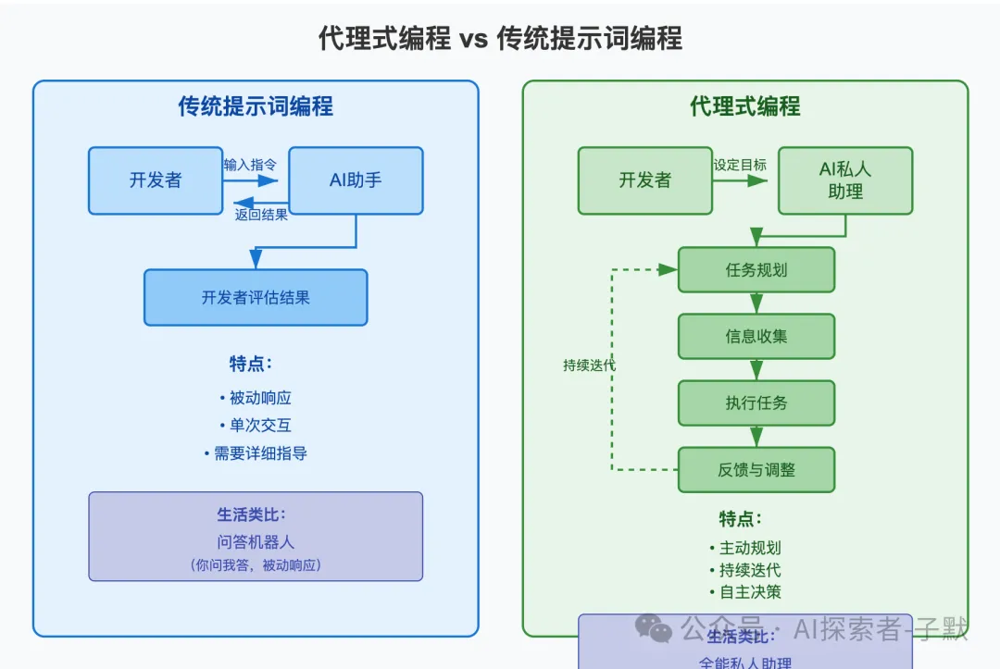
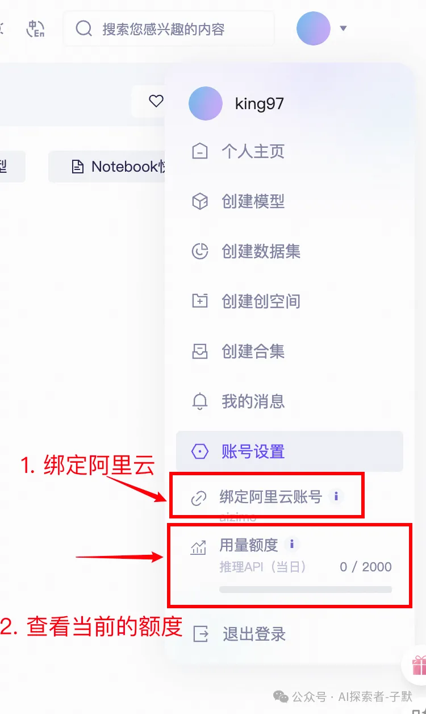
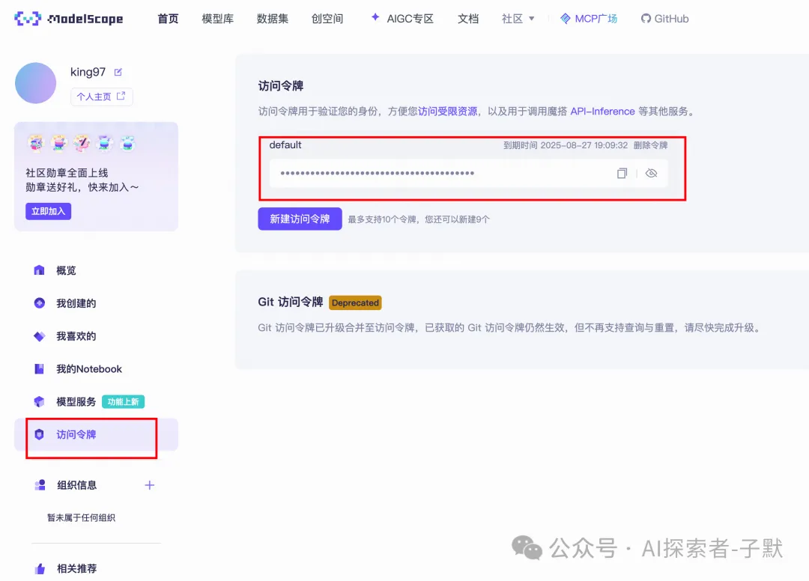

# 免费将Qwen3-coder接入Claude Code

<font style="color:black;">Qwen3-Coder: 在世界中自主编程</font>

**<font style="color:black;background-color:rgba(0, 0, 0, 0.05);">什么是“代理式编程”？</font>**<font style="color:rgb(119, 119, 119);background-color:rgba(0, 0, 0, 0.05);">“代理式编程”（Agentic Coding）是一种新兴的编程范式，强调 AI 模型在软件开发过程中具备自主性、目标导向和持续迭代的能力。与传统的基于提示词（prompt-based）的编程方式不同，代理式编程让 AI 模型不仅仅是被动地响应输入，而是主动地规划、执行、评估并优化开发任务。</font>

<font style="color:black;">举一个生活化的例子：</font>

**<font style="color:black;background-color:rgba(0, 0, 0, 0.05);">代理式编程就像是雇佣了一个全能的私人助理</font>**

<font style="color:rgb(119, 119, 119);background-color:rgba(0, 0, 0, 0.05);">想象一下，你是一位企业家，日常工作繁忙，需要处理大量的任务。于是，你雇佣了一位私人助理，负责帮你完成以下工作：</font>

+ **<font style="color:black;background-color:rgba(0, 0, 0, 0.05);">任务规划</font>****<font style="color:rgb(1, 1, 1);background-color:rgba(0, 0, 0, 0.05);">：根据你的目标，制定每日工作计划。</font>**
+ **<font style="color:black;background-color:rgba(0, 0, 0, 0.05);">信息收集</font>****<font style="color:rgb(1, 1, 1);background-color:rgba(0, 0, 0, 0.05);">：主动查找并整理你需要的资料。</font>**
+ **<font style="color:black;background-color:rgba(0, 0, 0, 0.05);">执行任务</font>****<font style="color:rgb(1, 1, 1);background-color:rgba(0, 0, 0, 0.05);">：根据计划完成各项工作，如回复邮件、安排会议等。</font>**
+ **<font style="color:black;background-color:rgba(0, 0, 0, 0.05);">反馈与调整</font>****<font style="color:rgb(1, 1, 1);background-color:rgba(0, 0, 0, 0.05);">：在工作中遇到问题时，主动向你汇报并提出解决方案。</font>**

<font style="color:rgb(119, 119, 119);background-color:rgba(0, 0, 0, 0.05);">这位私人助理不仅仅是被动地等待你的指示，而是能够主动思考、执行并反馈，极大地提高了你的工作效率。</font>


<font style="color:#888;background-color:rgba(0, 0, 0, 0.05);">生活化类比</font>

**<font style="color:black;">在编程中的类比：Qwen3-Coder 就是你的“编程私人助理”</font>**

<font style="color:black;">在软件开发中，传统的 AI 编程助手通常是被动响应你的指令，例如：</font>

+ **<font style="color:rgb(1,1,1);">你输入：“请帮我写一个登录功能。”</font>**
+ **<font style="color:rgb(1,1,1);">AI 回答：“好的，这是一个基本的登录功能代码。”</font>**

<font style="color:black;">然而，Qwen3-Coder 作为一个具备代理式编程能力的 AI 模型，就像是你雇佣的“编程私人助理”，能够主动承担更多责任：</font>

+ **<font style="color:black;">任务规划</font>****<font style="color:rgb(1,1,1);">：根据项目需求，主动提出功能模块的设计方案。</font>**
+ **<font style="color:black;">信息收集</font>****<font style="color:rgb(1,1,1);">：自动查阅相关文档，获取所需的技术资料。</font>**
+ **<font style="color:black;">执行任务</font>****<font style="color:rgb(1,1,1);">：编写代码、运行测试、提交版本等。</font>**
+ **<font style="color:black;">反馈与调整</font>****<font style="color:rgb(1,1,1);">：在遇到问题时，自动进行调试并优化代码。</font>**

<font style="color:black;">这种主动性和自主性，使得开发者可以将更多的精力集中在系统设计和业务逻辑上，而将繁琐的编码任务交给 Qwen3-Coder，从而提高开发效率和代码质量。</font>



<font style="color:#888;">代理式编程vs传统式编程</font>

## <font style="color:rgb(255, 255, 255);background-color:rgb(33, 33, 34);">接入教程</font>
### <font style="color:black;">获取魔塔密钥</font>
<font style="color:rgb(119, 119, 119);background-color:rgba(0, 0, 0, 0.05);">首先要有个阿里云账号，然后去这里登录注册一下，</font>**<font style="color:black;background-color:rgba(0, 0, 0, 0.05);">绑定自己的阿里云账号</font>**

<font style="color:black;">下方链接是 Qwen-Coder 模型地址，必须要绑定自己的阿里云账号才可以进行使用，可以不实名，但是必须要绑定。可以通过鼠标移动到魔搭社区右上角头像处，在弹出的菜单底部查看自己是否完成阿里云账号绑定：魔塔平台</font>



<font style="color:#888;background-color:rgba(0, 0, 0, 0.05);">代理式编程vs传统式编程</font>

**<font style="color:black;">进入控制台，获取密钥</font>**<font style="color:black;">：</font>



<font style="color:#888;">控制台</font>

### <font style="color:black;">安装Claude Code & Claude Coder Router</font>
| **<font style="color:black;">模块</font>** | **<font style="color:black;">功能</font>** |
| :--- | :--- |
| **<font style="color:black;">Node.js (≥18)</font>** | 提供 JavaScript 包管理与命令行工具执行环境 |
| **<font style="color:black;">Claude Code CLI</font>** | Anthropic 官方命令行 AI 编程工具 |
| **<font style="color:black;">Claude Code Router (ccr)</font>** | 可任意路由 Claude Code 请求到多家模型服务 |
| **<font style="color:black;">Qwen3‑Coder API Key</font>** | 魔塔 用于调用 Qwen3‑Coder 模型 |


### **<font style="color:black;">第一部 — 安装 Node.js（必要步骤）</font>**
1. **<font style="color:rgb(1,1,1);">打开 nodejs.org 网站。</font>**
2. **<font style="color:rgb(1,1,1);">下载并安装 </font>****<font style="color:black;">LTS（长期支持）18 LTS 或以上版本</font>****<font style="color:rgb(1,1,1);">（可选 20.x）。</font>**
3. **<font style="color:rgb(1,1,1);">安装完成后，在终端（macOS/Linux）或命令提示符（Windows）运行：</font>**

```plain
node -v
npm -v
```

1. **<font style="color:rgb(1,1,1);">正确安装时会显示版本号，比如 v18.15.0。</font>**

### **<font style="color:black;">第二部 — 安装 Claude Code CLI</font>**
<font style="color:black;">在终端输入以下命令：</font>

```plain
npm install -g @anthropic-ai/claude-code
```

### **<font style="color:black;">第三部 - 安装 Claude Code Router（适用于多模型切换）</font>**
<font style="color:black;">这种方式更灵活，可在同一个机器上同时配置多个模型（如 Kimi-K2、Claude 4 等），并通过 /model 命令实时切换。</font>

**<font style="color:black;">1. 安装 ccr</font>**

```plain
npm install -g @musistudio/claude-code-router
```

**<font style="color:black;">2. 修改配置</font>**

<font style="color:black;">配置文件路径：</font>

+ **<font style="color:rgb(1,1,1);">macOS/Linux：~/.claude-code-router/config.json</font>**
+ **<font style="color:rgb(1,1,1);">Windows：%USERPROFILE%.claude-code-router\config.json</font>**

<font style="color:black;">该 config.json 已包含诸多可选设置，例如：</font>

+ **<font style="color:rgb(1,1,1);">Router 对象中可以定义 background, think, longContext 等场景对应模型；</font>**
+ **<font style="color:rgb(1,1,1);">Providers 数组里可以添加多个提供方，如 DeepSeek、OpenRouter 等；</font>**
+ **<font style="color:rgb(1,1,1);">修改完保存后请运行：</font>**

```plain
ccr restart
```

+ **<font style="color:rgb(1,1,1);">使更改生效</font>**

---

**<font style="color:black;">config.json文件配置如下（需要将你的魔塔API_KEY填写）</font>**

```plain
{
  "Providers": [
    {
      "name": "modelscope",
      "api_base_url": "https://api-inference.modelscope.cn/v1/chat/completions",
      "api_key": "API_KEY",
      "models": [
        "Qwen/Qwen3-Coder-480B-A35B-Instruct",
        "ZhipuAI/GLM-4.5",
        "moonshotai/Kimi-K2-Instruct"
      ],
      "transformer": {
        "use": [
          [
            "maxtoken",
            {
              "max_tokens": 65536
            }
          ],
          "enhancetool"
        ]
      }
    }
  ],
"Router": {
    "default": "modelscope,Qwen/Qwen3-Coder-480B-A35B-Instruct"
  },
"HOST": "127.0.0.1",
"LOG": true
}
```

**<font style="color:black;">3. 启动服务与 Claude Code</font>**

```plain
ccr start         # 启动本地 Router 代理服务
ccr code          # 强制走路由启动 Claude Code
```

<font style="color:black;">首次运行可能自动打开一个 Web 界面，点击 Test 后成功即可。</font>

<font style="color:black;">你可以使用 /model 切换模型，比如：</font>

```plain
/model dashscope,qwen3-coder‑plus
```

## **<font style="color:rgba(0, 0, 0, 0.9);">  
</font>**
## **<font style="color:rgba(0, 0, 0, 0.9);">❓</font>****<font style="color:rgba(0, 0, 0, 0.9);"> 常见问题解答（FAQ）</font>**
1. **<font style="color:black;">报错 "No allowed providers" 或 "Unsupported"：</font>**

**<font style="color:black;">→ 检查 config.json 是否包含 "dashscope" provider；是否将 default 路由指向 "dashscope,qwen3-coder-plus"；执行过 ccr restart。</font>**

2. **<font style="color:black;">输出很慢 / Token 用完：</font>**

**<font style="color:black;">→ 每日免费使用额度为 </font>****<font style="color:black;">2,000 次/1,000,000 tokens</font>****<font style="color:black;">，节假日多操作可能用完。可以通过设置 /model dashscope,qwen3-coder-plus 切换到备用 provider（若你添加）。</font>**

3. **<font style="color:black;">运行报错 ccr: command not found：</font>**

**<font style="color:black;">→ 检查是否使用了正确终端，部分用户环境变量未刷新；尝试重启终端或检查 %PATH% 或 ~/.bashrc 是否包含 npm install 的目录。</font>**

4. **<font style="color:black;">为 Windows Terminal 设置默认模型：</font>**

**<font style="color:black;">→ 可以在 PowerShell 配置文件（$PROFILE）里添加 alias 或 zetx 以上环境变量，使启动时直接加载。</font>**

---

**<font style="color:black;">完成设备示例（macOS/Linux 终端总流程）</font>**

```plain
node -v && npm -v        # 确认 Node.js ≥18
npm install -g @anthropic-ai/claude-code
npm install -g @musistudio/claude-code-router 
修改config.json ,添加provider
ccr start
ccr code
```

---


> 更新: 2025-08-08 14:26:46  
> 原文: <https://www.yuque.com/lixinsi/dtxgrg/mvl6q7wragdbgh1h>