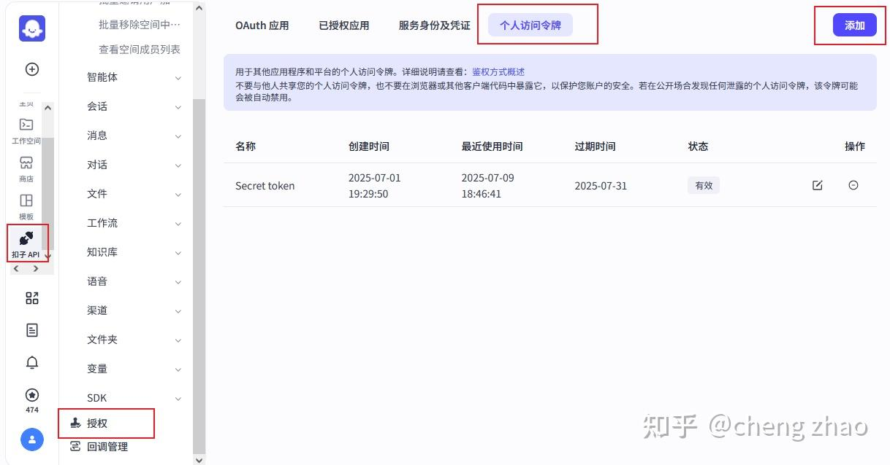
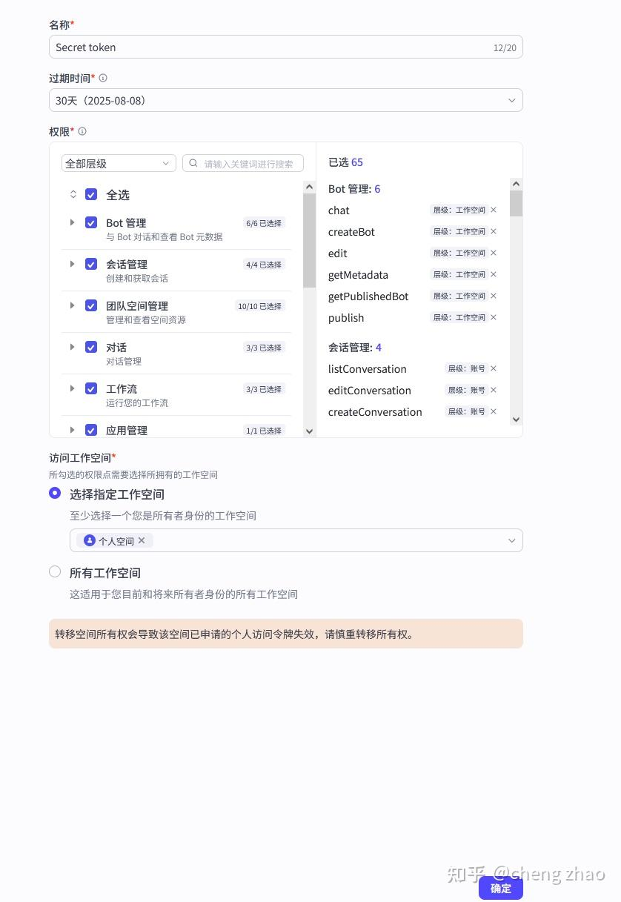
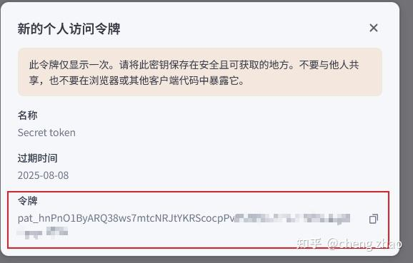
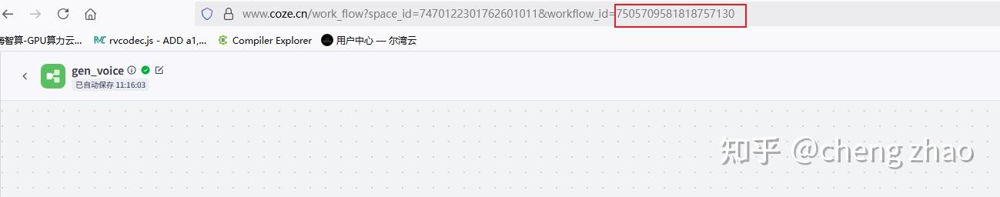

# 网盘系统前端提示词

### 1.在 <https://chat.qwen.ai/>生成自己想要的网页模板 html 样式。生成后把代码复制到 trad 里面统一风格，至此页面都统一风格后在调试功能

```plain
"请创建一个赛博朋克/科幻风格的登录页面，要求： 

整体风格：暗黑背景 + 霓虹青色(#00ffff)主色调，带有未来科技感，类似《银翼杀手》或《创：战纪》的UI设计 
核心特效： 
动态粒子背景（青色光点，鼠标悬停时产生排斥效果，点击添加新粒子）
顶部到底部的扫描线动画（青色渐变，3秒循环）
磨砂玻璃效果的登录卡片（半透明黑色，背景模糊）
布局要求： 
全屏居中显示
登录表单最大宽度400px
深色背景(#000)上显示
视觉元素： 
标题使用青-蓝-紫渐变文字（-webkit-background-clip: text实现）
输入框深蓝边框，聚焦时青色发光
按钮青蓝渐变，悬停时上浮和发光
霓虹风格的标签文字
技术实现： 
使用纯HTML/CSS/JS，不依赖框架
粒子效果使用tsParticles库（通过CDN引入）
必须包含响应式设计（适配移动端）
使用backdrop-filter实现磨砂玻璃效果
功能组件： 
用户名和密码输入框
登录按钮
辅助链接（如"忘记密码"）
标题和副标题"

```

### 2.常用文件列表展示

```plain
网格/缩略图视图
```

## MuseTalk训练自己的数字人


### 1. 注意事项

1. 建议选择显存48G及以上的GPU
2. 如果选择24G的GPU,在realtime推理时，请将batch\_size调整到4以下
3. 使用realtime推理可以生成数字人模型
4. 建议使用真人形象的视频训练角色模型，musetalk对动漫角色的处理不太好
5. 视频推荐480P分辨率
6. 视频中的人不要出现过大的运动，尤其是头部

### 2. 制作数字人视频

大家可以使用 文生图 -> 图生视频 的工具生成自己想要的数字人形象，生成一个视频

### 3. 使用方法

### 3.1. 初始化环境

```bash
cd /root/workspace/MuseTalk 
conda activate MuseTalk
```

### **3.2. 使用自定义的素材进行推理**

1. 将要使用的音频文件放在/root/workspace/MuseTalk/data/audio目录下，音频文件需要是wav格式
2. 将要使用的视频文件放在/root/workspace/MuseTalk/data/video目录下，视频文件需要是mp4格式,分辨率不要太高，建议480P或720P
3. 修改/root/workspace/MuseTalk/configs/inference/realtime.yaml

```bash
# avator_1: 
#  preparation: True 
# your can set it to False if you want to use the existing avator, it will save time 
#  bbox_shift: 5 
#  video_path: "data/video/yongen.mp4" 
#  audio_clips: 
#      audio_0: "data/audio/yongen.wav" 
#      audio_1: "data/audio/eng.wav" 
avator_2: 
  preparation: True # your can set it to False if you want to use the existing avator, it will save time 
  video_path: "data/video/yongen.mp4" 
  audio_clips: 
    audio_0: "data/audio/yongen.wav"
```

将原有的内容注释掉，在下面添加新的配置，例如task\_2，将video\_path和audio\_path修改为你自己文件的路径.\
preparation为True表示会生成一个新的数字人模型，如果之前已经有数字人模型，你可以将这个值修改为False

之后执行命令

```bash
sh inference.sh v1.5 realtime
```

### 4. 使用新的数字人

推理完成之后，我们会得到一个新的数字人模型，位置在

`/root/workspace/MuseTalk/results/v15/avatars/avator_n/`

把 avator\_n 文件夹拷贝到第一节`Livetalking`的 `/workspace/LiveTalking/data/avatars/`目录下，就可以使用新的数字人了

## 三、coze相关

### 1. 添加个人访问令牌



点击扣子API -> 授权 -> 个人访问令牌 -> 添加



点击确定，就会生成一个令牌，保存下来，这个令牌就是`COZE_API_TOKEN`



### 2. 工作流



打开一个工作流，网址最后面的部分就是`WORKFLOW_ID`

```plain
这个页面样式不符合要求我需要

登入页面和注册页面和下面

登入使用用户名以及密码

要求保持一致

## 应用架构设计

### 主应用布局 (App.vue)

**布局结构**:

- 左侧可折叠导航栏 (a-layout-sider)

- 顶部标题栏 (a-layout-header) 包含折叠按钮和用户菜单

- 主内容区域 (a-layout-content) 包含路由页面

**关键特性**:

- 响应式侧边栏折叠

- 用户登录状态管理

- 导航集成

- 统一的页面布局容器

**样式规范**:

- 侧边栏: 白色背景，浅色主题，品牌标识居中显示

- 顶部栏: 白色背景，阴影效果，用户头像和下拉菜单

- 内容区: 透明背景，模块化布局，16px外边距

### 主内容区模块化布局规范

**设计原则**:

- 主内容区背景设为透明 (`background: 'transparent'`)

- 功能模块独立分离，每个模块使用白色背景卡片

- 同行模块高度必须保持一致

- 模块间距统一，视觉效果整齐专业

**模块分离策略**:

1. **筛选操作区**: 包含搜索框、筛选条件、操作按钮等

2. **数据列表区**: 包含表格、分页等数据展示组件

3. **统计信息区**: 包含数据统计卡片、图表等

4. **功能操作区**: 包含快捷操作、工具按钮等
```


> 更新: 2025-08-15 11:10:32  
> 原文: <https://www.yuque.com/lixinsi/dtxgrg/zyurave545copvv6>