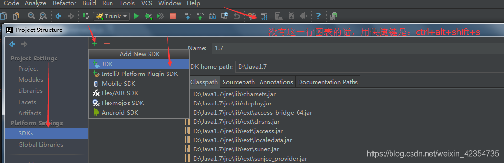

# CentOS---安装JDK（yum安装）无需配置环境变量

##### 1.查看云端目前支持安装的JDK版本
yum search java|grep jdk

##### 2.选择JDK版本，并安装
yum install -y java-1.8.0-openjdk

##### 3.检查是否安装成功
java -version

##### 4.查看JDK的安装目录
##### find / -name 'java'
IJ安装javajdk

ntelliJ IDEA支持多个版本的JDK同时存在，如下图：

[https://www.cnblogs.com/XiaoCui-blog/p/15185532.html](https://www.cnblogs.com/XiaoCui-blog/p/15185532.html)

[https://gitee.com/xwintop/x-RdbmsSyncTool#https://gitee.com/link?target=https%3A%2F%2Fwww.jetbrains.com%2F%3Ffrom%3DxJavaFxTool](https://gitee.com/xwintop/x-RdbmsSyncTool#https://gitee.com/link?target=https%3A%2F%2Fwww.jetbrains.com%2F%3Ffrom%3DxJavaFxTool)

dbsync:[http://www.hc-software.com/dbsync.htm](http://www.hc-software.com/dbsync.htm)

> 更新: 2022-09-18 10:14:55  
> 原文: <https://www.yuque.com/lixinsi/mxdptw/pwlm9p>