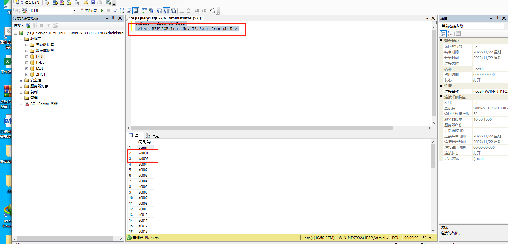

# SQL 常用语法以及函数

## <font style="color:rgb(36, 39, 41);">REPLACE() 語法 (SQL REPLACE() Syntax)</font>
SELECT REPLACE(str, from_str, to_str) FROM table_name; 

<font style="color:rgb(51, 51, 51);">函數意義為，在字串 str 中，將所有字串 from_str，取代為字串 to_str。</font>

## <font style="color:rgb(36, 39, 41);">REPLACE() 函數查詢用法 (Example)</font>
<font style="color:rgb(51, 51, 51);">假設我們有一個 customers 資料表：</font>

| <font style="color:rgb(51, 51, 51);">C_Id</font> | <font style="color:rgb(51, 51, 51);">Name</font> |
| --- | --- |
| <font style="color:rgb(51, 51, 51);">1</font> | <font style="color:rgb(51, 51, 51);">Smith</font> |
| <font style="color:rgb(51, 51, 51);">2</font> | <font style="color:rgb(51, 51, 51);">Brad</font> |


<font style="color:rgb(51, 51, 51);">我們可以如此：</font>

SELECT REPLACE(Name, 'Smith', 'ReplaceSmith') FROM customers; 

<font style="color:rgb(51, 51, 51);">返回的結果如下：</font>

| <font style="color:rgb(51, 51, 51);">REPLACE(Name, 'Smith', 'ReplaceSmith')</font> |
| --- |
| <font style="color:rgb(51, 51, 51);">ReplaceSmith</font> |
| <font style="color:rgb(51, 51, 51);">Brad</font> |


```sql
select * from tb_User
select REPLACE(LoginNo,'T','w') from tb_User
```



```sql
UPDATE table_name
SET column1 = value1, column2 = value2, ...
WHERE condition;

update tb_UserInfo set UserNo=REPLACE(UserNo,'s00101','s00102') where UserType=3
```

## <font style="color:rgb(36, 39, 41);">LIKE 運算子查詢用法 (Example)</font>
<font style="color:rgb(51, 51, 51);">假設我們想從下面的 customers 資料表中取得住在台北縣市的顧客資料：</font>

| <font style="color:rgb(51, 51, 51);">C_Id</font> | <font style="color:rgb(51, 51, 51);">Name</font> | <font style="color:rgb(51, 51, 51);">Address</font> | <font style="color:rgb(51, 51, 51);">Phone</font> |
| --- | --- | --- | --- |
| <font style="color:rgb(51, 51, 51);">1</font> | <font style="color:rgb(51, 51, 51);">張一</font> | <font style="color:rgb(51, 51, 51);">台北市XX路100號</font> | <font style="color:rgb(51, 51, 51);">02-12345678</font> |
| <font style="color:rgb(51, 51, 51);">2</font> | <font style="color:rgb(51, 51, 51);">王二</font> | <font style="color:rgb(51, 51, 51);">新竹縣YY路200號</font> | <font style="color:rgb(51, 51, 51);">03-12345678</font> |
| <font style="color:rgb(51, 51, 51);">3</font> | <font style="color:rgb(51, 51, 51);">李三</font> | <font style="color:rgb(51, 51, 51);">高雄縣ZZ路300號</font> | <font style="color:rgb(51, 51, 51);">07-12345678</font> |
| <font style="color:rgb(51, 51, 51);">4</font> | <font style="color:rgb(51, 51, 51);">陳四</font> | <font style="color:rgb(51, 51, 51);">台北縣AA路400號</font> | <font style="color:rgb(51, 51, 51);">02-87654321</font> |


<font style="color:rgb(51, 51, 51);">我們可以使用這樣的 LIKE 查詢語句：</font>

SELECT * FROM customers WHERE Address LIKE '台北%'; 

<font style="color:rgb(51, 51, 51);">查詢結果如下：</font>

| <font style="color:rgb(51, 51, 51);">C_Id</font> | <font style="color:rgb(51, 51, 51);">Name</font> | <font style="color:rgb(51, 51, 51);">Address</font> | <font style="color:rgb(51, 51, 51);">Phone</font> |
| --- | --- | --- | --- |
| <font style="color:rgb(51, 51, 51);">1</font> | <font style="color:rgb(51, 51, 51);">張一</font> | <font style="color:rgb(51, 51, 51);">台北市XX路100號</font> | <font style="color:rgb(51, 51, 51);">02-12345678</font> |
| <font style="color:rgb(51, 51, 51);">4</font> | <font style="color:rgb(51, 51, 51);">陳四</font> | <font style="color:rgb(51, 51, 51);">台北縣AA路400號</font> | <font style="color:rgb(51, 51, 51);">02-87654321</font> |


## <font style="color:rgb(36, 39, 41);">NOT LIKE</font>
<font style="color:rgb(51, 51, 51);">相反的，NOT LIKE 就是不包含在條件裡的的資料我通通要了，如上例多加上 NOT：</font>

SELECT * FROM customers WHERE Address NOT LIKE '台北%'; 

<font style="color:rgb(51, 51, 51);">查詢後返回的結果會是：</font>

| <font style="color:rgb(51, 51, 51);">C_Id</font> | <font style="color:rgb(51, 51, 51);">Name</font> | <font style="color:rgb(51, 51, 51);">Address</font> | <font style="color:rgb(51, 51, 51);">Phone</font> |
| --- | --- | --- | --- |
| <font style="color:rgb(51, 51, 51);">2</font> | <font style="color:rgb(51, 51, 51);">王二</font> | <font style="color:rgb(51, 51, 51);">新竹縣YY路200號</font> | <font style="color:rgb(51, 51, 51);">03-12345678</font> |
| <font style="color:rgb(51, 51, 51);">3</font> | <font style="color:rgb(51, 51, 51);">李三</font> | <font style="color:rgb(51, 51, 51);">高雄縣ZZ路300號</font> | <font style="color:rgb(51, 51, 51);">07-12345678</font> |


```sql
--按升序排列
select * from tb_User order by U_ID ASC;
--按降序排序
select * from tb_User order by U_ID desc;

```


> 更新: 2022-11-23 18:00:31  
> 原文: <https://www.yuque.com/lixinsi/mxdptw/adc8796w4nn3qu8t>