# Sql compare比较同步破解和使用教程

# 一、使用教程
SQL Compare是编程人员常用的比较两个数据库之间差异的工具。可以用来比较数据库里面的对象。比如存储过程，数据库中的数据，表的结构。

下面我就简单介绍一下如何使用

##### 1、选择要比较的数据库，点“Compare Now”进行比较
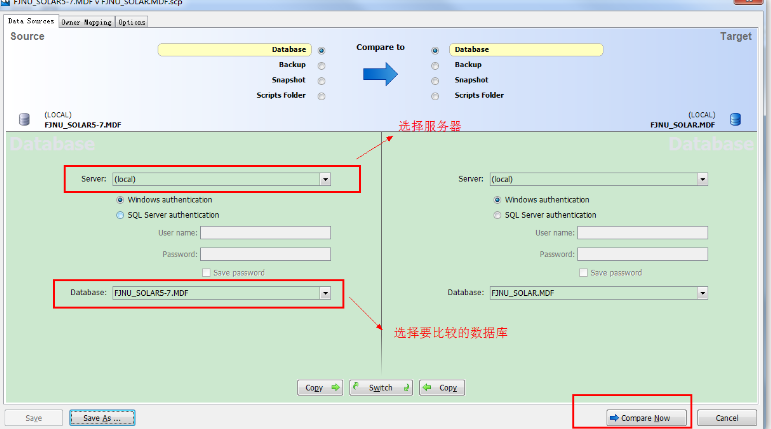

##### 2、对比两个数据库之间的差异，选择要同步的东西。红框出是对比窗口，可以看到两个数据库之间的差异
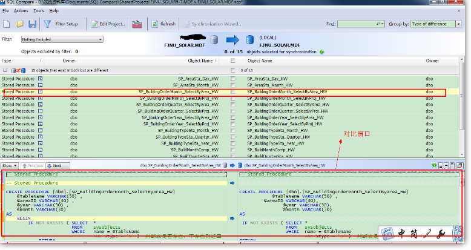

##### 3、同步数据库中的对象，点“Synchronization Wizard”
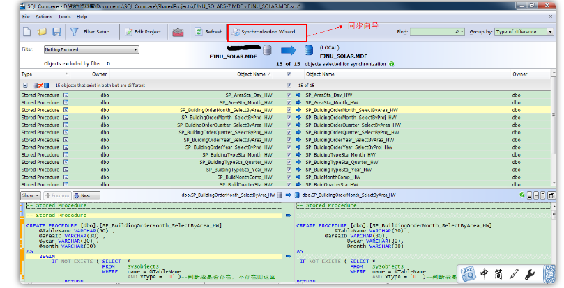

##### 4、开始同步，因为一直按“下一步”，这里只上图，不在说明步骤。
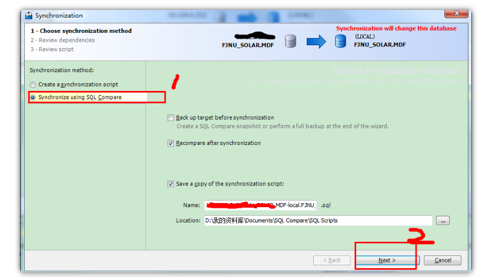

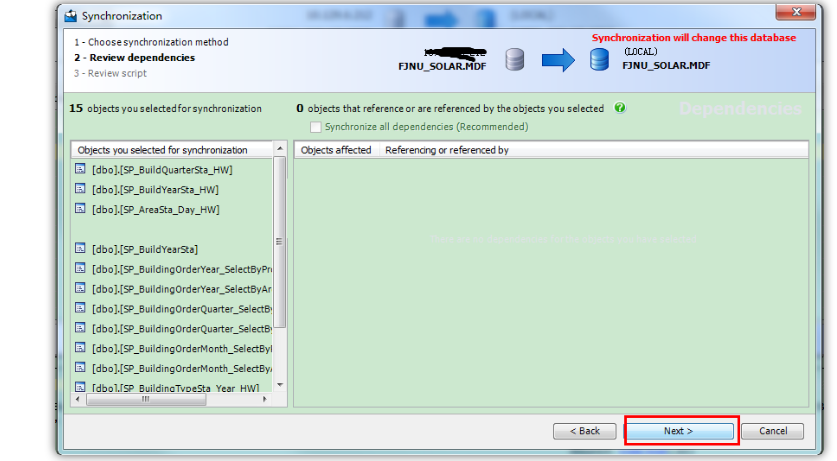

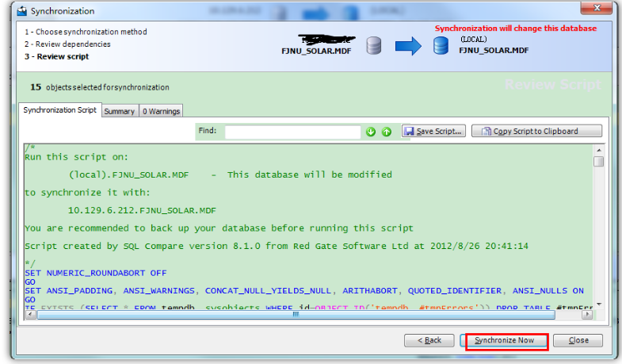

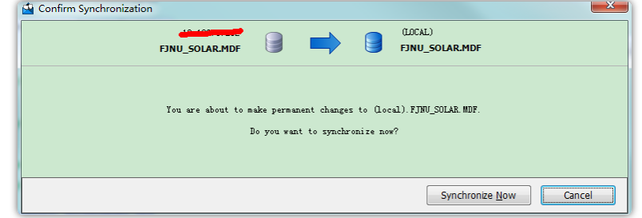

# 二、破解教程
由于我是刚才破解过程忘记截图了，Sorry。不过内容以及界面和以下都是一样！

##### 断开网络
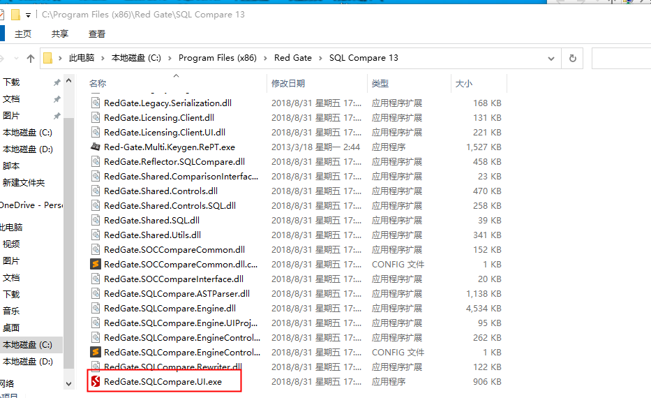

更改兼容性

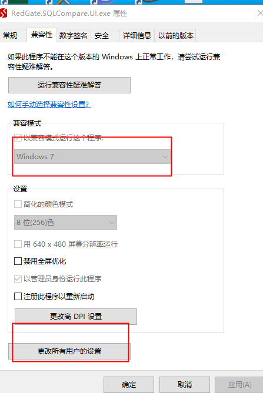

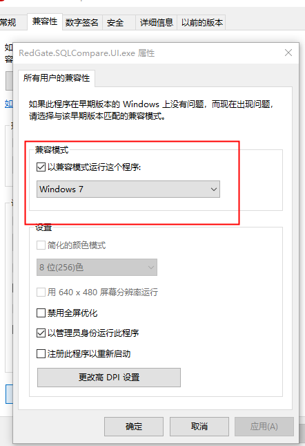

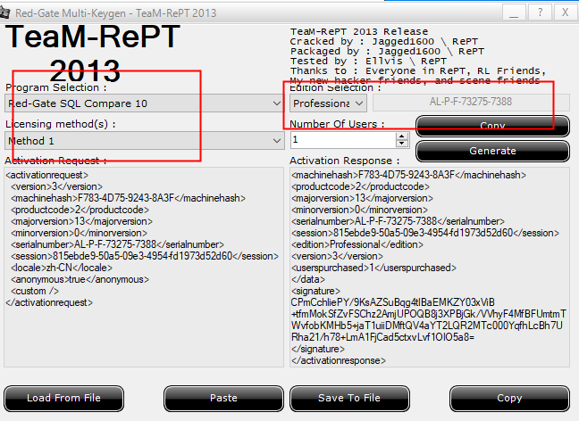

> 更新: 2022-12-06 13:10:31  
> 原文: <https://www.yuque.com/lixinsi/mxdptw/ptxfth>