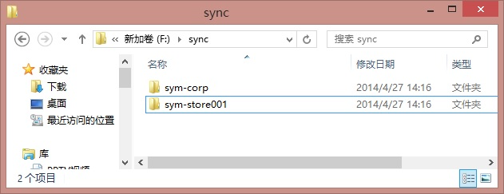
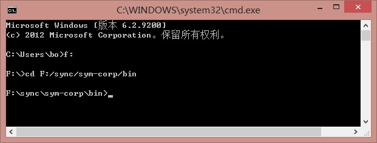
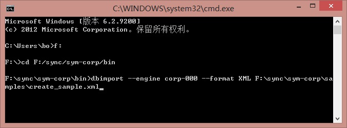
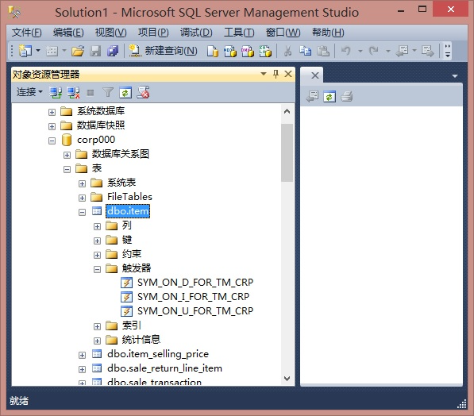
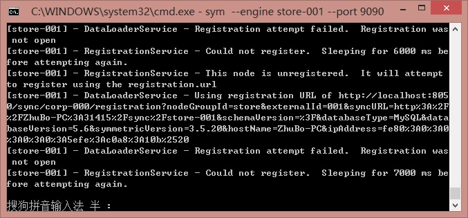

# SymmetricDS 异构数据库同步软件部署案例

## [https://www.cnblogs.com/bobozhu/p/3694599.html](https://www.cnblogs.com/bobozhu/p/3694599.html)
SymmetricDS是一个开源的同步软件，该软件是基于java环境编写的，在运行的时候需要安装JDK。SymmetricDS可以同步文件和数据库，本文的重点是数据库方面的同步。

SymmetricDS支持多种数据库的同步，支持的数据库如下：

Oracle, MySQL, MariaDB, PostgreSQL, MS SQL Server (including Azure), IBM DB2, H2, HSQLDB, Derby, Firebird, Interbase, Informix, Greenplum, SQLite (including Android), Sybase ASE, and Sybase ASA (SQL Anywhere) databases.

数据库的同步可以按照计划同步，也可以实现准实时同步。

SymmetricDS是如何抓取源数据库的数据的变化然后再同步到目标数据库呢？

官方文档上介绍了三种方式来捕捉数据的变化：

• Lazy data capture queries changed data from a source system using some SQL condition (like a  
time stamp column).

通过sql的查询来捕捉数据的变化，比如说通过时间戳的变化来捕捉变化的数据。  
• Trigger-based data capture installs database triggers to capture changes.

通过在数据库中建立触发器来捕捉每张表的数据的变化。（在部署SymmetricDS的时候，所选中的需要同步的表，会由SymmetricDS自动建立触发器来捕捉该表中数据的更新，插入以及删除。）  
• Log-based data capture reads data changes from proprietary database recovery logs.

基于日志的数据变化。通过读取数据库中日志的变化来捕捉变化的数据。

所有以上三个方面都有自己的优势和缺点，并且以上三种捕捉数据变化的方式，SymmetricDS在将来都会实现。但在目前，SymmetricDS只支持前两种方式来捕捉数据的变化。

下面通过一个官方的一个demo来实现sql server 到 Mysql的同步功能，该Demo是corp和store之间的同步，即公司和商店之间的数据库的同步。

**一  安装并配置SymmetricDS  **                                                                                                                                                                      

1.首先，从http://www.symmetricds.org/ 下载symmetric-ds-3.x.x-server.zip 文件。

2.在本地建立两个文件夹以此来代表两台机器。一个文件夹安装corp的SymmetricDS软件，另一个文件夹下也安装SymmetricDS软件代表store。

然后拷贝下载的symmetric-ds-3.x.x-server.zip文件分别到这两个文件夹下，并解压缩到当前文件夹到这两个文件夹下。

3.拷贝配置文件到相应路径下。

从F:\sync\sym-corp\samples路径下拷贝corp-000.properties到F:\sync\sym-corp\engines下，同样在F:\sync\sym-store001\samples下拷贝store-001.properties到F:\sync\sym-store001\engines下。

4.修改配置文件使SymmetricDS连接到数据库。

Corp的配置：

打开F:\sync\sym-corp\engines下的corp-000.properties，可以看到里面都是数据库连接的配置。

第22行 ：engine.name=corp-000，这个是该engine的名字。

我这个demo中，公司的数据库是sql server，那么在这个文件中的配置应该如下：

 1 #数据库驱动的类名  2   3 　　　　　　db.driver=net.sourceforge.jtds.jdbc.Driver  4   5 　　　　　　#jdbc连接  6   7 　　　　　　db.url=jdbc:jtds:sqlserver://localhost:1433/corp000;useCursors=true;bufferMaxMemory=10240;lobBuffer=5242880  8   9 　　　　　　#数据库的登陆账号 10  11 　　　　　　db.user=sa 12  13 　　　　　　#数据库的登陆密码 14  15 　　　　　　db.password=Administrator 16  17 　　　　　　#主节点的注册地址 18 　　　　　　registration.url= 19 　　　　　　sync.url=http://localhost:8050/sync/corp-000 20  21 　　　　　　#设置的group id 22  23 　　　　　　group.id=corp 24  25 　　　　　　#分配的一个ID 26 　　　　　　external.id=000

store的配置：

打开F:\sync\sym-store001\engines下的store-001.properties，可以看到里面都是数据库连接的配置。

第22行 ：engine.name=store-001，这个是该engine的名字。

我这个demo中，公司的数据库是sql server，那么在这个文件中的配置应该如下：

 1 　#数据库驱动的类名  2   3 　　　　　　db.driver=com.mysql.jdbc.Driver  4 　　　　　　#jdbc连接  5   6 　　　　　　db.url=jdbc:mysql://localhost/store001  7 　　　　　　#数据库的登陆账号  8   9 　　　　　　db.user=root 10 　　　　　　#数据库的登陆密码 11  12 　　　　　　db.password=root 13 　　　　　　#需要连接主节点的SymmetrcDS来注册，只有注册通过之后，才能同步 14 　　　　　　registration.url=http://localhost:8050/sync/corp-000 15 　　　　　　#设置的group id 16  17 　　　　　　group.id=store 18  19 　　　　　　#分配的一个ID 20 　　　　　　external.id=001

**二  建立数据库并创建相应的业务表和系统表****           ****                                                                                                                                       **

△ 配置corp000的数据库信息

1.打开命令窗口并定位到F:\sync\sym-corp\bin路径下

2.建立业务表

在cmd窗口中输入以下命令，并按回车：

dbimport --engine corp-000 --format XML F:\sync\sym-corp\samples\create_sample.xml

以上命令代表运行bin路径下的 dbimport.bat并调用engine路径下的corp-000.properties配置文件，并执行F:\sync\sym-corp\samples路径下的create_sample.xml脚本，在执行之后会在sql server的corp数据库中创建四张以下表:

item,item_selling_price,sale_return_line_item,sale_transaction

3.在corp数据库中创建SymmetricDS的系统表

因SymmetricDS的运行需要一些系统表来装载数据同步的相关信息，因此需要创建一些SymmetricDS需要的系统表。

在cmd窗口中继续输入以下命令，并按回车：

symadmin --engine corp-000 create-sym-tables

在执行以上命令之后会在sql server的corp数据库中创建多张以sym_ 开头的SymmetricDS的系统表。

4.最后，需要在业务表中插入一些数据以做同步测试用。

继续在cmd命令窗口中运行以下命令：

dbimport --engine corp-000 F:\sync\sym-corp\samples\insert_sample.sql

△ 配置store001的数据库信息

1.另外打开一个cmd窗口(上面那个cmd窗口先开着，后边会用到，就不需要重新打开了)，定位到F:\sync\sym-store001\bin路径下。  

2.在cmd窗口中运行以下命令以创建与corp一样的业务表

dbimport --engine store-001 --format XML F:\sync\sym-store001\samples\create_sample.xml

以上corp和store的相关表的配置已经完成，请确认corp和store的数据库的以下相关信息:

1.从corp数据库向store数据库同步的以下两张表是否在两个数据库中都存在：

item , item_selling_price

2.从store向corp数据库同步的以下两张表是否在两个数据库中都存在:

sale_transaction , sale_return_line_item

3.在corp数据库中，是否存在以sym_开头的系统表，比如sym_channel,sym_trigger, sym_router, 和 sym_trigger_router表。

4.确认corp数据库中的item表中有测试数据。

**三 启动SymmetricDS并同步数据                                                                                                                                      **

1.上一步骤中，我们打开了两个cmd的窗口，分别将路径定位到F:\sync\sym-corp\bin和F:\sync\sym-store001\bin，如果关闭的话，请重新打开两个cmd命令窗口，并将路径定位到corp和store的bin文件夹路径下，以代表corp机器和store机器。  

2.在corp的cmd窗口中，运行以下命令：

sym --engine corp-000 --port 8050

以上命令在第一次运行的时候，将会对相应的需要同步的表在数据库中建立触发器，可以查看数据库中的该表的触发器。如下图所示，建立了三个触发器来捕捉该表的数据的删除，插入和更新操作。

之后，SymmetricDS将会监听8050端口，来监听同步的请求和向corp发来注册请求的信息。

3.在store的cmd窗口中，运行以下命令:

sym --engine store-001 --port 8010

在store机器上第一次运行以上命令时，将会自动创建SymmetricDS的系统表，然后会根据F:\sync\sym-store001\engines下的store-001.properties中的registration.url来取得主机的注册地址（即corp的注册地址），并一直向该url发送注册请求。

**四 注册节点****                                                                                                                                                                                                          **

当一个没有注册的节点启动后，它将会尝试根据engines文件下的*.properties中的registration.url向该url发送注册信息，只有注册之后才能够同步数据。但是root节点(这儿是corp节点)的注册功能并没有打开，所以需要打开root节点的注册功能才可以接收注册请求。

1.在上一步骤中，我们打开了两个cmd窗口分别代表corp节点和store节点，上一步中，现在store节点每隔一定时间就尝试向corp节点发送注册信息，因为corp的注册功能并没有打开，所以store节点的注册请求一直失败，请看下图中的最后一行:RegistrationService - Could not register.  Sleeping for 28000 ms before attempting again.

现在打开第三个cmd命令窗口，并定位到F:\sync\sym-corp\bin，然后运行以下命令：

symadmin --engine corp-000 open-registration store 001

以上命令是运行bin文件下的sysadmin命令，并调用engine文件下的corp-000配置文件，对group node为store，编号为001的节点打开注册窗口。

然后查看store节点的cmd窗口的输出，发现注册成功。

**五 初始化数据                                                                                                                                                                     **

1.打开一个cmd窗口，定位到corp的F:\sync\sym-corp\bin 路径下，运行以下命令：

symadmin --engine corp-000 reload-node 001

以上命令就是将数据从corp节点上初始化到 编号为001的节点上，初始化之后，可以在store节点上的数据库中的item和item_selling_price表中查找到数据。

2.在corp节点pull data到store节点

打开sql server的corp库，并运行以下sql:

1　　insert into item (item_id, name) values (**110000055**, 'Soft Drink'); 2　　insert into item_selling_price (item_id, store_id, price)  3　　values (**110000055**, '001',**0.65**);  4　　insert into item_selling_price (item_id, store_id, price)  5　　values (**110000055**,'002', **1.00**);

运行完毕之后，可以查看mysql上的store库的item和item_selling_price表，数据已经同步过去了。

在以上sql的第4行和第5行，是一条insert语句，因为其插入的是002节点，而store是配置的001节点，所以这条数据并未插入到mysql的store数据库中，而corp节点并未找到002节点，因此该条数据被丢弃。

从corp节点往store节点是用pull的方式同步数据的，即corp节点有新的数据插入后，并不主动同步到store节点，而是等待store节点来取数据。

3.store节点push data到corp

在mysql的store库中，打开一个查询窗口，运行以下代码:

1 insert into sale_transaction (tran_id, store_id, workstation, day, seq) values 2 (**1000**, '001', '3', '2007-11-01', **100**); 3 insert into sale_return_line_item (tran_id, item_id, price, quantity) values 4 (**1000**, **110000055**, **0.65**, **1**);

数据将会同步到corp节点。当store数据库中的表插入新的数据时，数据将会主动push到corp节点。

> 更新: 2022-09-18 11:06:19  
> 原文: <https://www.yuque.com/lixinsi/mxdptw/zyesc6>