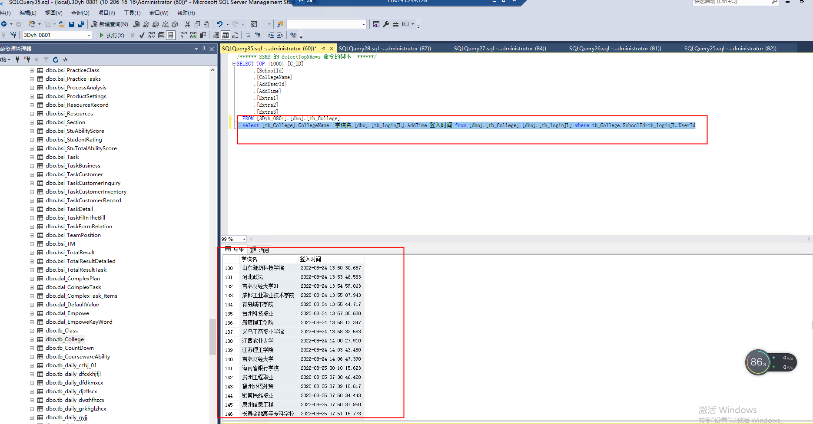
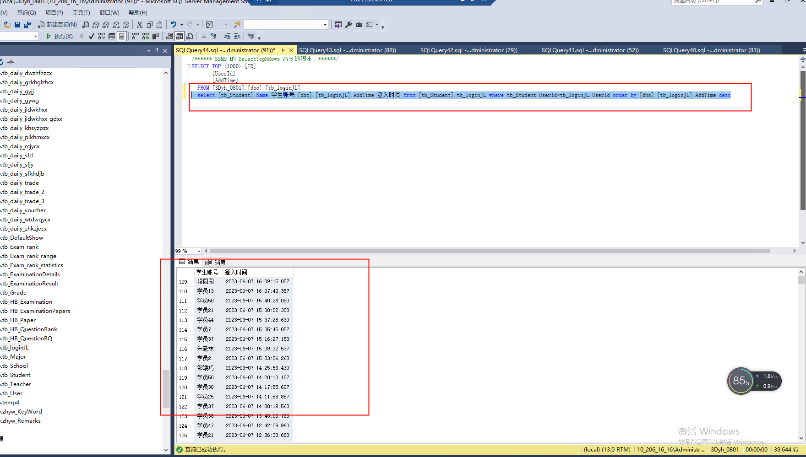

# sql查询多表格字段联合查询

```sql
select [tb_College].CollegeName  学院名,[dbo].[tb_loginJL].AddTime 登入时间 from [dbo].[tb_College],[dbo].[tb_loginJL] where tb_College.SchoolId=tb_loginJL.UserId
```



```sql
  select [tb_Student].Name 学生账号,[dbo].[tb_loginJL].AddTime 登入时间 from [tb_Student],tb_loginJL where tb_Student.UserId=tb_loginJL.UserId order by [dbo].[tb_loginJL].AddTime desc
```



```sql
SQL中的查询排序
一、SQL基础查询
1、select语句
格式：select字段from表名；

2、where 用于限制查询的结果

3、查询条件> < >= <= = !=

4、与 或（AND，OR）

5、在 不在（IN，NOT IN）

6、在[a,b] (between val1 and val2)

7、空 非空(NULL,NOT NULL)

8、全部 任一（ALL，ANY）
不能单独使用，必须与关系运算符配合

9、排重DISTINCT
用在字段之前


二、排序
1、使用 ORDER BY 语句
格式：select 字段 from 表名 where 条件 ORDER BY 字段；

2、设置升序降序（ASC，DESC）
格式：select 字段 from 表名 where 条件 ORDER BY 字段 ASC|DESC

3、多项排序
格式：select 字段 from 表名 where 条件 ORDER BY 字段 ASC|DESC，字段ASC|DESC

三、聚合函数
注意：在使用比较运算符时NULL为最大值，在排序时也会受影响
把 select 语句的查询结果汇聚成一个结果，这样的函数叫聚合函数
1、MAX\MIN
获取最大值和最小值，可以是任何数据类型，但只能获取一个字段

2、AVG\SUM
获取平均值、总和
nvl(salary,0)

3、COUNT
统计记录的数量

四、分组
1、GROUP BY
格式：select 组函数 from 表 group by 字段

2、HAVING 组判断条件
它的真假决定一组数据是否返回

五、查询语句的执行顺序
1、格式：select sum(salary) from 表名 where bool order by group by
　　a、from 表名，先确定数据的来源
　　b、where 确定表中的哪些数据有效
　　c、group by 字段名，确定分组的依据
　　d、having 确定组数据是否返回
　　e、order by 对组数据进行排序

六、关联查询
1、多表查询
select 字段 from 表1，表2 where;
2、多表查询时有相同字段怎么办
 　  1、表名.字段名
　　2、表名如果太长，可以给表起别名 （from 表 别名）
3、笛卡尔积
　　a、8条数据
　　b、9条数据
在多表查询时，一定要设置where 条件，否则将得到笛卡尔积


七、连接查询
当使用多表进行关联查询时，根据设置的条件会得到不同的结果
1、内连接查询：左右两边能匹配上的
select last_name ,name from s_emp,s_dept where dept_id=s_dept.id
2、外连接：左右两边不能匹配的数据
select last_name ,name from s_emp left|right|full outer join s_dept on dept_id=s_dept.id
3、左外连接
匹配成功的数据+左表不能匹配的数据
4、右外连接
匹配成功的数据+右表不能匹配的数据
5、全外连接
匹配成功的数据+左右表不能匹配的数据
```


> 更新: 2023-06-08 11:50:41  
> 原文: <https://www.yuque.com/lixinsi/mxdptw/ul1u9mwb1w0qmx33>