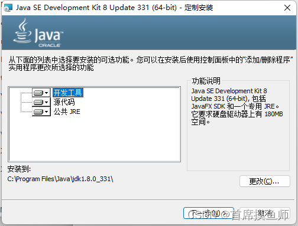
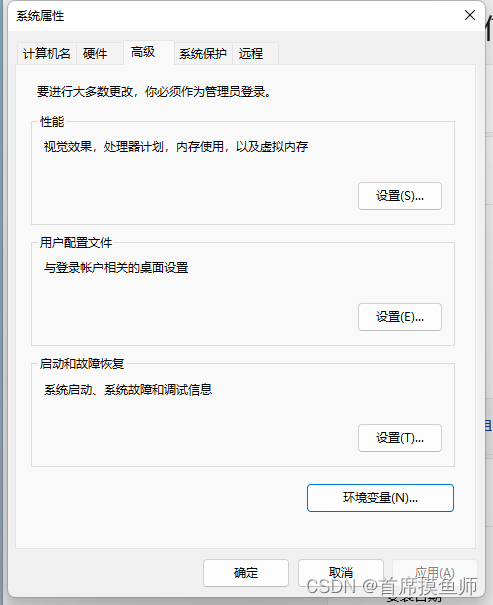
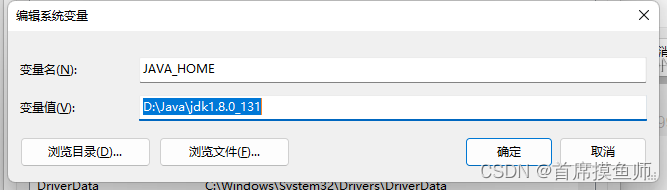
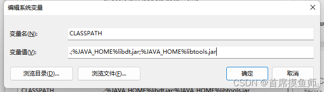
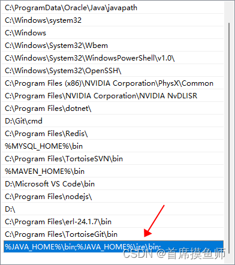
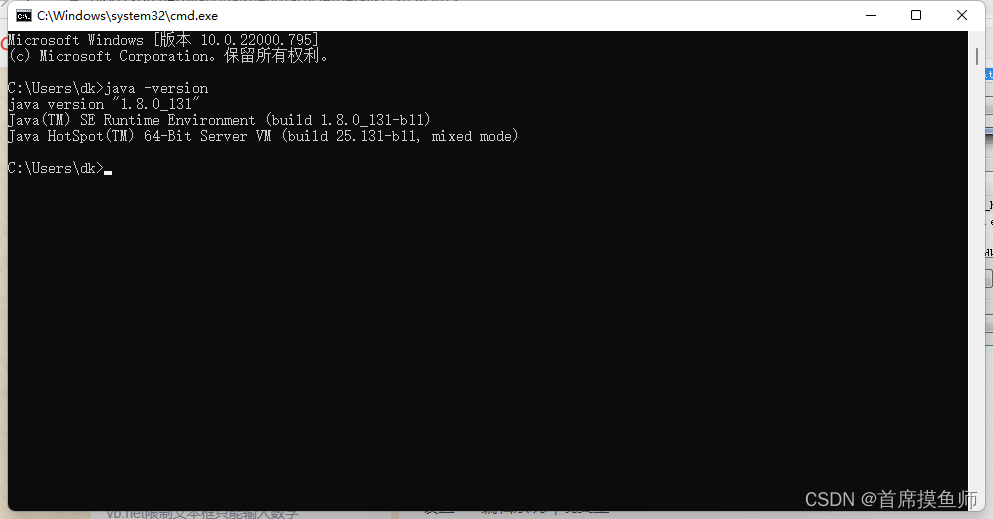

# widows安装jdk

Windows软件：如何安装Jdk1.8并配置环境变量

本章介绍如何安装Jdk1.8并配置环境变量

第一步：双击安装我们的文件，记住我们的安装路径

第二步：配置环境变量

1、进入系统属性，高级选项

2、在系统变量区域选择新建，输入变量名“ JAVA_HOME ”;变量值“ 你的jdk的路径

3、在系统变量区域，选择“新建”，输入变量名“ CLASSPATH”; 变量值 ：“.;%JAVA_HOME%\lib\dt.jar;%JAVA_HOME%\lib\tools.jar;” 。请注意变量值中，前面的“点“和”分号”，可以直接复制此变量值。然后点击“确定”

4、在系统变量区域，双击path变量，新建 %JAVA_HOME%\bin;%JAVA_HOME%\jre\bin; 如下：

5、cmd输入 java -version 安装完

资源下载 [https://pan.baidu.com/s/1RKKAkskGwV5K3GDcjq1Z8w](https://pan.baidu.com/s/1RKKAkskGwV5K3GDcjq1Z8w)提取码: vycd

> 更新: 2022-09-18 10:56:07  
> 原文: <https://www.yuque.com/lixinsi/mxdptw/qwglet>