# AI-for-教案&PPT生成

##   
新增生成网址 ppt 
[https://www.islide.cc/](https://www.islide.cc/)

# 豆包+Kimi生成教学PPT
## 豆包生成教案
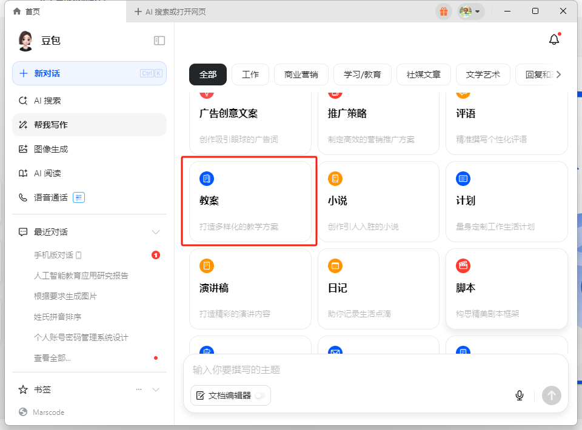

    - prompt：

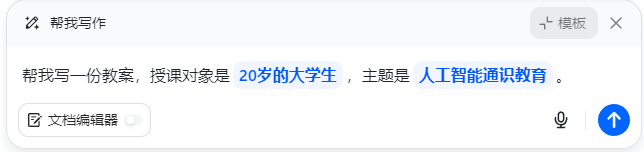

    - 生成内容，进行下载

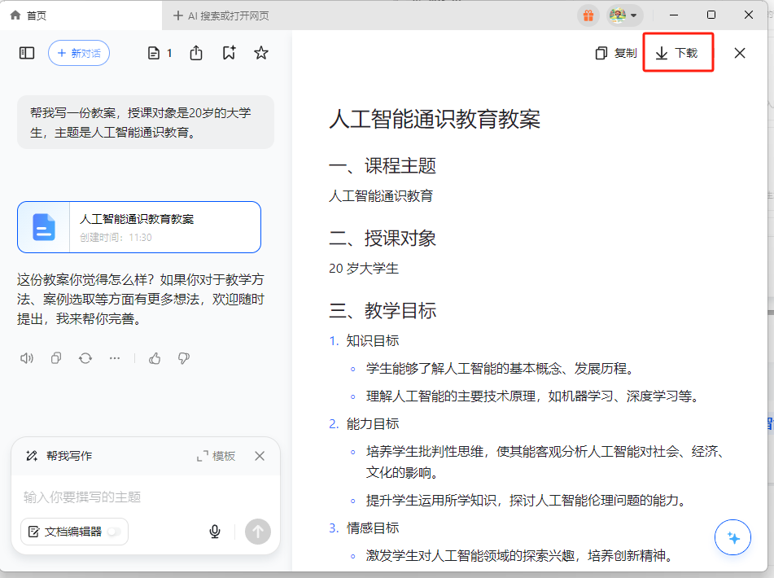

[https://kdocs.cn/l/ckammUIqUcWV](https://kdocs.cn/l/ckammUIqUcWV)

## kimi生成PPT
打开kimi网站，选择kimi+,选择PPT

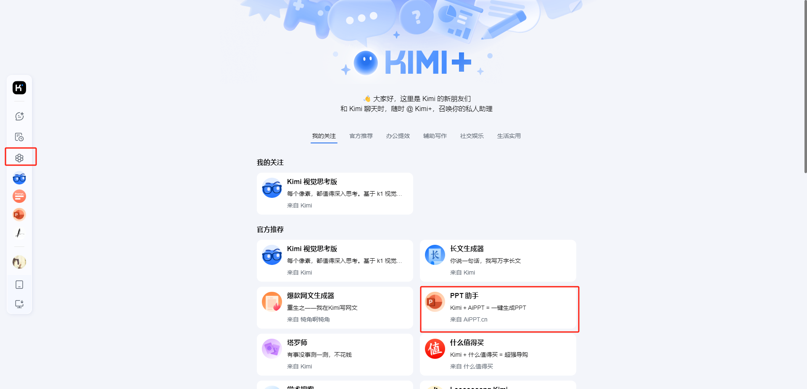

    - 上传教案文档，提示词：

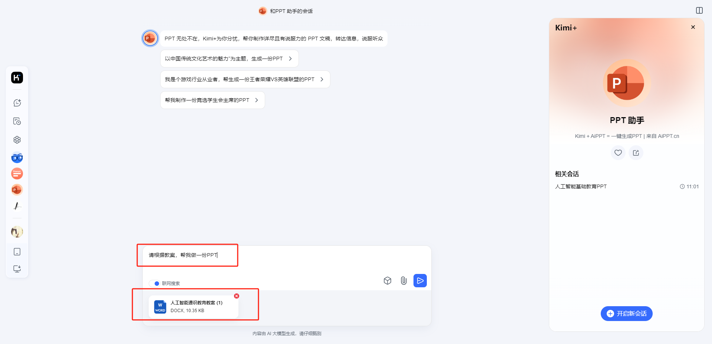

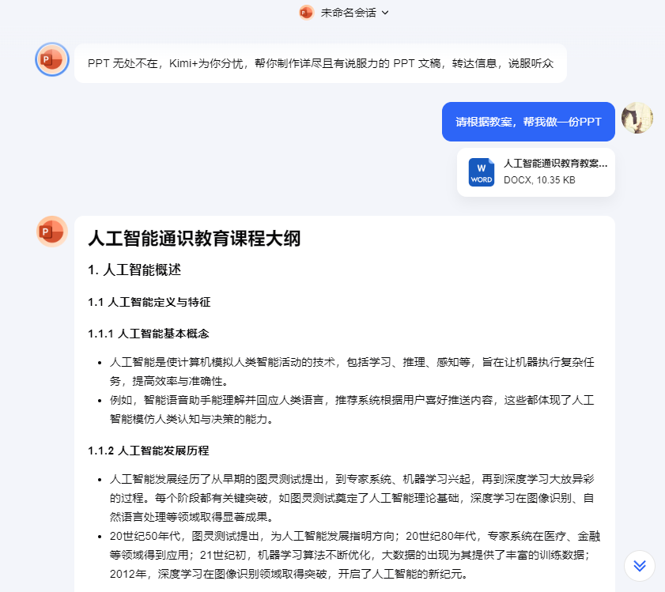

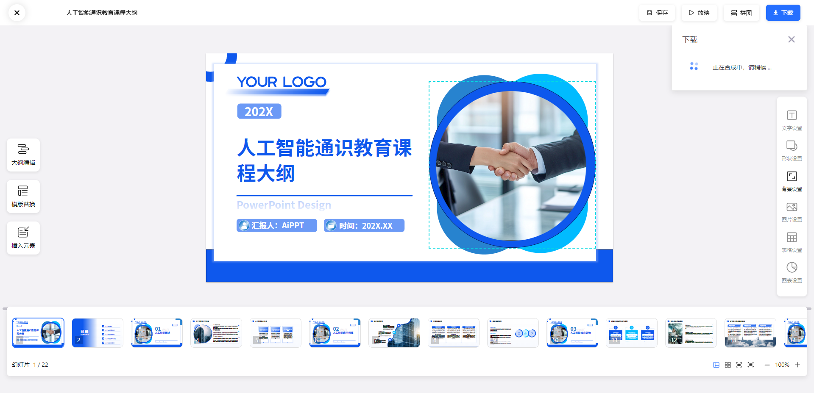

[https://kdocs.cn/l/crnUYUJwF3Xz](https://kdocs.cn/l/crnUYUJwF3Xz)

# 智谱清言[https://chatglm.cn/](https://chatglm.cn/)
_**每天只有一次导出机会！**_

## 1、输入提示词，生成大纲。还可针对某段进行改写
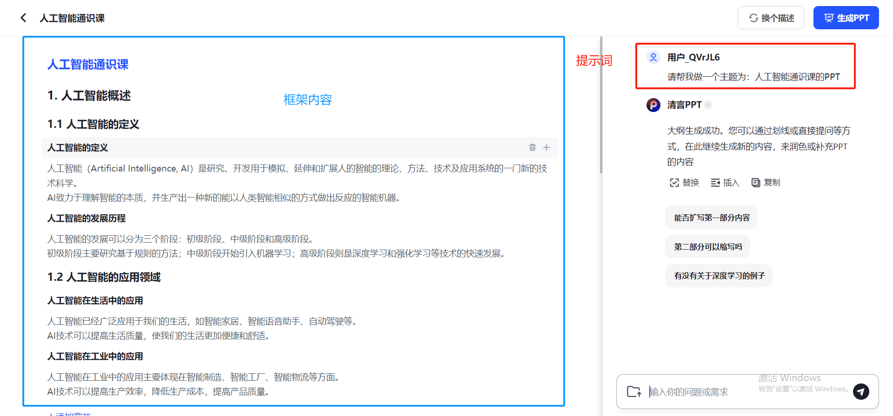

## 2、点击生成PPT，选择模板，直接生成
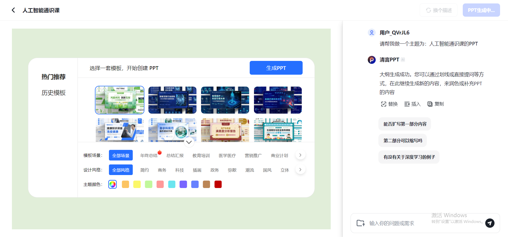

[https://kdocs.cn/l/cuEqPonTQxDO](https://kdocs.cn/l/cuEqPonTQxDO)

# WPS-AI
## 1、新建-演示文稿-选择AI
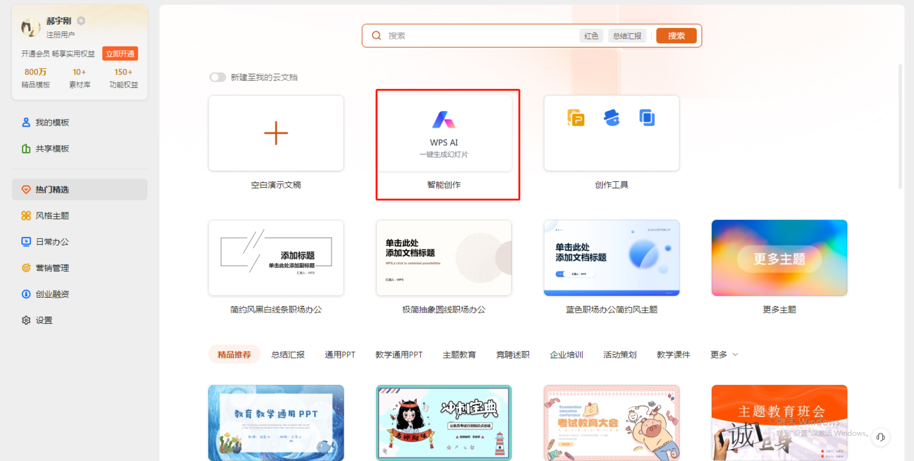

## 2、输入关键词或者主题。注意：这里还可以添加文档
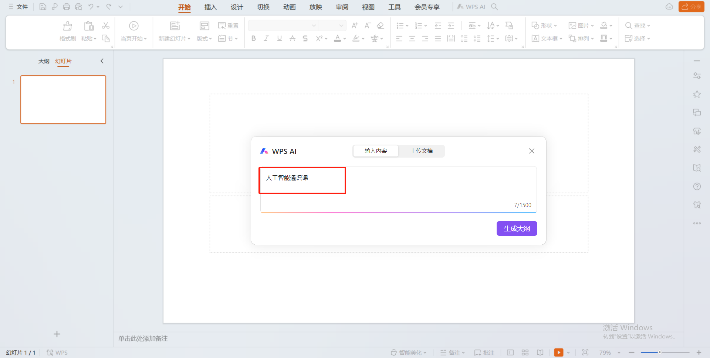

## 3、生成大纲，点击生成PPT
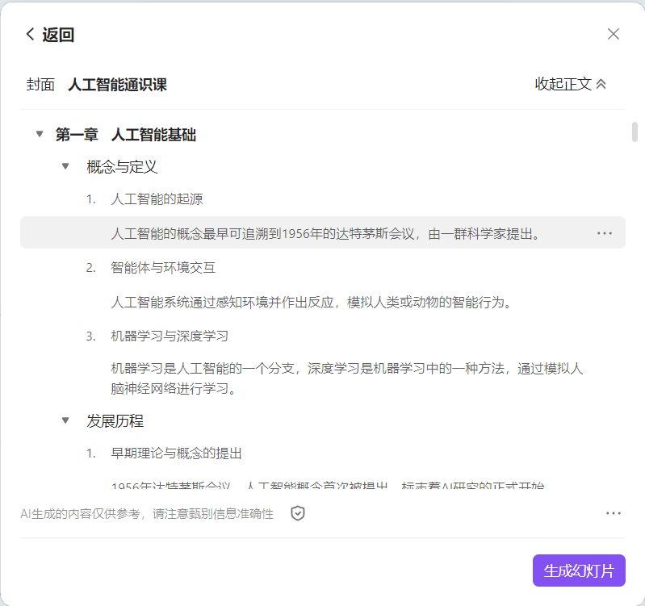

## 4、选择模板，创建幻灯片
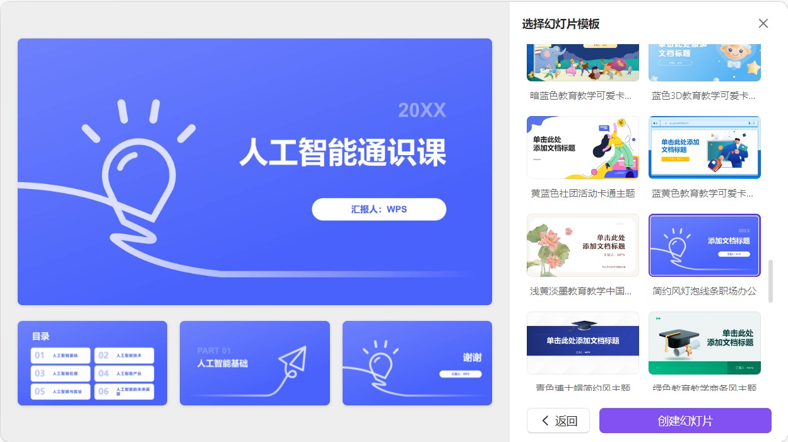

[https://kdocs.cn/l/cpVBa8zUH2xD](https://kdocs.cn/l/cpVBa8zUH2xD)

# 豆包直接生成PPT
选择生成PPT、输入主题、选择模板

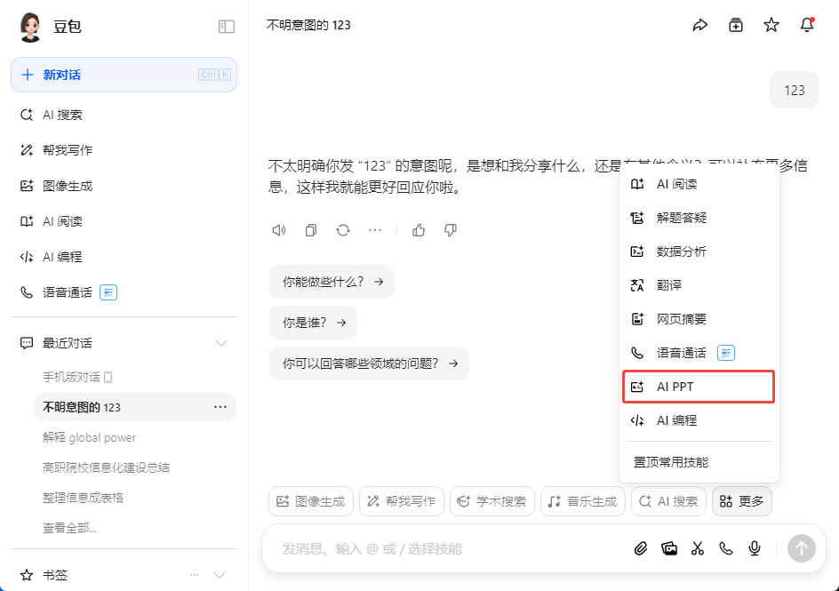

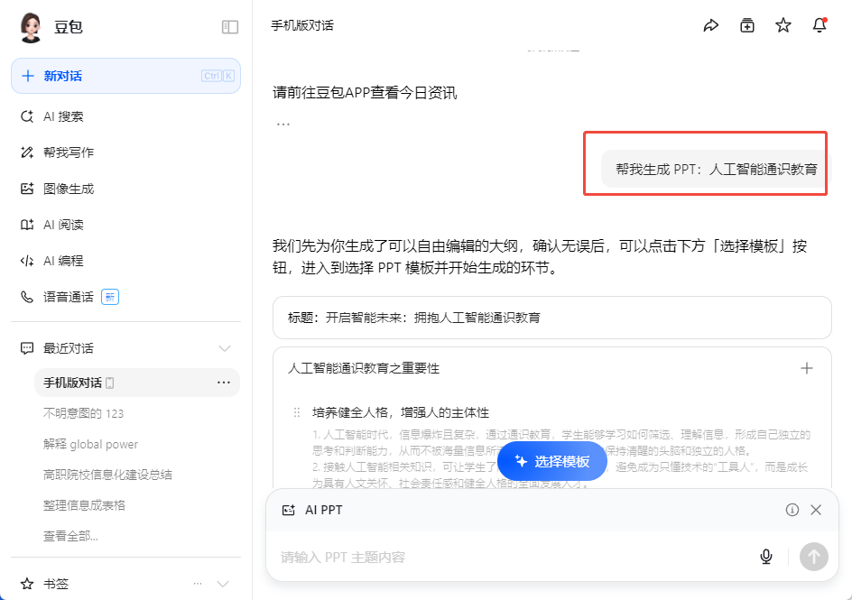

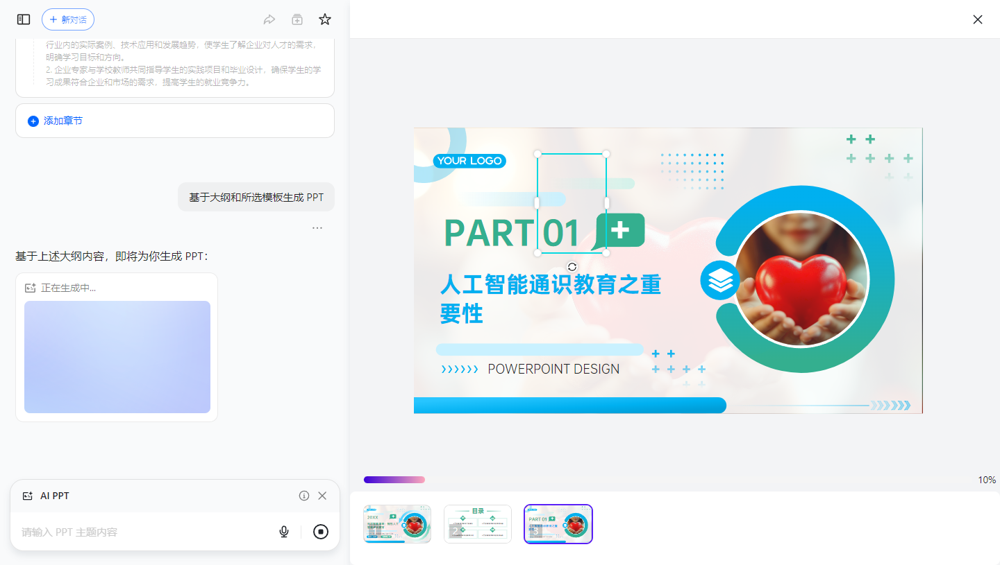

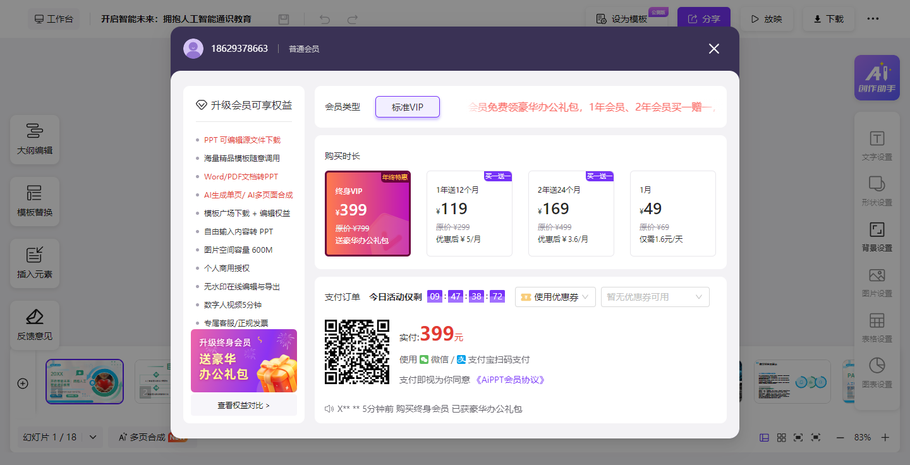

# 百度文库、AIPPT、讯飞星火等都可以直接做PPT

> 更新: 2025-07-04 08:40:42  
> 原文: <https://www.yuque.com/lixinsi/vnere7/nc4zz87g6dxk19es>