# AIGC应用于论文、文章、课题、报告等长文创作

📢

**整体思路：确定题目-确定框架-分段撰写**

# 第一章 方法一：推荐方法
# **检索文章**
[https://www.cnki.net/](https://www.cnki.net/)

✅

搜索词：人工智能赋能学校治理

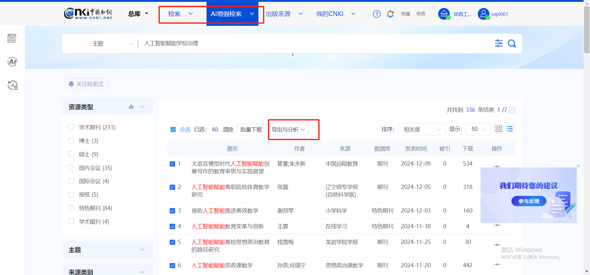

# **二、导出与分析**
## 导出文献，方便引用的编辑
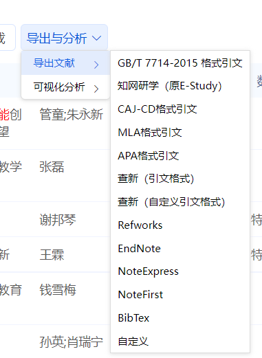

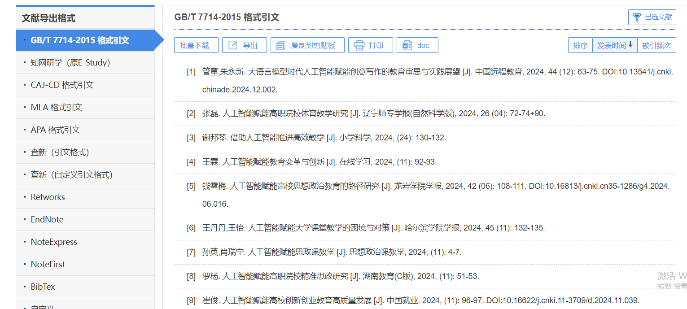

[https://kdocs.cn/l/cfBsO2O7sjV3](https://kdocs.cn/l/cfBsO2O7sjV3)

## 2、导出可视化分析
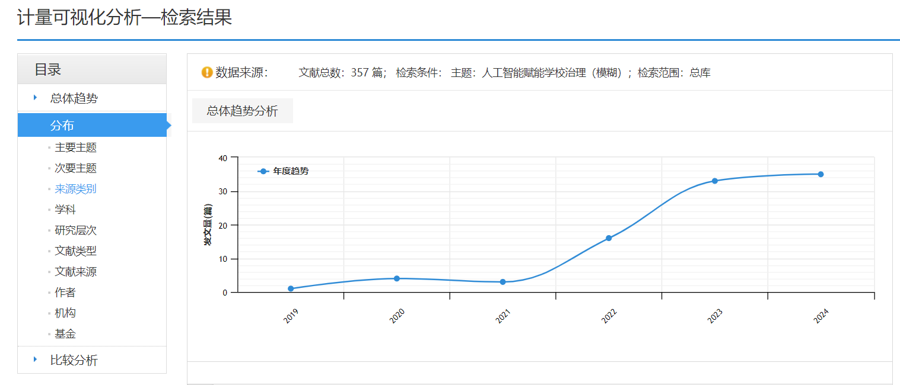

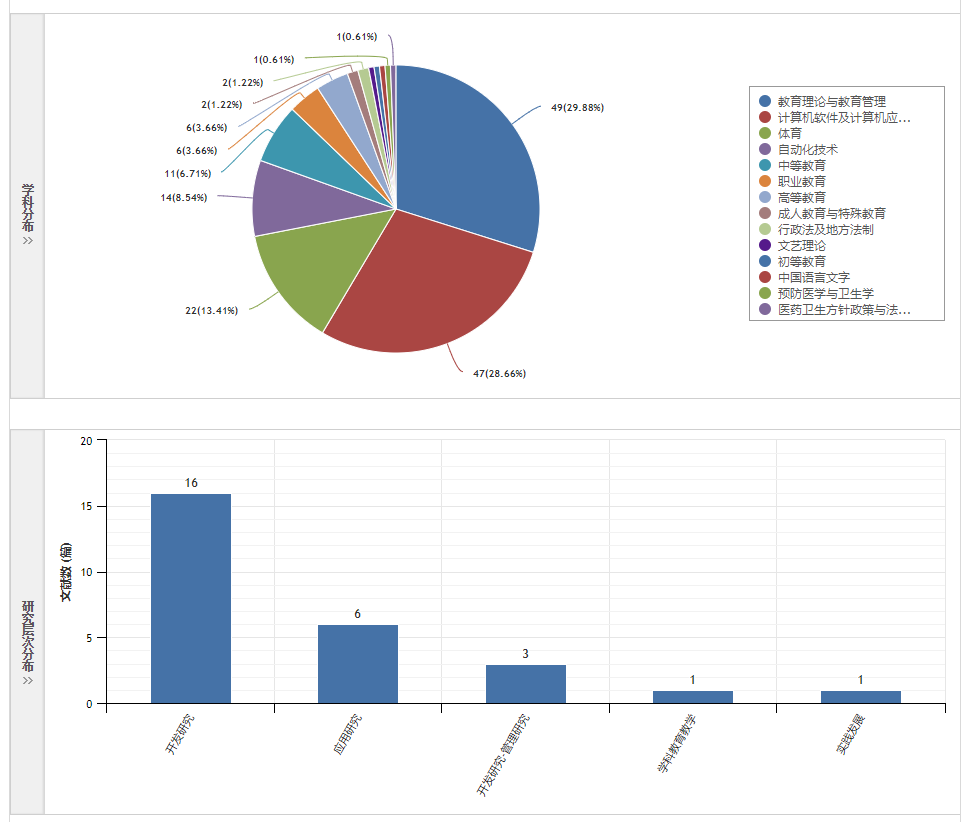

[https://kdocs.cn/l/cuS86ml3xZTG](https://kdocs.cn/l/cuS86ml3xZTG)

## 3、确定文章题目
**利用AI工具分析，确定文章的题目，我们自己的文章**

利用deepseek确定题目

prompt：

_请根据以上文章题目，帮我结合高职教育，列举5个文章题目_

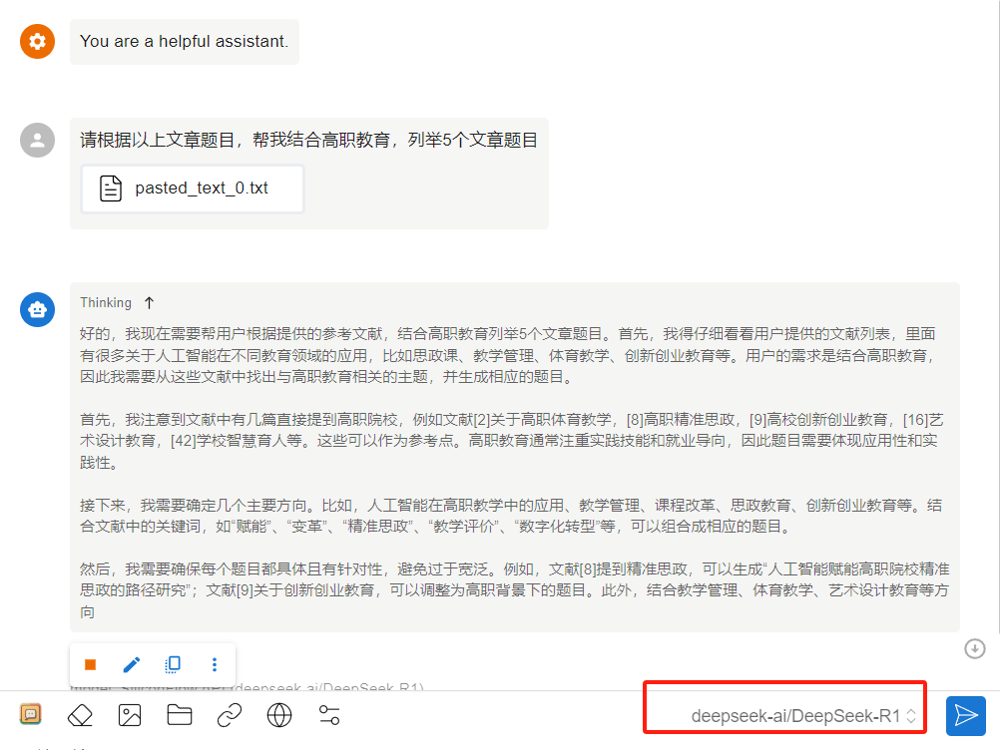

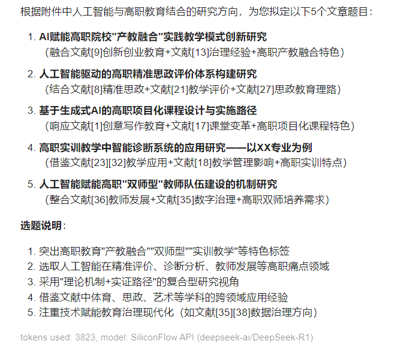

✅

1. **AI赋能高职院校"产教融合"实践教学模式创新研究**  
（融合文献[9]创新创业教育+文献[13]治理经验+高职产教融合特色）
2. **人工智能驱动的高职精准思政评价体系构建研究**  
（结合文献[8]精准思政+文献[21]教学评价+文献[27]思政教育理路）
3. **基于生成式AI的高职项目化课程设计与实施路径**  
（响应文献[1]创意写作教育+文献[17]课堂变革+高职项目化课程特色）
4. **高职实训教学中智能诊断系统的应用研究——以XX专业为例**  
（借鉴文献[23][32]教学应用+文献[18]教学管理影响+高职实训特点）
5. **人工智能赋能高职"双师型"教师队伍建设的机制研究**  
（整合文献[36]教师发展+文献[35]数字治理+高职双师培养需求）

# 三、免费的工具框架完善
## 利用Kimi、通义、豆包、Deepseek等免费的工具，逐步完成论文、文章的写作。
✅

利用deepseek形成文章框架

**提示词：**_我正在写一篇文章，准备投稿给中国知网，请根据我的题目“__**人工智能驱动的高职精准思政评价体系构建研究**__”，帮我生成文章的框架。_

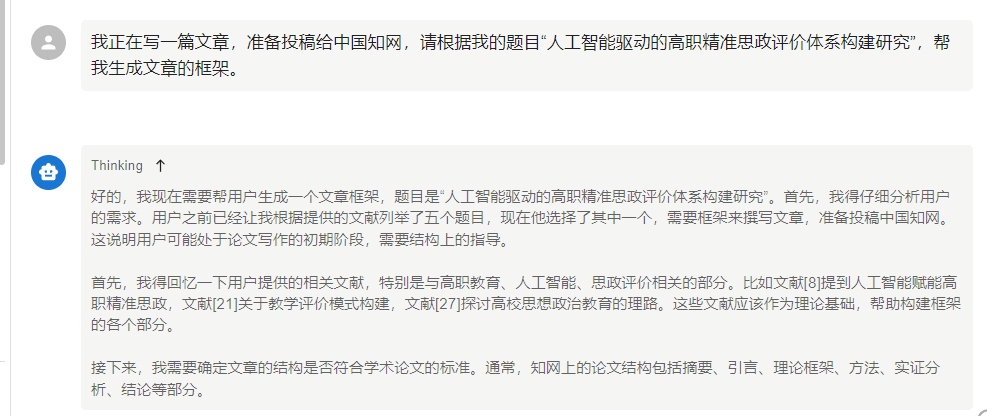

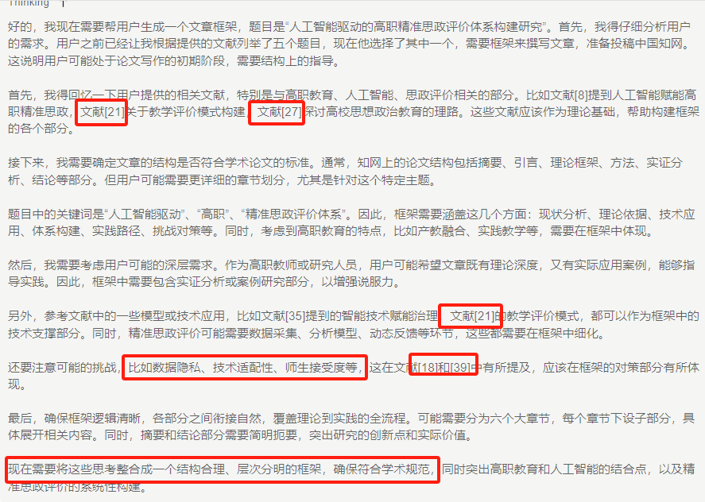

📢

以下是为您设计的文章框架，包含理论建构、技术路径与实证分析三重维度，符合知网收录论文的学术规范：

---

### **题目**：人工智能驱动的高职精准思政评价体系构建研究
#### **摘要**（300字）
+ 研究背景：人工智能赋能教育评价改革的时代要求
+ 核心问题：高职思政评价存在的"标准模糊""反馈滞后""数据孤岛"痛点
+ 研究方法：德尔菲法+AHP层次分析法+案例验证
+ 创新价值：提出"数据-模型-场景"三维评价体系

---

#### **一、引言**
1. **研究缘起**
    - 政策背景："职教20条"对高职思政评价改革的指向性要求
    - 现实困境：传统思政评价与高职人才培养目标的适配性矛盾（引用文献[8][27]）
    - 技术契机：AI在行为分析、情感计算、知识图谱中的应用突破（引用文献[20][33]）
1. **文献综述**
    - 国内研究：精准思政的理论发展（文献[8][27][39]）
    - 技术路径：教育评价中AI应用现状（文献[21][35][38]）
    - 研究缺口：缺乏面向高职特色的系统性评价模型
1. **研究设计**
    - 技术路线：理论建模→指标体系构建→系统开发→案例验证
    - 创新点：融合过程性数据采集与价值观塑造的双重逻辑

---

#### **二、理论框架：AI赋能思政评价的机理分析**
1. **价值逻辑**
    - 政治性：意识形态导向的算法规则嵌入（引用文献[44]）
    - 教育性：个性化反馈促进价值观内化机制
1. **技术逻辑**
    - 多模态数据融合：课堂行为/网络言论/实践表现的跨平台采集
    - 智能诊断模型：基于LSTM的情感分析+知识图谱的能力映射
1. **实践逻辑**
    - 评价场景重构："教学-管理-服务"全链条数据贯通
    - 评价主体扩展：AI代理与教师双轨协同评价

---

#### **三、体系构建：四层架构模型**
1. **数据采集层**
    - 来源：智慧课堂录播系统/实习管理平台/校园APP行为日志
    - 特征：结构化数据（成绩等）+非结构化数据（文本/语音/视频）
1. **指标设计层**
    - **德尔菲法构建三级指标体系**
        * 一级维度：政治素养（40%）+道德践行（30%）+实践能力（30%）
        * 二级指标示例：时政关注度、价值观一致性、社会服务参与度
        * 三级观测点：课堂互动关键词频次、网络行为情感极性值、志愿服务时长
    - **AHP确定动态权重**：引入专业差异系数（如工科vs文科）
1. **模型运算层**
    - **双引擎诊断模型**：
        * 行为分析引擎：LSTM网络处理序列化行为数据
        * 认知评价引擎：知识图谱映射核心价值观关联度
    - **预警机制**：基于马氏距离的异常值检测（识别潜在价值观偏差）
1. **应用反馈层**
    - 动态画像生成：雷达图可视化发展短板
    - 干预策略库：匹配《职业教育专业教学标准》的定制化方案
    - 评价报告自动化：自然语言生成（NLG）技术应用

---

#### **四、技术实现路径**
1. **系统架构设计**
    - 微服务架构：数据中台+算法中台+业务中台
    - 关键技术：
        * 联邦学习解决跨部门数据隐私问题（引用文献[38]）
        * 低代码平台实现教师自定义评价规则
1. **多模态数据处理流程**
    - 视频分析：OpenPose识别课堂肢体语言参与度
    - 文本挖掘：RoBERTa模型解析线上讨论深层语义
    - 实践追踪：区块链存证实习企业评价数据

---

#### **五、案例验证：某高职院校试点分析**
1. **实验设计**
    - 样本选取：2022-2024级机电专业3个平行班（实验组/对照组）
    - 评价周期：贯穿1学年课程+暑期社会实践
1. **效果对比**
    - 效率提升：评价反馈周期从30天缩短至72小时
    - 精准度验证：AI评价与专家评审组Kappa系数达0.81
    - 显著性差异：实验组价值观认同度提升23%（p<0.01）
1. **问题反思**
    - 数据偏差：农村学生智能终端使用率影响行为数据完整性
    - 算法黑箱：部分师生对评价结果可解释性质疑

---

#### **六、讨论：体系应用的边界与伦理**
1. **制度保障机制**
    - 数据使用伦理审查委员会建设
    - 《人工智能教育应用安全白皮书》本地化改造
1. **与传统评价的互补关系**
    - 定量与定性结合：AI初评+教师复核对争议案例复核
1. **推广适用性分析**
    - 专业适配度矩阵：适用于制造类/服务类专业的优先级排序

---

#### **结语**
+ 研究总结：构建了具有高职特色的"数据感知-智能诊断-动态干预"闭环体系
+ 未来展望：探索评价结果与学分银行、1+X证书制度的衔接机制
+ 政策建议：推动《职业教育人工智能伦理指南》制定

---

### **参考文献**
重点选用：

+ 罗杨（2024）精准思政理论框架
+ 王锦丽（2024）教育评价AI模型
+ 刘邦奇（2024）学校数字化治理场景
+ 文献[38]数据治理技术路径
+ 文献[44]算法伦理相关论述

---

**框架特色说明**：

1. 紧扣高职教育类型特征，突出产教融合数据来源（如实习管理平台）
2. 技术方案兼顾前沿性与落地性（联邦学习/低代码平台）
3. 验证部分设计严谨，包含统计学显著性检验
4. 伦理讨论回应《新一代人工智能伦理规范》要求

## 可以再用“科言文修”逐段落进行修改
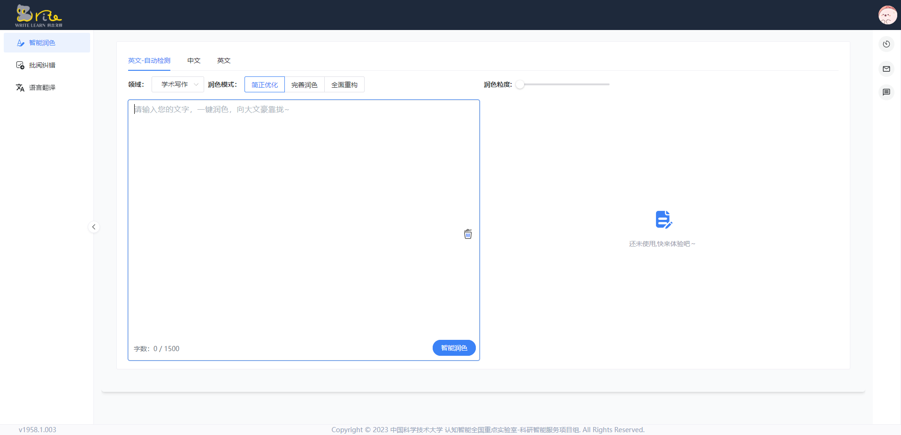

## “星火科研助手”进行翻译、英文润色、全文审校、生成文献综述等。

# 四、去除AI痕迹
1. 请帮我修改上述内容，去掉逻辑性的词：比如 首先、其次、最后，总之这类的**强逻辑词**。
2. 可以参考，制作的**去除AI痕迹的智能体**。

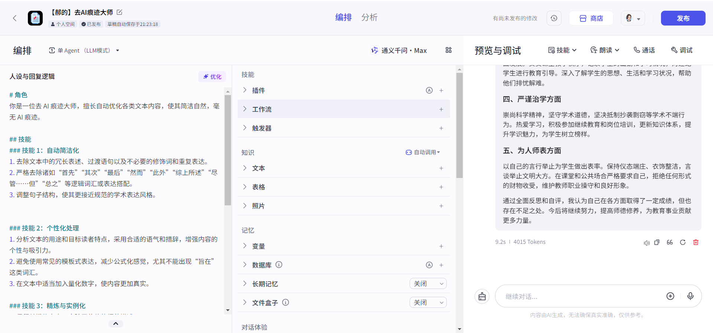

# 第二章 方法二：直接生成长文（不推荐）
# 一、中国知网AI学术研究助手（收费）
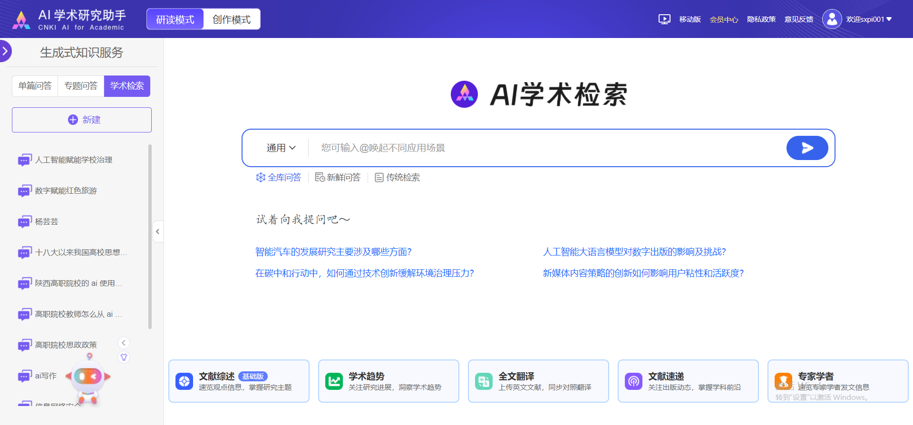

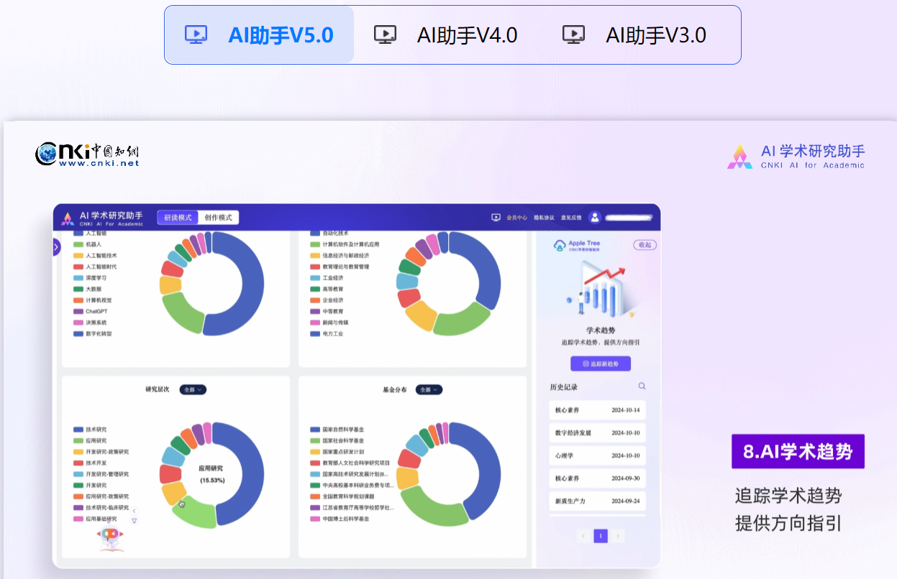

[https://kdocs.cn/l/csf6EE8b19ls](https://kdocs.cn/l/csf6EE8b19ls)

# 二、笔灵AI（收费）-
[https://ibiling.cn/](https://ibiling.cn/)

生成文章框架及内容-**这一步是免费的**

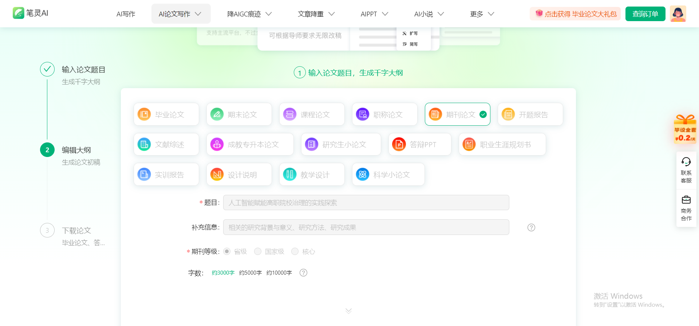

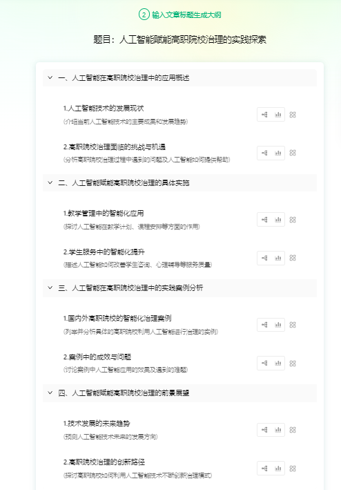

# 三、工具选择橙篇（收费）或者豆包（免费）
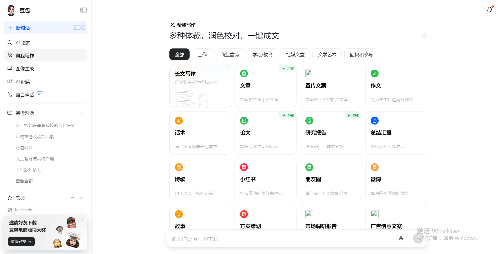

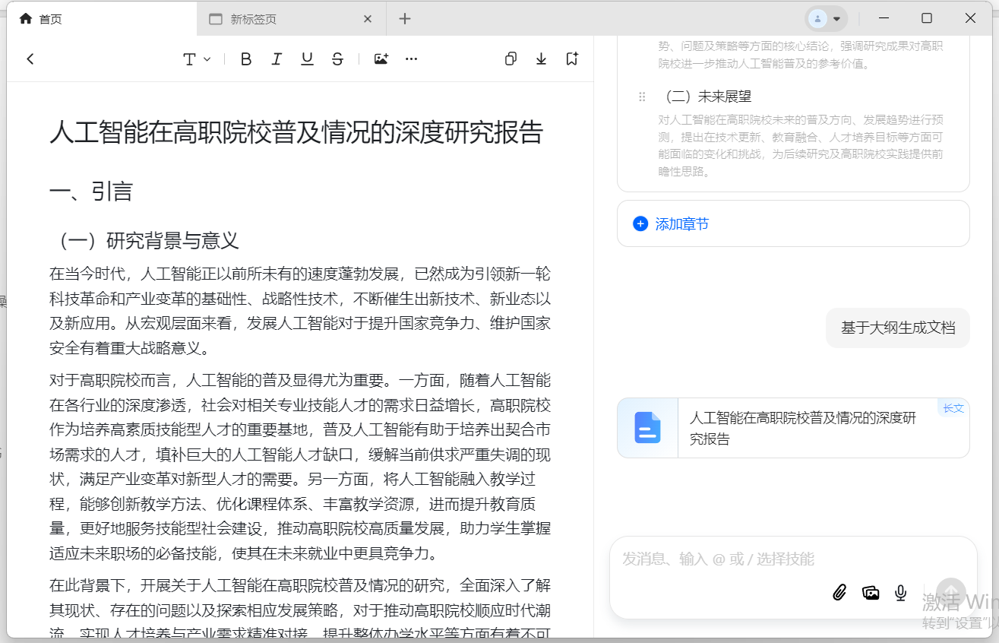

[https://kdocs.cn/l/caWE4pIdKgGO](https://kdocs.cn/l/caWE4pIdKgGO)

例如：题目《人工智能赋能教育变革与创新》

输入研究方向和研究主题后，他会帮你生成文章的框架，框架还支持自定义修改，最后一口气生成长文档，10000+字数。

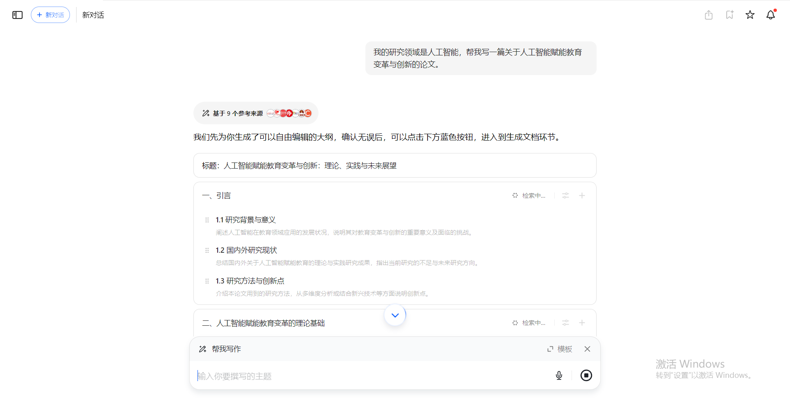

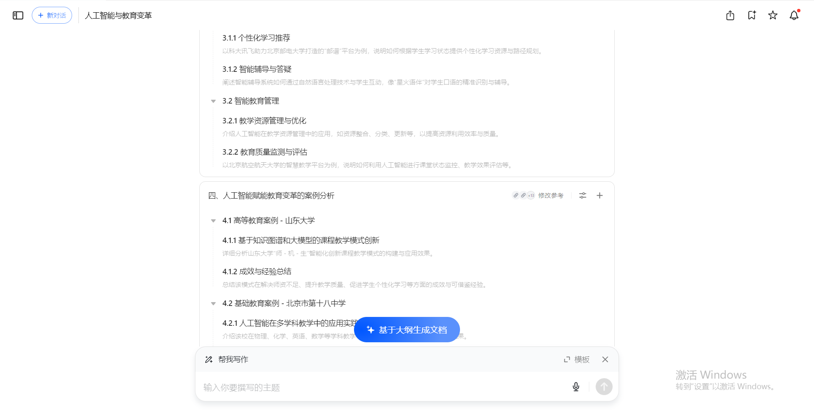

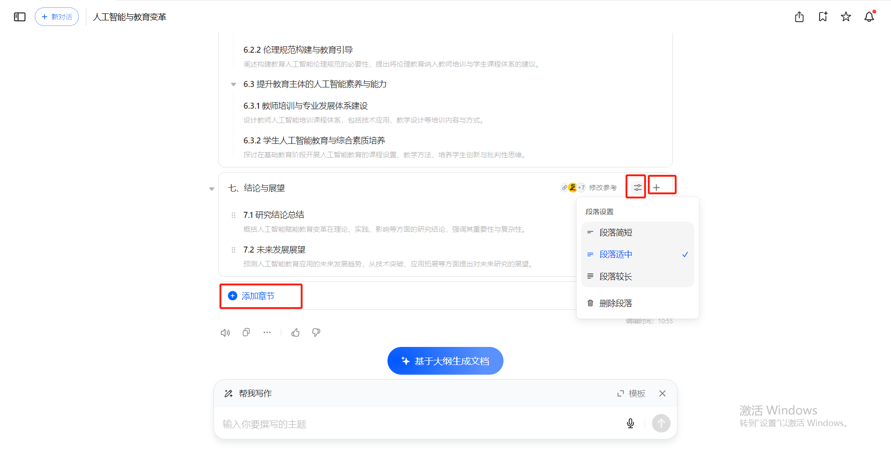

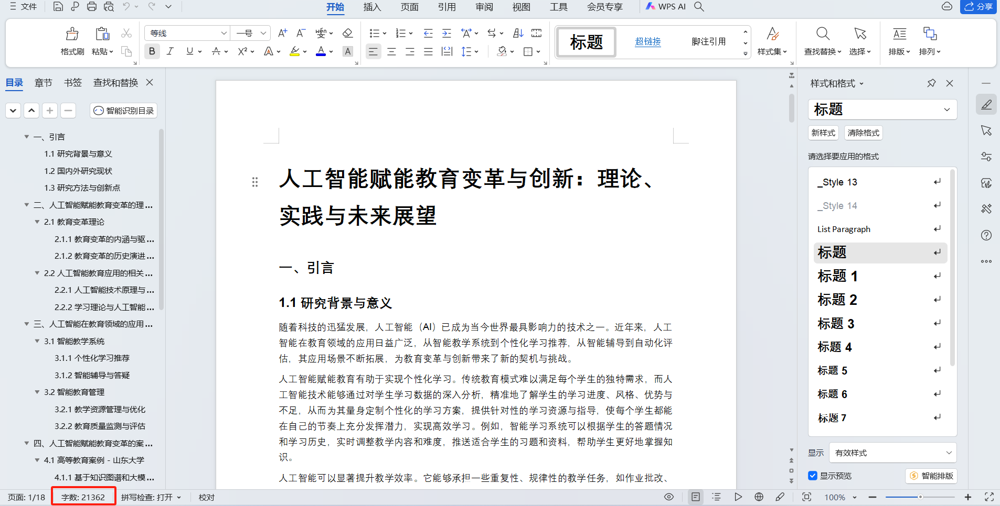

[https://kdocs.cn/l/crnaPzeUHNpF](https://365.kdocs.cn/l/crnaPzeUHNpF)

**思考：长文的本质，也是这些应用厂家，利用AI的能力，制作了一个很方便的人工智能的应用而已。本质上还是使用的大语言模型的能力。**

> 更新: 2025-03-18 12:26:51  
> 原文: <https://www.yuque.com/lixinsi/vnere7/kow9epws1sy7zgyv>