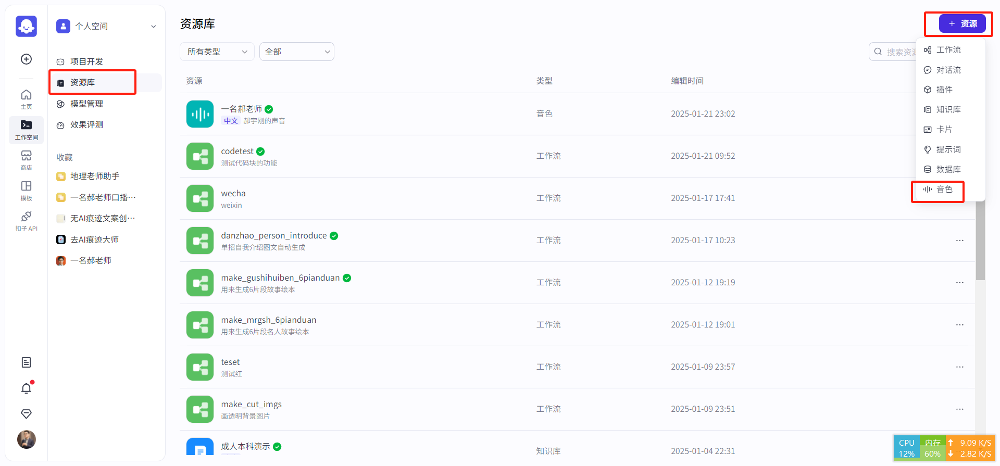
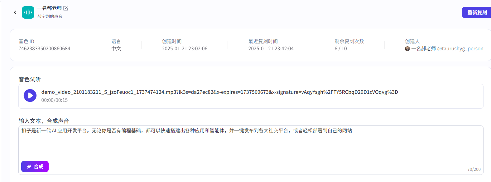
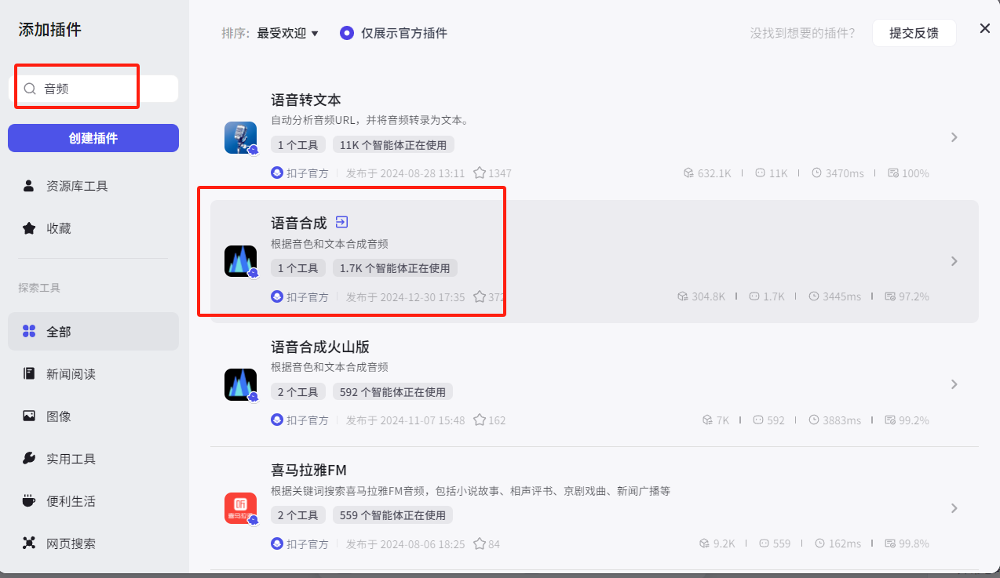
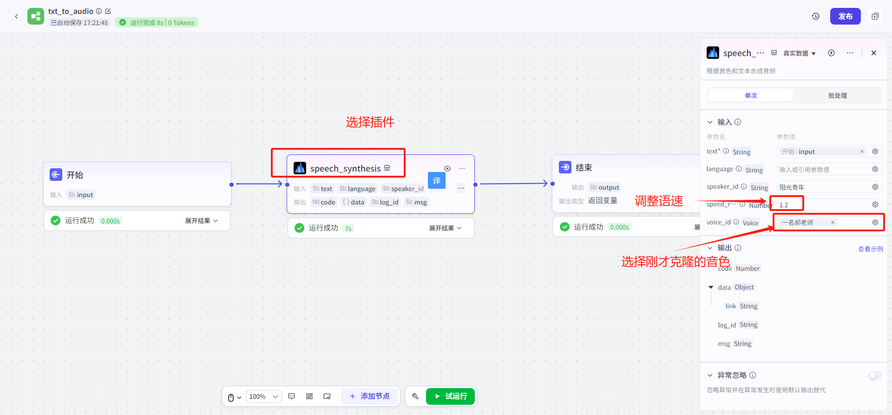
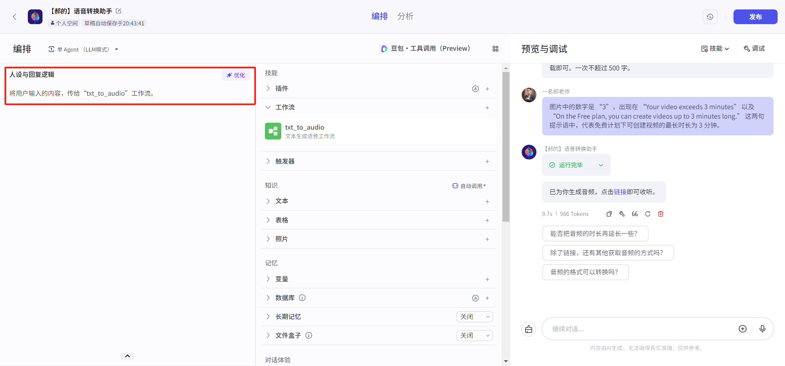
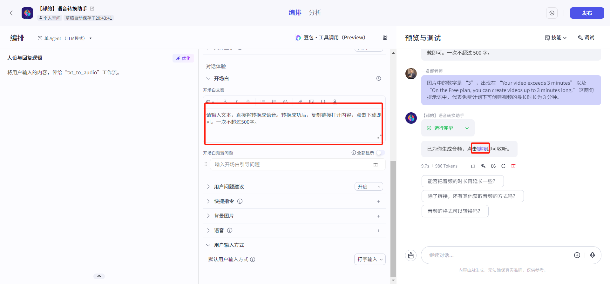
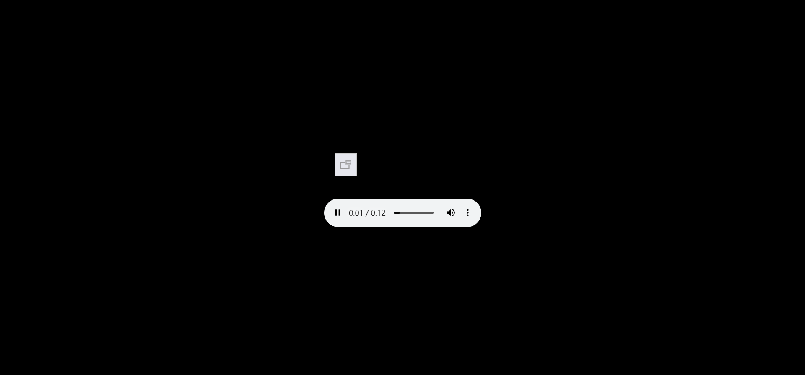
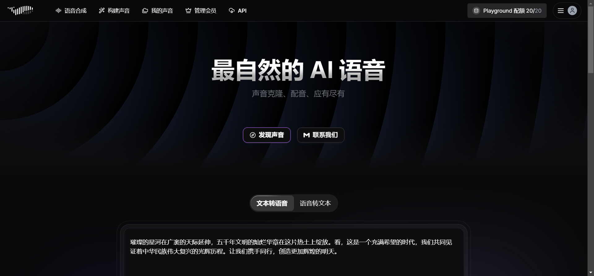
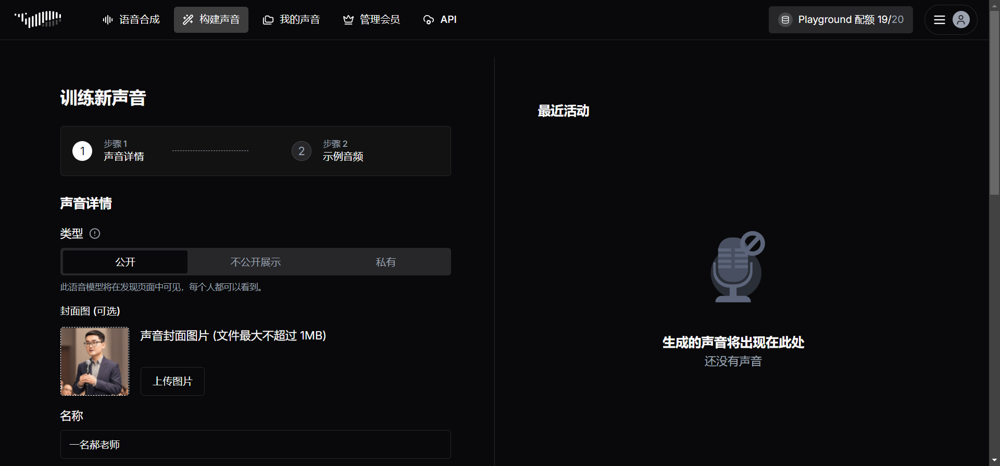
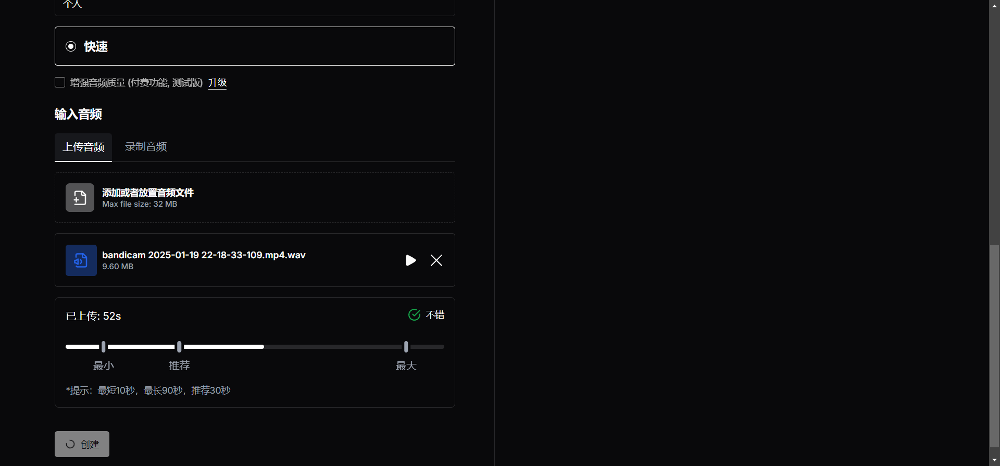

# AI声音克隆的方法

# 方法1：用扣子Coze克隆声音，做智能体应用【推荐】
**分为3步骤：**

1. **克隆自己的音色；**
2. **搭建工作流；**
3. **构建智能体；**

**效果：访问智能体，输入文字，转换成自己声音的语音。**

**用途：可以用来做线上课资源。可以用来做知识分享。（应对不想出境、不方便录制等情况）**

## 登录扣子网站
[https://www.coze.cn/](https://www.coze.cn/)

1. 点击“资源库”---点击“资源”--点击“音色”

## 按照提示，输入名称，录音或者上传音频，完成音色复制

**注意：只能有一个复制声音，能复制10次。每次转语音，最多有200字。但是不限制次数。**

## 创建工作流，文本转自己音色的声音

成品视频

[https://kdocs.cn/l/ctvbAWnO1rZR](https://kdocs.cn/l/ctvbAWnO1rZR)

关注并私信我，获取文档教程。

# 方法二：用fish audio克隆声音
[https://fish-audio.cn/zh-CN/](https://fish-audio.cn/zh-CN/)

可以克隆自己的声音

一、访问网站，邮箱登录

二、构建声音（可以上传，也可以直接录音）

三、点击创建、选择语音合成，选择自己音色。

**注意：只能转语音20次，每次最多有500字。**

> 更新: 2025-03-18 12:27:36  
> 原文: <https://www.yuque.com/lixinsi/vnere7/cggualim6r851xoe>