# Coze工作流6片段故事绘本

### [https://365.kdocs.cn/l/cu1AxlsQdmqe](https://365.kdocs.cn/l/cu1AxlsQdmqe)
# 工作流整体展示
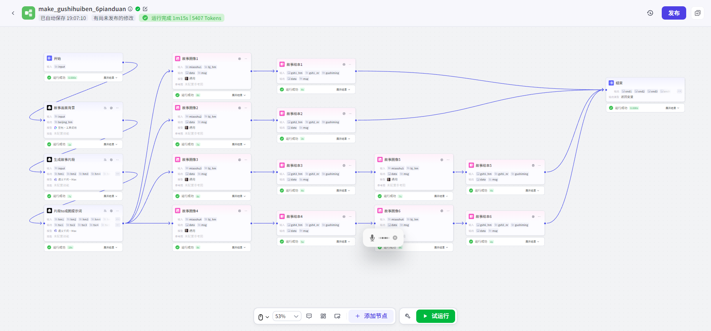

# 成果展示
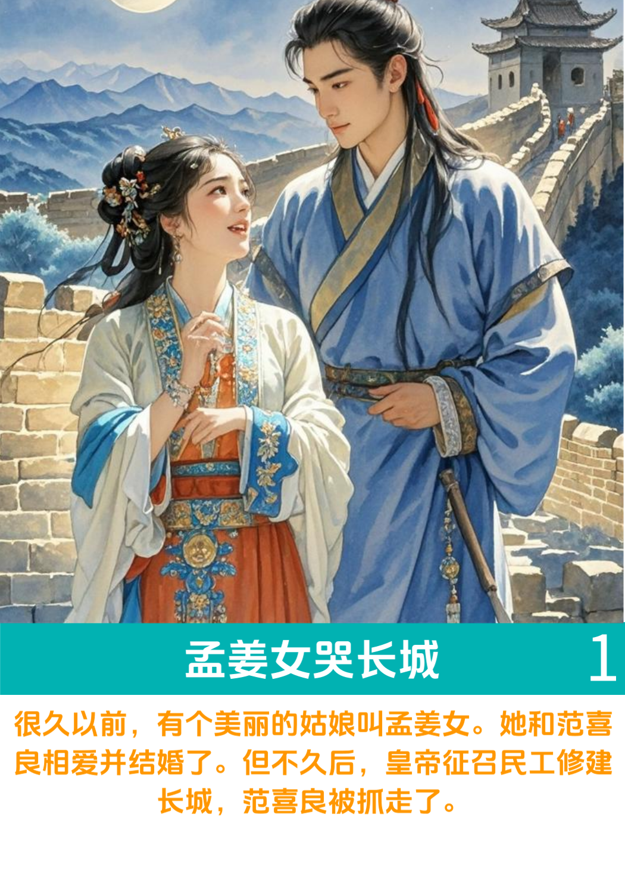

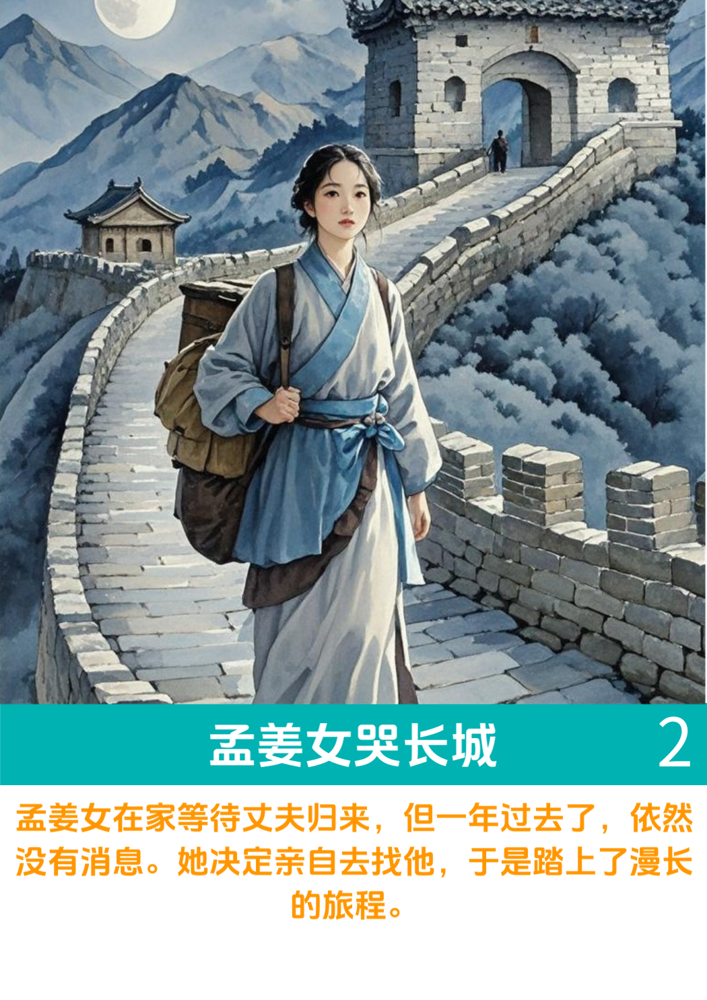

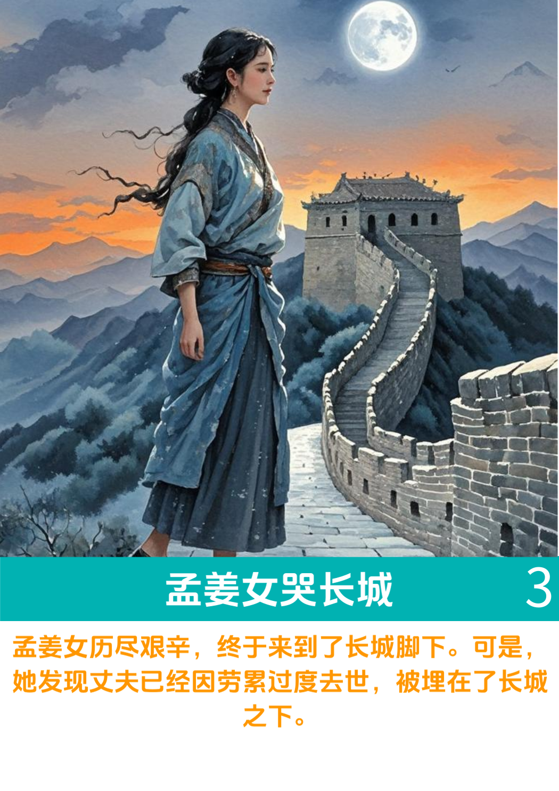

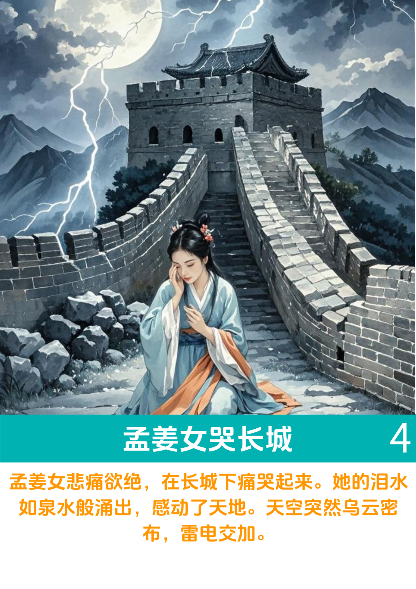

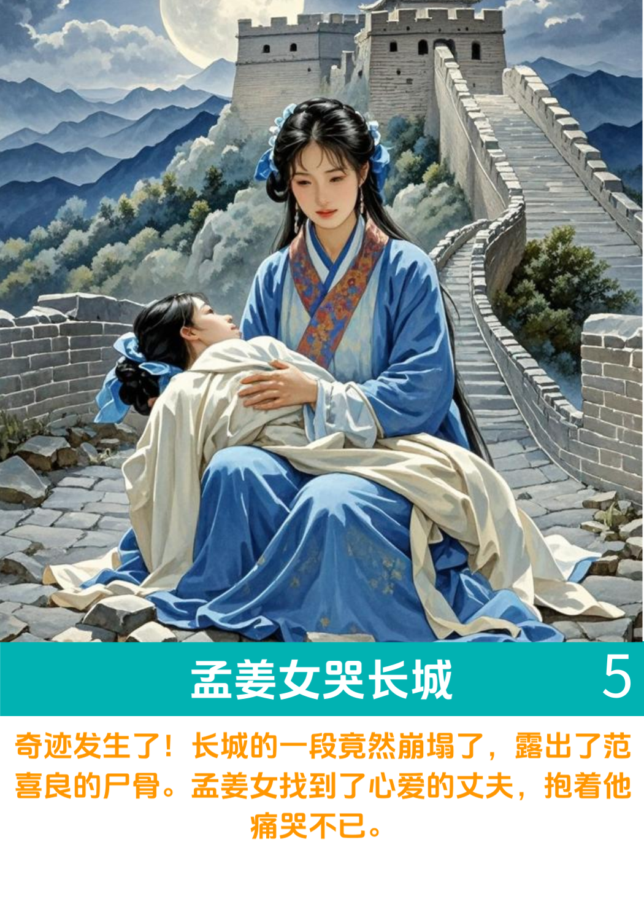

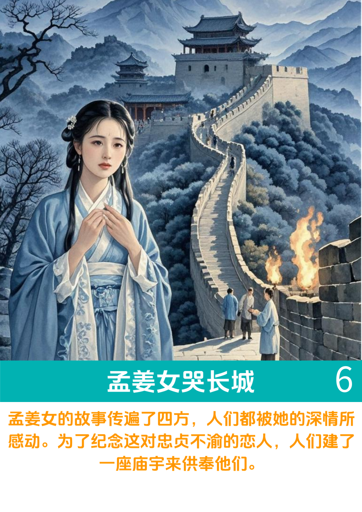

# 配置教程
## 用到的模块
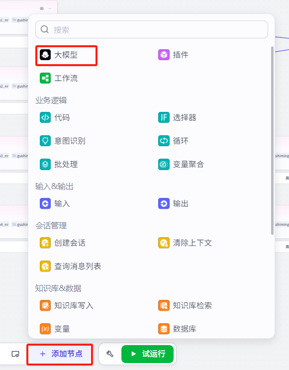

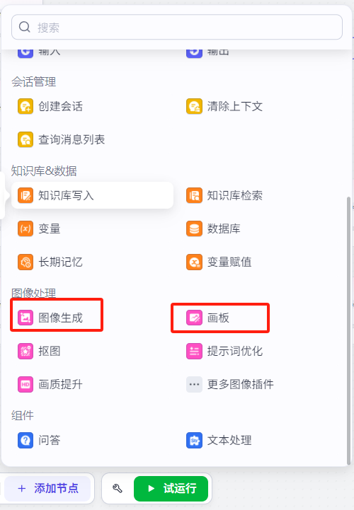

## 生成故事画面背景
    - 目的是将这部分内容，加入到每个成图提示词的前面，尽可能保证6个画面的一致性。

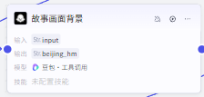

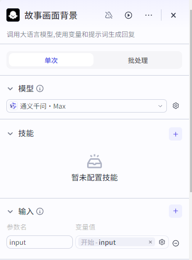

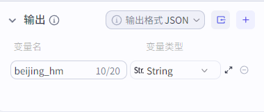

**系统提示词：**

你是一名儿童故事创作专家，能够准确描述故事的整体风格和画面背景。

**用户提示词**

##时代确定

###请根据故事发生的年代，确定画面的整体背景风格

##参考一下内容，进行描述

###艺术风格：比如：写实主义、卡通化、水彩画风、油画风等。这会影响到线条、纹理和细节的表现方式。

###主题与情感：首先确定你的故事想要传达的主题和情感。比如是神秘、浪漫、悲伤还是欢乐？这将为整个画面定下基调。

###色彩调性：选择一个主色调，并决定它是暖色调（如红色、橙色）还是冷色调（如蓝色、绿色）。色彩可以帮助加强情感表达，例如暖色调通常给人以温暖和活力的感觉，而冷色调则可能带来平静或忧郁的氛围。

###时间背景：根据{{input}}确定故事发生的时期，是古代、现代还是未来。不同的时间背景会影响服装、建筑和其他元素的设计。

###地点设定：描述故事发生的地点，例如：城市、乡村、森林、海洋等。每个地点都有其独特的视觉特征。

###光线效果：定义场景中的光源类型，自然光（日光、月光）、人造光（灯光），以及这些光源如何影响环境和角色。

###构图布局：考虑图像中各个元素的位置安排，包括：前景、中景和背景的关系，以及它们如何引导观众的视线。

###特殊元素：从{{input}}提取特征物。故事中有任何特定的象征物或关键物品需要出现在图片中，请明确指出。

###一致性检查：确保所有元素都符合你设定的故事世界规则，保持内部逻辑的一致性。

##字数要求

##字数控制在100字左右

## 生成故事片段。
    - 大模型将输入的故事名称，分成6个片段，进行输出。

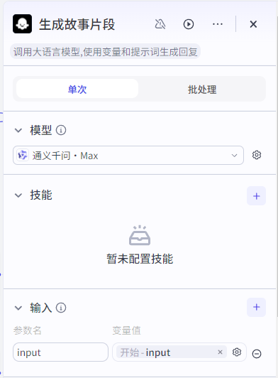

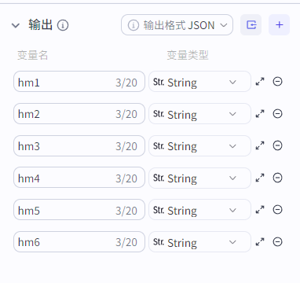

**系统提示词：**

你是一个儿童故事创作大师，每个故事片段控制在90字左右。

**用户提示词：**

##内容要求

根据{{input}}，将故事描述成6个片段输出，6个片段的内容需要有连贯性，能完整表述整个故事。

##风格要求

内容符合儿童故事的口吻；

##字数要求

每个故事片段用90字左右描述。

##输出要求

第一个画面内容输出到变量hm1，内容字数90字；

第二个画面内容输出到变量hm2，内容字数90字；

第三个画面内容输出到变量hm3，内容字数90字；

第四个画面内容输出到变量hm4，内容字数90字；

第五个画面内容输出到变量hm5，内容字数90字；

第六个画面内容输出到变量hm6，内容字数90字；

## 生成成图提示词
    - 将上一阶段6个故事片段，生成6个提示词，用于后期的成图。

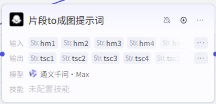

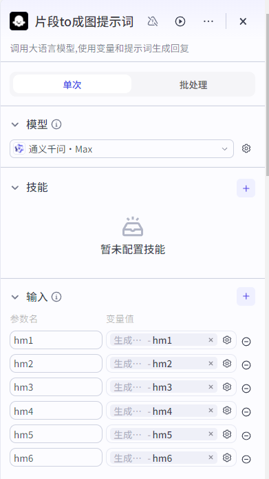

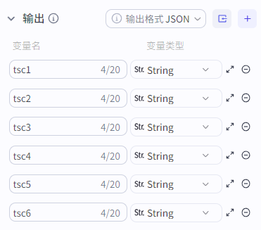

**系统提示词：**

你是一名绘画提示词大师。

**用户提示词：**

##提示词规则 

###核心情节：明确指出故事中最关键的情节或事件。这应该是图像的主要焦点。 角色描绘：详细描述主要角色的外貌、衣着、表情以及他们之间的互动。对于人物的情感状态（如快乐、悲伤、紧张）也应具体说明。 

###场景设定：精确地描述故事发生的地点和时间背景。包括具体的环境特征，比如室内还是室外，白天还是夜晚，周围有哪些物体或建筑物等。 

###动作姿态：如果故事中包含特定的动作或者姿势，请清晰地描述它们。例如，“主人公正站在悬崖边缘，望着远方的日落”。 

###氛围与情绪：传达故事所要表达的整体感觉或情绪。是神秘、温馨、惊险还是其他？这将影响到色彩的选择和构图的方式。 

###象征性元素：如果有任何象征性的物品或符号出现在故事里，不要忘记在提示词中提及，并解释其意义。 ###视角选择：决定是从哪个角度观看这个场景。第一人称视角可能会让观者更有代入感；而第三人称全知视角则可以展现更多细节。 

###艺术风格：指定你期望的艺术表现形式，比如油画、水彩画、漫画风或是数字绘画等。

###颜色调色板：如果对色调有特殊要求，比如冷色调或暖色调，应该提前说明。 

###光线效果：描述光源的位置及其产生的阴影、反光等效果，这对营造气氛非常重要。

###文本信息：如果希望图像中含有文字，如对话气泡、标题或标语，需明确指出。

###比例与布局：确定各元素之间的相对大小及位置安排，以确保构图合理且符合故事情境。

##逐一生成

请把{{hm1}}优化成生图提示词，准确体现{{hm1}}中的画面内容，输出到变量tsc1；

请把{{hm2}}优化成生图提示词，准确体现{{hm2}}中的画面内容，输出到变量tsc2；

请把{{hm3}}优化成生图提示词，准确体现{{hm3}}中的画面内容，输出到变量tsc3；

请把{{hm4}}优化成生图提示词，准确体现{{hm4}}中的画面内容，输出到变量tsc4；

请把{{hm5}}优化成生图提示词，准确体现{{hm5}}中的画面内容，输出到变量tsc5；

请把{{hm6}}优化成生图提示词，准确体现{{hm6}}中的画面内容，输出到变量tsc6；

##参考案例

提示词参考下面的案例：

主题: 狼牙山五壮士

历史背景: 抗日战争时期（1941年），八路军战士与日军激战，宁死不屈的英雄事迹

画面环境背景: 狼牙山险峻的山峰、陡峭的悬崖、崎岖的山路、战火弥漫、硝烟四起、远处隐约可见日军部队

背景细节: 山间植被稀疏、岩石裸露、天空阴沉密布、乌云压顶、象征战争的紧张与压抑

人物: 五位八路军战士，身穿灰色军装，头戴军帽，手持步枪或手榴弹，表情坚毅无畏

动作: 战士们站在悬崖边缘，有的回头怒视敌人，有的准备跳崖，表现出宁死不屈的英雄气概

细节: 军装破损、血迹斑斑、武器紧握、眼神坚定、面部表情充满决心

氛围: 悲壮、英勇、无畏、历史厚重感

光影: 逆光效果，突出人物的轮廓，增强戏剧性；战火的光影映照在战士们的脸上

色彩: 以灰暗色调为主（灰色、褐色、黑色），突出战争的残酷与压抑；局部使用红色（血迹、火光）象征牺牲与抗争

完整提示词:

狼牙山五壮士、抗日战争时期（1941年）、八路军战士、日军部队、狼牙山险峻山峰、陡峭悬崖、崎岖山路、战火弥漫、硝烟四起、山间植被稀疏、岩石裸露、阴沉天空、乌云压顶、五位战士、灰色军装、军帽、步枪、手榴弹、坚毅表情、悬崖边缘、回头怒视、跳崖、宁死不屈、军装破损、血迹斑斑、紧握武器、坚定眼神、悲壮氛围、英勇无畏、历史厚重感、逆光效果、灰暗色调、红色象征、火光、牺牲与抗争

## 故事画面的生成及绘本的设计
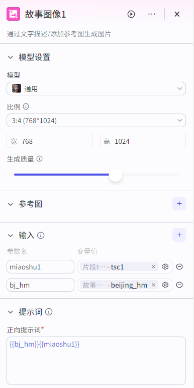

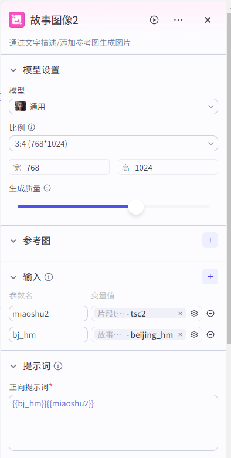

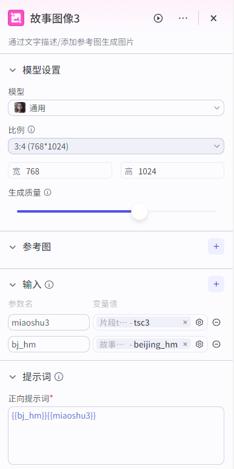

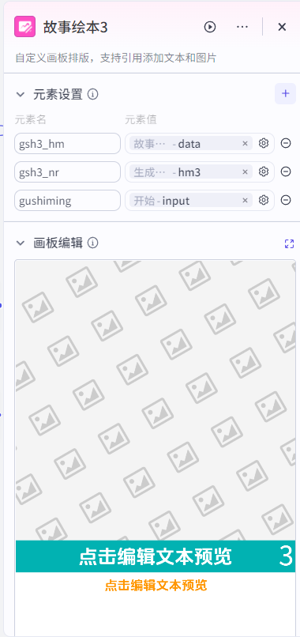

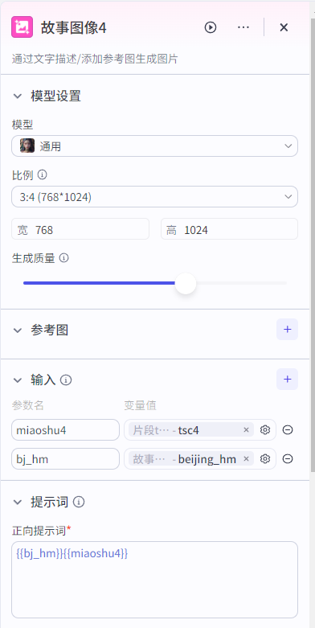

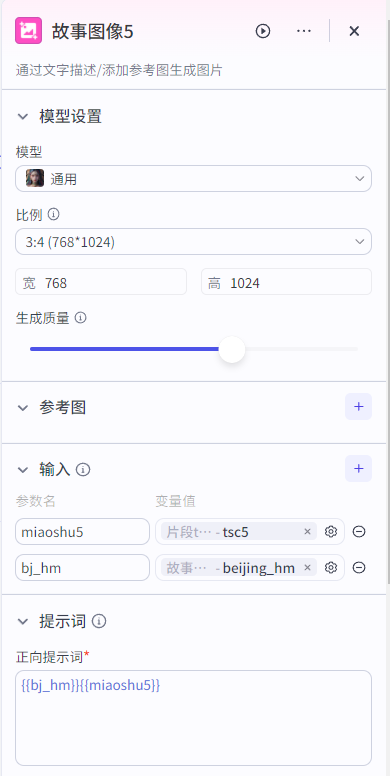

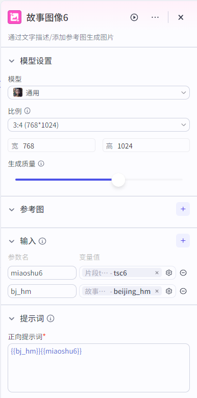

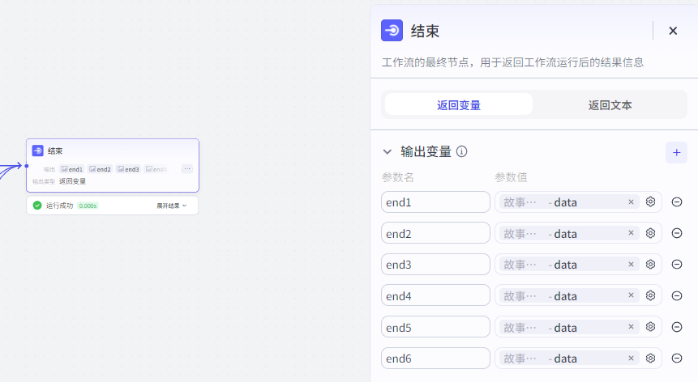

# 说明
有人可能会有疑问，为什么片段5和6的要串联在后面，和1-2-3-4并列放着，不是很整齐吗。这是因为，工作流在工作的时候，一个功能模块最多能并行4个。同理，如果大家想实现超过4片段的，都可以往后面串联片段。

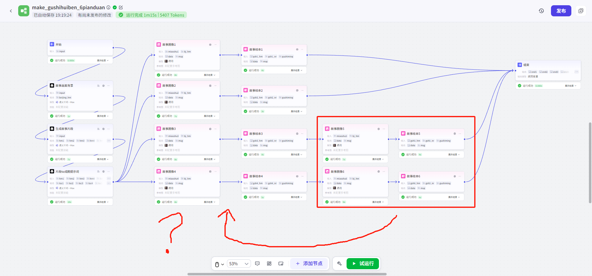

**更多AI技巧分享，欢迎关注抖音“一名郝老师”**

> 更新: 2025-03-19 11:44:44  
> 原文: <https://www.yuque.com/lixinsi/vnere7/ic56dbxru0yk4or3>