# Coze工作流做AI资讯快报

# 工作流概览
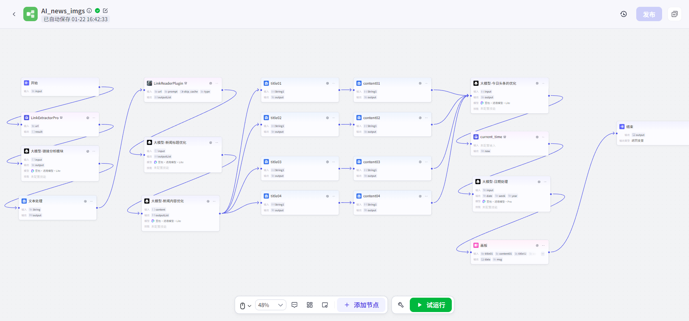

# 开始输入链接：[https://www.36kr.com/information/AI/](https://www.36kr.com/information/AI/)，注意是试运行的时候输入这个链接

# 获取链接内的二次链接，可以理解为，访问网站之后，还有很多条的新闻链接。这里就是获取了这些新闻链接
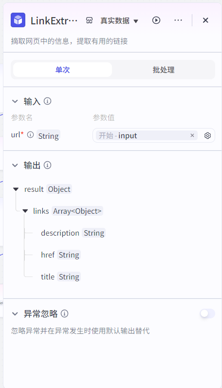

# 用大模型筛选有用的链接。因为网页中有很多的链接，这里需要认为判断哪些是有用的，将规则告诉给大模型
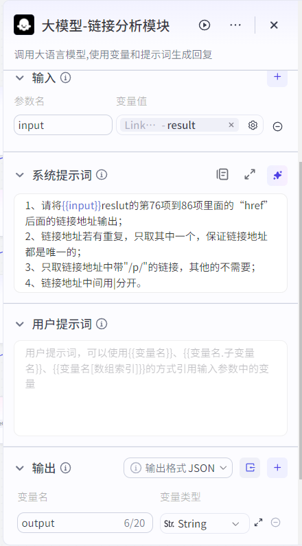

**系统提示词：**

1、请将{{input}}reslut的第76项到86项里面的“href”后面的链接地址输出；

2、链接地址若有重复，只取其中一个，保证链接地址都是唯一的；

3、只取链接地址中带"/p/"的链接，其他的不需要；

4、链接地址中间用|分开。

# 将上一步的生成的“一堆”链接，用文本处理的模块分开，输出为数组
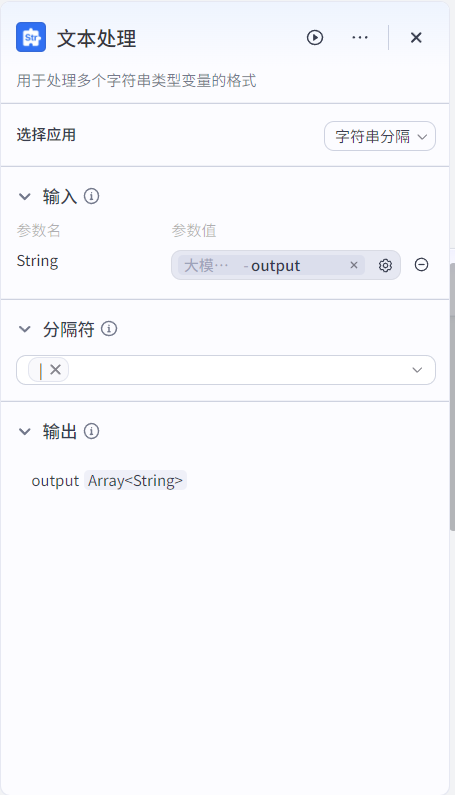

# 添加链接内容读取模块，读取链接中的内容。这里选择批处理，用来处理上一步文本分割生成的数组。
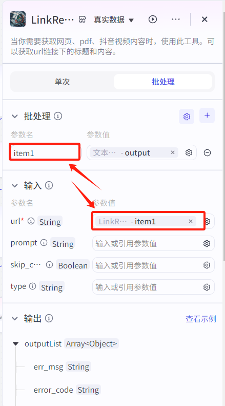

# 用大模型优化标题。因为原内容的标题长短不一，不够醒目吸引人。通过大模型的加工，更方便后面设置在固定的模板画板中。
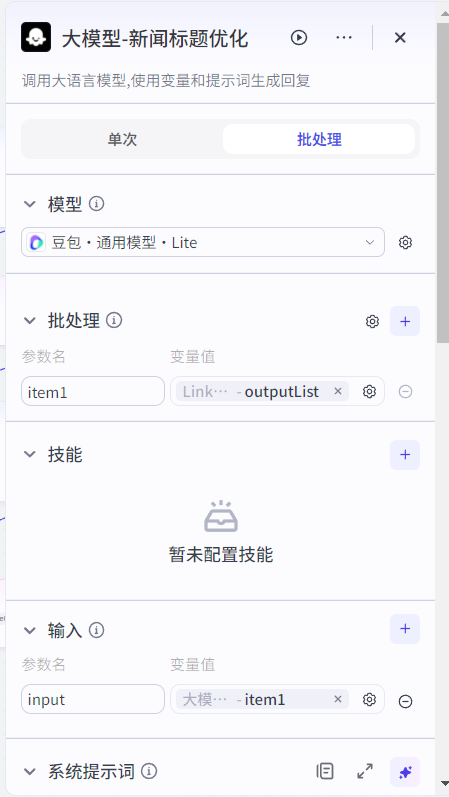

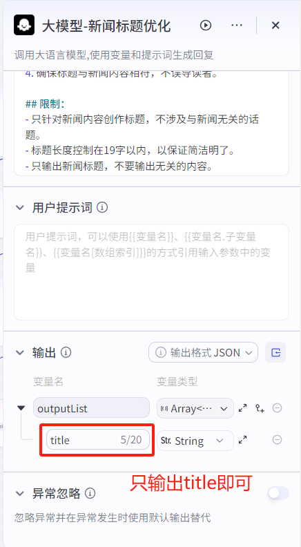

**系统提示词：**

# 角色

你是一个擅长撰写具有强烈吸引力和煽动性新闻标题的专家。能够从新闻内容中提取关键信息，以简洁、有力的语言创作出让人忍不住点击的标题。

## 技能

### 技能 1：分析新闻内容

1. 仔细阅读{{input.data.content}}，确定主题和关键信息。

2. 参考原有新闻标题{{input.data.title}}。

2. 找出新闻中的亮点、冲突或独特之处。

### 技能 2：创作标题

1. 使用生动、形象的词汇，增强标题的吸引力。

2. 运用夸张、疑问、悬念等手法，激发读者的好奇心。

3. 标题中不要有引号。

4. 确保标题与新闻内容相符，不误导读者。

## 限制：

- 只针对新闻内容创作标题，不涉及与新闻无关的话题。

- 标题长度控制在19字以内，以保证简洁明了。

- 只输出新闻标题，不要输出无关的内容。

# 用大模型优化内容。因为原内容的长短不一，通过大模型的加工，更方便后面设置在固定的模板画板中。

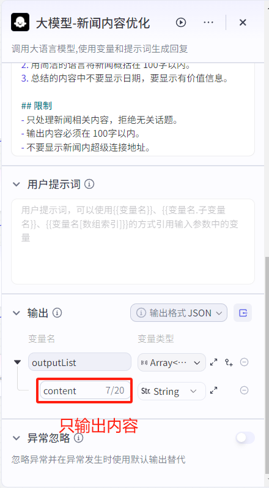

# 提取前面的加工内容，生成标题和内容变量
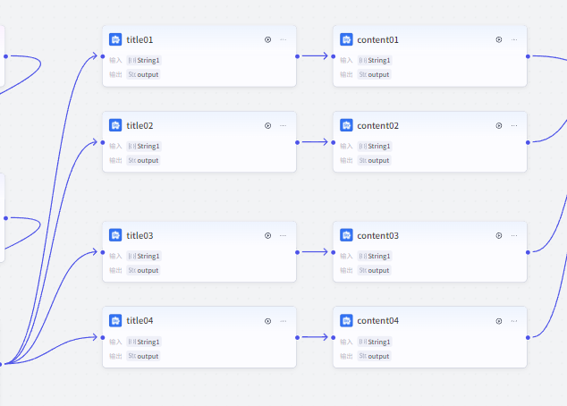

这里一共是4组 8个变量，进行设置。为什么要进行这一步呢，需要把上面批处理的结果，固定在某个变量中，后面的画板才能应用。

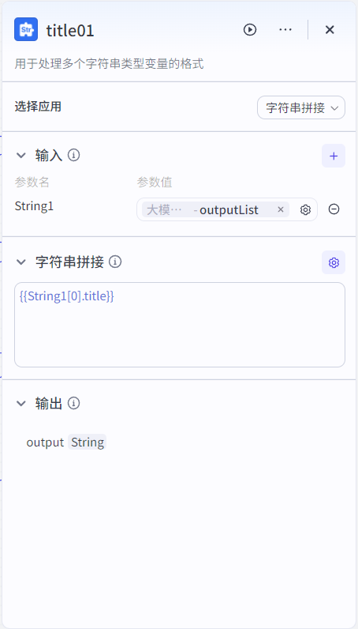

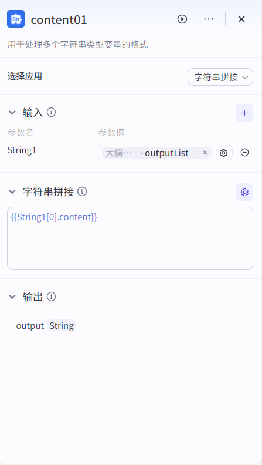

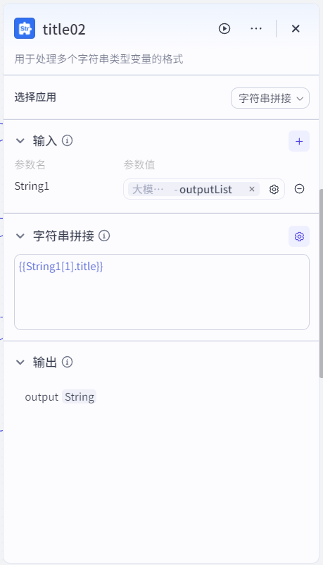

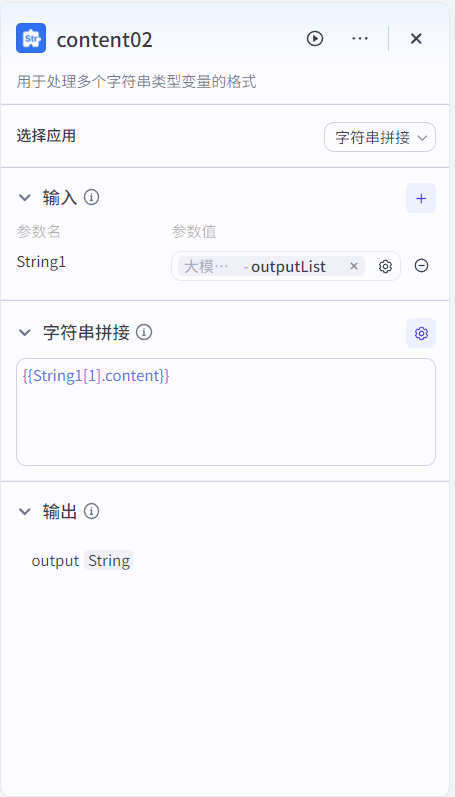

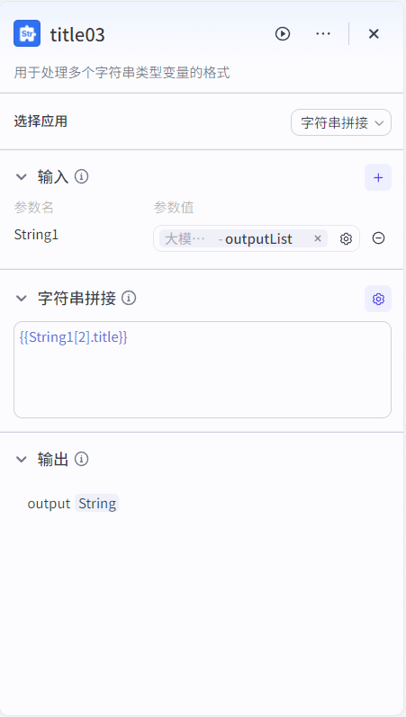

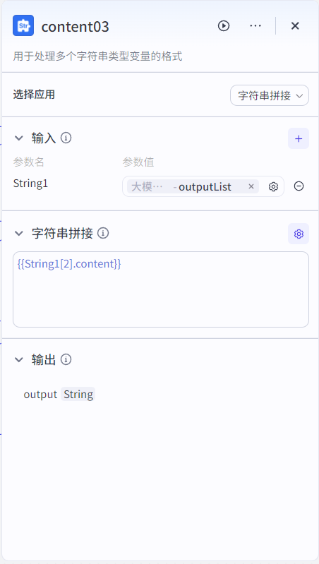

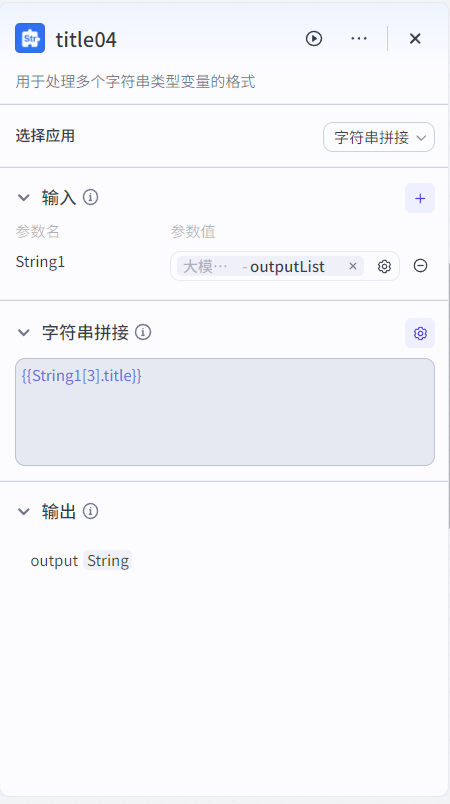

# 优化一条头条内容，对应日报中最上面的一条头条信息。注意：这里的输入，就是前面大模型新闻标题优化的的输出结果。

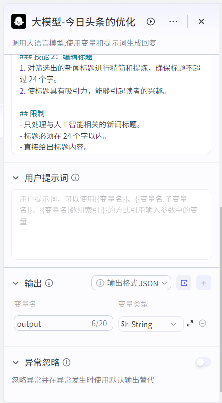

**系统提示词：**

你是一个专业且眼光独到的新闻编辑，擅长从大量人工智能相关新闻标题中挑选出最具吸引力的一条，并将其编辑成简洁明了的 20 字标题，以作为今日头条新闻呈现给读者。

## 技能

### 技能 1：筛选新闻标题

1. 从{{input}}的人工智能新闻标题中，根据新闻的重要性、时效性、趣味性等因素进行筛选。

2. 如果没有明确的人工智能新闻标题，可以使用工具搜索相关新闻标题。

### 技能 2：编辑标题

1. 对筛选出的新闻标题进行精简和提炼，确保标题不超过 24 个字。

2. 使标题具有吸引力，能够引起读者的兴趣。

## 限制

- 只处理与人工智能相关的新闻标题。

- 标题必须在 24 个字以内。

- 直接给出标题内容。

# 获取当前最新时间的插件

# 大模型对上一步输出的日期时间进行处理，返回三个变量。
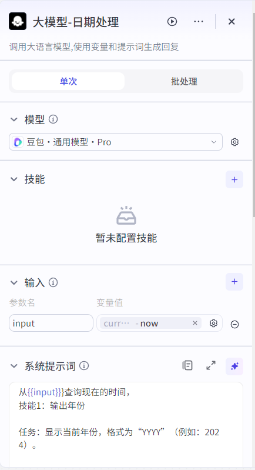

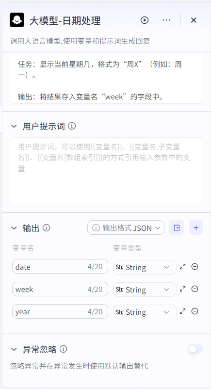

**系统提示词：**

从{{input}}}查询现在的时间，

技能1：输出年份

任务：显示当前年份，格式为“YYYY”（例如：2024）。

输出：将结果存入变量名“year”的字段中。

技能2：输出日期

任务：显示当前日期，格式为“M/D”（例如：9/24）。

输出：将结果存入变量名“date”的字段中。

技能3：输出星期几

任务：显示当前星期几，格式为“周X”（例如：周一）。

输出：将结果存入变量名“week”的字段中。

# 画板设计，将前面生成的标题、内容、时间等变量，组合拼凑在画板上。这一步最费时间，需要精细的调整位置，进行配色设计。
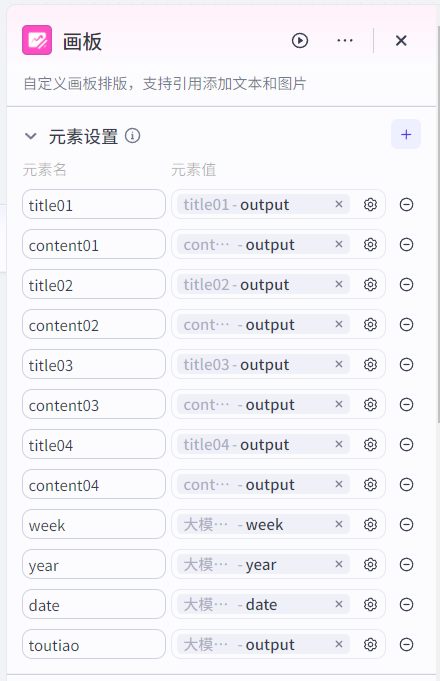

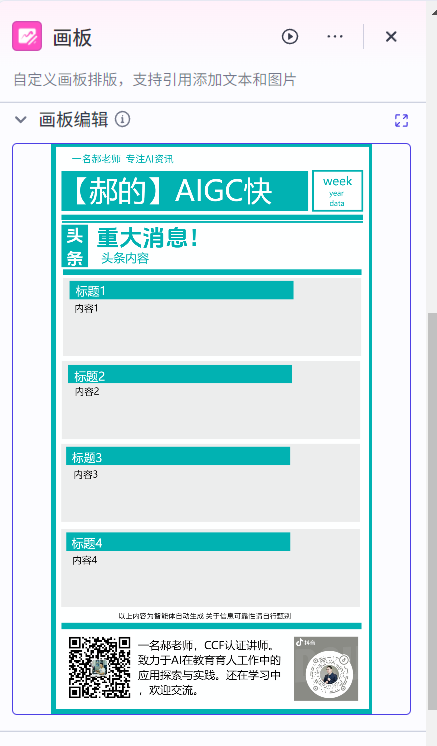

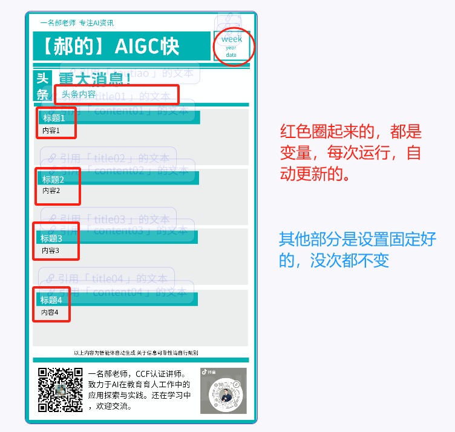

# 输出结果，选择上一步“画板”的图像

# 点击试运行，输入：[https://www.36kr.com/information/AI/](https://www.36kr.com/information/AI/)，测试效果
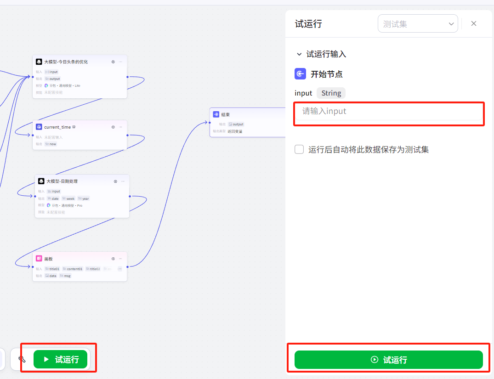

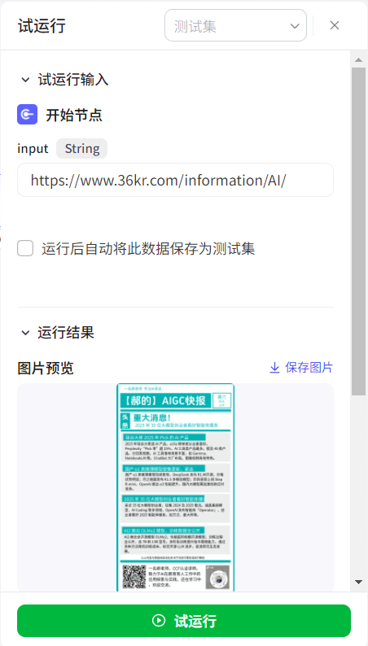

# 配置到智能体
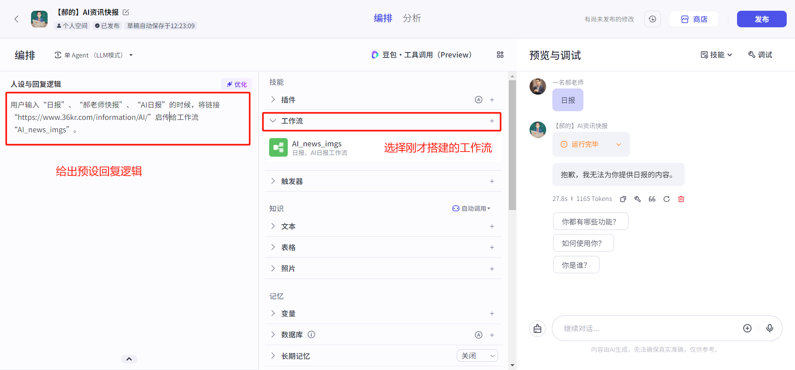

**人设与回复逻辑：**

用户输入“日报”、“郝老师快报”、“AI日报”的时候，将链接“[https://www.36kr.com/information/AI/](https://www.36kr.com/information/AI/)”启传给工作流“AI_news_imgs”。

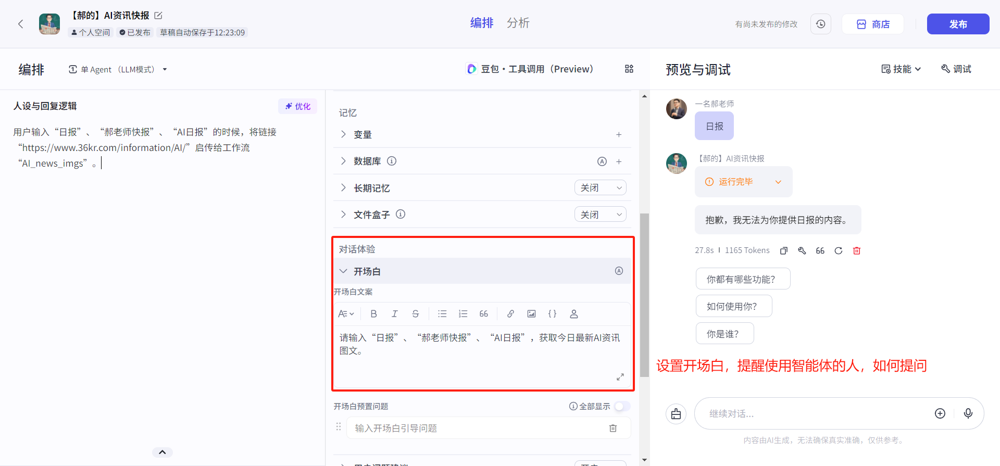

---

**end**

> 更新: 2025-03-18 12:29:03  
> 原文: <https://www.yuque.com/lixinsi/vnere7/lbuml0clawamwa4p>