# DIFY+数字人框架ADH部署及配置文档

## <font style="color:rgb(47, 54, 60);">1. 前言</font>

<font style="color:rgb(51, 51, 51);">数字人框架ADH部署及配置文档，主要介绍了数字人框架ADH的部署和配置方法，包括Awesome Digital Human的安装和配置等。</font>

<font style="color:rgb(51, 51, 51);">本项目旨在通过dify提供数字人的LLM（大模型） ASR（语音识别） TTS（文本转语音） 的能力，通过ADH前端展示。</font>

<font style="color:rgb(51, 51, 51);">来自与开源项目：</font>[<font style="color:rgb(65, 131, 196);">https://github.com/wan-h/awesome-digital-human-live2d</font>](https://github.com/wan-h/awesome-digital-human-live2d)

<font style="color:rgb(51, 51, 51);">B站的地址：</font>[<font style="color:rgb(65, 131, 196);">https://space.bilibili.com/14600648</font>](https://space.bilibili.com/14600648)<font style="color:rgb(51, 51, 51);"> </font><font style="color:rgb(51, 51, 51);">一力辉</font>

<font style="color:rgb(51, 51, 51);">资源网盘地址：</font>[<font style="color:rgb(65, 131, 196);">https://pan.quark.cn/s/f12c1f5b733c</font>](https://pan.quark.cn/s/f12c1f5b733c)

## <font style="color:rgb(47, 54, 60);">2. 部署方法</font>

### <font style="color:rgb(47, 54, 60);">下载</font>

<font style="color:rgb(51, 51, 51);">从github拉取或直接在上述网盘中下载：</font>

```plain
git clone https://github.com/wan-h/awesome-digital-human-live2d.git
```

### <font style="color:rgb(47, 54, 60);">配置文件的修改</font>

<font style="color:rgb(51, 51, 51);">来到项目根目录目录下，使用powershell或其他命令行工具，执行下述代码：</font>

```plain
# 使用 all in dify 配置文件，默认使用 config_template.yaml 配置文件
cd configs
cp config_all_in_dify.yaml config.yaml
```

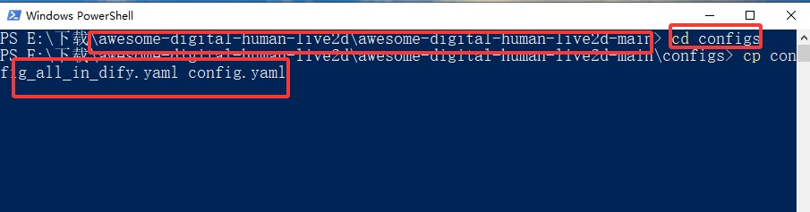

### <font style="color:rgb(47, 54, 60);">docker容器部署</font>

<font style="color:rgb(51, 51, 51);">打开docker, 切换到项目根目录，执行下述命令：</font>

<font style="color:rgb(51, 51, 51);">两种方式：</font>

#### <font style="color:rgb(47, 54, 60);">方式一：快速启动(体验)</font>

```plain
# 项目根目录下执行
docker-compose -f docker-compose-quickStart.yaml up -d
```

#### <font style="color:rgb(47, 54, 60);">方式二：可开发启动(可额外配置)</font>

```plain
# 项目根目录下执行
docker-compose up --build -d
```

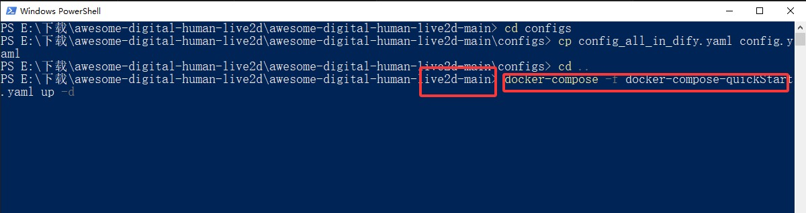

<font style="color:rgb(51, 51, 51);">执行完上述命令之后在浏览器中输入：</font>[<font style="color:rgb(65, 131, 196);">http://localhost:3000/</font>](http://localhost:3000/)<font style="color:rgb(51, 51, 51);"> </font><font style="color:rgb(51, 51, 51);">即可访问ADH。</font>

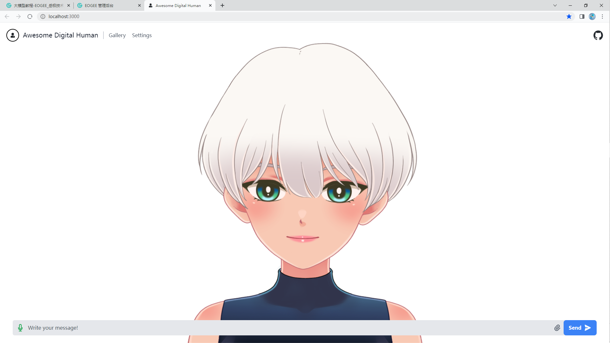

## <font style="color:rgb(47, 54, 60);">3.dify的配置</font>

### <font style="color:rgb(47, 54, 60);">获取api及服务url</font>

<font style="color:rgb(51, 51, 51);">打开dify中任意一个工作流或对话流，点击右上角的</font><font style="color:rgb(51, 51, 51);"> </font><code><font style="color:rgb(51, 51, 51);background-color:rgb(246, 246, 246);">发布</font></code><font style="color:rgb(51, 51, 51);">-</font><code><font style="color:rgb(51, 51, 51);background-color:rgb(246, 246, 246);">API</font></code><font style="color:rgb(51, 51, 51);"> </font><font style="color:rgb(51, 51, 51);">按钮，即可访问到API页面。</font>

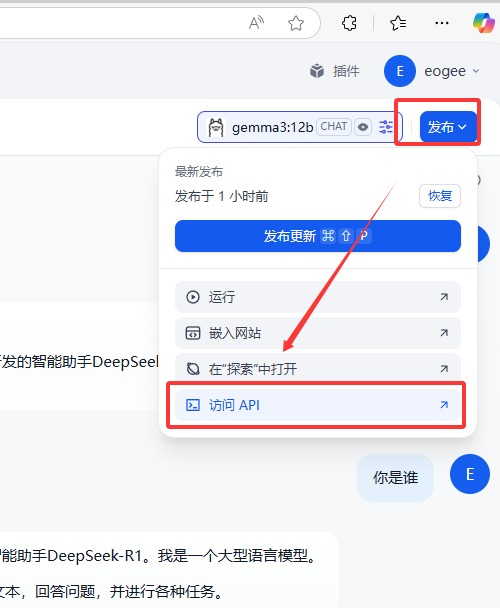

<font style="color:rgb(51, 51, 51);">点击右上角的</font><code><font style="color:rgb(51, 51, 51);background-color:rgb(246, 246, 246);">api密钥-创建密钥-复制密钥</font></code><font style="color:rgb(51, 51, 51);">。</font>

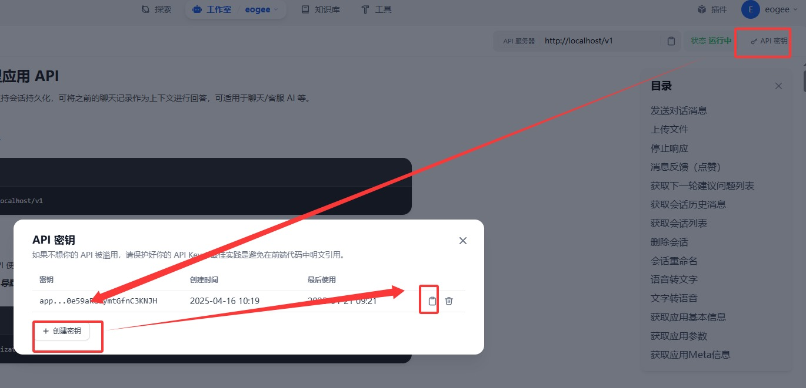

<font style="color:rgb(51, 51, 51);">需要说明的是，由于我们的dify和ADH都是部署在docker中，所以服务器的url地址应设置为</font><code><font style="color:rgb(51, 51, 51);background-color:rgb(246, 246, 246);">http://本地局域网下ip/v1</font></code><font style="color:rgb(51, 51, 51);">，或者是</font><code><font style="color:rgb(51, 51, 51);background-color:rgb(246, 246, 246);">http://host.docker.internal/v1</font></code><font style="color:rgb(51, 51, 51);">，如果部署在其他服务器上，则需要修改为相应的地址。</font>

### <font style="color:rgb(47, 54, 60);">去ADH中配置dify服务</font>

<font style="color:rgb(51, 51, 51);">回到</font><code><font style="color:rgb(51, 51, 51);background-color:rgb(246, 246, 246);">http://localhost:3000/</font></code><font style="color:rgb(51, 51, 51);"> </font><font style="color:rgb(51, 51, 51);">打开左上角的settings-服务，依次将上述的API密钥、服务url填入相应的输入框中，点击保存即可。</font>

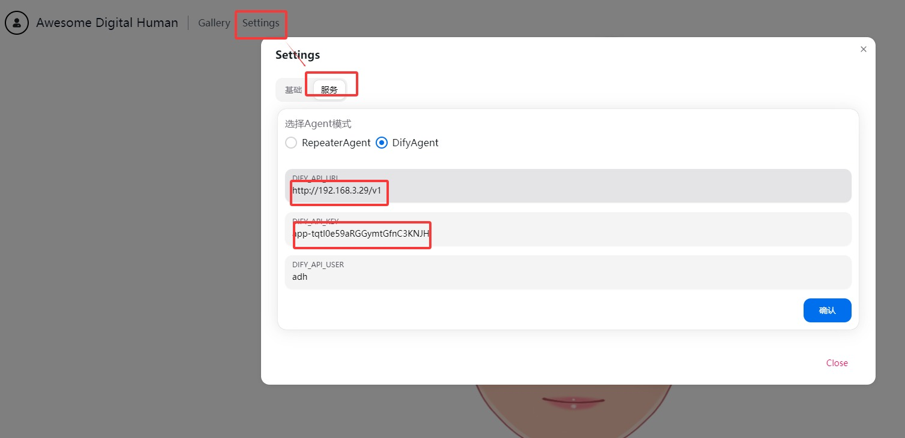

### <font style="color:rgb(47, 54, 60);">测试响应</font>

<font style="color:rgb(51, 51, 51);">在输入框中测试输入文本，查看是否有对话响应。</font>

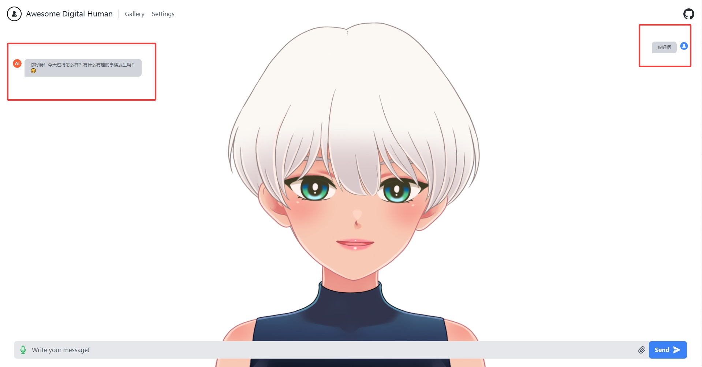

### <font style="color:rgb(47, 54, 60);">配置dify的语音识别和文本转语音</font>

* <font style="color:rgb(51, 51, 51);">打开右上角的</font><code><font style="color:rgb(51, 51, 51);background-color:rgb(246, 246, 246);">设置-模型提供商-添加模型提供商</font></code><font style="color:rgb(51, 51, 51);">，选择</font><code><font style="color:rgb(51, 51, 51);background-color:rgb(246, 246, 246);">阿里百炼</font></code><font style="color:rgb(51, 51, 51);">，输入api密钥信息，点击保存即可。</font>
* <font style="color:rgb(51, 51, 51);">点击</font><code><font style="color:rgb(51, 51, 51);background-color:rgb(246, 246, 246);">系统默认模型-设置默认模型</font></code><font style="color:rgb(51, 51, 51);">，选择</font><code><font style="color:rgb(51, 51, 51);background-color:rgb(246, 246, 246);">qwen-tts</font></code><font style="color:rgb(51, 51, 51);">，点击保存。</font>
* <font style="color:rgb(51, 51, 51);">语音识别模型配置同上。</font>

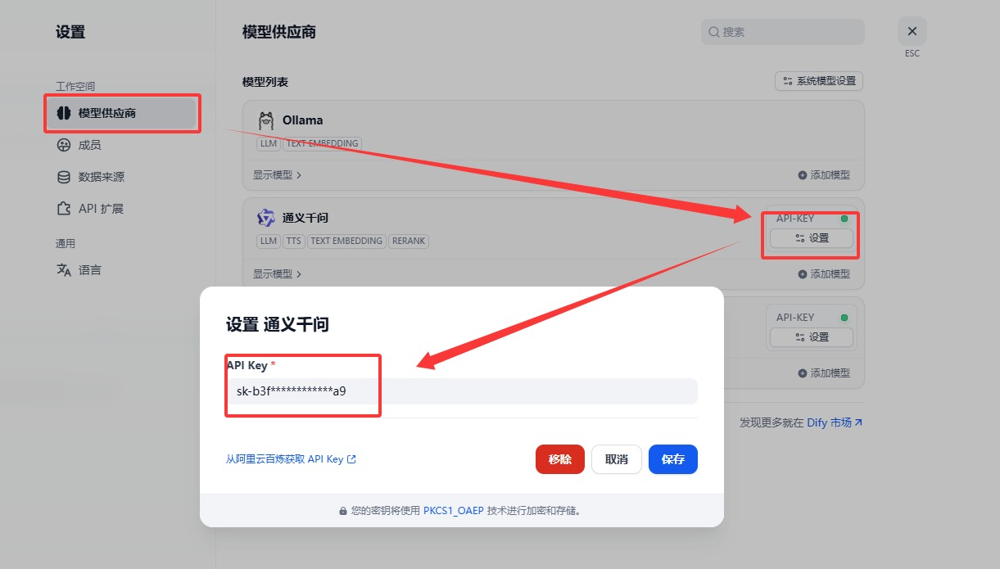

### <font style="color:rgb(47, 54, 60);">在工作流或对话流中配置上述两个模型</font>

<font style="color:rgb(51, 51, 51);">打开对应的工作流或对话流（聊天助手），点击右下角的</font><code><font style="color:rgb(51, 51, 51);background-color:rgb(246, 246, 246);">管理</font></code><font style="color:rgb(51, 51, 51);">，设置</font><code><font style="color:rgb(51, 51, 51);background-color:rgb(246, 246, 246);">文字转语音</font></code><font style="color:rgb(51, 51, 51);">和</font><code><font style="color:rgb(51, 51, 51);background-color:rgb(246, 246, 246);">语音转文字</font></code><font style="color:rgb(51, 51, 51);">的配置项。</font>

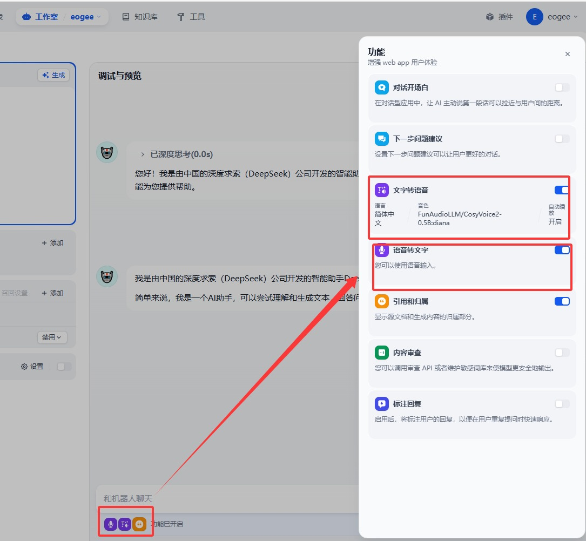

**<font style="color:rgb(51, 51, 51);">点击右上角</font>**<code>**<font style="color:rgb(51, 51, 51);background-color:rgb(246, 246, 246);">发布-发布更新</font>**</code><font style="color:rgb(51, 51, 51);">。</font>

### <font style="color:rgb(47, 54, 60);">ADH中测试语音沟通能力</font>

<font style="color:rgb(51, 51, 51);">打开ADH，</font><code><font style="color:rgb(51, 51, 51);background-color:rgb(246, 246, 246);">麦克风</font></code><font style="color:rgb(51, 51, 51);">按钮，说一句话，点击</font><code><font style="color:rgb(51, 51, 51);background-color:rgb(246, 246, 246);">发送</font></code><font style="color:rgb(51, 51, 51);">按钮，查看是否有语音响应。</font>

<font style="color:rgb(51, 51, 51);">如何显示</font><code><font style="color:rgb(51, 51, 51);background-color:rgb(246, 246, 246);">未获取麦克风权限</font></code><font style="color:rgb(51, 51, 51);">，则需要在浏览器设置中打开麦克风权限。</font>

<font style="color:rgb(51, 51, 51);">打开方式如下：</font>

* <font style="color:rgb(51, 51, 51);">打开浏览器设置，</font><code><font style="color:rgb(51, 51, 51);background-color:rgb(246, 246, 246);">网站设置-权限设置-麦克风</font></code><font style="color:rgb(51, 51, 51);">，打开</font><code><font style="color:rgb(51, 51, 51);background-color:rgb(246, 246, 246);">麦克风</font></code><font style="color:rgb(51, 51, 51);">权限。</font>

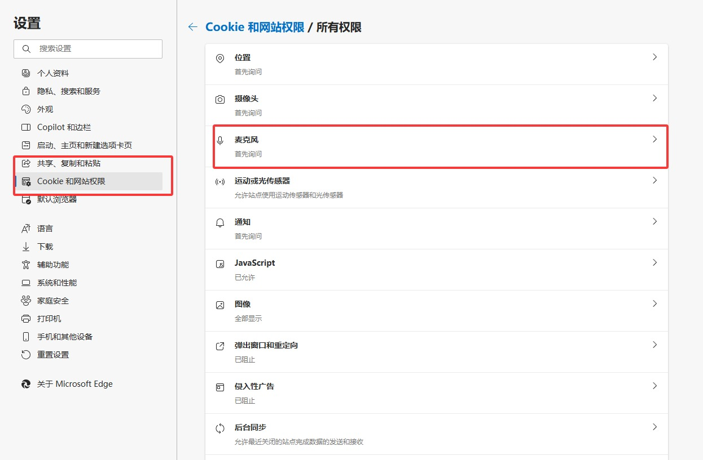

<font style="color:rgb(51, 51, 51);">如果不能设置，可以查看下述方法（20250425新增）：</font>

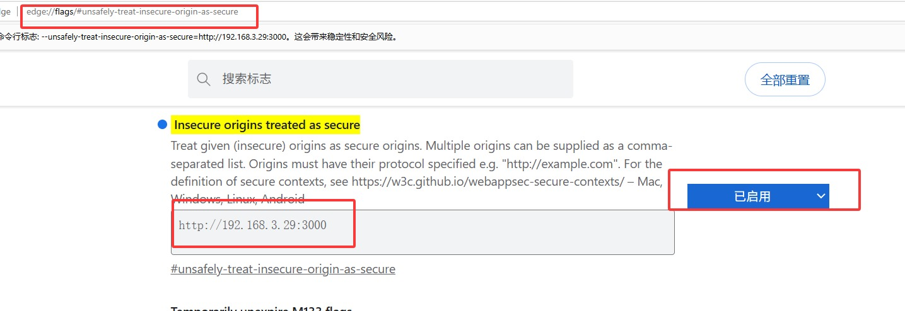

## <font style="color:rgb(47, 54, 60);">4. ADH的配置</font>

### <font style="color:rgb(47, 54, 60);">端口配置</font>

**<font style="color:rgb(51, 51, 51);">后端端口配置</font>**

<font style="color:rgb(51, 51, 51);">打开项目源码中的</font><code><font style="color:rgb(51, 51, 51);background-color:rgb(246, 246, 246);">awesome-digital-human-live2d-main\docker-compose-quickStart.yaml</font></code><font style="color:rgb(51, 51, 51);">或</font><code><font style="color:rgb(51, 51, 51);background-color:rgb(246, 246, 246);">awesome-digital-human-live2d-main\docker-compose.yaml</font></code><font style="color:rgb(51, 51, 51);">\ </font><font style="color:rgb(51, 51, 51);">修改</font><code><font style="color:rgb(51, 51, 51);background-color:rgb(246, 246, 246);">ports</font></code><font style="color:rgb(51, 51, 51);">的值，其中3000为前端端口，8000为后端端口。</font>

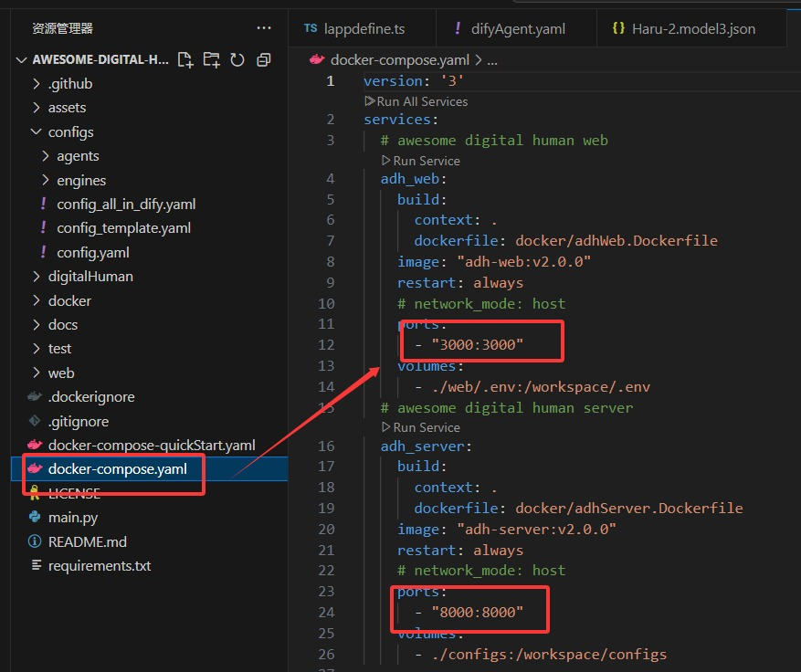

### <font style="color:rgb(47, 54, 60);">修改默认人物模型</font>

<font style="color:rgb(51, 51, 51);">打开项目源码中的</font><code><font style="color:rgb(51, 51, 51);background-color:rgb(246, 246, 246);">awesome-digital-human-live2d-main\web\app\lib\live2d\lappdefine.ts</font></code><font style="color:rgb(51, 51, 51);">\ </font><font style="color:rgb(51, 51, 51);">找到：</font>

```plain
//模型定义----------------------------------
export const ModelsDesc: string[] = [
  'Kei', 'Haru-1', 'Haru-2', 'Chitose', 'Mao', 'Miara', 'Tsumiki', 'Rice', 'Epsilon', 'Hibiki', 'Izumi', 'Shizuku', 'Hiyori'
];
export const ModelDefault = 'Haru-2';
```

<font style="color:rgb(51, 51, 51);">此时，我们就将</font><code><font style="color:rgb(51, 51, 51);background-color:rgb(246, 246, 246);">ModelDefault</font></code><font style="color:rgb(51, 51, 51);">改为我们想要的模型，比如</font><code><font style="color:rgb(51, 51, 51);background-color:rgb(246, 246, 246);">Haru-2</font></code><font style="color:rgb(51, 51, 51);">。</font>

### <font style="color:rgb(47, 54, 60);">添加背景图片</font>

<font style="color:rgb(51, 51, 51);">粘贴一张图片至：</font><code><font style="color:rgb(51, 51, 51);background-color:rgb(246, 246, 246);">awesome-digital-human-live2d-main\web\public\backgrounds</font></code><font style="color:rgb(51, 51, 51);">文件夹下，jpg格式确认可用，其他格式自行测试</font>

<font style="color:rgb(51, 51, 51);">打开项目源码中的</font><code><font style="color:rgb(51, 51, 51);background-color:rgb(246, 246, 246);">awesome-digital-human-live2d-main\web\app\lib\live2d\lappdefine.ts</font></code><font style="color:rgb(51, 51, 51);">\ </font><font style="color:rgb(51, 51, 51);">找到：</font>

```plain
// 模型后面的背景图像文件
export const BackImages: string[] = [
  'forest_trail', 'night_street' , 'mine_background'
];
```

<font style="color:rgb(51, 51, 51);">其中</font><code><font style="color:rgb(51, 51, 51);background-color:rgb(246, 246, 246);">mine_background</font></code><font style="color:rgb(51, 51, 51);">就是我们自己添加的图片\ </font>**<font style="color:rgb(51, 51, 51);">注意：图片名称要与文件名称一致，但不包括拓展名，即.jpg</font>**<font style="color:rgb(51, 51, 51);">。</font>

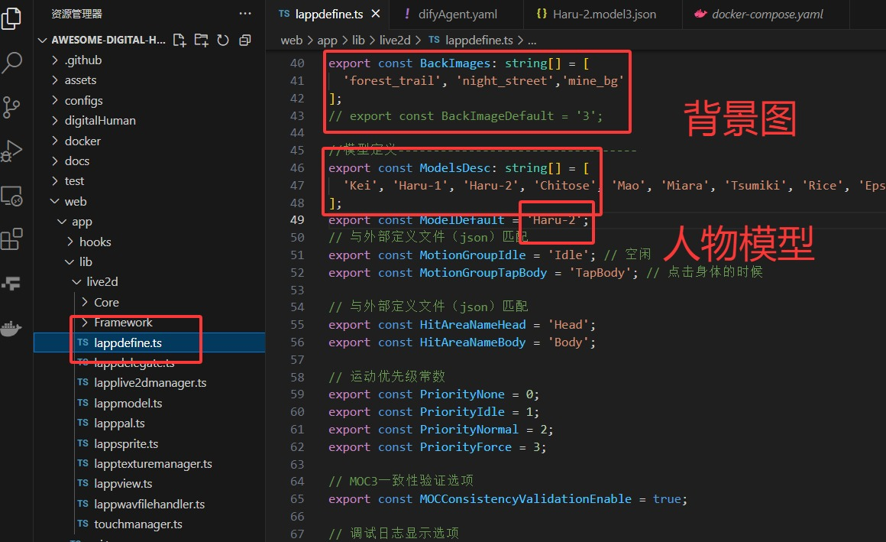

### <font style="color:rgb(47, 54, 60);">配置默认dify服务参数</font>

<font style="color:rgb(51, 51, 51);">找到</font><code><font style="color:rgb(51, 51, 51);background-color:rgb(246, 246, 246);">awesome-digital-human-live2d-main\configs\agents\difyAgent.yaml</font></code><font style="color:rgb(51, 51, 51);">,</font>

```plain
NAME: "DifyAgent"
VERSION: "v0.0.1"
# 暴露给前端的参数选项以及默认值
PARAMETERS: [
  {
    NAME: "DIFY_API_URL",
    DEFAULT: "" # 这里填入dify的api地址
  },
  {
    NAME: "DIFY_API_KEY",
    DEFAULT: "" # 这里填入dify的api密钥
  },
  {
    NAME: "DIFY_API_USER",
    DEFAULT: "adh"
  }
]
```

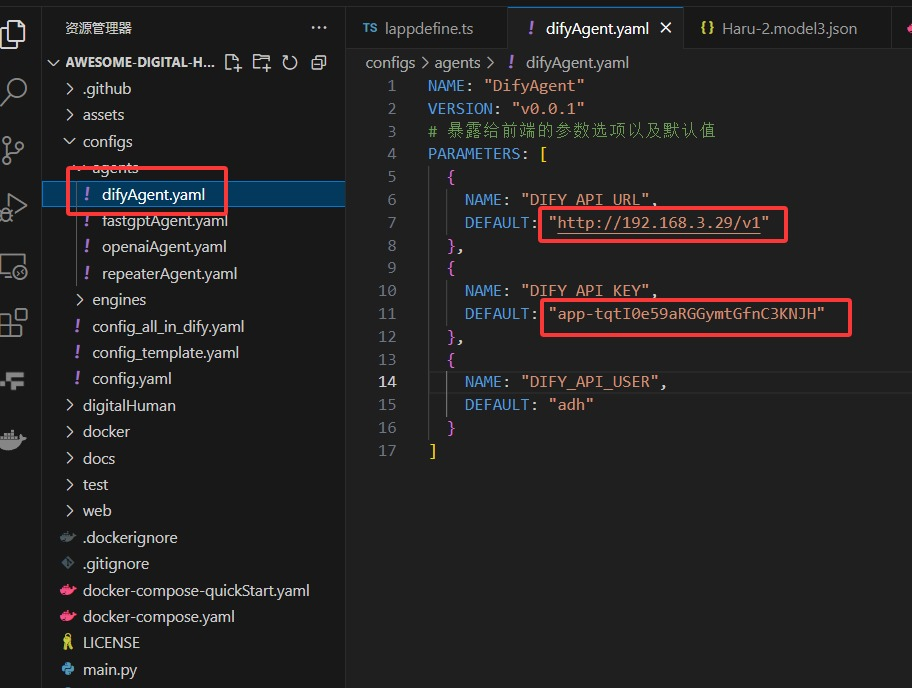

### <font style="color:rgb(47, 54, 60);">设置模型默认动作</font>

<font style="color:rgb(51, 51, 51);">由于框架中的部门人物模型，有怪异的表现，我们需要新增或删除部分动作，这里以</font><code><font style="color:rgb(51, 51, 51);background-color:rgb(246, 246, 246);">haru-2</font></code><font style="color:rgb(51, 51, 51);">模型为例，删除部分动作：</font>

<font style="color:rgb(51, 51, 51);">打开项目源码中的</font><code><font style="color:rgb(51, 51, 51);background-color:rgb(246, 246, 246);">awesome-digital-human-live2d-main\web\public\characters\Haru-2\Haru-2.model3.json</font></code><font style="color:rgb(51, 51, 51);">\ </font><font style="color:rgb(51, 51, 51);">找到：</font>

```plain
"Motions": {
            "Idle": [
                {
                    "File": "motions/微笑-正常.motion3.json",
                    "FadeInTime": 0.5,
                    "FadeOutTime": 0.5
                },
                {
                    "File": "motions/微笑-背手点头.motion3.json",
                    "FadeInTime": 0.5,
                    "FadeOutTime": 0.5
                },
                {
                    "File": "motions/高兴-身体前倾眯眼.motion3.json",
                    "FadeInTime": 0.5,
                    "FadeOutTime": 0.5
                }
            ],
```

<font style="color:rgb(51, 51, 51);">删除其中</font><code><font style="color:rgb(51, 51, 51);background-color:rgb(246, 246, 246);">高兴-身体前倾眯眼.motion3.json</font></code><font style="color:rgb(51, 51, 51);">和</font><code><font style="color:rgb(51, 51, 51);background-color:rgb(246, 246, 246);">微笑-向前浅鞠躬.motion3.json</font></code><font style="color:rgb(51, 51, 51);">这两行，保存文件。\ </font>**<font style="color:rgb(51, 51, 51);">注意：要删除掉整个{}及包裹中的内容和逗号，ctrl+s保存</font>**<font style="color:rgb(51, 51, 51);">。</font>

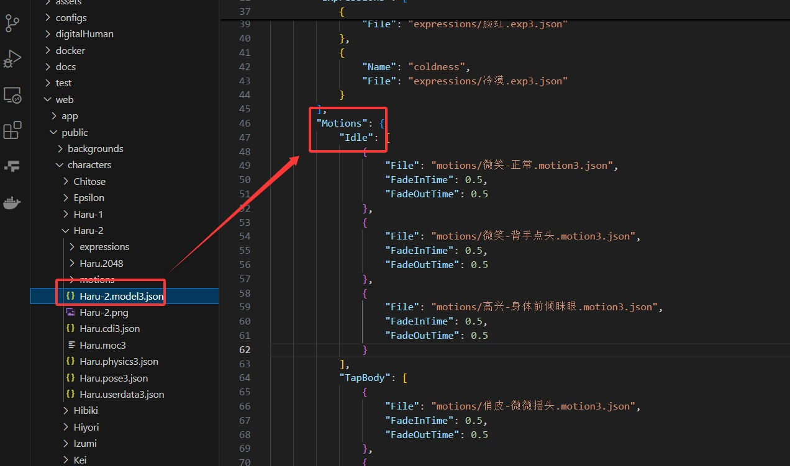

<font style="color:rgb(51, 51, 51);">至此，基本配置都已经完成。</font>

## <font style="color:rgb(47, 54, 60);">5. 启动修改配置后的ADH</font>

```plain
# 项目根目录下执行
docker-compose up --build -d
```

<font style="color:rgb(51, 51, 51);">打开浏览器，输入：</font>[<font style="color:rgb(65, 131, 196);">http://localhost:3000/</font>](http://localhost:3000/)<font style="color:rgb(51, 51, 51);"> 即可访问ADH。</font>


> 更新: 2025-10-04 09:16:12  
> 原文: <https://www.yuque.com/lixinsi/vnere7/ireqnl2omkmm80yl>