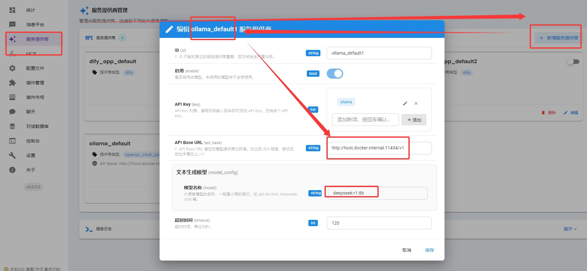
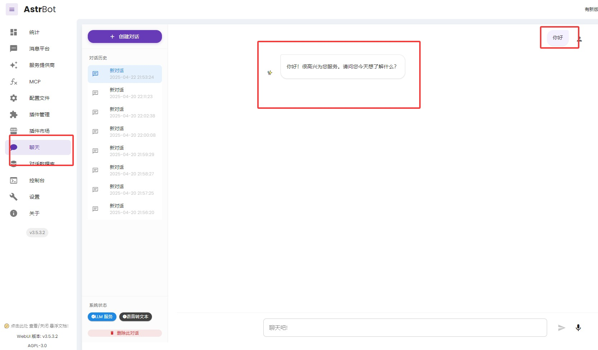
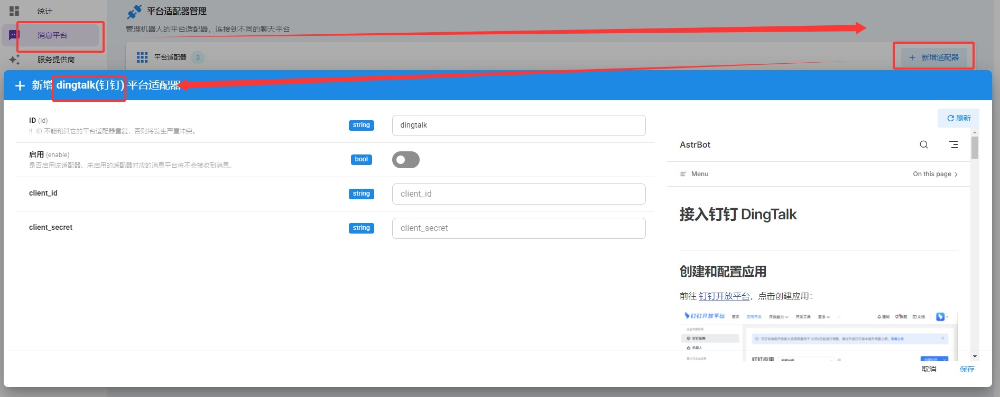
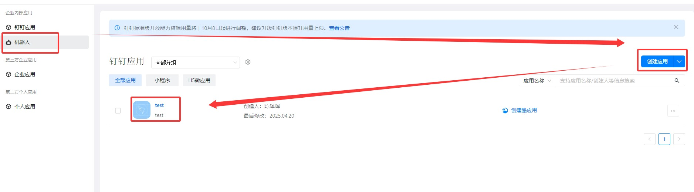
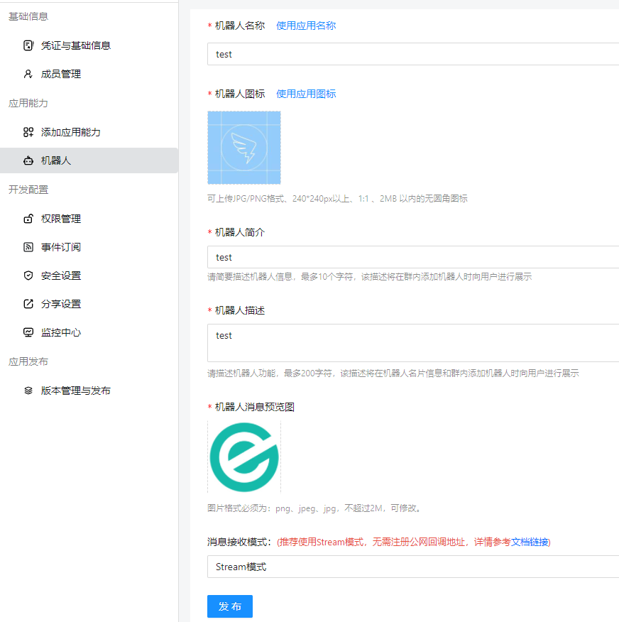
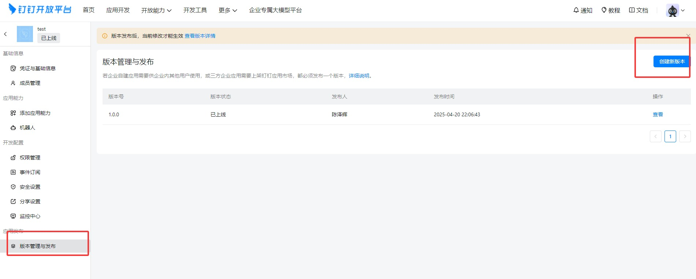
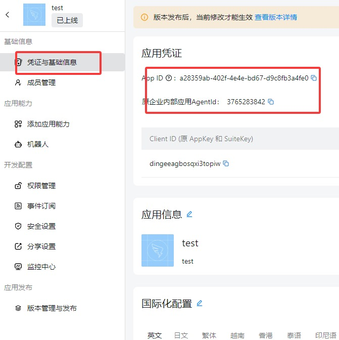
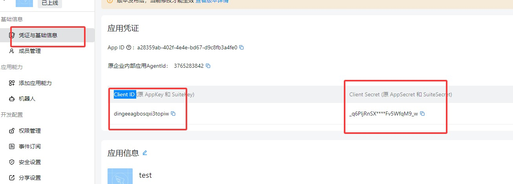
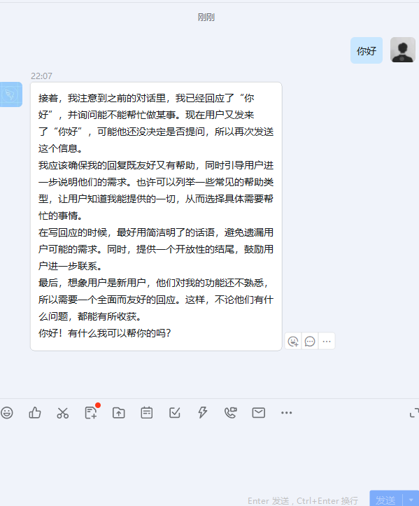
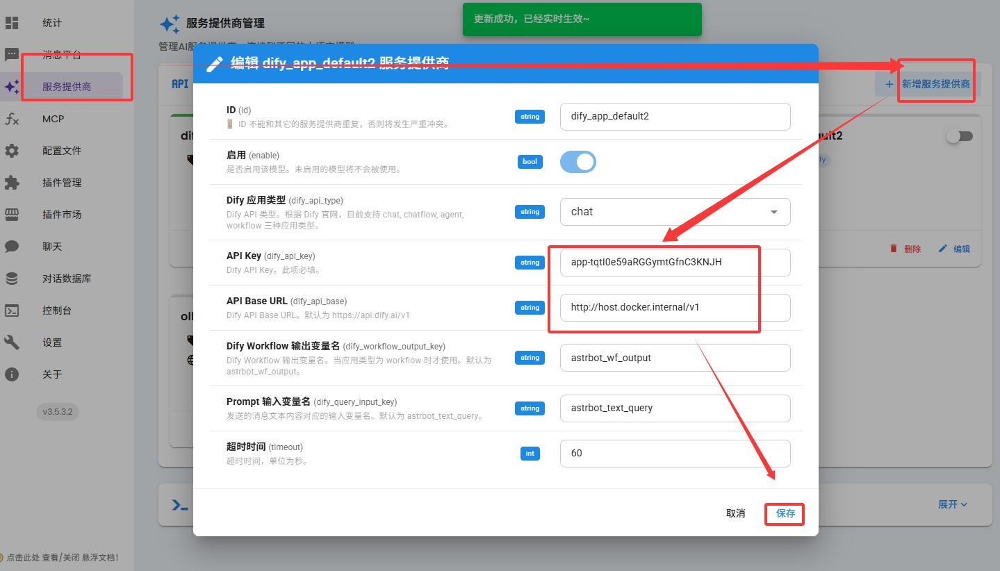

# Dify连接和微信、钉钉等,使用astrBot

## <font style="color:rgb(47, 54, 60);">1.什么是astrBot？</font>

* <font style="color:rgb(51, 51, 51);">可以用于链接 微信、QQ、Telegram 等 IM 平台的聊天机器人。</font>
* <font style="color:rgb(51, 51, 51);">服务层可以链接 ollama dify 等。</font>

## <font style="color:rgb(47, 54, 60);">2.下载及安装astrBot</font>

### <font style="color:rgb(47, 54, 60);">下载</font>

* <font style="color:rgb(51, 51, 51);">下载地址：</font>[<font style="color:rgb(65, 131, 196);">https://github.com/AstrBotDevs/AstrBot</font>](https://github.com/AstrBotDevs/AstrBot)
* <font style="color:rgb(51, 51, 51);">你也可以在网盘中下载：</font>

### <font style="color:rgb(47, 54, 60);">安装</font>

<font style="color:rgb(51, 51, 51);">这里使用docker安装，可参考：</font>[<font style="color:rgb(65, 131, 196);">https://www.eogee.com/article/detail/15</font>](https://www.eogee.com/article/detail/15)

<font style="color:rgb(51, 51, 51);">安装前，需要保证docker已经启动并运行。</font>

<font style="color:rgb(51, 51, 51);">下载后，解压到任意目录，打开命令行，进入到项目根目录下，输入以下命令：</font>

```plain
docker compose up -d
```

<font style="color:rgb(51, 51, 51);">开始拉取镜像。完成后，在浏览器中输入：</font>[<font style="color:rgb(65, 131, 196);">http://localhost:6185</font>](http://localhost:6185/)<font style="color:rgb(51, 51, 51);"> </font><font style="color:rgb(51, 51, 51);">/，即可访问astrBot。</font>

## <font style="color:rgb(47, 54, 60);">3.配置astrBot的服务运行时</font>

### <font style="color:rgb(47, 54, 60);">添加dify</font>

* <font style="color:rgb(51, 51, 51);">注册账号并登录astrBot</font>
* <font style="color:rgb(51, 51, 51);">点击左侧菜单中的“服务提供商”，选择“添加服务提供商”，选择ollama,输入ollama的配置信息:\ </font><font style="color:rgb(51, 51, 51);">仅修改API Base URL (api\_base)为ollama的API地址：</font><code><font style="color:rgb(51, 51, 51);background-color:rgb(246, 246, 246);">http://host.docker.internal:11434/v1</font></code><font style="color:rgb(51, 51, 51);">和文本生成模型为你本地安装的大模型，如：</font><code><font style="color:rgb(51, 51, 51);background-color:rgb(246, 246, 246);">deepseek-r1:8b</font></code>
* <font style="color:rgb(51, 51, 51);">其他保持默认，点击保存。</font>



### <font style="color:rgb(47, 54, 60);">测试ollama的运行情况</font>

* <font style="color:rgb(51, 51, 51);">点击左侧菜单中的“聊天”，在输入框中输入“你好”，测试ollama是否正常响应。</font>



## <font style="color:rgb(47, 54, 60);">4. 添加钉钉机器人</font>

### <font style="color:rgb(47, 54, 60);">添加钉钉消息服务</font>

<font style="color:rgb(51, 51, 51);">点击左侧菜单中的“消息平台”，选择“添加服务提供商”，选择“dingtalk”。</font>



### <font style="color:rgb(47, 54, 60);">注册并添加钉钉机器人</font>

<font style="color:rgb(51, 51, 51);">根据右侧给出的注册地址，注册并登录，添加一个“钉钉开放平台”的机器人。</font>



<font style="color:rgb(51, 51, 51);">点击应用详情，跳转页面后，点击主页面最下方的</font><code><font style="color:rgb(51, 51, 51);background-color:rgb(246, 246, 246);">机器人配置</font></code><font style="color:rgb(51, 51, 51);">，填写名称、说明和图标等，点击</font><code><font style="color:rgb(51, 51, 51);background-color:rgb(246, 246, 246);">发布</font></code><font style="color:rgb(51, 51, 51);">。</font>



<font style="color:rgb(51, 51, 51);">点击左侧菜单栏中的“版本管理与发布”并发布此应用。</font>



<font style="color:rgb(51, 51, 51);">点击左侧菜单栏中的“凭证与基础信息”，获取Client ID 和 Client Secret。</font>



<font style="color:rgb(51, 51, 51);">粘贴至astrBot的相应配置，点击保存。</font>



### <font style="color:rgb(47, 54, 60);">测试钉钉机器人的运行情况</font>

<font style="color:rgb(51, 51, 51);">打开并登录钉钉，搜索“test”机器人并和他聊天，测试能否成功响应。</font>



### <font style="color:rgb(47, 54, 60);">将机器人与dify服务绑定</font>

<font style="color:rgb(51, 51, 51);">点击astrBot左侧菜单中的“服务提供商”，点击“添加服务”，选择dify。并输入dify中已有的工作流或其他应用的url和api\_key,点击保存。我们这里选择</font><code><font style="color:rgb(51, 51, 51);background-color:rgb(246, 246, 246);">chat</font></code><font style="color:rgb(51, 51, 51);">对话应用，具体获取url和api\_key的方式参考：</font>[<font style="color:rgb(65, 131, 196);">https://www.eogee.com/article/detail/31</font>](https://www.eogee.com/article/detail/31)<font style="color:rgb(51, 51, 51);"> </font><font style="color:rgb(51, 51, 51);">的第3部分。</font>



<font style="color:rgb(51, 51, 51);">测试钉钉机器人与dify服务的绑定的运行情况：</font>


> 更新: 2025-10-04 09:19:46  
> 原文: <https://www.yuque.com/lixinsi/vnere7/vfipyal973v31cpi>