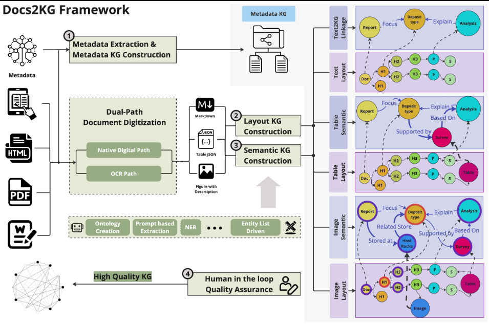
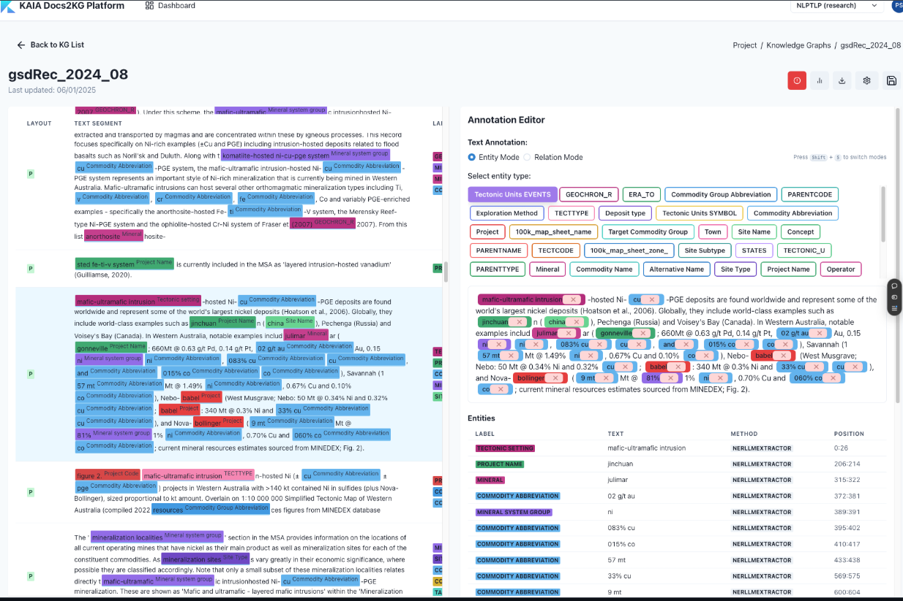
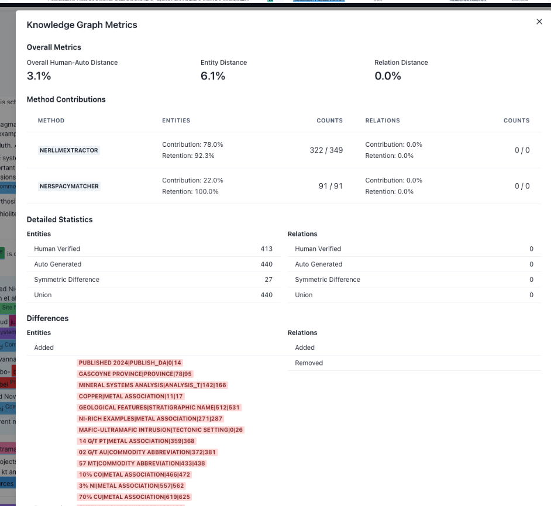

# Docs2KG非结构化数据转结构化数据

### 1.开源地址：[https://github.com/AI4WA/Docs2KG](https://github.com/AI4WA/Docs2KG)
# <font style="color:#000000;">Docs2KG</font>
**<font style="color:#000000;">一种从异构文档中构建统一知识图谱的人-法学硕士协作方法</font>**

<font style="color:#000000;"> </font><font style="color:#000000;"> </font><font style="color:#000000;"> </font><font style="color:#000000;"> </font><font style="color:#000000;"> </font>

## <font style="color:#000000;">安装</font>
<font style="color:#000000;">我们已将软件包发布到 PyPi:</font><font style="color:#000000;"> </font>[<font style="color:#000000;">Docs2KG</font>](https://pypi.org/project/Docs2KG/)<font style="color:#000000;">，</font>

<font style="color:#000000;">您可以通过以下方式安装：</font>

```plain
pip install Docs2KG

python -m spacy download en_core_web_sm
```

---



---

## <font style="color:#000000;">设置和教程</font>
[<font style="color:#000000;">详细的设置和教程可以在文档</font>](https://docs2kg.ai4wa.com/Tutorial/1.GettingStarted/)<font style="color:#000000;">中找到</font><font style="color:#000000;">。</font>

<font style="color:#000000;">您可以通过两种方式运行该包：</font>

+ <font style="color:#000000;">在代码中导入该包，并将其与自己的代码挂钩</font>
+ <font style="color:#000000;">在命令行中运行该包</font>

### <font style="color:#000000;">命令行</font>
```plain
# first setup the CONFIG_FILE environment variable to local one
export CONFIG_FILE=config.yml # or any other path for the configuration file
docs2kg # this command will tell you how to use the package

# we currently support the following commands
docs2kg process-document your_input_file --agent-name phi3.5 --agent-type ollama --project-id your_project_id
docs2kg batch-process your_input_dir --agent-name phi3.5 --agent-type ollama --project-id your_project_id
docs2kg list-formats # list all the supported formats
```

```plain
Usage: docs2kg [OPTIONS] COMMAND [ARGS]...

  Docs2KG - Document to Knowledge Graph conversion tool.

  Supports multiple document formats: PDF, DOCX, HTML, and EPUB.

Options:
  -c, --config PATH  Path to the configuration file (default: ./config.yml)
  --help             Show this message and exit.

Commands:
  batch-process     Process all supported documents in a directory.
  list-formats      List all supported document formats.
  neo4j             Load data to Neo4j database.
  process-document  Process a single document file.
```

```plain
Usage: docs2kg process-document [OPTIONS] FILE_PATH

  Process a single document file.

  FILE_PATH: Path to the document file (PDF, DOCX, HTML, or EPUB)

Options:
  -p, --project-id TEXT  Project ID for the knowledge graph construction
  -n, --agent-name TEXT  Name of the agent to use for NER extraction
  -t, --agent-type TEXT  Type of the agent to use for NER extraction
  --help                 Show this message and exit.
```

```plain
Usage: docs2kg neo4j [OPTIONS] PROJECT_ID

  Load data to Neo4j database.

Options:
  -m, --mode [import|export|load|docker_start|docker_stop]
                                  Mode of operation (import or export)
  -u, --neo4j-uri TEXT            URI for the Neo4j database
  -U, --neo4j-user TEXT           Username for the Neo4j database
  -P, --neo4j-password TEXT       Password for the Neo4j database
  -r, --reset_db                  Reset the database before loading data
  --help
```

## <font style="color:#000000;">动机</font>
<font style="color:#000000;">要将各种非结构化文档消化成统一的知识图谱，主要面临两个挑战：</font>

+ **<font style="color:#000000;">如何将文档数字化？</font>**
    - <font style="color:#000000;">采用双路径数据处理</font>
        * <font style="color:#000000;">对于基于图像的文档，例如扫描的 PDF、图像等，我们可以通过布局分析和 OCR 等方式对其进行处理。Docling 和 MinerU 专注于这一部分。</font>
        * <font style="color:#000000;">对于原生数字文档，如电子书、docx、html 等，我们可以通过编程解析器进行处理</font>
    - <font style="color:#000000;">我们相信很快就会有一个强有力的解决方案。</font>
+ **<font style="color:#000000;">如何以较少的努力构建高质量的统一知识图谱？</font>**

<font style="color:#000000;">目前，很多工具都专注于第一个挑战，而忽视了第二个挑战。</font>

<font style="color:#000000;">为了以较少的努力构建高质量的统一知识图谱，我们提出了 Docs2KG。</font>

+ <font style="color:#000000;">我们采用自下而上和自上而下的方法来在 LLM 的帮助下构建统一的知识图谱及其本体。</font>
+ <font style="color:#000000;">我们从三个方面来组织知识图谱：</font>
    - <font style="color:#000000;">MetaKG：关于所有文档的知识，如作者、出版日期等。</font>
    - <font style="color:#000000;">LayoutKG：有关文档布局的知识，如标题、副标题、章节等。</font>
    - <font style="color:#000000;">SemanticKG：关于文档内容的知识，如实体、关系等。</font>
+ <font style="color:#000000;">我们提供了人与法学硕士 (LLM) 协作界面，允许人类审查和增强生成的知识图谱。</font>
    - <font style="color:#000000;">本体、实体列表、关系列表的更新版本将反过来帮助 KG Construction LLM 代理在下一次迭代中产生更好的结果。</font>
    - <font style="color:#000000;">知识图谱的输出可用于下游应用程序，如 RAG 等。</font>
    - <font style="color:#000000;">人机 LLM 协作界面链接：</font>[<font style="color:#000000;">Docs2KG</font>](https://docs2kg.kaiaperth.com/)
    - <font style="color:#000000;">注释之后，将提供评估自动构建质量的指标。</font>
        * <font style="color:#000000;">每种方法正确提取了多少个实体？</font>
        * <font style="color:#000000;">每种方法正确提取了多少关系？</font>
        * <font style="color:#000000;">最终知识图谱中每种方法的贡献和保留，包括人工注释。</font>

<font style="color:#000000;">接口示例，您只需注册，即可自由访问。</font>






---

## <font style="color:#000000;">发展</font>
```plain
python3 -m venv venv
source venv/bin/activate
pip install -r requirements.txt
pip install -r requirements.dev.txt

pip install -e .
```

---

## <font style="color:#000000;">引用</font>
<font style="color:#000000;">如果您发现这个包有用，请考虑引用我们的工作：</font>

```plain
@misc{sun2024docs2kg,
    title = {Docs2KG: Unified Knowledge Graph Construction from Heterogeneous Documents Assisted by Large Language Models},
    author = {Qiang Sun and Yuanyi Luo and Wenxiao Zhang and Sirui Li and Jichunyang Li and Kai Niu and Xiangrui Kong and Wei Liu},
    year = {2024},
    eprint = {2406.02962},
    archivePrefix = {arXiv},
    primaryClass = {cs.CL}
}
```


> 更新: 2025-03-03 08:34:58  
> 原文: <https://www.yuque.com/lixinsi/vnere7/tl71zclp7yfa5vq6>