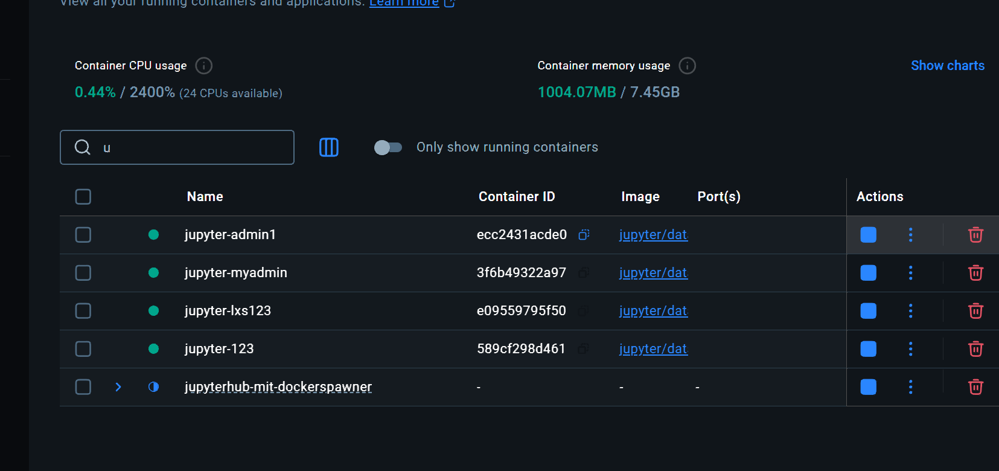

# Jupyter_hub测试环境

```dockerfile
version: '3.8'

services:
  jupyterhub:
    build: .
    image: my_jupyterhub
    volumes:
      - /var/run/docker.sock:/var/run/docker.sock
      - ./jupyterhub_config.py:/srv/jupyterhub/jupyterhub_config.py
      - jupyterhub_data:/srv/jupyterhub/data
    ports:
      - "8000:8000"
    networks:
      - jupyterhub

volumes:
  jupyterhub_data:

networks:
  jupyterhub:
    name: jupyterhub

```

```dockerfile
FROM jupyterhub/jupyterhub:latest

RUN pip install --no-cache \
    oauthenticator \
    dockerspawner \
    jupyterhub-nativeauthenticator


COPY jupyterhub_config.py /srv/jupyterhub/jupyterhub_config.py

```

```python
from dockerspawner import DockerSpawner
from nativeauthenticator import NativeAuthenticator
import os
import sys
import tornado.web

c.JupyterHub.authenticator_class = NativeAuthenticator
c.JupyterHub.log_level = 'DEBUG'
c.JupyterHub.hub_ip = '0.0.0.0'
c.JupyterHub.spawner_class = DockerSpawner

# Persistence
c.JupyterHub.db_url = "sqlite:///data/jupyterhub.sqlite"


c.DockerSpawner.network_name = 'jupyterhub'
c.DockerSpawner.remove = True
c.DockerSpawner.volumes = { 'jupyterhub-user-{username}': "/home/jovyan/work" }
c.DockerSpawner.notebook_dir = '/home/jovyan/work'
c.DockerSpawner.image = "jupyter/datascience-notebook:latest"
c.Spawner.http_timeout = 300

c.GenericOAuthenticator.enable_auth_state = True
# Enable user registration
c.Authenticator.allowed_users = {'admin1', 'myadmin', 'lxs123'}
c.Authenticator.admin_users = {'admin1', 'myadmin'}
c.NativeAuthenticator.open_signup = True
c.NativeAuthenticator.create_system_users = True
c.NativeAuthenticator.check_whitelist = False

# 在文件开头的 import 部分添加
import sys
import tornado.web

# 在配置部分添加
c.JupyterHub.template_paths = ['/usr/local/share/jupyterhub/templates']
c.JupyterHub.template_vars = {
    'logo_file': '',  # 避免 logo 404 错误
}

# 禁用 xsrf 检查（仅用于测试环境）
c.ConfigurableHTTPProxy.auth_token = '<random-token>'
c.JupyterHub.disable_check_xsrf = True

#notebook_dir = os.environ.get('DOCKER_NOTEBOOK_DIR') or '/home/jovyan/work'


```




> 更新: 2025-04-20 21:28:58  
> 原文: <https://www.yuque.com/lixinsi/vnere7/nmgaxfiu5a7iyns1>