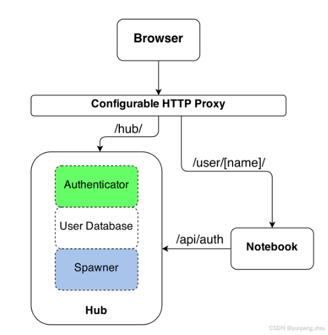
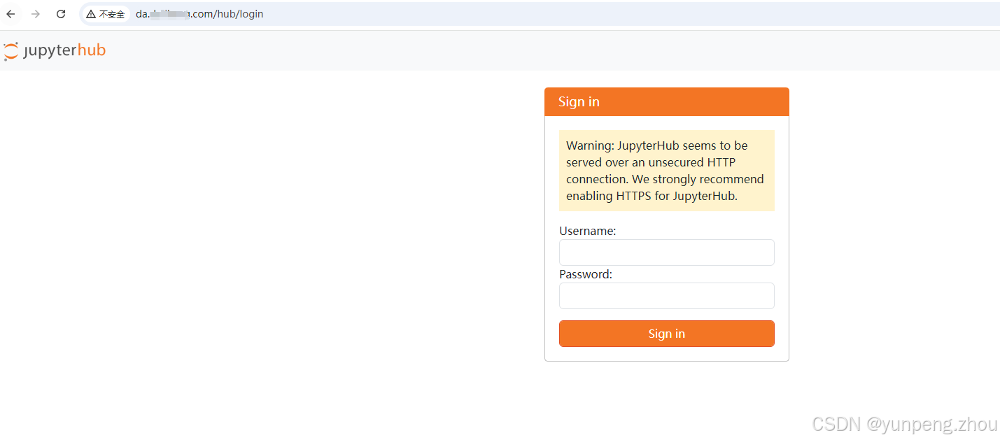
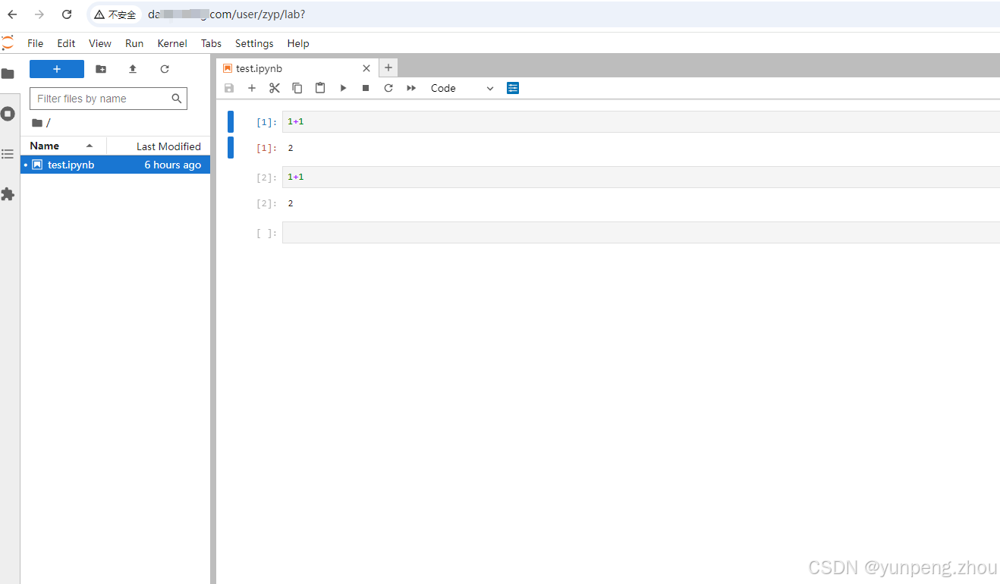
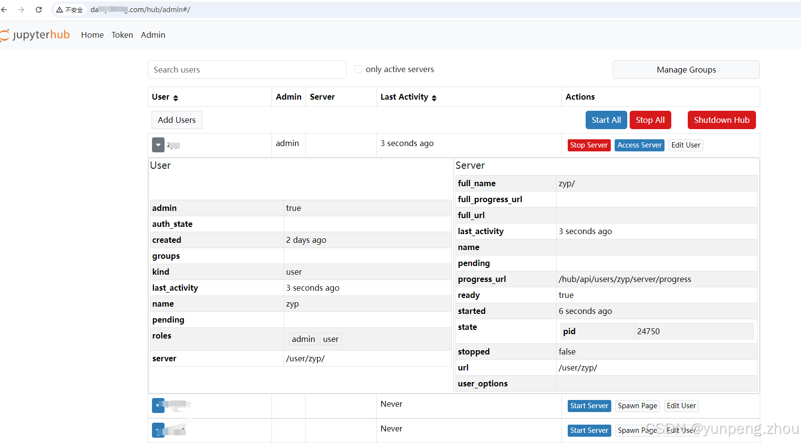
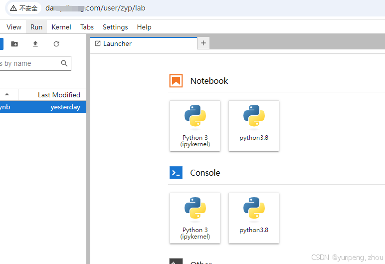

# Jupyterhub 多用户分析平台在线和离线部署（自定义用户认证）

## <font style="color:rgb(79, 79, 79);">Jupyterhub</font>
#### <font style="color:rgb(79, 79, 79);">文章目录</font>
+ [<font style="color:rgb(78, 161, 219);">Jupyterhub</font>](https://blog.csdn.net/a1314_521a/article/details/142554128?spm=1001.2101.3001.6650.1&utm_medium=distribute.pc_relevant.none-task-blog-2~default~OPENSEARCH~PaidSort-1-142554128-blog-125497385.235%5Ev43%5Epc_blog_bottom_relevance_base4&depth_1-utm_source=distribute.pc_relevant.none-task-blog-2~default~OPENSEARCH~PaidSort-1-142554128-blog-125497385.235%5Ev43%5Epc_blog_bottom_relevance_base4&utm_relevant_index=1#Jupyterhub_0)
    - [<font style="color:rgb(78, 161, 219);">1、简介</font>](https://blog.csdn.net/a1314_521a/article/details/142554128?spm=1001.2101.3001.6650.1&utm_medium=distribute.pc_relevant.none-task-blog-2~default~OPENSEARCH~PaidSort-1-142554128-blog-125497385.235%5Ev43%5Epc_blog_bottom_relevance_base4&depth_1-utm_source=distribute.pc_relevant.none-task-blog-2~default~OPENSEARCH~PaidSort-1-142554128-blog-125497385.235%5Ev43%5Epc_blog_bottom_relevance_base4&utm_relevant_index=1#1_3)
    - [<font style="color:rgb(78, 161, 219);">2、安装配置（在线）</font>](https://blog.csdn.net/a1314_521a/article/details/142554128?spm=1001.2101.3001.6650.1&utm_medium=distribute.pc_relevant.none-task-blog-2~default~OPENSEARCH~PaidSort-1-142554128-blog-125497385.235%5Ev43%5Epc_blog_bottom_relevance_base4&depth_1-utm_source=distribute.pc_relevant.none-task-blog-2~default~OPENSEARCH~PaidSort-1-142554128-blog-125497385.235%5Ev43%5Epc_blog_bottom_relevance_base4&utm_relevant_index=1#2_38)
        * [<font style="color:rgb(78, 161, 219);">2.1 安装准备</font>](https://blog.csdn.net/a1314_521a/article/details/142554128?spm=1001.2101.3001.6650.1&utm_medium=distribute.pc_relevant.none-task-blog-2~default~OPENSEARCH~PaidSort-1-142554128-blog-125497385.235%5Ev43%5Epc_blog_bottom_relevance_base4&depth_1-utm_source=distribute.pc_relevant.none-task-blog-2~default~OPENSEARCH~PaidSort-1-142554128-blog-125497385.235%5Ev43%5Epc_blog_bottom_relevance_base4&utm_relevant_index=1#21__42)
        * [<font style="color:rgb(78, 161, 219);">2.2 安装jupyterhub</font>](https://blog.csdn.net/a1314_521a/article/details/142554128?spm=1001.2101.3001.6650.1&utm_medium=distribute.pc_relevant.none-task-blog-2~default~OPENSEARCH~PaidSort-1-142554128-blog-125497385.235%5Ev43%5Epc_blog_bottom_relevance_base4&depth_1-utm_source=distribute.pc_relevant.none-task-blog-2~default~OPENSEARCH~PaidSort-1-142554128-blog-125497385.235%5Ev43%5Epc_blog_bottom_relevance_base4&utm_relevant_index=1#22_jupyterhub_68)
        * [<font style="color:rgb(78, 161, 219);">2.2 自定义身份验证器</font>](https://blog.csdn.net/a1314_521a/article/details/142554128?spm=1001.2101.3001.6650.1&utm_medium=distribute.pc_relevant.none-task-blog-2~default~OPENSEARCH~PaidSort-1-142554128-blog-125497385.235%5Ev43%5Epc_blog_bottom_relevance_base4&depth_1-utm_source=distribute.pc_relevant.none-task-blog-2~default~OPENSEARCH~PaidSort-1-142554128-blog-125497385.235%5Ev43%5Epc_blog_bottom_relevance_base4&utm_relevant_index=1#22__96)
        * [<font style="color:rgb(78, 161, 219);">2.3 自定义单用户jupyter服务生成器</font>](https://blog.csdn.net/a1314_521a/article/details/142554128?spm=1001.2101.3001.6650.1&utm_medium=distribute.pc_relevant.none-task-blog-2~default~OPENSEARCH~PaidSort-1-142554128-blog-125497385.235%5Ev43%5Epc_blog_bottom_relevance_base4&depth_1-utm_source=distribute.pc_relevant.none-task-blog-2~default~OPENSEARCH~PaidSort-1-142554128-blog-125497385.235%5Ev43%5Epc_blog_bottom_relevance_base4&utm_relevant_index=1#23_jupyter_176)
        * [<font style="color:rgb(78, 161, 219);">2.4 配置 jupyterhub_config.py</font>](https://blog.csdn.net/a1314_521a/article/details/142554128?spm=1001.2101.3001.6650.1&utm_medium=distribute.pc_relevant.none-task-blog-2~default~OPENSEARCH~PaidSort-1-142554128-blog-125497385.235%5Ev43%5Epc_blog_bottom_relevance_base4&depth_1-utm_source=distribute.pc_relevant.none-task-blog-2~default~OPENSEARCH~PaidSort-1-142554128-blog-125497385.235%5Ev43%5Epc_blog_bottom_relevance_base4&utm_relevant_index=1#24__jupyterhub_configpy_225)
        * [<font style="color:rgb(78, 161, 219);">2.4 启动服务</font>](https://blog.csdn.net/a1314_521a/article/details/142554128?spm=1001.2101.3001.6650.1&utm_medium=distribute.pc_relevant.none-task-blog-2~default~OPENSEARCH~PaidSort-1-142554128-blog-125497385.235%5Ev43%5Epc_blog_bottom_relevance_base4&depth_1-utm_source=distribute.pc_relevant.none-task-blog-2~default~OPENSEARCH~PaidSort-1-142554128-blog-125497385.235%5Ev43%5Epc_blog_bottom_relevance_base4&utm_relevant_index=1#24__298)
        * [<font style="color:rgb(78, 161, 219);">2.5 登录测试</font>](https://blog.csdn.net/a1314_521a/article/details/142554128?spm=1001.2101.3001.6650.1&utm_medium=distribute.pc_relevant.none-task-blog-2~default~OPENSEARCH~PaidSort-1-142554128-blog-125497385.235%5Ev43%5Epc_blog_bottom_relevance_base4&depth_1-utm_source=distribute.pc_relevant.none-task-blog-2~default~OPENSEARCH~PaidSort-1-142554128-blog-125497385.235%5Ev43%5Epc_blog_bottom_relevance_base4&utm_relevant_index=1#25__309)
            + [<font style="color:rgb(78, 161, 219);">2.5.1 用户登录 http://da.db.com</font>](https://blog.csdn.net/a1314_521a/article/details/142554128?spm=1001.2101.3001.6650.1&utm_medium=distribute.pc_relevant.none-task-blog-2~default~OPENSEARCH~PaidSort-1-142554128-blog-125497385.235%5Ev43%5Epc_blog_bottom_relevance_base4&depth_1-utm_source=distribute.pc_relevant.none-task-blog-2~default~OPENSEARCH~PaidSort-1-142554128-blog-125497385.235%5Ev43%5Epc_blog_bottom_relevance_base4&utm_relevant_index=1#251__httpdadbcom_311)
            + [<font style="color:rgb(78, 161, 219);">2.5.2 管理界面登录 http://da.db.com/hub/admin</font>](https://blog.csdn.net/a1314_521a/article/details/142554128?spm=1001.2101.3001.6650.1&utm_medium=distribute.pc_relevant.none-task-blog-2~default~OPENSEARCH~PaidSort-1-142554128-blog-125497385.235%5Ev43%5Epc_blog_bottom_relevance_base4&depth_1-utm_source=distribute.pc_relevant.none-task-blog-2~default~OPENSEARCH~PaidSort-1-142554128-blog-125497385.235%5Ev43%5Epc_blog_bottom_relevance_base4&utm_relevant_index=1#252__httpdadbcomhubadmin_318)
        * [<font style="color:rgb(78, 161, 219);">2.6 为不同用户分别添加内核</font>](https://blog.csdn.net/a1314_521a/article/details/142554128?spm=1001.2101.3001.6650.1&utm_medium=distribute.pc_relevant.none-task-blog-2~default~OPENSEARCH~PaidSort-1-142554128-blog-125497385.235%5Ev43%5Epc_blog_bottom_relevance_base4&depth_1-utm_source=distribute.pc_relevant.none-task-blog-2~default~OPENSEARCH~PaidSort-1-142554128-blog-125497385.235%5Ev43%5Epc_blog_bottom_relevance_base4&utm_relevant_index=1#26___321)
        * [<font style="color:rgb(78, 161, 219);">3、离线部署</font>](https://blog.csdn.net/a1314_521a/article/details/142554128?spm=1001.2101.3001.6650.1&utm_medium=distribute.pc_relevant.none-task-blog-2~default~OPENSEARCH~PaidSort-1-142554128-blog-125497385.235%5Ev43%5Epc_blog_bottom_relevance_base4&depth_1-utm_source=distribute.pc_relevant.none-task-blog-2~default~OPENSEARCH~PaidSort-1-142554128-blog-125497385.235%5Ev43%5Epc_blog_bottom_relevance_base4&utm_relevant_index=1#3_338)
            + [<font style="color:rgb(78, 161, 219);">3.1 方式一</font>](https://blog.csdn.net/a1314_521a/article/details/142554128?spm=1001.2101.3001.6650.1&utm_medium=distribute.pc_relevant.none-task-blog-2~default~OPENSEARCH~PaidSort-1-142554128-blog-125497385.235%5Ev43%5Epc_blog_bottom_relevance_base4&depth_1-utm_source=distribute.pc_relevant.none-task-blog-2~default~OPENSEARCH~PaidSort-1-142554128-blog-125497385.235%5Ev43%5Epc_blog_bottom_relevance_base4&utm_relevant_index=1#31__339)
            + [<font style="color:rgb(78, 161, 219);">3.2 方式一</font>](https://blog.csdn.net/a1314_521a/article/details/142554128?spm=1001.2101.3001.6650.1&utm_medium=distribute.pc_relevant.none-task-blog-2~default~OPENSEARCH~PaidSort-1-142554128-blog-125497385.235%5Ev43%5Epc_blog_bottom_relevance_base4&depth_1-utm_source=distribute.pc_relevant.none-task-blog-2~default~OPENSEARCH~PaidSort-1-142554128-blog-125497385.235%5Ev43%5Epc_blog_bottom_relevance_base4&utm_relevant_index=1#32__344)
        * [<font style="color:rgb(78, 161, 219);">4、其他配置</font>](https://blog.csdn.net/a1314_521a/article/details/142554128?spm=1001.2101.3001.6650.1&utm_medium=distribute.pc_relevant.none-task-blog-2~default~OPENSEARCH~PaidSort-1-142554128-blog-125497385.235%5Ev43%5Epc_blog_bottom_relevance_base4&depth_1-utm_source=distribute.pc_relevant.none-task-blog-2~default~OPENSEARCH~PaidSort-1-142554128-blog-125497385.235%5Ev43%5Epc_blog_bottom_relevance_base4&utm_relevant_index=1#4_355)
            + [<font style="color:rgb(78, 161, 219);">4.1 服务证书配置</font>](https://blog.csdn.net/a1314_521a/article/details/142554128?spm=1001.2101.3001.6650.1&utm_medium=distribute.pc_relevant.none-task-blog-2~default~OPENSEARCH~PaidSort-1-142554128-blog-125497385.235%5Ev43%5Epc_blog_bottom_relevance_base4&depth_1-utm_source=distribute.pc_relevant.none-task-blog-2~default~OPENSEARCH~PaidSort-1-142554128-blog-125497385.235%5Ev43%5Epc_blog_bottom_relevance_base4&utm_relevant_index=1#41__356)
            + [<font style="color:rgb(78, 161, 219);">4.2 域名配置注意点</font>](https://blog.csdn.net/a1314_521a/article/details/142554128?spm=1001.2101.3001.6650.1&utm_medium=distribute.pc_relevant.none-task-blog-2~default~OPENSEARCH~PaidSort-1-142554128-blog-125497385.235%5Ev43%5Epc_blog_bottom_relevance_base4&depth_1-utm_source=distribute.pc_relevant.none-task-blog-2~default~OPENSEARCH~PaidSort-1-142554128-blog-125497385.235%5Ev43%5Epc_blog_bottom_relevance_base4&utm_relevant_index=1#42__373)

### <font style="color:rgb(79, 79, 79);">1、简介</font>
**<font style="color:rgb(77, 77, 77);">JupyterHub</font>**<font style="color:rgb(77, 77, 77);">是为多个不同用户提供Jupyter-notebook环境的最佳方式。由于JupyterHub为每个用户管理一个单独的Jupyter环境，因此它可以用于学生班级、企业数据科学组或科学研究组。它是一个多用户Hub，生成、管理和代理单用户Jupyter-notebook服务器的多个实例。(单个Jupyter-notebook服务可以配置为Jupyter-lab服务)。</font>

**<font style="color:rgb(77, 77, 77);">发行版本：</font>**<font style="color:rgb(77, 77, 77);">  
</font>[<font style="color:rgb(78, 161, 219);">The Littlest JupyterHub</font>](https://github.com/jupyterhub/the-littlest-jupyterhub)<font style="color:rgb(77, 77, 77);"> </font><font style="color:rgb(77, 77, 77);">适用于少量用户（1-100）的简单服务环境,，是一个简化的Jupyterhub。</font>

[<font style="color:rgb(78, 161, 219);">Zero to JupyterHub with Kubernetes</font>](https://z2jh.jupyter.org/en/stable/)<font style="color:rgb(77, 77, 77);"> </font><font style="color:rgb(77, 77, 77);">适用于更多用户的动态服务版本，Jupyterhub部署在Kubernets集群上。(单台Jupyterhub服务器，大量用户同时使用会竞争资源)</font>

**<font style="color:rgb(77, 77, 77);">架构：</font>**

<font style="color:rgb(77, 77, 77);">  
</font>

+ **<font style="color:rgba(0, 0, 0, 0.75);">Hub</font>**<font style="color:rgba(0, 0, 0, 0.75);">：是Jupyterhub的核心（tornado process）</font>
+ **<font style="color:rgba(0, 0, 0, 0.75);">Http proxy</font>**<font style="color:rgba(0, 0, 0, 0.75);">：用于接受来自客户端浏览器的请求</font>
+ **<font style="color:rgba(0, 0, 0, 0.75);">Spawners</font>**<font style="color:rgba(0, 0, 0, 0.75);">：生成、管理多个单用户Jupyter notebook服务进程</font>
+ **<font style="color:rgba(0, 0, 0, 0.75);">Authenticato</font>**<font style="color:rgba(0, 0, 0, 0.75);">r：用户身份验证</font>

<font style="color:rgb(77, 77, 77);">另外：可以通过</font><font style="color:rgb(77, 77, 77);"> </font>**<font style="color:rgb(77, 77, 77);">config.py</font>**<font style="color:rgb(77, 77, 77);"> </font><font style="color:rgb(77, 77, 77);">文件添加可选配置；通过</font>**<font style="color:rgb(77, 77, 77);">admin</font>**<font style="color:rgb(77, 77, 77);">面板管理用户。</font>

**<font style="color:rgb(77, 77, 77);">服务流程：</font>**

+ <font style="color:rgba(0, 0, 0, 0.75);">Hub 启动一个代理</font>
+ <font style="color:rgba(0, 0, 0, 0.75);">默认情况下，代理将所有请求转发到Hub</font>
+ <font style="color:rgba(0, 0, 0, 0.75);">Hub处理用户登录（Authenticator）并根据需要生成单用户Jupyter notebook服务进程（Spawners）</font>
+ <font style="color:rgba(0, 0, 0, 0.75);">Hub将用户请求url重定向单用户Jupyter notebook 服务器(/user/)</font>

### <font style="color:rgb(79, 79, 79);">2、安装配置（在线）</font>
<font style="color:rgb(77, 77, 77);">本次先安装单机版</font><font style="color:rgb(77, 77, 77);"> </font>**<font style="color:rgb(77, 77, 77);">Jupyterhub</font>**<font style="color:rgb(77, 77, 77);">，官方强烈建议</font><font style="color:rgb(77, 77, 77);"> </font>**<font style="color:rgb(77, 77, 77);">Jupyterhub on k8s</font>**<font style="color:rgb(77, 77, 77);">，但Jupyterhub原理都一样.</font>

#### <font style="color:rgb(79, 79, 79);">2.1 安装准备</font>
+ <font style="color:rgb(77, 77, 77);">Centos7.9</font>
+ <font style="color:rgb(77, 77, 77);">Python 3.8 或更高版本</font>
+ [<font style="color:rgb(78, 161, 219);">Node.js 12</font>](https://www.npmjs.com/)<font style="color:rgb(77, 77, 77);"> 或更高版本</font>

```python
# 下载nodejs
> wget https://mirrors.huaweicloud.com/nodejs/v16.20.2/node-v16.20.2-linux-x64.tar.gz
# 解压
> tar -xf node-v16.20.2-linux-x64.tar.gz
# 创建链接
> ln -s ~/node-v16.20.2-linux-x64/bin/node  ~/bin/

> node -v
v16.20.2

```

+ <font style="color:rgb(77, 77, 77);">域名配置（可选）</font>

<font style="color:rgb(77, 77, 77);">da.db.com --> x.x.x.x:8000</font>

#### <font style="color:rgb(79, 79, 79);">2.2 安装jupyterhub</font>
<font style="color:rgb(77, 77, 77);">anaconda3 下载 </font>[<font style="color:rgb(78, 161, 219);">清华开源镜像站</font>](https://mirrors.tuna.tsinghua.edu.cn/anaconda/archive/?C=M&O=D)

```python
#1. 安装 anaconda3
> sh Anaconda3-2024.06-1-Linux-x86_64.sh

#2. 配置命令（用户家目录.bash_profile文件（登录时自动执行），已将$HOME/bin目录加入$PATH，如果无效 source .bash_profile）
> ln -s ~/anaconda3/bin/conda ~/bin
> ln -s ~/anaconda3/bin/pip3 ~/bin
> ln -s ~/anaconda3/bin/python3 ~/bin

#3. 安装Jupyterhub 
> conda install -c conda-forge jupyterhub # 安装jupyterhub 和 proxy
> conda install -c conda-forge jupyterhub-idle-culler # 可选额外服务，可杀死闲置的单用户jupyter进程，减少资源浪费

#4. 测试安装是否成功
> ln -s ~/anaconda3/bin/jupyterhub ~/bin
> ln -s ~/anaconda3/bin/jupyterhub-singleuser ~/bin    # 启动单用户服务需要使用
> ln -s ~/anaconda3/bin/configurable-http-proxy ~/bin  # 代理启动
> ln -s ~/anaconda3/bin/jupyterhub-idle-culler ~/bin   # 自动清理闲置的单用户jupyter服务进程

> configurable-http-proxy -h
> jupyterhub -h


```

#### <font style="color:rgb(79, 79, 79);">2.2 自定义身份验证器</font>
<font style="color:rgb(77, 77, 77);">Jupyterhub 多用户身份验证，默认使用jupyterhub.auth.PAMAuthenticator 验证器，利用unix/linux系统的用户账户和密码来进行身份验证。</font>

<font style="color:rgb(77, 77, 77);">Jupyterhub 身份验证分两步：</font>

1. <font style="color:rgb(77, 77, 77);">身份验证：验证用户身份</font>
2. <font style="color:rgb(77, 77, 77);">授权认证：允许通过身份验证的人访问Jupyterhub</font>

**<font style="color:rgb(77, 77, 77);">自定义身份认证</font>**<font style="color:rgb(77, 77, 77);">: </font>[<font style="color:rgb(78, 161, 219);">官方介绍</font>](https://jupyterhub.readthedocs.io/en/stable/reference/authenticators.html#authenticators)

```python
import pandas as pd

# 自定义身份验证类()
class CustomAuthenticator(Authenticator):

    # 新增用户（注意：此函数每次启动jupyterhub都会执行此函数）
    def add_user(self, user): 
        username = user.name     
        self._check_user(username,passwd=username,type_=2) # 本地用户文件中增加用户，但无法配置用户密码，该函数主要目的是在jupyterhub.sqlite中用户数据库增加允许访问Hub的用户
        if not self.validate_username(user.name):
            raise ValueError(f"Invalid username: {user.name}")
        if self.allow_existing_users and not self.allow_all:
            self.allowed_users.add(user.name) # 从hub允许登录集合中添加（jupyterhub.sqlite中用户数据库也会跟增加）

        
    # 删除用户
    def delete_user(self, user):
        username = user.name
        self._check_user(username,type_=3) # 从本地用户文件中删除
        self.allowed_users.discard(user.name)  # 从hub允许登录集合中删除（jupyterhub.sqlite中用户数据库也会跟着删除）
       
   
    # 用户验证
    async def authenticate(self,handler,data):
        username = data['username']
        passwd = data['password']
        if self._check_user(username,passwd,type_=1):
            return username
        else:
            return None
        
     # 用户验证
    def _check_user(self,username,passwd=None,type_=1):
         # 本地用户文件 
         users_path = '/自己路径/users.csv'
         users_data = pd.read_csv(users_path,dtype={'passwd':str})
         pwd = users_data.loc[users_data['user'] == username,['passwd']]
         
         # 用户已存在
         if pwd.size:
              # 用户密码验证
              if type_ == 1: 
                 if pwd.iloc[0].item() == passwd:
                    print('用户身份验证成功')
                    return True
                 else:
                    raise ValueError('用户身份验证失败')
                
              # 新增用户
              elif type_ == 2:
                 print('用户已存在')
                
              # 用户删除
              else:
                 users_data.loc[users_data['user'] != username,:].to_csv(users_path,index=False)
                 print('用户删除成功')
         else:

              if type_ == 2:
                  pd.concat([users_data,pd.DataFrame({'user':[username],'passwd':[passwd]})],axis=0).to_csv(users_path,index=False)
                  print('用户添加成功')
              else:
                  raise ValueError('用户不存在')


```

#### <font style="color:rgb(79, 79, 79);">2.3 自定义单用户jupyter服务生成器</font>
<font style="color:rgb(77, 77, 77);">Jupyterhub 默认使用</font>**<font style="color:rgb(77, 77, 77);">LocalProcessSpawner</font>**<font style="color:rgb(77, 77, 77);">生成器，要求通过身份验证的用户在linux系统用户中存在。不能在Windows上工作。</font>

```python
from jupyterhub.spawner import LocalProcessSpawner

# 自定义单用户jupyter生成器
class CustomSpawner(LocalProcessSpawner):
     
     # 此处设置jupyterlab 工作目录，可修改，username是Authenticator的返回结果
     home_dir_template = Unicode('/自定义工作目录路径/jupyterhub/{username}',
                                 config=True,
                                 help="""Template to expand to set the user home.{username} is expanded to the jupyterhub username.""",
                                 )

     home_dir = Unicode(help="The home directory for the user")

     @default('home_dir')
     def _default_home_dir(self):
         return self.home_dir_template.format(username=self.user.name)

     def make_preexec_fn(self, name):
         home = self.home_dir
     
         # 创建每个用户工作目录
         def preexec():
             try:
                 os.makedirs(home, 0o755, exist_ok=True)
                 os.chdir(home)
             except Exception as e:
                 self.log.exception("Error in preexec for %s", name)

         return preexec

     def user_env(self, env):
         env['USER'] = self.user.name
         env['HOME'] = self.home_dir
         env['SHELL'] = '/bin/bash'
         return env

     def move_certs(self, paths):
         """No-op for installing certs."""
         return paths
     

```

#### <font style="color:rgb(79, 79, 79);">2.4 配置 jupyterhub_config.py</font>
```python
#1. 生成配置文件
> jupyterhub --generate-config  # 会在当前文件下生成jupyterhub_config.py文件

#2.服务配置
> vim jupyterhub_config.py

'''
## 设置每个用户的 book类型 和 工作目录（创建.ipynb文件自动保存的地方）
c.Spawner.default_url = '/lab'         # 使用jupyterlab 代替jupyter notebook
c.Spawner.notebook_dir = '~'           # 将每个人的jupyter工作目录，设定为自己用户名文件夹下
# c.Spawner.args = ['--allow-root']    # 运行以root用户启动；此参数可配置jupyterlab 或jupyter命令 启动时的参数

## configurable_http_proxy 代理设置
c.ConfigurableHTTPProxy.api_url = 'http://localhost:8001' # hub与http代理进行通信的API端点的URL，这应该是默认值不写也行
c.ConfigurableHTTPProxy.should_start = True #允许hub启动代理 可以不写，默认的，为False 就需要自己去 启动configurable-http-proxy
# proxy 对外暴露的端口
c.JupyterHub.ip = '0.0.0.0'
c.JupyterHub.port = 8000
# hub服务地址
c.JupyterHub.hub_bind_url = 'http://127.0.0.1:8082'

## 用户验证配置 authenticator
c.JupyterHub.authenticator_class = 'jupyterhub.auth.CustomAuthenticator'  # 采用自定义身份验证器

c.Authenticator.allow_existing_users = True #允许通过 JupyterHub API或管理页面/hub/admin 管理用户（只管理通过身份认证的用户与hub之间的访问权限）
'''当添加用户时：\
   如果allow_existing_users为True，该用户将自动添加到allowed_users集和数据库中，则重新启动Hub将不需要手动更新配置文件中的allowed_users设置，因为用户将从数据库加载。\
   如果allow_existing_users为False，则不允许未通过配置(如allowed_users)授予访问权限的用户登录，即使他们存在于数据库中。
'''
c.Authenticator.admin_users = {'zyp'}  # 管理员用户

c.Authenticator.allow_all = False  # 允许所有通过身份验证的人，有访问jupyterhub的权限
c.Authenticator.allowed_users = set() # 允许部分通过身份验证的人，有访问jupyterhub的权限
c.Authenticator.delete_invalid_users = True  # 从jupyterhub.sqlite用户数据库中自动删除没有通过身份认证的用户


## 单用户进程孵化器 spawner
c.JupyterHub.spawner_class = 'jupyterhub.spawner.CustomSpawner'   # 单用户jupyter服务生成器

# 额外服务 单用户jupyter进程关闭服务，默认3600s后kill，减少资源浪费
c.JupyterHub.services = [
    {
        'name': 'idle-culler',
        'command': ['python3', '-m', 'jupyterhub_idle_culler', '--timeout=3600'], 
    }
]

c.JupyterHub.load_roles = [
    {
        "name": "list-and-cull", # name the role
        "services": [
            "idle-culler", # assign the service to this role
        ],
        "scopes": [
            # declare what permissions the service should have
            "list:users", # list users
            "read:users:activity", # read user last-activity
            "admin:servers", # start/stop servers
        ],
    }
]

## 其他文件配置
c.JupyterHub.cookie_secret_file = '/自己路径/jupyterhub_cookie_secret'
c.JupyterHub.db_url = 'sqlite:自定义存储路径/jupyterhub.sqlite'
c.JupyterHub.pid_file = '/自己路径/jupyterhub.pid'

'''

```

#### <font style="color:rgb(79, 79, 79);">2.4 启动服务</font>
```python
# 启动服务(无安全认证)
> jupyterhub  -f=/自己路径/jupyterhub_config.py --no-ssl   # 指定生成的配置文件路径

# 后台服务启动(无安全认证)
> nohup jupyterhub  -f=/自己路径/jupyterhub_config.py --no-ssl >> jupyterhub.log 2>&1 &


```

#### <font style="color:rgb(79, 79, 79);">2.5 登录测试</font>
##### <font style="color:rgb(79, 79, 79);">2.5.1 用户登录 http://da.db.com</font>




##### <font style="color:rgb(79, 79, 79);">2.5.2 管理界面登录 http://da.db.com/hub/admin</font>


#### <font style="color:rgb(79, 79, 79);">2.6 为不同用户分别添加内核</font>
[<font style="color:rgb(78, 161, 219);">内核生成参考文档：jupyter-lab 添加内核、修改工作目录、多行输出、指定浏览器等常用配置</font>](https://blog.csdn.net/a1314_521a/article/details/125382287)

```python
# 展示所有可以内核
> jupyter kernelspec list

<< EOF
Available kernels:
  python3.8_da    /home/用户名/.local/share/jupyter/kernels/python3.8    # 新添加Python3.8 内核
  python3         /home/用户名/anaconda3/share/jupyter/kernels/python3   
EOF

# 为用户配置内核
> cp -r ~/.local/share/jupyter/kernels  /自定义用户工作目录/jupyterhub/zyp/.local/share/jupyter/

```



#### <font style="color:rgb(79, 79, 79);">3、离线部署</font>
##### <font style="color:rgb(79, 79, 79);">3.1 方式一</font>
**<font style="color:rgb(77, 77, 77);">在联网机器上安装好anaconda3和配置好jupyterhub后，直接整体拷贝到离线机器，即开开箱使用（使用docker移植更为方便</font>**<font style="color:rgb(77, 77, 77);">）  
</font><font style="color:rgb(77, 77, 77);">注意点：</font>

1. <font style="color:rgba(0, 0, 0, 0.75);">整个anaconda3环境或envs下虚拟环境移植，需提前打包成文件python.tar.gz后再拷贝传输，传输过程中不易丢失文件</font>
2. <font style="color:rgba(0, 0, 0, 0.75);">离线机器的用户和安装目录最好与联网机器保持一致，python/bin下一些可执行命令文件里包含路径信息（路径不一致就需要修改命令文件）</font>

##### <font style="color:rgb(79, 79, 79);">3.2 方式一</font>
<font style="color:rgb(77, 77, 77);">若离线机器已python或anaconda环境，则进行离线包的安装。</font>

1. <font style="color:rgba(0, 0, 0, 0.75);">直接copy联网机器下的site-packags的相关包到离线机器下（此种方式可能需要进行一些命令文件的配置python/bin）</font>
2. <font style="color:rgba(0, 0, 0, 0.75);">复制离线安装包</font>

```python
#联网机器
> conda install --download-only xxx     # 离线包默认存储目录 anaconda3/pkgs/xxx.conda
# 离线机器
> conda install xxx.conda

```

#### <font style="color:rgb(79, 79, 79);">4、其他配置</font>
##### <font style="color:rgb(79, 79, 79);">4.1 服务证书配置</font>
```python
# 生成自签名证书和私钥文件
> openssl req -x509 -newkey rsa:4096 -keyout mykey.pem -out mycert.cert -days 365 -nodes

# 修改jupyterhub_config.py 配置文件
> vim jupyterhub_config.py

'
c.JupyterHub.ssl_key = '/自己路径/mykey.pem'
c.JupyterHub.ssl_cert = '/自己路径/mycert.cert'
'

# 重新启动服务
> nohup jupyterhub  -f=/自己路径/jupyterhub_config.py  >> jupyterhub.log 2>&1 &

```

<font style="color:rgb(77, 77, 77);">这里没有验证</font>

##### <font style="color:rgb(79, 79, 79);">4.2 域名配置注意点</font>
<font style="color:rgb(77, 77, 77);">使用域名da.db.com做服务映射，再做ip:port的http或https代理时，注意jupyterhub服务请求包含4类websocket请求会报错，需要增加websocket代理</font>

+ <font style="color:rgba(0, 0, 0, 0.75);">ws://da.db.com/user/</font>_<font style="color:rgba(0, 0, 0, 0.75);">/api/events/subscribe</font>_
+ <font style="color:rgba(0, 0, 0, 0.75);">ws://da.db.com/user/</font>_<font style="color:rgba(0, 0, 0, 0.75);">/api/kernels/</font>_<font style="color:rgba(0, 0, 0, 0.75);">/channels*</font>
+ <font style="color:rgba(0, 0, 0, 0.75);">ws://da.db.com/user/</font>_<font style="color:rgba(0, 0, 0, 0.75);">/terminals/websocket</font>_
+ <font style="color:rgba(0, 0, 0, 0.75);">ws://da.db.com/user/*/lsp/ws/pylsp</font>


> 更新: 2025-04-19 23:14:20  
> 原文: <https://www.yuque.com/lixinsi/vnere7/enkgc8wgg6qe134a>