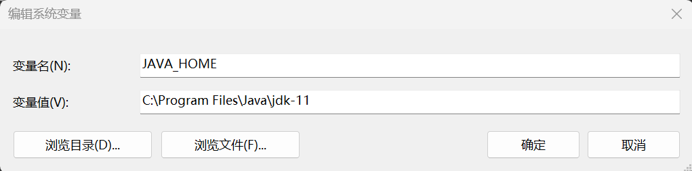
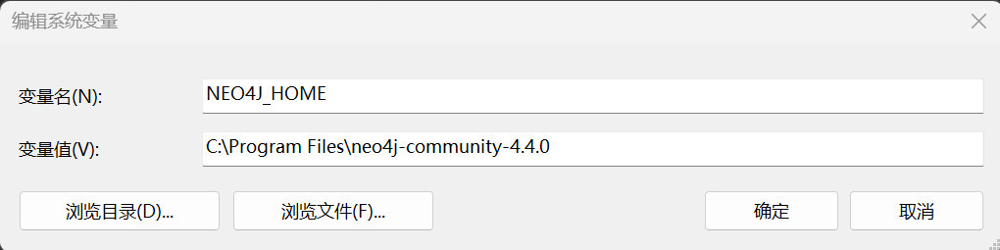
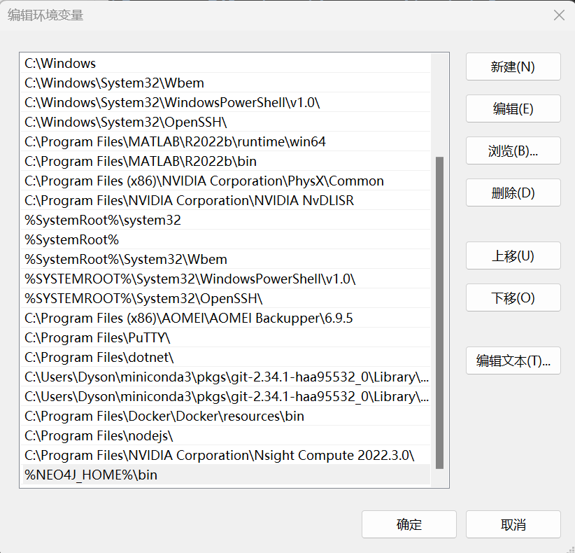
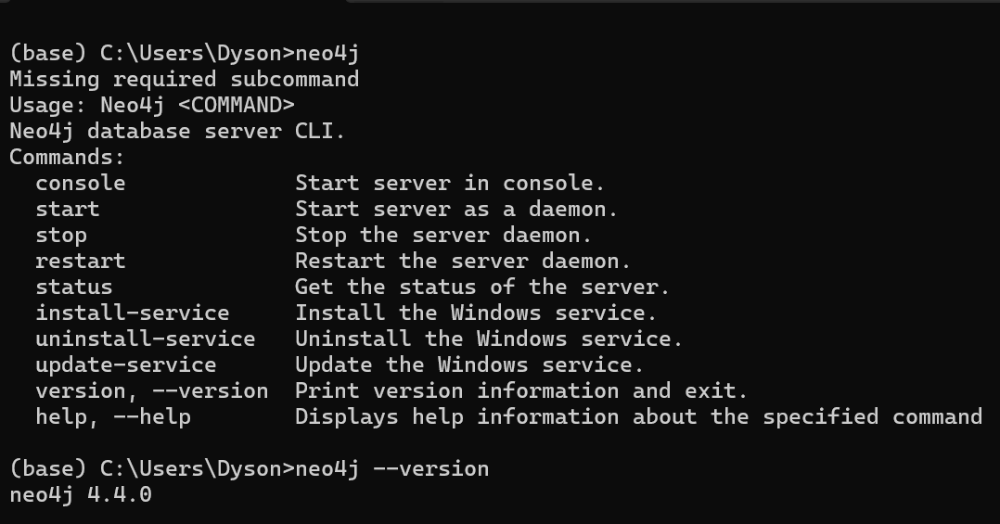
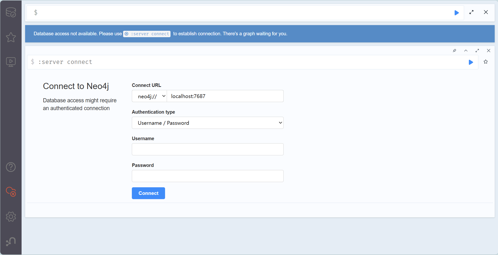
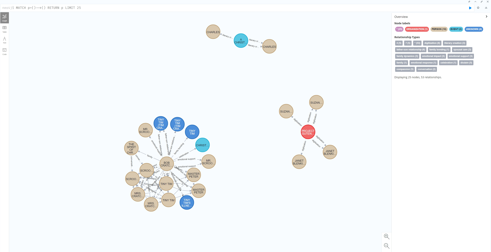

# LIGHTRAG+NEO4J做知识图谱可视化的踩坑记录

*<font style="color:rgb(234, 237, 243);background-color:#FFFFFF;">024年11月23日 |  at 00:00</font>*

***<font style="background-color:#FFFFFF;">注意: 这里主要涉及JDK, Neo4j和APOC，它们之间都有版本对应关系！第一次接触的话，很多设置细节问题需要注意，我搞了好久才弄好，记录下来帮人避坑。</font>***

## <font style="background-color:#FFFFFF;">Table of Content</font>[<font style="background-color:#FFFFFF;">#</font>](https://dysonfreeman.netlify.app/posts/lightragneo4j%E5%81%9A%E5%9B%BE%E8%B0%B1%E5%8F%AF%E8%A7%86%E5%8C%96%E7%9A%84%E8%B8%A9%E5%9D%91%E8%AE%B0%E5%BD%95/#table-of-content)

* [<font style="background-color:#FFFFFF;">0. 版本匹配提醒</font>](https://dysonfreeman.netlify.app/posts/lightragneo4j%E5%81%9A%E5%9B%BE%E8%B0%B1%E5%8F%AF%E8%A7%86%E5%8C%96%E7%9A%84%E8%B8%A9%E5%9D%91%E8%AE%B0%E5%BD%95/#0-%E7%89%88%E6%9C%AC%E5%8C%B9%E9%85%8D%E6%8F%90%E9%86%92)
* [<font style="background-color:#FFFFFF;">1.安装 JDK</font>](https://dysonfreeman.netlify.app/posts/lightragneo4j%E5%81%9A%E5%9B%BE%E8%B0%B1%E5%8F%AF%E8%A7%86%E5%8C%96%E7%9A%84%E8%B8%A9%E5%9D%91%E8%AE%B0%E5%BD%95/#1%E5%AE%89%E8%A3%85-jdk)
  * [<font style="background-color:#FFFFFF;">1.1 下载地址</font>](https://dysonfreeman.netlify.app/posts/lightragneo4j%E5%81%9A%E5%9B%BE%E8%B0%B1%E5%8F%AF%E8%A7%86%E5%8C%96%E7%9A%84%E8%B8%A9%E5%9D%91%E8%AE%B0%E5%BD%95/#11-%E4%B8%8B%E8%BD%BD%E5%9C%B0%E5%9D%80)
  * [<font style="background-color:#FFFFFF;">1.2 安装设置</font>](https://dysonfreeman.netlify.app/posts/lightragneo4j%E5%81%9A%E5%9B%BE%E8%B0%B1%E5%8F%AF%E8%A7%86%E5%8C%96%E7%9A%84%E8%B8%A9%E5%9D%91%E8%AE%B0%E5%BD%95/#12-%E5%AE%89%E8%A3%85%E8%AE%BE%E7%BD%AE)
* [<font style="background-color:#FFFFFF;">2. 安装 NEO4J</font>](https://dysonfreeman.netlify.app/posts/lightragneo4j%E5%81%9A%E5%9B%BE%E8%B0%B1%E5%8F%AF%E8%A7%86%E5%8C%96%E7%9A%84%E8%B8%A9%E5%9D%91%E8%AE%B0%E5%BD%95/#2-%E5%AE%89%E8%A3%85-neo4j)
  * [<font style="background-color:#FFFFFF;">2.1 下载地址</font>](https://dysonfreeman.netlify.app/posts/lightragneo4j%E5%81%9A%E5%9B%BE%E8%B0%B1%E5%8F%AF%E8%A7%86%E5%8C%96%E7%9A%84%E8%B8%A9%E5%9D%91%E8%AE%B0%E5%BD%95/#21-%E4%B8%8B%E8%BD%BD%E5%9C%B0%E5%9D%80)
  * [<font style="background-color:#FFFFFF;">2.2 安装和设置</font>](https://dysonfreeman.netlify.app/posts/lightragneo4j%E5%81%9A%E5%9B%BE%E8%B0%B1%E5%8F%AF%E8%A7%86%E5%8C%96%E7%9A%84%E8%B8%A9%E5%9D%91%E8%AE%B0%E5%BD%95/#22-%E5%AE%89%E8%A3%85%E5%92%8C%E8%AE%BE%E7%BD%AE)
* [<font style="background-color:#FFFFFF;">3. APOC 插件的安装</font>](https://dysonfreeman.netlify.app/posts/lightragneo4j%E5%81%9A%E5%9B%BE%E8%B0%B1%E5%8F%AF%E8%A7%86%E5%8C%96%E7%9A%84%E8%B8%A9%E5%9D%91%E8%AE%B0%E5%BD%95/#3-apoc-%E6%8F%92%E4%BB%B6%E7%9A%84%E5%AE%89%E8%A3%85)
  * [<font style="background-color:#FFFFFF;">3.1 下载和放置位置</font>](https://dysonfreeman.netlify.app/posts/lightragneo4j%E5%81%9A%E5%9B%BE%E8%B0%B1%E5%8F%AF%E8%A7%86%E5%8C%96%E7%9A%84%E8%B8%A9%E5%9D%91%E8%AE%B0%E5%BD%95/#31-%E4%B8%8B%E8%BD%BD%E5%92%8C%E6%94%BE%E7%BD%AE%E4%BD%8D%E7%BD%AE)
  * [<font style="background-color:#FFFFFF;">3.2 设置!!!很重要</font>](https://dysonfreeman.netlify.app/posts/lightragneo4j%E5%81%9A%E5%9B%BE%E8%B0%B1%E5%8F%AF%E8%A7%86%E5%8C%96%E7%9A%84%E8%B8%A9%E5%9D%91%E8%AE%B0%E5%BD%95/#32-%E8%AE%BE%E7%BD%AE%E5%BE%88%E9%87%8D%E8%A6%81)
* [<font style="background-color:#FFFFFF;">4. 跑起来！</font>](https://dysonfreeman.netlify.app/posts/lightragneo4j%E5%81%9A%E5%9B%BE%E8%B0%B1%E5%8F%AF%E8%A7%86%E5%8C%96%E7%9A%84%E8%B8%A9%E5%9D%91%E8%AE%B0%E5%BD%95/#4-%E8%B7%91%E8%B5%B7%E6%9D%A5)
  * [<font style="background-color:#FFFFFF;">4.1 安装并启动Neo4j服务</font>](https://dysonfreeman.netlify.app/posts/lightragneo4j%E5%81%9A%E5%9B%BE%E8%B0%B1%E5%8F%AF%E8%A7%86%E5%8C%96%E7%9A%84%E8%B8%A9%E5%9D%91%E8%AE%B0%E5%BD%95/#41-%E5%AE%89%E8%A3%85%E5%B9%B6%E5%90%AF%E5%8A%A8neo4j%E6%9C%8D%E5%8A%A1)
  * [<font style="background-color:#FFFFFF;">4.2 服务页面的配置</font>](https://dysonfreeman.netlify.app/posts/lightragneo4j%E5%81%9A%E5%9B%BE%E8%B0%B1%E5%8F%AF%E8%A7%86%E5%8C%96%E7%9A%84%E8%B8%A9%E5%9D%91%E8%AE%B0%E5%BD%95/#42-%E6%9C%8D%E5%8A%A1%E9%A1%B5%E9%9D%A2%E7%9A%84%E9%85%8D%E7%BD%AE)
  * [<font style="background-color:#FFFFFF;">4.3 展现LightRAG构建的图谱</font>](https://dysonfreeman.netlify.app/posts/lightragneo4j%E5%81%9A%E5%9B%BE%E8%B0%B1%E5%8F%AF%E8%A7%86%E5%8C%96%E7%9A%84%E8%B8%A9%E5%9D%91%E8%AE%B0%E5%BD%95/#43-%E5%B1%95%E7%8E%B0lightrag%E6%9E%84%E5%BB%BA%E7%9A%84%E5%9B%BE%E8%B0%B1)

## <font style="background-color:#FFFFFF;">0. 版本匹配提醒</font>[<font style="background-color:#FFFFFF;">#</font>](https://dysonfreeman.netlify.app/posts/lightragneo4j%E5%81%9A%E5%9B%BE%E8%B0%B1%E5%8F%AF%E8%A7%86%E5%8C%96%E7%9A%84%E8%B8%A9%E5%9D%91%E8%AE%B0%E5%BD%95/#0-%E7%89%88%E6%9C%AC%E5%8C%B9%E9%85%8D%E6%8F%90%E9%86%92)

* <font style="background-color:#FFFFFF;">依赖关系：JDK <- Neo4j <- APOC</font>
* <font style="background-color:#FFFFFF;">简单理解：JDK版本决定Neo4j的版本，而APOC作为Neo4j的插件，又要去适配Neo4j的版本。可以根据情况自行选择和匹配。</font>
* <font style="background-color:#FFFFFF;">我的选择： · JDK：11 · Neo4j：4.4.0.x (我选的是4.4.0.25) · APOC：4.4.0</font>

## <font style="background-color:#FFFFFF;">1.安装 JDK</font>[<font style="background-color:#FFFFFF;">#</font>](https://dysonfreeman.netlify.app/posts/lightragneo4j%E5%81%9A%E5%9B%BE%E8%B0%B1%E5%8F%AF%E8%A7%86%E5%8C%96%E7%9A%84%E8%B8%A9%E5%9D%91%E8%AE%B0%E5%BD%95/#1%E5%AE%89%E8%A3%85-jdk)

### *<font style="background-color:#FFFFFF;">1.1 下载地址</font>*[*<font style="background-color:#FFFFFF;">#</font>*](https://dysonfreeman.netlify.app/posts/lightragneo4j%E5%81%9A%E5%9B%BE%E8%B0%B1%E5%8F%AF%E8%A7%86%E5%8C%96%E7%9A%84%E8%B8%A9%E5%9D%91%E8%AE%B0%E5%BD%95/#11-%E4%B8%8B%E8%BD%BD%E5%9C%B0%E5%9D%80)

***<font style="background-color:#FFFFFF;">我用的是4.4.0.x版本的</font>**\_\_**<font style="background-color:#FFFFFF;"> </font>***<code>_**<font style="background-color:#FFFFFF;">Neo4j</font>**_</code>***<font style="background-color:#FFFFFF;">，因此需要下载</font>***<code>_**<font style="background-color:#FFFFFF;">JDK11</font>**_</code>***<font style="background-color:#FFFFFF;">，其它的各位可以自己确定一下。反正我是换了</font>***<code>_**<font style="background-color:#FFFFFF;">Neo4j</font>**_</code>***<font style="background-color:#FFFFFF;">之后运行不了，错误提示里面告诉我需要JDK11的，大不了看错误提示改一下。</font>***

1. [<font style="background-color:#FFFFFF;">JDK11官方下载</font>](https://www.oracle.com/cn/java/technologies/javase/jdk11-archive-downloads.html)<font style="background-color:#FFFFFF;"> </font><font style="background-color:#FFFFFF;">建议使用官网下载，但是需要注册和邮箱激活！</font>
2. [<font style="background-color:#FFFFFF;">OpenJDK Downloads | Download Java JDK 8, 11, 17, & 21 | OpenLogic</font>](https://www.openlogic.com/openjdk-downloads?field_java_parent_version_target_id=406\&field_operating_system_target_id=436\&field_architecture_target_id=391\&field_java_package_target_id=396)<font style="background-color:#FFFFFF;"> </font><font style="background-color:#FFFFFF;">这个没有测试过，可能是开源版本的JDK？据说可以平替（自行验证，我不负责</font><font style="background-color:#FFFFFF;">🤪</font><font style="background-color:#FFFFFF;">）</font>

### *<font style="background-color:#FFFFFF;">1.2 安装设置</font>*[*<font style="background-color:#FFFFFF;">#</font>*](https://dysonfreeman.netlify.app/posts/lightragneo4j%E5%81%9A%E5%9B%BE%E8%B0%B1%E5%8F%AF%E8%A7%86%E5%8C%96%E7%9A%84%E8%B8%A9%E5%9D%91%E8%AE%B0%E5%BD%95/#12-%E5%AE%89%E8%A3%85%E8%AE%BE%E7%BD%AE)

<font style="background-color:#FFFFFF;">正常点击安装完成后，需要设置一下环境变量。在“系统变量”中添加：</font>

* <font style="background-color:#FFFFFF;">变量名(N):</font><code>**<font style="background-color:#FFFFFF;">JAVA_HOME</font>**</code>
* <font style="background-color:#FFFFFF;">变量值(V):</font><code>**<font style="background-color:#FFFFFF;">C:\Program Files\Java\jdk-11</font>**</code><font style="background-color:#FFFFFF;"> 当然，变量值那里要换成自己电脑上</font><code>**<font style="background-color:#FFFFFF;">JDK</font>**</code><font style="background-color:#FFFFFF;">的安装位置！</font>

## <font style="background-color:#FFFFFF;">2. 安装 NEO4J</font>[<font style="background-color:#FFFFFF;">#</font>](https://dysonfreeman.netlify.app/posts/lightragneo4j%E5%81%9A%E5%9B%BE%E8%B0%B1%E5%8F%AF%E8%A7%86%E5%8C%96%E7%9A%84%E8%B8%A9%E5%9D%91%E8%AE%B0%E5%BD%95/#2-%E5%AE%89%E8%A3%85-neo4j)

***<font style="background-color:#FFFFFF;">因为大部分资料是基于Community版本的Neo4j，因此这里也选择Community，但是桌面版（Desktop）也可以共存，感兴趣的话可以自行研究一下。</font>***

### *<font style="background-color:#FFFFFF;">2.1 下载地址</font>*[*<font style="background-color:#FFFFFF;">#</font>*](https://dysonfreeman.netlify.app/posts/lightragneo4j%E5%81%9A%E5%9B%BE%E8%B0%B1%E5%8F%AF%E8%A7%86%E5%8C%96%E7%9A%84%E8%B8%A9%E5%9D%91%E8%AE%B0%E5%BD%95/#21-%E4%B8%8B%E8%BD%BD%E5%9C%B0%E5%9D%80)

[<font style="background-color:#FFFFFF;">Index of /doc/neo4j/</font>](https://we-yun.com/doc/neo4j/)<font style="background-color:#FFFFFF;"> </font><font style="background-color:#FFFFFF;">自行选择版本下载即可，但是再次提醒，它和</font><code>**<font style="background-color:#FFFFFF;">APOC</font>**</code><font style="background-color:#FFFFFF;">版本之间是有对应的，一定要选择匹配的版本，省的像我一样返工！ 我选择了</font><code>**<font style="background-color:#FFFFFF;">4.4.0</font>**</code><font style="background-color:#FFFFFF;">版。（下表是</font><code>**<font style="background-color:#FFFFFF;">NEO4J</font>**</code><font style="background-color:#FFFFFF;">和</font><code>**<font style="background-color:#FFFFFF;">APOC</font>**</code><font style="background-color:#FFFFFF;">的版本兼容表，来源于</font><code>**<font style="background-color:#FFFFFF;">APOC</font>**</code><font style="background-color:#FFFFFF;">官方页面）</font>

| **<font style="background-color:#FFFFFF;">apoc version</font>** | **<font style="background-color:#FFFFFF;">neo4j version</font>** |
| --- | --- |
| [<font style="background-color:#FFFFFF;">4.4.0.1</font>](https://github.com/neo4j-contrib/neo4j-apoc-procedures/releases/4.4.0.1) | <font style="background-color:#FFFFFF;">4.4.0 (4.3.x)</font> |
| [<font style="background-color:#FFFFFF;">4.3.0.4</font>](https://github.com/neo4j-contrib/neo4j-apoc-procedures/releases/4.3.0.4) | <font style="background-color:#FFFFFF;">4.3.7 (4.3.x)</font> |
| [<font style="background-color:#FFFFFF;">4.2.0.9</font>](https://github.com/neo4j-contrib/neo4j-apoc-procedures/releases/4.2.0.9) | <font style="background-color:#FFFFFF;">4.2.11 (4.2.x)</font> |
| [<font style="background-color:#FFFFFF;">4.1.0.10</font>](https://github.com/neo4j-contrib/neo4j-apoc-procedures/releases/4.1.0.10) | <font style="background-color:#FFFFFF;">4.1.11 (4.1.x)</font> |
| [<font style="background-color:#FFFFFF;">4.0.0.18</font>](https://github.com/neo4j-contrib/neo4j-apoc-procedures/releases/4.0.0.18) | <font style="background-color:#FFFFFF;">4.0.12 (4.0.x)</font> |
| [<font style="background-color:#FFFFFF;">3.5.0.15</font>](https://github.com/neo4j-contrib/neo4j-apoc-procedures/releases/3.5.0.15) | <font style="background-color:#FFFFFF;">3.5.30 (3.5.x)</font> |
| [<font style="background-color:#FFFFFF;">3.4.0.8</font>](https://github.com/neo4j-contrib/neo4j-apoc-procedures/releases/3.4.0.8) | <font style="background-color:#FFFFFF;">3.4.18 (3.4.x)</font> |
| [<font style="background-color:#FFFFFF;">3.3.0.4</font>](https://github.com/neo4j-contrib/neo4j-apoc-procedures/releases/3.3.0.4) | <font style="background-color:#FFFFFF;">3.3.9 (3.3.x)</font> |
| [<font style="background-color:#FFFFFF;">3.2.3.6</font>](https://github.com/neo4j-contrib/neo4j-apoc-procedures/releases/3.2.3.6) | <font style="background-color:#FFFFFF;">3.2.14 (3.2.x)</font> |
| [<font style="background-color:#FFFFFF;">3.1.3.9</font>](https://github.com/neo4j-contrib/neo4j-apoc-procedures/releases/3.1.3.9) | <font style="background-color:#FFFFFF;">3.1.9 (3.1.x)</font> |
| [<font style="background-color:#FFFFFF;">3.0.8.6</font>](https://github.com/neo4j-contrib/neo4j-apoc-procedures/releases/3.0.8.6) | <font style="background-color:#FFFFFF;">3.0.12 (3.0.x)</font> |
| [<font style="background-color:#FFFFFF;">3.5.0.0</font>](https://github.com/neo4j-contrib/neo4j-apoc-procedures/releases/3.5.0.0) | <font style="background-color:#FFFFFF;">3.5.0-beta01</font> |
| [<font style="background-color:#FFFFFF;">3.4.0.2</font>](https://github.com/neo4j-contrib/neo4j-apoc-procedures/releases/3.4.0.2) | <font style="background-color:#FFFFFF;">3.4.5</font> |
| [<font style="background-color:#FFFFFF;">3.3.0.3</font>](https://github.com/neo4j-contrib/neo4j-apoc-procedures/releases/3.3.0.3) | <font style="background-color:#FFFFFF;">3.3.5</font> |
| [<font style="background-color:#FFFFFF;">3.2.3.5</font>](https://github.com/neo4j-contrib/neo4j-apoc-procedures/releases/3.2.3.5) | <font style="background-color:#FFFFFF;">3.2.3</font> |
| [<font style="background-color:#FFFFFF;">3.1.3.8</font>](https://github.com/neo4j-contrib/neo4j-apoc-procedures/releases/3.1.3.8) | <font style="background-color:#FFFFFF;">3.1.5</font> |

### *<font style="background-color:#FFFFFF;">2.2 安装和设置</font>*[*<font style="background-color:#FFFFFF;">#</font>*](https://dysonfreeman.netlify.app/posts/lightragneo4j%E5%81%9A%E5%9B%BE%E8%B0%B1%E5%8F%AF%E8%A7%86%E5%8C%96%E7%9A%84%E8%B8%A9%E5%9D%91%E8%AE%B0%E5%BD%95/#22-%E5%AE%89%E8%A3%85%E5%92%8C%E8%AE%BE%E7%BD%AE)

<font style="background-color:#FFFFFF;">Community社区版是个zip文件，因此只要选个目标位置解压就可以了，我选择如下位置：</font>

```plain
C:\Program Files\neo4j-community-4.4.0
```

<font style="background-color:#FFFFFF;">接下来就是添加环境变量了，包括两个操作：</font>

1. <font style="background-color:#FFFFFF;">在“系统变量”中添加</font><code>**<font style="background-color:#FFFFFF;">NEO4J_HOME</font>**</code><font style="background-color:#FFFFFF;">，直接上图：</font>
2. <font style="background-color:#FFFFFF;">在“系统变量”的</font><code>**<font style="background-color:#FFFFFF;">Path</font>**</code><font style="background-color:#FFFFFF;">变量中，增加一项： </font><code>**<font style="background-color:#FFFFFF;">%NEO4J_HOME%\bin</font>**</code><font style="background-color:#FFFFFF;">两项完成之后，你打开命令行窗口，输入</font><code>**<font style="background-color:#FFFFFF;">neo4j</font>**</code><font style="background-color:#FFFFFF;">，应该就能可以看到下图这样的回应了，凡是提示找不到命令之类的，都是环境变量设置的问题，对比上面改就是了！也可以查询一下版本：</font>

```plain
neo4j --version
```



## <font style="background-color:#FFFFFF;">3. APOC 插件的安装</font>[<font style="background-color:#FFFFFF;">#</font>](https://dysonfreeman.netlify.app/posts/lightragneo4j%E5%81%9A%E5%9B%BE%E8%B0%B1%E5%8F%AF%E8%A7%86%E5%8C%96%E7%9A%84%E8%B8%A9%E5%9D%91%E8%AE%B0%E5%BD%95/#3-apoc-%E6%8F%92%E4%BB%B6%E7%9A%84%E5%AE%89%E8%A3%85)

### *<font style="background-color:#FFFFFF;">3.1 下载和放置位置</font>*[*<font style="background-color:#FFFFFF;">#</font>*](https://dysonfreeman.netlify.app/posts/lightragneo4j%E5%81%9A%E5%9B%BE%E8%B0%B1%E5%8F%AF%E8%A7%86%E5%8C%96%E7%9A%84%E8%B8%A9%E5%9D%91%E8%AE%B0%E5%BD%95/#31-%E4%B8%8B%E8%BD%BD%E5%92%8C%E6%94%BE%E7%BD%AE%E4%BD%8D%E7%BD%AE)

<font style="background-color:#FFFFFF;">国内下载，用</font>[<font style="background-color:#FFFFFF;">这个链接</font>](http://doc.we-yun.com:1008/doc/neo4j-apoc/)<font style="background-color:#FFFFFF;">，你懂的。根据版本的匹配关系，我选了个匹配我的</font><code>**<font style="background-color:#FFFFFF;">Neo4j</font>**</code><font style="background-color:#FFFFFF;">版本</font><code>**<font style="background-color:#FFFFFF;">APOC 4.4.0.1</font>**</code><font style="background-color:#FFFFFF;">。里面有好几个，但最好下载</font><code>**<font style="background-color:#FFFFFF;">apoc-4.4.0.1-all</font>**</code><font style="background-color:#FFFFFF;">这个，因为这是最全的，避免后面又出幺蛾子。下载后放在你</font><code>**<font style="background-color:#FFFFFF;">Neo4j</font>**</code><font style="background-color:#FFFFFF;">文件夹下的</font><code>**<font style="background-color:#FFFFFF;">plugins</font>**</code><font style="background-color:#FFFFFF;">子文件夹下就可以了。以下是我的：</font>

```plain
C:\Program Files\neo4j-community-4.4.0\plugins
```

### *<font style="background-color:#FFFFFF;">3.2 设置!!!很重要</font>*[*<font style="background-color:#FFFFFF;">#</font>*](https://dysonfreeman.netlify.app/posts/lightragneo4j%E5%81%9A%E5%9B%BE%E8%B0%B1%E5%8F%AF%E8%A7%86%E5%8C%96%E7%9A%84%E8%B8%A9%E5%9D%91%E8%AE%B0%E5%BD%95/#32-%E8%AE%BE%E7%BD%AE%E5%BE%88%E9%87%8D%E8%A6%81)

<font style="background-color:#FFFFFF;">APOC只是下载了放在那是不会起作用的，当你运行</font><code>**<font style="background-color:#FFFFFF;">LightRAG</font>**</code><font style="background-color:#FFFFFF;">显示构建的图谱时，会一直报找不到</font><code>**<font style="background-color:#FFFFFF;">apoc</font>**</code><font style="background-color:#FFFFFF;">，必须要进行配置才可以。根据网上搜到的若干帖子，直接照抄过来都无法成功，经过反复测试，下面这两个改动部分按我的来就可以了。 找到</font><code>**<font style="background-color:#FFFFFF;">C:\Program Files\neo4j-community-4.4.0\conf</font>**</code><font style="background-color:#FFFFFF;">文件夹下</font><code>**<font style="background-color:#FFFFFF;">neo4j.conf</font>**</code><font style="background-color:#FFFFFF;">文件，在其中定位到如下被注释掉的两行（这两行不相邻，但很近）：</font>

```plain
#dbms.security.procedures.unrestricted=my.extensions.example,my.procedures.*
#dbms.security.procedures.allowlist=apoc.coll.*,apoc.load.*,gds.*
```

<font style="background-color:rgb(33, 39, 55);"></font><font style="background-color:#FFFFFF;">它们改成如下的样子，并取消注释：</font>

```plain
dbms.security.procedures.unrestricted=apoc.*
dbms.security.procedures.allowlist=apoc.*
```

<font style="background-color:rgb(33, 39, 55);"></font><font style="background-color:#FFFFFF;">其是</font>**<font style="background-color:#FFFFFF;">最后一行</font>**<font style="background-color:#FFFFFF;">，就是我一直按网上帖子改不成功的原因。因为</font><code>**<font style="background-color:#FFFFFF;">LightRAG</font>**</code><font style="background-color:#FFFFFF;">好像使用了</font><code>**<font style="background-color:#FFFFFF;">apoc</font>**</code><font style="background-color:#FFFFFF;">的某个方法，但这里按原来写法，只放开了</font><code>**<font style="background-color:#FFFFFF;">apoc.coll.*</font>**</code><font style="background-color:#FFFFFF;">和</font><code>**<font style="background-color:#FFFFFF;">apoc.load.*</font>**</code><font style="background-color:#FFFFFF;">两个方法，所以一直报错找不到，我这里就把</font><code>**<font style="background-color:#FFFFFF;">apoc</font>**</code><font style="background-color:#FFFFFF;">下面的全放开了。 然后，应该就可以放心的启动</font><code>**<font style="background-color:#FFFFFF;">Neo4j</font>**</code><font style="background-color:#FFFFFF;">的服务了！</font>

## <font style="background-color:#FFFFFF;">4. 跑起来！</font>[<font style="background-color:#FFFFFF;">#</font>](https://dysonfreeman.netlify.app/posts/lightragneo4j%E5%81%9A%E5%9B%BE%E8%B0%B1%E5%8F%AF%E8%A7%86%E5%8C%96%E7%9A%84%E8%B8%A9%E5%9D%91%E8%AE%B0%E5%BD%95/#4-%E8%B7%91%E8%B5%B7%E6%9D%A5)

### *<font style="background-color:#FFFFFF;">4.1 安装并启动Neo4j服务</font>*[*<font style="background-color:#FFFFFF;">#</font>*](https://dysonfreeman.netlify.app/posts/lightragneo4j%E5%81%9A%E5%9B%BE%E8%B0%B1%E5%8F%AF%E8%A7%86%E5%8C%96%E7%9A%84%E8%B8%A9%E5%9D%91%E8%AE%B0%E5%BD%95/#41-%E5%AE%89%E8%A3%85%E5%B9%B6%E5%90%AF%E5%8A%A8neo4j%E6%9C%8D%E5%8A%A1)

<font style="background-color:#FFFFFF;">管理员模式打开命令行窗口，然后输入：</font>

```plain
neo4j install-serive
```

<font style="background-color:#FFFFFF;">接下来就可以启动服务了，两个方式：</font>

* <code>**<font style="background-color:#FFFFFF;">neo4j console</font>**</code><font style="background-color:#FFFFFF;">：带状态反馈信息的启动，你可以在窗口看到服务状态信息，结束关闭需要</font><code>**<font style="background-color:#FFFFFF;">Ctrl+C</font>**</code><font style="background-color:#FFFFFF;">终止进程；</font>
* <code>**<font style="background-color:#FFFFFF;">neo4j start</font>**</code><font style="background-color:#FFFFFF;">：不带状态，直接启动，可以在同一个窗口使用</font><code>**<font style="background-color:#FFFFFF;">neo4j stop</font>**</code><font style="background-color:#FFFFFF;">来终止进程。 之后，启动成功后，会出现下面的提示，这是用第一个方式启动的：</font>

```plain
C:\Windows\System32>neo4j console
Directories in use:
home:         C:\Program Files\neo4j-community-4.4.0
config:       C:\Program Files\neo4j-community-4.4.0\conf
logs:         C:\Program Files\neo4j-community-4.4.0\logs
plugins:      C:\Program Files\neo4j-community-4.4.0\plugins
import:       C:\Program Files\neo4j-community-4.4.0\import
data:         C:\Program Files\neo4j-community-4.4.0\data
certificates: C:\Program Files\neo4j-community-4.4.0\certificates
licenses:     C:\Program Files\neo4j-community-4.4.0\licenses
run:          C:\Program Files\neo4j-community-4.4.0\run
Starting Neo4j.
2024-11-22 15:51:30.878+0000 INFO  Starting...
2024-11-22 15:51:31.453+0000 INFO  This instance is ServerId{baa33dc0} (baa33dc0-ad7c-4169-bd41-55a5d4c46e31)
2024-11-22 15:51:32.138+0000 INFO  ======== Neo4j 4.4.0 ========
2024-11-22 15:51:36.236+0000 INFO  Performing postInitialization step for component 'security-users' with version 3 and status CURRENT
2024-11-22 15:51:36.236+0000 INFO  Updating the initial password in component 'security-users'
2024-11-22 15:51:37.110+0000 INFO  Called db.clearQueryCaches(): Query cache already empty.
2024-11-22 15:51:37.472+0000 INFO  Bolt enabled on kubernetes.docker.internal:7687.
2024-11-22 15:51:37.896+0000 INFO  Remote interface available at http://localhost:7474/
2024-11-22 15:51:37.898+0000 INFO  id: 8C6AA1531BE4544853FE5EBC28F2E483EEEECFE841379E6A844F0B7C174E9384
2024-11-22 15:51:37.899+0000 INFO  name: system
2024-11-22 15:51:37.899+0000 INFO  creationDate: 2024-11-22T14:14:10.777Z
2024-11-22 15:51:37.899+0000 INFO  Started.
Copy
```

### *<font style="background-color:#FFFFFF;">4.2 服务页面的配置</font>*[*<font style="background-color:#FFFFFF;">#</font>*](https://dysonfreeman.netlify.app/posts/lightragneo4j%E5%81%9A%E5%9B%BE%E8%B0%B1%E5%8F%AF%E8%A7%86%E5%8C%96%E7%9A%84%E8%B8%A9%E5%9D%91%E8%AE%B0%E5%BD%95/#42-%E6%9C%8D%E5%8A%A1%E9%A1%B5%E9%9D%A2%E7%9A%84%E9%85%8D%E7%BD%AE)

<font style="background-color:#FFFFFF;">根据上面提示打开</font><code>**<font style="background-color:#FFFFFF;">http://localhost:7474</font>**</code><font style="background-color:#FFFFFF;">，就能够呈现这个页面：</font><font style="background-color:#FFFFFF;">首次需要连接到Neo4j的服务页面，在上面填写信息,初始用户和密码如下：</font>

* <font style="background-color:#FFFFFF;">Username: neo4j</font>
* <font style="background-color:#FFFFFF;">Password: neo4j 接着就是要求你改密码，按要求改就是了！然后就可以登录到新的页面：</font><font style="background-color:#FFFFFF;">不放心可以用下面的命令测试一下：</font>

```plain
neo4j$ return apoc.version()
```

<font style="background-color:#FFFFFF;">应该能够成功返回你之前下载的</font><code>**<font style="background-color:#FFFFFF;">apoc</font>**</code><font style="background-color:#FFFFFF;">版本号。</font>

### *<font style="background-color:rgb(33, 39, 55);">4</font>\_\_<font style="background-color:#FFFFFF;">.3 展现LightRAG构建的图谱</font>*[*<font style="background-color:#FFFFFF;">#</font>*](https://dysonfreeman.netlify.app/posts/lightragneo4j%E5%81%9A%E5%9B%BE%E8%B0%B1%E5%8F%AF%E8%A7%86%E5%8C%96%E7%9A%84%E8%B8%A9%E5%9D%91%E8%AE%B0%E5%BD%95/#43-%E5%B1%95%E7%8E%B0lightrag%E6%9E%84%E5%BB%BA%E7%9A%84%E5%9B%BE%E8%B0%B1)

<font style="background-color:#FFFFFF;">关于LightRAG怎么部署和使用，以后有机会再单独说吧，按照官网的指导就可以完成构建。这里展示的是在完成LightRAG的构建之后，会生成一系列文件，我们把它对接到刚刚部署的</font><code>**<font style="background-color:#FFFFFF;">Neo4j</font>**</code><font style="background-color:#FFFFFF;">中进行展示。在</font><code>**<font style="background-color:#FFFFFF;">(lightrag) C:\Users\Dyson\Documents\LightRAG\examples></font>**</code><font style="background-color:#FFFFFF;">目录下，先修改一下</font><code>**<font style="background-color:#FFFFFF;">graph_visual_with_neo4j.py</font>**</code><font style="background-color:#FFFFFF;">中关于登录页面的验证，就是改成之前设置的用户名和密码：</font>

```plain
# Neo4j connection credentials
NEO4J_URI = "neo4j://localhost:7687"
NEO4J_USERNAME = "neo4j"
NEO4J_PASSWORD = "YOU_PASSWORD"
```

<font style="background-color:#FFFFFF;">然后运行:</font>

```plain
python graph_visual_with_neo4j.py
```

<font style="background-color:#FFFFFF;">大功告成！</font><font style="background-color:#FFFFFF;">如果出现：</font>

```plain
Error occurred: {code: Neo.ClientError.Security.Unauthorized} {message: The client is unauthorized due to authentication failure.}
```

<font style="color:#000000;background-color:#FFFFFF;">说明刚才的密码设置不对！去改过来就可以了。</font>


> 更新: 2025-01-02 09:08:57  
> 原文: <https://www.yuque.com/lixinsi/vnere7/ogmlg04giv670dzb>