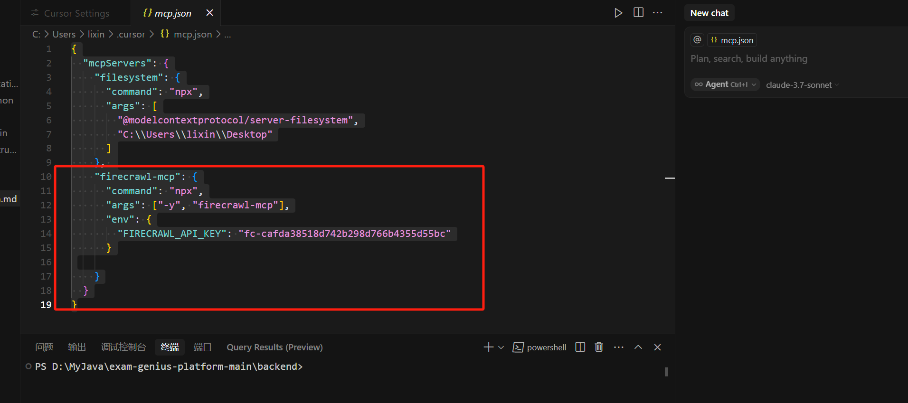

# MCP配置

### 安装 nodejs 环境
[https://nodejs.org/en/download/](https://nodejs.org/en/download/)

### 1.filesystem 
```python
{
  "mcpServers": {
    "filesystem": {
      "command": "npx",
      "args": [
        "@modelcontextprotocol/server-filesystem",
        "C:\\Users\\lixin\\Desktop"
      ]
    }, 
    "firecrawl-mcp": {
      "command": "npx",
      "args": ["-y", "firecrawl-mcp"],
      "env": {
        "FIRECRAWL_API_KEY": "fc-cafda38518d742b298d766b4355d55bc"
      }

    }
  }
}
```

### 2.firecrawl-mcp
获取 key

[https://www.firecrawl.dev/app/api-keys](https://www.firecrawl.dev/app/api-keys)

开源项目

[https://github.com/mendableai/firecrawl-mcp-server?tab=readme-ov-file](https://github.com/mendableai/firecrawl-mcp-server?tab=readme-ov-file)

配置文件

```python
{
  "mcpServers": {
    "filesystem": {
      "command": "npx",
      "args": [
        "@modelcontextprotocol/server-filesystem",
        "C:\\Users\\lixin\\Desktop"
      ]
    }, 
    "firecrawl-mcp": {
      "command": "npx",
      "args": ["-y", "firecrawl-mcp"],
      "env": {
        "FIRECRAWL_API_KEY": "fc-cafda38518d742b298d766b4355d55bc"
      }

    }
  }
}
```



### 3.Figma-Context-MCP
开源地址：[https://github.com/GLips/Figma-Context-MCP](https://github.com/GLips/Figma-Context-MCP)


> 更新: 2025-04-13 10:12:04  
> 原文: <https://www.yuque.com/lixinsi/vnere7/pqr6yh915of5u9n2>