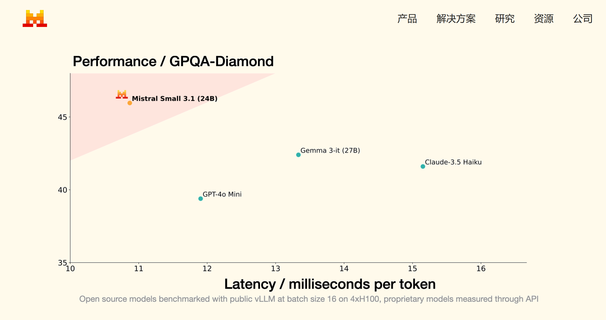
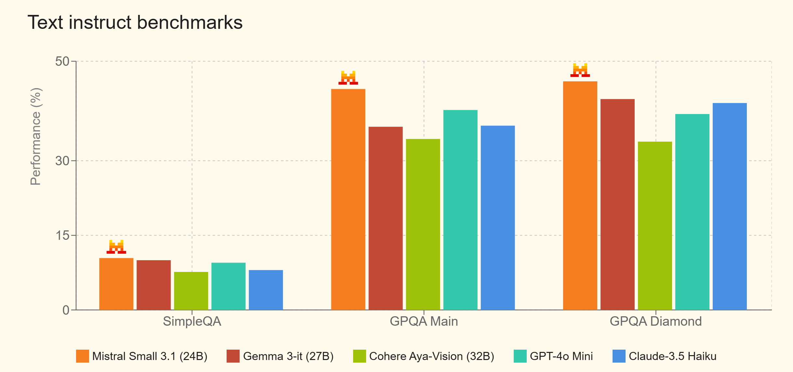

# Mistral Small 3.1 发布！堪称同重量级别中最好的AI型号！！完全开源

<font style="color:rgb(78, 83, 88);">Mistral Small 3.1 已经正式发布！完全免费开源，具有更先进的文本性能、多模式理解和高达 128k 个标记的扩展上下文窗口。该模型的表现优于 Gemma 3 和 GPT-4o Mini 等同类模型，同时提供每秒 150 个标记的推理速度。</font>



<font style="color:rgb(78, 83, 88);">现代 AI 应用程序需要多种功能（处理文本、理解多模式输入、支持多种语言以及管理长上下文），同时还要具有低延迟和成本效益。如下所示，Mistral Small 3.1 是第一个不仅满足而且实际上超越了领先的小型专有模型在所有这些维度上的性能的开源模型。</font>

<font style="color:rgb(78, 83, 88);">下面您将找到有关模型性能的更多详细信息。只要有可能，我们就会显示其他提供商之前报告的数字，否则我们会通过我们的通用评估工具来评估模型。</font>

#### <font style="color:rgb(78, 83, 88);">文本基准评分</font>


<font style="color:rgb(78, 83, 88);">Mistral Small 3.1 可用于需要多模式理解的各种企业和消费者应用程序，例如文档验证、诊断、设备上图像处理、质量检查的视觉检查、安全系统中的物体检测、基于图像的客户支持和通用协助。</font>

**<font style="color:rgb(255, 0, 0);">本地部署教程：</font>**

<font style="color:rgb(78, 83, 88);">1、通过Ollama客户端快速部署 【</font>[点击下载](https://ollama.com/)<font style="color:rgb(78, 83, 88);">】</font>

<font style="color:rgb(78, 83, 88);">2、一键部署命令：</font>

<font style="color:rgb(78, 83, 88);">24B模型</font>

```plain
ollama run MHKetbi/Mistral-Small3.1-24B-Instruct-2503
```

<font style="color:rgb(78, 83, 88);">量化版，适合小显存的显卡</font>

<font style="color:rgb(78, 83, 88);">【</font>[点击前往](https://ollama.com/MHKetbi/Mistral-Small3.1-24B-Instruct-2503/tags)<font style="color:rgb(78, 83, 88);">】</font>

<font style="color:rgb(78, 83, 88);">3、WebUI 调用本地 Mistral Small 3.1 AI模型 【</font>[点击安装](https://chromewebstore.google.com/detail/page-assist-%E6%9C%AC%E5%9C%B0-ai-%E6%A8%A1%E5%9E%8B%E7%9A%84-web/jfgfiigpkhlkbnfnbobbkinehhfdhndo?pli=1)<font style="color:rgb(78, 83, 88);">】，方便大家使用，支持Chrome、Edge等浏览器。</font>

## <font style="color:rgb(78, 83, 88);">主要特性和功能</font>
+ <font style="color:rgb(78, 83, 88);">轻量级：Mistral Small 3.1 可以在单个 RTX 4090 或具有 32GB RAM 的 Mac 上运行。这使其非常适合设备上的使用情况。</font>
+ <font style="color:rgb(78, 83, 88);">快速响应对话帮助：非常适合虚拟助手和其他需要快速、准确响应的应用程序。 </font>
+ <font style="color:rgb(78, 83, 88);">低延迟函数调用：能够在自动化或代理工作流程中快速执行函数</font>
+ <font style="color:rgb(78, 83, 88);">针对专业领域进行微调：Mistral Small 3.1 可以针对特定领域进行微调，打造精准的主题专家。这在法律咨询、医疗诊断和技术支持等领域尤其有用。</font>
+ <font style="color:rgb(78, 83, 88);">高级推理的基础：社区在开放的 Mistral 模型之上构建模型的方式继续给我们留下深刻印象。仅在过去几周，我们就看到了几个基于 Mistral Small 3 构建的出色推理模型，例如Nous Research 的DeepHermes 24B。为此，我们发布了 Mistral Small 3.1 的基础和指令检查点，以便进一步对模型进行下游定制。</font>

<font style="color:rgb(78, 83, 88);"></font>

<font style="color:rgb(78, 83, 88);">没有GPU的用户也不用担心，你完全可以在Mistral 官方平台上使用，上面也是满血版【</font>[点击前往](https://chat.mistral.ai/chat)<font style="color:rgb(78, 83, 88);">】</font>


> 更新: 2025-03-22 12:29:10  
> 原文: <https://www.yuque.com/lixinsi/vnere7/pbcvz030rmttfpqv>