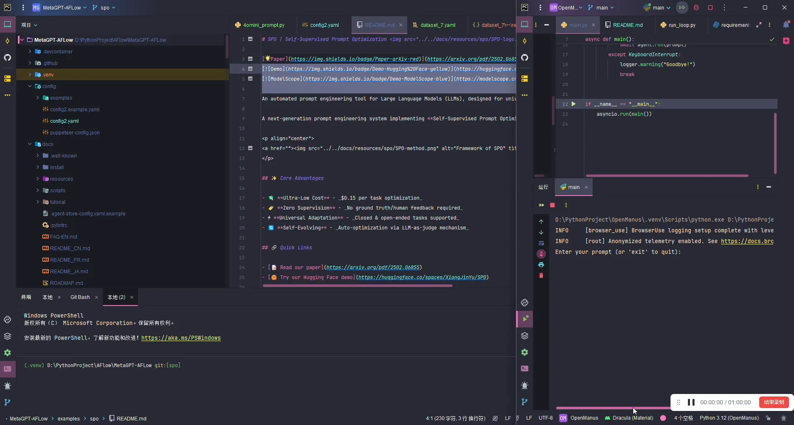
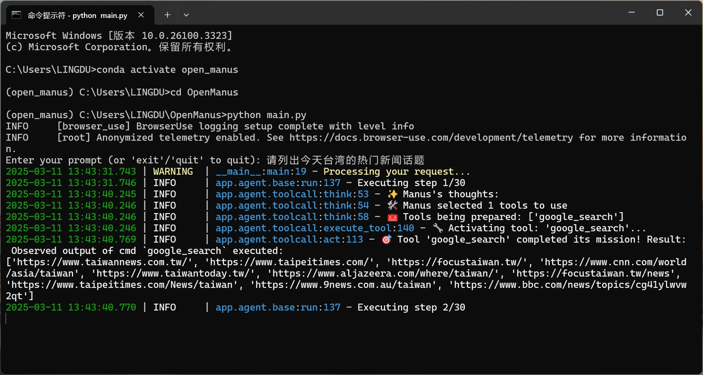
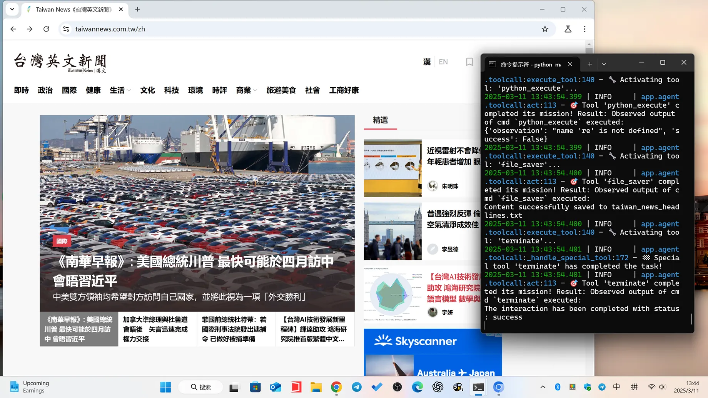
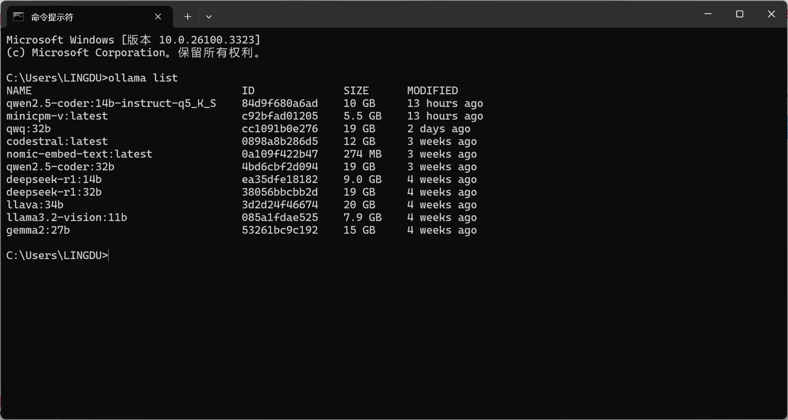

# OpenManus 本地部署！ 完全免费，对接 Ollama 本地大模型，真香！

<font style="color:rgb(78, 83, 88);">短短 3 天，39K Stars，Manus 开源版 OpenManus 彻底爆火！完全免费，无需等待，无需任何费用，无需APIKEY，直接对接我们本地的开源大模型！通过调用本地的 Ollama ，不要太香！</font>




**<font style="color:rgb(78, 83, 88);">本地部署过程：</font>**

<font style="color:rgb(78, 83, 88);">提前准备安装 python 3.12 【</font>[点击下载](https://www.python.org/downloads/release/python-3120/)<font style="color:rgb(78, 83, 88);">】和 conda 【</font>[点击前往](https://repo.anaconda.com/)<font style="color:rgb(78, 83, 88);">】</font>

<font style="color:rgb(78, 83, 88);">下面我会提供两种不同的安装方法，分别适合Windows 和 macOS 、Linux用户</font>

### <font style="color:rgb(78, 83, 88);">方法 1：使用 conda （ 适合 Windows 用户）</font>
<font style="color:rgb(78, 83, 88);">1、创建一个新的 conda 环境：</font>

```plain
conda create -n open_manus python=3.12

conda activate open_manus
```

<font style="color:rgb(78, 83, 88);">2、克隆存储库：</font>

```plain
git clone https://github.com/mannaandpoem/OpenManus.git

cd OpenManus
```

<font style="color:rgb(78, 83, 88);">3、安装依赖项：</font>

```plain
pip install -r requirements.txt
```

<font style="color:rgb(78, 83, 88);">4、安装Ollama 本地部署AI大模型</font>

<font style="color:rgb(78, 83, 88);">Ollama 官方下载：【</font>[点击前往](https://ollama.com/)<font style="color:rgb(78, 83, 88);">】</font>

<font style="color:rgb(78, 83, 88);">由于本地对接的AI模型，必须使用有函数调用的模型才可以， 比如 qwen2.5-coder:14b、qwen2.5-coder:14b-instruct-q5_K_S、qwen2.5-coder:32b 都可以，视觉模型可以使用 minicpm-v</font>

<font style="color:rgb(78, 83, 88);">本地模型安装命令：</font>

```plain
ollama run qwen2.5-coder:14b
```

<font style="color:rgb(78, 83, 88);">视觉模型安装命令:</font>

```plain
ollama run minicpm-v
```

<font style="color:rgb(78, 83, 88);">当然你可以安装任何你想要的，只要支持函数调用的模型就可以， 只需在安装命令 ollama run 后面跟上模型名称即可！</font>

<font style="color:rgb(78, 83, 88);">5、修改配置文件</font>

<font style="color:rgb(78, 83, 88);">在安装目录下，找到 OpenManus\config\config.example.toml  ，把config.example.toml 改成 config.toml</font>

<font style="color:rgb(78, 83, 88);">然后将里面的内容改成如下：</font>

```plain
# Global LLM configuration

[llm]

model = "qwen2.5-coder:14b"

base_url = "http://localhost:11434/v1"

api_key = "sk-..."

max_tokens = 4096

temperature = 0.0


# [llm] #AZURE OPENAI:

# api_type= 'azure'

# model = "YOUR_MODEL_NAME" #"gpt-4o-mini"

# base_url = "{YOUR_AZURE_ENDPOINT.rstrip('/')}/openai/deployments/{AZURE_DEPOLYMENT_ID}"

# api_key = "AZURE API KEY"

# max_tokens = 8096

# temperature = 0.0

# api_version="AZURE API VERSION" #"2024-08-01-preview"


# Optional configuration for specific LLM models

[llm.vision]

model = "qwen2.5-coder:14b"

base_url = "http://localhost:11434/v1"

api_key = "sk-..."
```

**<font style="color:rgb(255, 0, 0);">注意：里面的模型文件名称要改成你自己安装的，后面的视觉模型可以和上面的一致，也可以自定义其它的视觉模型!</font>**

<font style="color:rgb(78, 83, 88);">如果你在中国大陆，可能需要把代码里的 localhost 改成 127.0.0.1 </font>

<font style="color:rgb(78, 83, 88);">最后运行即可</font>

```plain
python main.py
```

<font style="color:rgb(78, 83, 88);">详细的使用教程如下：</font>

  
 <font style="color:rgb(78, 83, 88);">运行以后就可以进行使用了！它就可以完全自动调用浏览器，打开并浏览，查询并收集需要的信息</font>





### <font style="color:rgb(78, 83, 88);">下次打开运行的命令如下：</font>
```plain
conda activate open_manus

cd OpenManus

python main.py
```

### <font style="color:rgb(78, 83, 88);">方法 2：使用 uv（适合macOS用户）</font>
<font style="color:rgb(78, 83, 88);">1、安装 uv（快速 Python 包安装程序和解析器）：</font>

```plain
curl -LsSf https://astral.sh/uv/install.sh | sh
```

<font style="color:rgb(78, 83, 88);">2、克隆存储库：</font>

```plain
git clone https://github.com/mannaandpoem/OpenManus.git

cd OpenManus
```

<font style="color:rgb(78, 83, 88);">3、创建一个新的虚拟环境并激活它：</font>

<font style="color:rgb(78, 83, 88);">Windows 系统</font>

```plain
uv venv

.venv\Scripts\activate
```

<font style="color:rgb(78, 83, 88);">macOS系统</font>

```plain
uv venv

source .venv/bin/activate
```

<font style="color:rgb(78, 83, 88);">4、安装依赖：</font>

```plain
uv pip install -r requirements.txt
```

<font style="color:rgb(78, 83, 88);">5、安装Ollama 本地部署AI大模型</font>

<font style="color:rgb(78, 83, 88);">更多内容，详细见零度教程</font>

<font style="color:rgb(78, 83, 88);">官方开源项目：【</font>[链接直达](https://github.com/mannaandpoem/OpenManus)<font style="color:rgb(78, 83, 88);">】</font>

**<font style="color:rgb(255, 0, 0);">如何卸载已安装过的模型？在CMD终端下，通过命令：</font>**

```plain
ollama list  # 查询已安装的模型

ollama rm 模型名称  # 卸载并删除模型
```



<font style="color:rgb(78, 83, 88);">比如需要删除gemma2:27b 模型，那么只需输入：</font>

```plain
ollama rm gemma2:27b
```


> 更新: 2025-03-22 12:24:53  
> 原文: <https://www.yuque.com/lixinsi/vnere7/byazor2ee8akrez1>