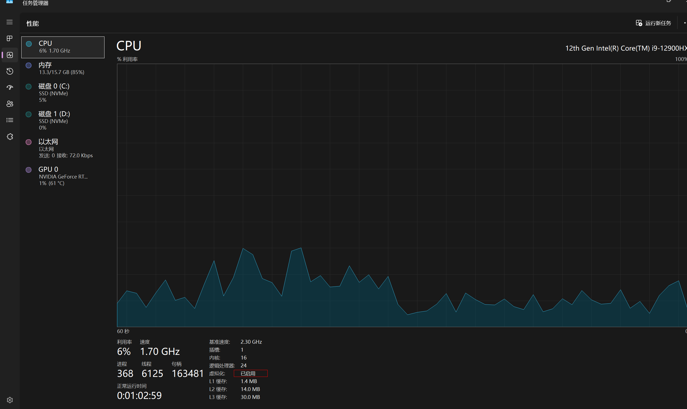
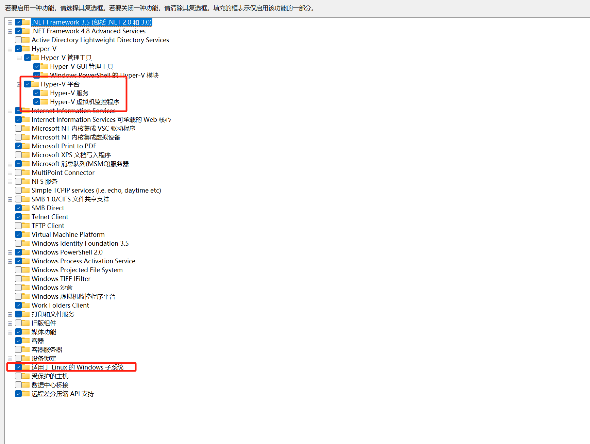
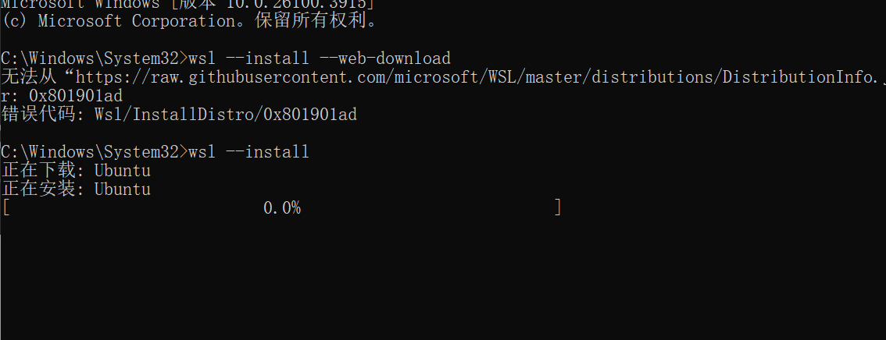
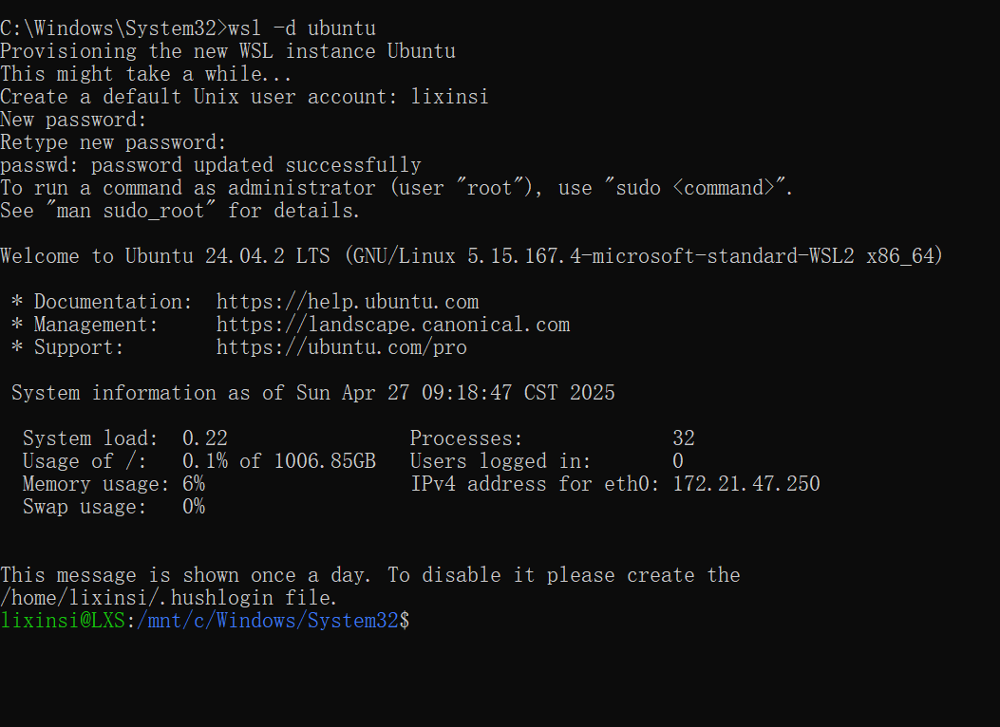
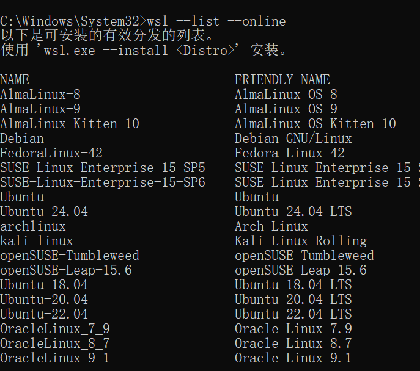
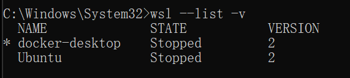
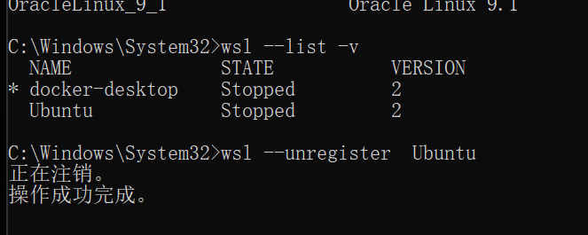
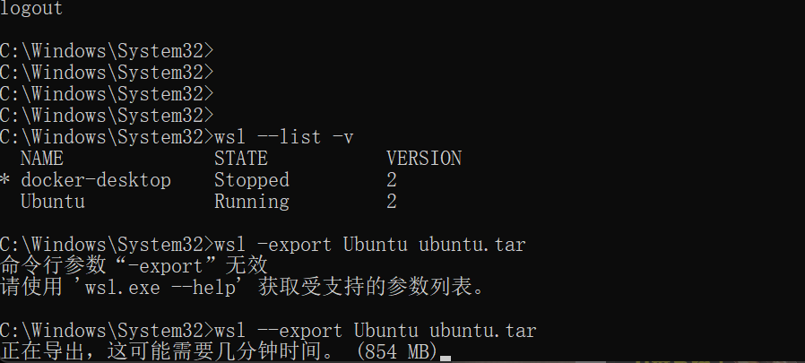

# WSL2

### 检查 wsl 里面是否开启虚拟化
```python
taskmgr
```



### 服务里面添加两个功能



### 打开 cmd 并且用管理员权限运行
```python
wsl  --install
wsl --install --web-download
```



### 启动安装的 ubuntu
```python
wsl -d ubuntu
账号：lixinsi
密码：Aa@#4520
```



### 查看其它 Linux 安装版本
```python
wsl --list --online

wsl  --install kali-linux
```




### 查看 wsl 虚拟机的状态
```python
wsl --list -v
```




### 卸载虚拟机
```python
wsl --unregister  Ubuntu
```



### 备份和恢复
### 导出镜像
```python
wsl --export Ubuntu ubuntu.tar  --导出镜像
```




### 导入镜像其它分区导入 切换默认启动系统
```python
wsl --set-default kali-linux
```

### 其它文件夹导入
```python
cd D:
mkdir wsl
wsl --import Ubuntu2 D:/wsl C:\Users\93917\Desktop\ubuntu.tar
```

### wsl 可以在 Windows 里面执行 Linux 程序，在 Linux 可以执行 Windows 程序
```python
wslg 
 
```


> 更新: 2025-04-28 14:41:43  
> 原文: <https://www.yuque.com/lixinsi/vnere7/vm53iomzkgtgfpad>