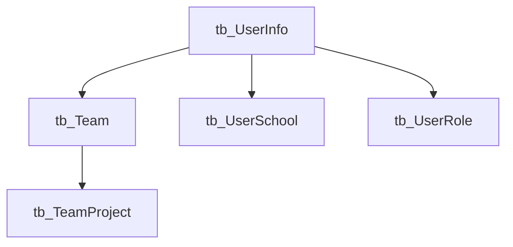
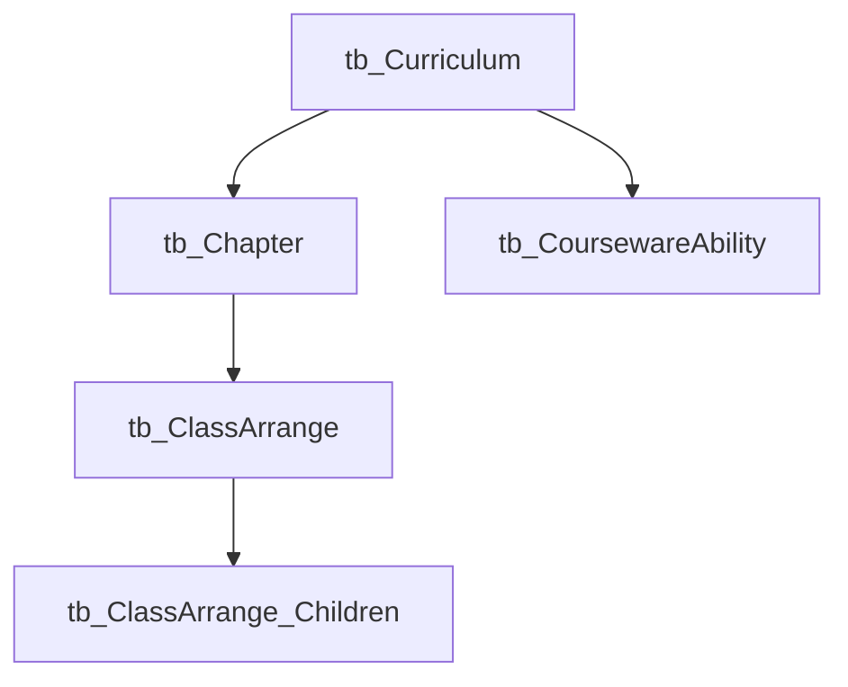
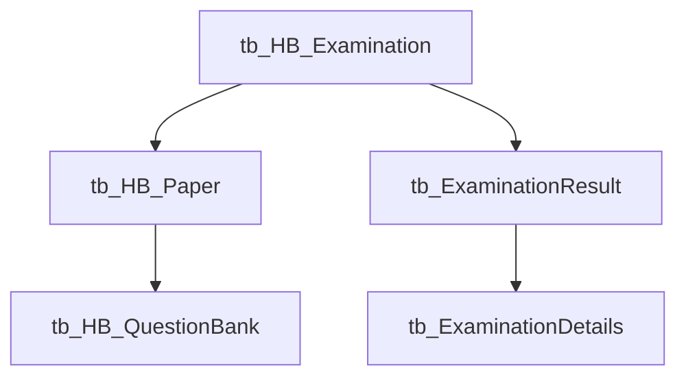
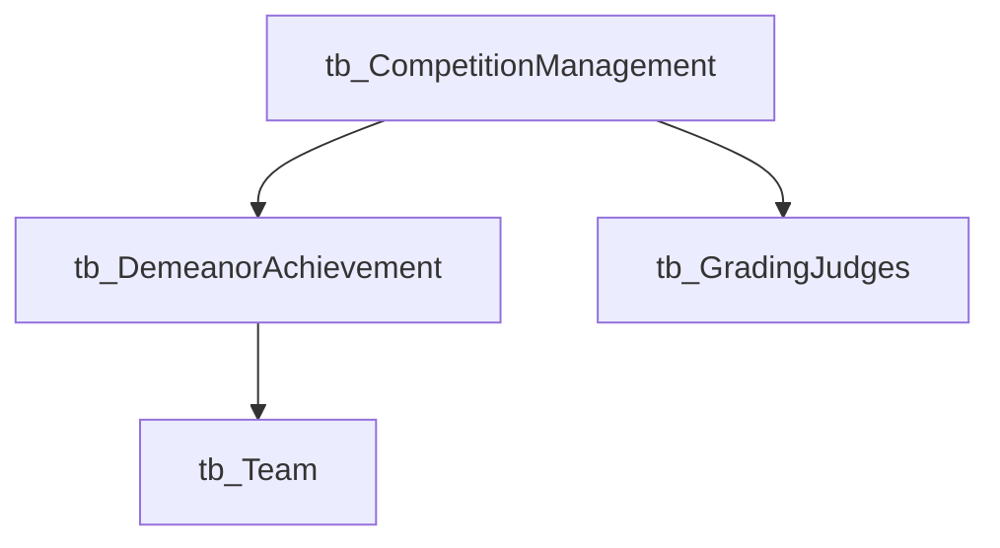
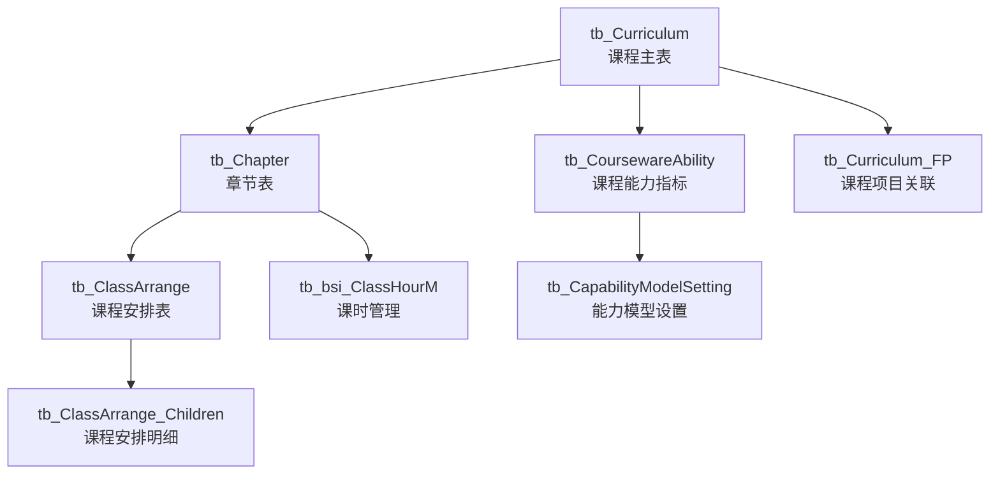
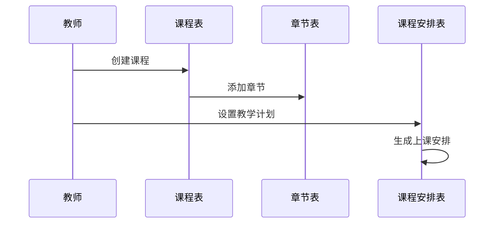
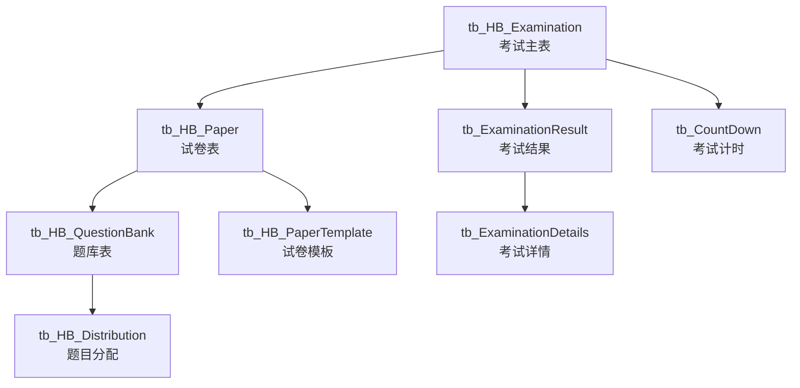
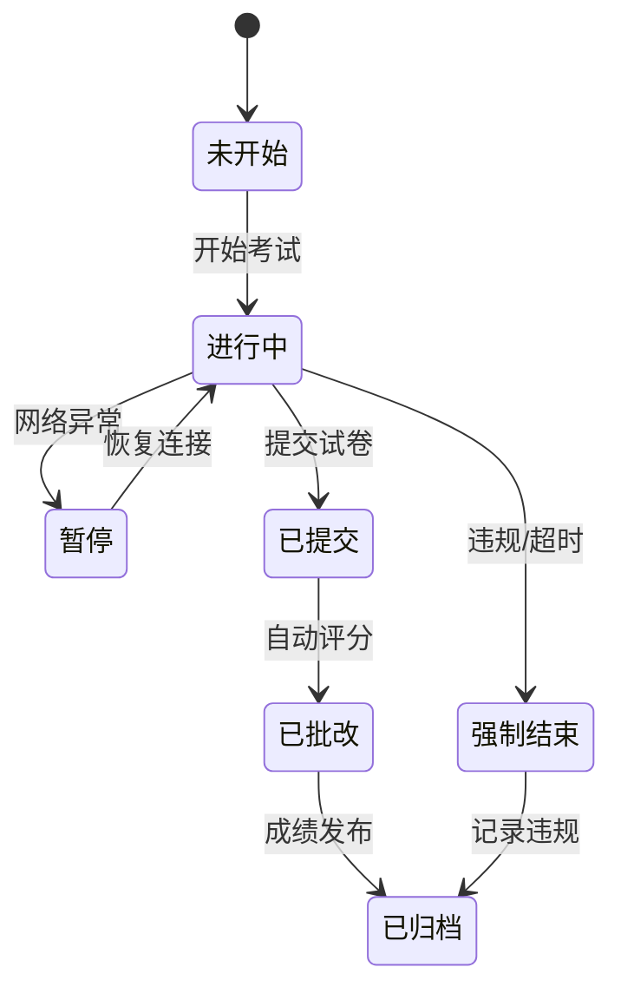

# 数据库设计文档

## 一、系统概述

### 1.1 数据库名称
`理论知识LLZS

### 1.2 业务模块划分

1. 用户权限管理模块
2. 教学管理模块
3. 考试评测模块
4. 课程资源模块
5. 竞赛管理模块

## 二、核心业务模块说明

### 1. 用户权限管理模块

#### 1.1 用户信息表 (tb_UserInfo)
| 字段名 | 类型 | 说明 | 约束 |
|--------|------|------|------|
| UId | int | 用户ID | 主键，自增 |
| UserNo | varchar(100) | 用户编号 | 可空 |
| UserPwd | varchar(200) | 用户密码 | 可空 |
| UserName | nvarchar(100) | 用户姓名 | 可空 |
| UserType | int | 用户类型 | 可空 |
| UserSchoolId | int | 所属学校ID | 可空 |
| UserClassId | int | 所属班级ID | 可空 |
| UserSex | nvarchar(50) | 性别 | 可空 |
| UserIdentity | varchar(200) | 身份证号 | 可空 |
| State | int | 状态 | 可空 |

#### 1.2 团队表 (tb_Team)
| 字段名 | 类型 | 说明 | 约束 |
|--------|------|------|------|
| Id | int | 团队ID | 主键，自增 |
| TeamCode | varchar(100) | 团队编码 | 可空 |
| TeamName | varchar(100) | 团队名称 | 可空 |
| SchoolId | int | 所属学校ID | 可空 |
| TeacherId | int | 指导教师ID | 可空 |

### 2. 教学管理模块

#### 2.1 课程表 (tb_Curriculum)
| 字段名 | 类型 | 说明 | 约束 |
|--------|------|------|------|
| ID | int | 课程ID | 主键，自增 |
| CurriculumName | varchar(100) | 课程名称 | 可空 |
| State | nchar(10) | 状态 | 可空 |
| Cover | text | 课程封面 | 可空 |
| Synopsis | varchar(1000) | 课程简介 | 可空 |
| CurrType | int | 课程类型 | 可空 |

#### 2.2 章节表 (tb_Chapter)
| 字段名 | 类型 | 说明 | 约束 |
|--------|------|------|------|
| ID | int | 章节ID | 主键，自增 |
| CurriculumID | int | 所属课程ID | 可空 |
| ResourcesName | varchar(100) | 资源名称 | 可空 |
| Sort | int | 排序序号 | 可空 |

### 3. 考试评测模块

#### 3.1 考试表 (tb_HB_Examination)
| 字段名 | 类型 | 说明 | 约束 |
|--------|------|------|------|
| EId | int | 考试ID | 主键，自增 |
| E_Name | varchar(100) | 考试名称 | 可空 |
| E_Type | int | 考试类型 | 可空 |
| E_StartTime | datetime | 开始时间 | 可空 |
| E_EndTime | datetime | 结束时间 | 可空 |
| E_Whenlong | int | 考试时长 | 可空 |
| E_IsState | int | 考试状态 | 可空 |

#### 3.2 试卷表 (tb_HB_Paper)
| 字段名 | 类型 | 说明 | 约束 |
|--------|------|------|------|
| PId | int | 试卷ID | 主键，自增 |
| P_Number | varchar(100) | 试卷编号 | 可空 |
| P_Name | varchar(100) | 试卷名称 | 可空 |
| P_IsOrder | int | 是否顺序答题 | 可空 |
| P_State | int | 试卷状态 | 可空 |

#### 3.3 题库表 (tb_HB_QuestionBank)
| 字段名 | 类型 | 说明 | 约束 |
|--------|------|------|------|
| QuestionBId | int | 题目ID | 主键，自增 |
| QB_CourseId | int | 所属课程ID | 可空 |
| QB_Type | int | 题目类型 | 可空 |
| QB_Description | varchar(8000) | 题目描述 | 可空 |
| QB_Answer | varchar(4000) | 答案 | 可空 |
| QB_Analysis | varchar(4000) | 解析 | 可空 |

### 4. 竞赛管理模块

#### 4.1 竞赛管理表 (tb_CompetitionManagement)
| 字段名 | 类型 | 说明 | 约束 |
|--------|------|------|------|
| Id | int | 竞赛ID | 主键，自增 |
| CompetitionName | varchar(50) | 竞赛名称 | 可空 |
| startTime | datetime | 开始时间 | 可空 |
| endTime | datetime | 结束时间 | 可空 |
| Scoringmodel | int | 评分模式 | 可空 |
| state | nchar(10) | 状态 | 可空 |

## 三、数据库设计规范

### 1. 命名规范
- 表名前缀规范：
  - tb_: 基础业务表
  - v_: 视图
  - A_: 辅助表

### 2. 字段设计规范
- 主键命名：表名简写+Id
- 创建时间：AddTime
- 创建人：AddUserId/AddOperator
- 状态字段：State
- 备用字段：Custom1, Custom2, Custom3

### 3. 索引设计
- 主键索引：使用聚集索引
- 外键索引：关联字段建议创建索引
- 查询索引：常用查询字段建议创建索引

### 4. 数据完整性
- 主键约束：使用自增主键
- 外键关系：主要通过代码层面控制
- 默认值：关键字段设置合适的默认值

### 5. 性能优化建议
1. 索引优化
   - 为常用查询字段创建索引
   - 避免对大字段创建索引

2. 表结构优化
   - 使用适当的字段类型
   - 避免使用过多的TEXT类型字段

3. 查询优化
   - 避免全表扫描
   - 使用合适的字段类型做关联

## 四、维护建议

### 1. 日常维护
- 定期更新统计信息
- 监控索引使用情况
- 检查数据增长趋势

### 2. 备份策略
- 建议每日全量备份
- 重要操作前进行备份
- 定期验证备份有效性

### 3. 性能监控
- 监控慢查询
- 监控磁盘空间
- 监控连接数

## 五、变更记录

| 时间 | 版本 | 变更内容 | 变更人 |
|------|------|----------|--------|
| 2024-12-08 | 1.0 | 初始版本 | System |

## 六、详细模块关系说明

### 1. 用户权限体系

#### 1.1 核心表关系


#### 1.2 业务流程
1. 用户注册流程
   - 用户注册时创建 tb_UserInfo 记录
   - 根据用户类型关联学校信息
   - 可选择加入团队或创建团队

2. 权限控制
   - UserType 字段控制用户角色：
     - 1: 管理员
     - 2: 教师
     - 3: 学生
     - 4: 访客
   - State 字段控制账号状态：
     - 0: 禁用
     - 1: 正常
     - 2: 待审核

3. 团队管理
   - 教师可创建团队（tb_Team）
   - 学生可加入多个团队
   - 团队关联项目和课程

### 2. 教学管理体系

#### 2.1 课程资源结构


#### 2.2 教学流程说明
1. 课程管理
   - 课程基本信息维护
   - 章节内容管理
   - 课件资源关联
   - 能力指标关联

2. 排课管理
   - 班级课程安排
   - 预习时间设置
   - 开课时间管理
   - 章节学习计划

3. 学习追踪
   - 学习进度记录
   - 课程完成情况
   - 能力达成度分析

### 3. 考试评测体系

#### 3.1 考试系统结构


#### 3.2 考试业务流程
1. 试卷管理
   - 题库建设
   - 试卷组卷
   - 试卷审核
   - 分值设置

2. 考试管理
   - 考试安排
   - 考试监控
   - 成绩管理
   - 试卷分析

3. 评分规则
   - 客观题自动评分
   - 主观题人工评分
   - 总分计算规则
   - 及格标准设置

### 4. 竞赛管理体系

#### 4.1 竞赛系统结构


#### 4.2 竞赛流程说明
1. 竞赛创建
   - 竞赛基本信息设置
   - 评分模型配置
   - 参赛队伍管理
   - 评委分配

2. 评分管理
   - 评分标准设置
   - 评委打分
   - 成绩汇总
   - 结果公示

3. 成绩处理
   - 计算最终得分
   - 生成排名
   - 导出成绩
   - 数据统计

## 七、关键业务场景说明

### 1. 在线考试流程
1. 考试准备阶段
   ```sql
   -- 创建考试
   INSERT INTO tb_HB_Examination (E_Name, E_Type, E_StartTime, E_EndTime, E_Whenlong)
   -- 关联试卷
   INSERT INTO tb_HB_Paper (P_Number, P_Name)
   -- 分配考生
   INSERT INTO tb_ExaminationDetails (ED_EId, ED_PId, ED_MId)
   ```

2. 考试进行阶段
   ```sql
   -- 记录答题信息
   INSERT INTO tb_ExaminationDetails (ED_Content, ED_OkNo)
   -- 更新考试状态
   UPDATE tb_HB_Examination SET E_IsState = 1
   ```

3. 考试结束阶段
   ```sql
   -- 计算成绩
   INSERT INTO tb_ExaminationResult (ER_Score, ER_State)
   -- 更新考试状态
   UPDATE tb_HB_Examination SET E_IsState = 2
   ```

### 2. 课程学习流程
1. 课程安排
   ```sql
   -- 创建课程计划
   INSERT INTO tb_ClassArrange (class_id, curriculum_id)
   -- 设置学习章节
   INSERT INTO tb_ClassArrange_Children (c_id, section_id)
   ```

2. 学习记录
   ```sql
   -- 记录学习时长
   UPDATE tb_ClassArrange_Children SET study_time = study_time + @duration
   -- 更新完成状态
   UPDATE tb_ClassArrange SET is_complete = 1
   ```

### 3. 竞赛评分流程
1. 评委打分
   ```sql
   -- 记录评分
   INSERT INTO tb_GradingJudges (DemeanorMatchID, Fraction)
   ```

2. 成绩汇总
   ```sql
   -- 计算平均分
   INSERT INTO tb_DemeanorAchievement (TrimmedMean, Average, FinalScore)
   ```

## 八、性能优化建议

### 1. 索引优化
```sql
-- 用户表常用查询索引
CREATE INDEX idx_user_type_state ON tb_UserInfo(UserType, State);

-- 考试查询优化
CREATE INDEX idx_exam_time ON tb_HB_Examination(E_StartTime, E_EndTime);

-- 成绩查询优化
CREATE INDEX idx_score_query ON tb_ExaminationResult(ER_EId, ER_MId);
```

### 2. 表分区策略
- 考试结果表按月分区
- 学习记录表按季度分区
- 历史数据归档策略

### 3. 查询优化建议
1. 考试成绩统计
   ```sql
   -- 使用合适的索引
   SELECT ER_MId, AVG(ER_Score) as avg_score
   FROM tb_ExaminationResult WITH (INDEX(idx_score_query))
   WHERE ER_EId = @examId
   GROUP BY ER_MId;
   ```

2. 学习进度查询
   ```sql
   -- 使用合适的连接方式
   SELECT c.*, cc.*
   FROM tb_ClassArrange c
   INNER HASH JOIN tb_ClassArrange_Children cc ON c.id = cc.c_id
   WHERE c.class_id = @classId;
   ```

## 九、核心模块详细设计

### 1. 教学管理模块详解

#### 1.1 课程体系完整结构


#### 1.2 课程管理详细说明
1. 课程基础信息
```sql
-- 课程状态定义
State: {
    '0': '未发布',
    '1': '已发布',
    '2': '已下架',
    '3': '审核中'
}

-- 课程类型定义
CurrType: {
    1: '理论课程',
    2: '实践课程',
    3: '混合课程',
    4: '竞赛课程'
}
```

2. 章节结构管理
```sql
-- 章节排序规则
Sort: {
    规则: '同级章节按Sort升序排列',
    范围: '1-1000',
    建议: '间隔10便于插入'
}

-- 资源类型
ResourceType: {
    1: '视频',
    2: '文档',
    3: '作业',
    4: '测验'
}
```

#### 1.3 教学安排流程

1. 课程规划


2. 学习进度追踪
```sql
-- 进度记录表结构
CREATE TABLE tb_LearningProgress (
    ID int IDENTITY(1,1) PRIMARY KEY,
    StudentId int,              -- 学生ID
    ChapterId int,             -- 章节ID
    LearningStatus int,        -- 学习状态
    CompletionRate decimal(5,2),-- 完成率
    LastAccessTime datetime,    -- 最后访问时间
    TotalDuration int,         -- 总学习时长(分钟)
    CONSTRAINT FK_Student FOREIGN KEY (StudentId) 
        REFERENCES tb_UserInfo(UId)
)
```

### 2. 考试评测模块详解

#### 2.1 考试系统完整结构


#### 2.2 题库管理详细说明

1. 题目类型定义
```sql
QB_Type: {
    1: '单选题',
    2: '多选题',
    3: '判断题',
    4: '填空题',
    5: '简答题',
    6: '操作题'
}

-- 题目状态
QB_State: {
    0: '待审核',
    1: '已启用',
    2: '已禁用',
    3: '已删除'
}
```

2. 题目难度体系
```sql
-- 难度等级定义
QB_Custom1: {
    1: '容易',
    2: '中等',
    3: '较难',
    4: '困难'
}

-- 分值建议
QB_Score: {
    '单选题': 2,
    '多选题': 4,
    '判断题': 1,
    '填空题': 3,
    '简答题': 5-10,
    '操作题': 10-20
}
```

#### 2.3 考试流程详细说明

1. 考试前准备
```sql
-- 考试模式设置
E_Type: {
    1: '正式考试',
    2: '模拟考试',
    3: '练习测验'
}

-- 时间加时规则
E_IsTimeBonus: {
    0: '不允许加时',
    1: '允许加时'
}
```

2. 考试过程控制
```sql
-- 考试状态流转
E_IsState: {
    0: '未开始',
    1: '进行中',
    2: '已结束',
    3: '已归档'
}

-- 防作弊措施
CREATE TABLE tb_ExamMonitor (
    ID int IDENTITY(1,1) PRIMARY KEY,
    ExamId int,               -- 考试ID
    StudentId int,            -- 学生ID
    MonitorType int,          -- 监控类型
    MonitorContent text,      -- 监控内容
    MonitorTime datetime,     -- 监控时间
    HandleStatus int          -- 处理状态
)
```

3. 成绩计算规则
```sql
-- 总分计算
CREATE PROCEDURE sp_CalculateFinalScore
    @ExamId int,
    @StudentId int
AS
BEGIN
    -- 1. 客观题自动评分
    UPDATE tb_ExaminationResult
    SET ER_Score = (
        SELECT SUM(CASE 
            WHEN ED_Type IN (1,2,3) AND ED_Content = ED_OkNo 
            THEN ED_Goal ELSE 0 END)
        FROM tb_ExaminationDetails
        WHERE ED_EId = @ExamId AND ED_MId = @StudentId
    )
    WHERE ER_EId = @ExamId AND ER_MId = @StudentId

    -- 2. 加入主观题分数
    UPDATE tb_ExaminationResult
    SET ER_Score = ER_Score + (
        SELECT SUM(ED_Goal)
        FROM tb_ExaminationDetails
        WHERE ED_EId = @ExamId 
        AND ED_MId = @StudentId
        AND ED_Type IN (4,5,6)
    )
    
    -- 3. 计算最终得分
    UPDATE tb_ExaminationResult
    SET ER_Score = CASE
        WHEN ER_Score >= 100 THEN 100
        WHEN ER_Score < 0 THEN 0
        ELSE ER_Score
    END
END
```

#### 2.4 成绩分析功能

1. 试卷分析
```sql
-- 试卷难度分析
CREATE VIEW v_PaperDifficulty AS
SELECT 
    P_Id,
    COUNT(*) as TotalQuestions,
    AVG(CASE WHEN ER_Score >= ED_Goal*0.6 THEN 1 ELSE 0 END) as PassRate,
    AVG(ER_Score/ED_Goal) as AvgScoreRate
FROM tb_ExaminationDetails ed
JOIN tb_ExaminationResult er ON ed.ED_EId = er.ER_EId
GROUP BY P_Id
```

2. 成绩统计
```sql
-- 成绩分布视图
CREATE VIEW v_ScoreDistribution AS
SELECT 
    ER_EId,
    COUNT(*) as StudentCount,
    SUM(CASE WHEN ER_Score >= 90 THEN 1 ELSE 0 END) as ExcellentCount,
    SUM(CASE WHEN ER_Score >= 80 AND ER_Score < 90 THEN 1 ELSE 0 END) as GoodCount,
    SUM(CASE WHEN ER_Score >= 60 AND ER_Score < 80 THEN 1 ELSE 0 END) as PassCount,
    SUM(CASE WHEN ER_Score < 60 THEN 1 ELSE 0 END) as FailCount
FROM tb_ExaminationResult
GROUP BY ER_EId
```

### 3. 性能优化补充建议

#### 3.1 分区策略详细说明
```sql
-- 考试结果表分区
CREATE PARTITION FUNCTION pf_ExamResult (datetime)
AS RANGE RIGHT FOR VALUES (
    '2023-01-01', '2023-04-01', '2023-07-01', '2023-10-01',
    '2024-01-01', '2024-04-01', '2024-07-01', '2024-10-01'
)

-- 创建分区方案
CREATE PARTITION SCHEME ps_ExamResult
AS PARTITION pf_ExamResult
ALL TO ([PRIMARY])

-- 应用分区方案
CREATE CLUSTERED INDEX CIX_ExamResult
ON tb_ExaminationResult(ER_AddTime)
ON ps_ExamResult(ER_AddTime)
```

#### 3.2 索引优化补充
```sql
-- 课程查询优化
CREATE INDEX idx_curriculum_status 
ON tb_Curriculum(State, CurrType)
INCLUDE (CurriculumName, Cover)

-- 考试成绩查询优化
CREATE INDEX idx_exam_result_composite
ON tb_ExaminationResult(ER_EId, ER_MId, ER_State)
INCLUDE (ER_Score, ER_AddTime)

-- 学习进度查询优化
CREATE INDEX idx_learning_progress
ON tb_ClassArrange_Children(ChapterID, open_time)
INCLUDE (is_delete, addtime)

```

## 十、核心业务模块完整说明

### 1. 教学管理模块完整设计

#### 1.1 课程主表设计
```sql
CREATE TABLE tb_Curriculum (
    ID int IDENTITY(1,1) PRIMARY KEY,
    CurriculumName nvarchar(100),    -- 课程名称
    CurrType int,                    -- 课程类型
    State int,                       -- 课程状态
    Cover nvarchar(200),             -- 课程封面
    Description ntext,               -- 课程描述
    TeacherId int,                   -- 教师ID
    CreateTime datetime DEFAULT GETDATE(),
    UpdateTime datetime,
    IsDelete bit DEFAULT 0,
    
    CONSTRAINT FK_Teacher FOREIGN KEY (TeacherId) 
        REFERENCES tb_UserInfo(UId)
)
```

#### 1.2 章节管理完整流程

1. 章节表结构
```sql
CREATE TABLE tb_Chapter (
    ID int IDENTITY(1,1) PRIMARY KEY,
    CurriculumId int,               -- 所属课程ID
    ChapterName nvarchar(100),      -- 章节名称
    ParentId int,                   -- 父章节ID
    Sort int,                       -- 排序号
    Level int,                      -- 层级
    ResourceType int,               -- 资源类型
    ResourcePath nvarchar(200),     -- 资源路径
    Duration int,                   -- 学习时长(分钟)
    
    CONSTRAINT FK_Curriculum FOREIGN KEY (CurriculumId) 
        REFERENCES tb_Curriculum(ID)
)

-- 章节层级规则
Level: {
    1: '章',
    2: '节',
    3: '小节'
}
```

2. 章节资源关联
```sql
CREATE TABLE tb_ChapterResource (
    ID int IDENTITY(1,1) PRIMARY KEY,
    ChapterId int,                  -- 章节ID
    ResourceType int,               -- 资源类型
    ResourceTitle nvarchar(100),    -- 资源标题
    ResourceUrl nvarchar(200),      -- 资源URL
    FileSize bigint,                -- 文件大小
    Duration int,                   -- 视频时长
    UploadTime datetime DEFAULT GETDATE(),
    
    CONSTRAINT FK_Chapter FOREIGN KEY (ChapterId) 
        REFERENCES tb_Chapter(ID)
)
```

#### 1.3 学习进度完整追踪系统

1. 课程进度主表
```sql
CREATE TABLE tb_CourseProgress (
    ID int IDENTITY(1,1) PRIMARY KEY,
    StudentId int,                  -- 学生ID
    CurriculumId int,              -- 课程ID
    EnrollTime datetime,           -- 选课时间
    LastStudyTime datetime,        -- 最后学习时间
    CompletedChapters int,         -- 已完成章节数
    TotalChapters int,             -- 总章节数
    CompletionRate decimal(5,2),    -- 完成率
    TotalDuration int,             -- 总学习时长(分钟)
    
    CONSTRAINT FK_Student_Course FOREIGN KEY (StudentId) 
        REFERENCES tb_UserInfo(UId),
    CONSTRAINT FK_Course FOREIGN KEY (CurriculumId) 
        REFERENCES tb_Curriculum(ID)
)
```

2. 章节学习记录
```sql
CREATE TABLE tb_ChapterStudyLog (
    ID int IDENTITY(1,1) PRIMARY KEY,
    StudentId int,                  -- 学生ID
    ChapterId int,                  -- 章节ID
    StartTime datetime,             -- 开始时间
    EndTime datetime,               -- 结束时间
    Duration int,                   -- 本次时长
    Progress decimal(5,2),          -- 学习进度
    DeviceInfo nvarchar(100),       -- 设备信息
    IPAddress nvarchar(50),         -- IP地址
    
    CONSTRAINT FK_Chapter_Log FOREIGN KEY (ChapterId) 
        REFERENCES tb_Chapter(ID)
)
```

### 2. 考试评测模块完整设计

#### 2.1 试卷管理系统

1. 试卷主表
```sql
CREATE TABLE tb_HB_Paper (
    P_Id int IDENTITY(1,1) PRIMARY KEY,
    P_Number nvarchar(50),          -- 试卷编号
    P_Name nvarchar(100),           -- 试卷名称
    P_TotalScore int,               -- 总分
    P_PassScore int,                -- 及格分
    P_Duration int,                 -- 考试时长
    P_DifficultyLevel int,          -- 难度等级
    P_Type int,                     -- 试卷类型
    P_State int,                    -- 状态
    P_CreateTime datetime DEFAULT GETDATE(),
    P_UpdateTime datetime,
    P_Creator int,                  -- 创建人
    
    CONSTRAINT FK_Paper_Creator FOREIGN KEY (P_Creator) 
        REFERENCES tb_UserInfo(UId)
)
```

2. 试卷题目分配
```sql
CREATE TABLE tb_HB_PaperQuestion (
    ID int IDENTITY(1,1) PRIMARY KEY,
    PaperId int,                    -- 试卷ID
    QuestionId int,                 -- 题目ID
    QuestionType int,               -- 题目类型
    Score decimal(5,2),             -- 分值
    SortOrder int,                  -- 排序号
    GroupName nvarchar(50),         -- 题组名称
    
    CONSTRAINT FK_Paper FOREIGN KEY (PaperId) 
        REFERENCES tb_HB_Paper(P_Id),
    CONSTRAINT FK_Question FOREIGN KEY (QuestionId) 
        REFERENCES tb_HB_QuestionBank(QB_Id)
)
```

#### 2.2 考试过程管理

1. 考试监控完整方案
```sql
CREATE TABLE tb_ExamMonitorDetail (
    ID int IDENTITY(1,1) PRIMARY KEY,
    MonitorId int,                  -- 监控记录ID
    EventType int,                  -- 事件类型
    EventTime datetime,             -- 事件时间
    EventDetail ntext,              -- 事件详情
    Screenshot nvarchar(200),       -- 截图路径
    Severity int,                   -- 严重程度
    
    CONSTRAINT FK_Monitor FOREIGN KEY (MonitorId) 
        REFERENCES tb_ExamMonitor(ID)
)

-- 事件类型定义
EventType: {
    1: '切换窗口',
    2: '复制粘贴',
    3: '网络异常',
    4: '设备异常',
    5: '人脸识别异常'
}

-- 严重程度定义
Severity: {
    1: '提醒',
    2: '警告',
    3: '严重',
    4: '终止考试'
}
```

2. 考试过程状态机


#### 2.3 成绩评定系统

1. 评分规则引擎
```sql
CREATE TABLE tb_ScoringRules (
    ID int IDENTITY(1,1) PRIMARY KEY,
    RuleType int,                   -- 规则类型
    QuestionType int,               -- 题目类型
    ScoreFormula nvarchar(500),     -- 计分公式
    MinScore decimal(5,2),          -- 最低分
    MaxScore decimal(5,2),          -- 最高分
    Description ntext,              -- 规则说明
    IsActive bit DEFAULT 1
)

-- 评分规则类型
RuleType: {
    1: '标准答案比对',
    2: '关键词匹配',
    3: '人工评分',
    4: '综合评定'
}
```

2. 成绩统计分析存储过程
```sql
CREATE PROCEDURE sp_AnalyzeExamResults
    @ExamId int
AS
BEGIN
    -- 1. 计算基础统计量
    SELECT 
        COUNT(*) as TotalStudents,
        AVG(ER_Score) as AvgScore,
        MIN(ER_Score) as MinScore,
        MAX(ER_Score) as MaxScore,
        STDEV(ER_Score) as StdDev
    FROM tb_ExaminationResult
    WHERE ER_EId = @ExamId

    -- 2. 计算分数段分布
    SELECT 
        CASE 
            WHEN ER_Score >= 90 THEN '优秀'
            WHEN ER_Score >= 80 THEN '良好'
            WHEN ER_Score >= 60 THEN '及格'
            ELSE '不及格'
        END as ScoreLevel,
        COUNT(*) as StudentCount,
        COUNT(*) * 100.0 / SUM(COUNT(*)) OVER() as Percentage
    FROM tb_ExaminationResult
    WHERE ER_EId = @ExamId
    GROUP BY 
        CASE 
            WHEN ER_Score >= 90 THEN '优秀'
            WHEN ER_Score >= 80 THEN '良好'
            WHEN ER_Score >= 60 THEN '及格'
            ELSE '不及格'
        END

    -- 3. 题目难度分析
    SELECT 
        ed.ED_Type as QuestionType,
        AVG(CASE WHEN ed.ED_Content = ed.ED_OkNo THEN 1 ELSE 0 END) as CorrectRate,
        AVG(ed.ED_Score) as AvgScore,
        COUNT(*) as AttemptCount
    FROM tb_ExaminationDetails ed
    WHERE ed.ED_EId = @ExamId
    GROUP BY ed.ED_Type
END
```

3. 成绩报告生成
```sql
CREATE PROCEDURE sp_GenerateExamReport
    @ExamId int,
    @StudentId int
AS
BEGIN
    -- 1. 学生基本信息
    SELECT 
        ui.UserName,
        ui.UserNo,
        ui.SchoolName,
        er.ER_Score,
        er.ER_StartTime,
        er.ER_EndTime,
        DATEDIFF(MINUTE, er.ER_StartTime, er.ER_EndTime) as Duration
    FROM tb_ExaminationResult er
    JOIN tb_UserInfo ui ON er.ER_MId = ui.UId
    WHERE er.ER_EId = @ExamId AND er.ER_MId = @StudentId

    -- 2. 题型得分分布
    SELECT 
        ED_Type,
        COUNT(*) as QuestionCount,
        SUM(ED_Goal) as TotalScore,
        SUM(ED_Score) as ObtainedScore,
        SUM(ED_Score) * 100.0 / SUM(ED_Goal) as ScoreRate
    FROM tb_ExaminationDetails
    WHERE ED_EId = @ExamId AND ED_MId = @StudentId
    GROUP BY ED_Type

    -- 3. 错题分析
    SELECT 
        ED_Type,
        ED_Content,
        ED_OkNo,
        ED_Goal,
        ED_Score,
        ED_Analysis
    FROM tb_ExaminationDetails
    WHERE ED_EId = @ExamId 
    AND ED_MId = @StudentId
    AND ED_Score < ED_Goal
END
```

{{ ... }}
