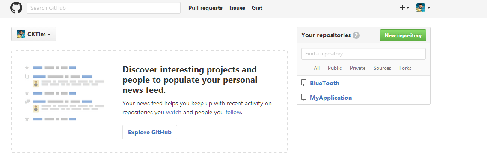
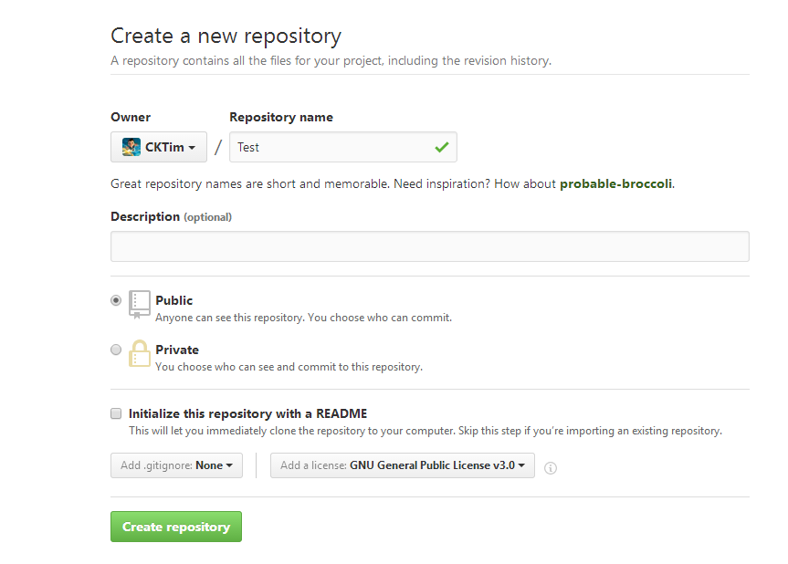
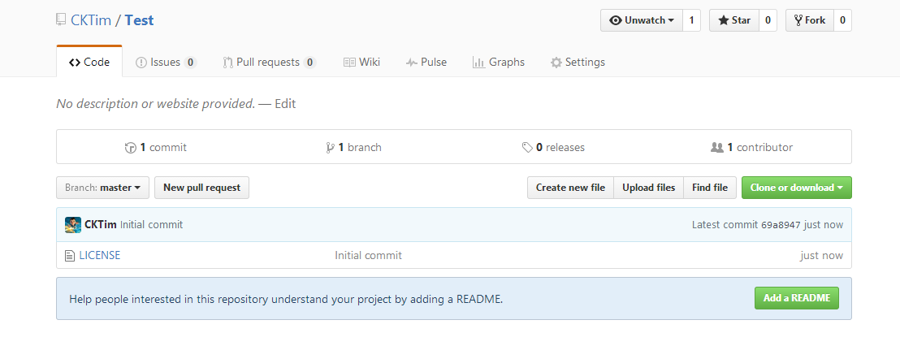
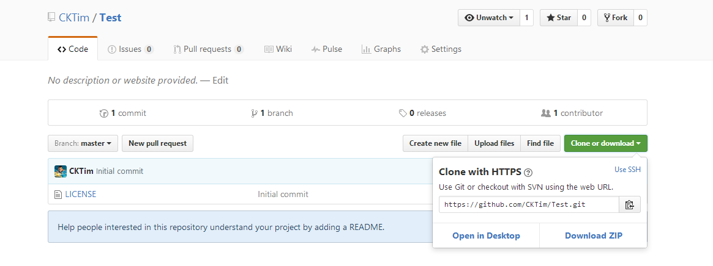
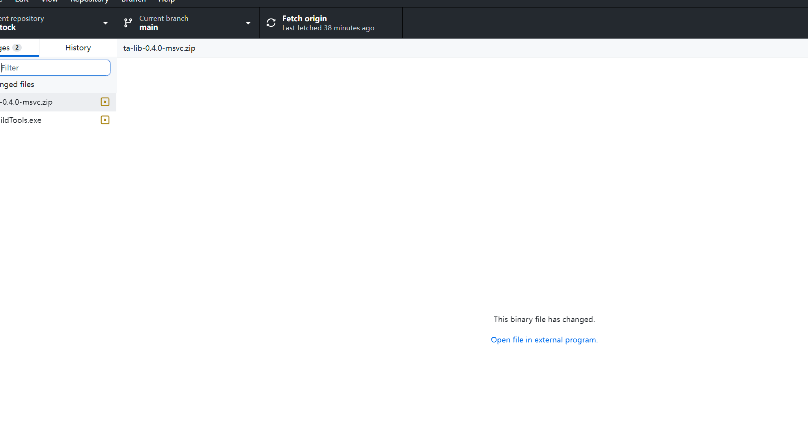

# github账号密码推送大文件

<font style="color:#494949;">github登入账号密码</font>

<font style="color:#494949;">账号:lixinsi7439@gmail.com</font>

<font style="color:#494949;">密码:lixinsi@520</font>

**<font style="color:rgb(255, 0, 0);">1.进入Github首页，点击New repository新建一个项目</font>****<font style="color:rgb(0, 0, 0);">  
</font>**



**<font style="color:rgb(255, 0, 0);">2.填写相应信息后点击create即可</font>**<font style="color:rgb(0, 0, 0);"> </font>

**<font style="color:rgb(0, 0, 0);">Repository name: 仓库名称</font>**

**<font style="color:rgb(0, 0, 0);">Description(可选): 仓库描述介绍</font>**

**<font style="color:rgb(0, 0, 0);">Public, Private : 仓库权限（公开共享，私有或指定合作者）</font>**

**<font style="color:rgb(0, 0, 0);">Initialize this repository with a README: 添加一个README.md</font>**

**<font style="color:rgb(0, 0, 0);">gitignore: 不需要进行版本管理的仓库类型，对应生成文件.gitignore</font>**

**<font style="color:rgb(0, 0, 0);">license: 证书类型，对应生成文件LICENSE</font>**

<font style="color:rgb(0, 0, 0);"></font>





**<font style="color:rgb(255, 0, 0);">4.点击Clone or dowload会出现一个地址，copy这个地址备用。</font>**



### 5.安装大文件上传
```dockerfile
git lfs install
```

### 6.添加文件类型
```dockerfile
git lfs track ".txt.bin.zip.exe"
```

### 7.初始化文件
```dockerfile
git add .gitattributes
```

### 8.提交或者打开 githubdesk 点击 fetch origin
```dockerfile
git push
git commit -m 'upload .gitattributes'
```




> 更新: 2025-05-10 16:38:19  
> 原文: <https://www.yuque.com/lixinsi/vnere7/fffggi92tearzy99>