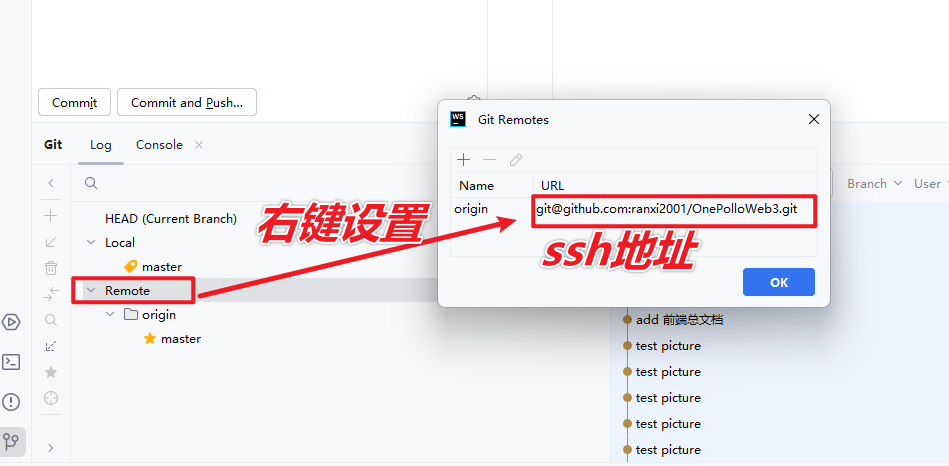
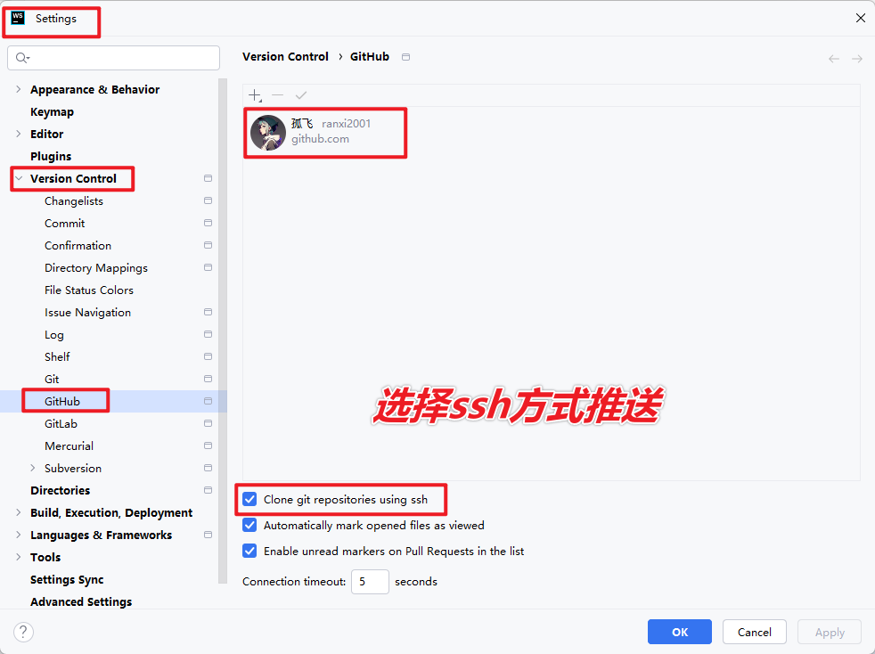

# git推送代码仓库版本控制

## <font style="color:rgb(52, 73, 94);">使用 SSH 方式推送 GitHub 项目的完整流程</font>

### <font style="color:rgb(52, 73, 94);">1.</font><font style="color:rgb(52, 73, 94);"> </font>**<font style="color:rgb(52, 73, 94);">生成 SSH 密钥</font>**

<font style="color:rgb(52, 73, 94);">如果你还没有生成 SSH 密钥，首先需要在本地机器生成一个 SSH 密钥。</font>

#### <font style="color:rgb(52, 73, 94);">在命令行中执行以下命令：</font>

```bash
ssh-keygen -t rsa -b 4096 -C "your_email@example.com"
```

* <code><font style="color:rgb(233, 105, 0);background-color:rgb(248, 248, 248);">-t rsa</font></code><font style="color:rgb(52, 73, 94);">: 使用 RSA 算法生成密钥。</font>
* <code><font style="color:rgb(233, 105, 0);background-color:rgb(248, 248, 248);">-b 4096</font></code><font style="color:rgb(52, 73, 94);">: 密钥长度为 4096 位（推荐）。</font>
* <code><font style="color:rgb(233, 105, 0);background-color:rgb(248, 248, 248);">-C "your_email@example.com"</font></code><font style="color:rgb(52, 73, 94);">: 这是生成密钥的标识，可以使用 GitHub 账户关联的邮箱。</font>

<font style="color:rgb(52, 73, 94);">按提示，默认情况下，SSH 密钥会被生成到</font><font style="color:rgb(52, 73, 94);"> </font><code><font style="color:rgb(233, 105, 0);background-color:rgb(248, 248, 248);">~/.ssh/id_rsa</font></code><font style="color:rgb(52, 73, 94);"> </font><font style="color:rgb(52, 73, 94);">文件中。</font>

### <font style="color:rgb(52, 73, 94);">2.</font><font style="color:rgb(52, 73, 94);"> </font>**<font style="color:rgb(52, 73, 94);">添加 SSH 密钥到 SSH 代理</font>**

<font style="color:rgb(52, 73, 94);">要确保 SSH 代理在后台运行，并将生成的密钥添加到代理中：</font>

#### <font style="color:rgb(52, 73, 94);">启动 SSH 代理：</font>

**<font style="color:rgb(52, 73, 94);"></font>**

```bash
eval "$(ssh-agent -s)"
```

#### <font style="color:rgb(52, 73, 94);">添加私钥到 SSH 代理：</font>

**<font style="color:rgb(52, 73, 94);"></font>**

```bash
ssh-add ~/.ssh/id_rsa
```

### <font style="color:rgb(52, 73, 94);">3.</font><font style="color:rgb(52, 73, 94);"> </font>**<font style="color:rgb(52, 73, 94);">将 SSH 公钥添加到 GitHub</font>**

<font style="color:rgb(52, 73, 94);">现在，你需要将生成的公钥添加到 GitHub 上。</font>

#### <font style="color:rgb(52, 73, 94);">获取公钥内容：</font>

**<font style="color:rgb(52, 73, 94);"></font>**

```bash
cat ~/.ssh/id_rsa.pub
```

<font style="color:rgb(52, 73, 94);">这会输出公钥的内容，类似于</font><font style="color:rgb(52, 73, 94);"> </font><code><font style="color:rgb(233, 105, 0);background-color:rgb(248, 248, 248);">ssh-rsa AAAA...your_key...==</font><font style="color:rgb(233, 105, 0);background-color:rgb(248, 248, 248);"> </font><font style="color:rgb(233, 105, 0);background-color:rgb(248, 248, 248);">your_email@example.com</font></code><font style="color:rgb(52, 73, 94);">，复制这一整段内容。</font>

#### <font style="color:rgb(52, 73, 94);">在 GitHub 上添加 SSH 密钥：</font>

1. <font style="color:rgb(52, 73, 94);">登录 GitHub 账户。</font>
2. <font style="color:rgb(52, 73, 94);">进入 GitHub 设置页面：</font>[<font style="color:rgb(66, 185, 131);">https://github.com/settings/keys</font>](https://github.com/settings/keys)<font style="color:rgb(52, 73, 94);">。</font>
3. <font style="color:rgb(52, 73, 94);">点击右上角的 “New SSH Key”。</font>
4. <font style="color:rgb(52, 73, 94);">在 “Title” 框中为该密钥起一个名字，比如</font><font style="color:rgb(52, 73, 94);"> </font><code><font style="color:rgb(233, 105, 0);background-color:rgb(248, 248, 248);">My Laptop SSH Key</font></code><font style="color:rgb(52, 73, 94);">。</font>
5. <font style="color:rgb(52, 73, 94);">在 “Key” 框中粘贴刚才复制的公钥内容。</font>
6. <font style="color:rgb(52, 73, 94);">点击 “Add SSH Key” 完成添加。</font>

### <font style="color:rgb(52, 73, 94);">4.</font><font style="color:rgb(52, 73, 94);"> </font>**<font style="color:rgb(52, 73, 94);">测试 SSH 连接</font>**

<font style="color:rgb(52, 73, 94);">你可以通过以下命令测试 SSH 连接是否正常：</font>

**<font style="color:rgb(52, 73, 94);"></font>**

```bash
ssh -T git@github.com
```

<font style="color:rgb(52, 73, 94);">如果配置正确，GitHub 应该会返回类似这样的信息：</font>

**<font style="color:rgb(52, 73, 94);"></font>**

```plain
Hi <username>! You've successfully authenticated, but GitHub does not provide shell access.
```

<font style="color:rgb(52, 73, 94);">这表明你已经成功配置 SSH 连接，并且可以推送代码到 GitHub。</font>

### <font style="color:rgb(52, 73, 94);">5.</font><font style="color:rgb(52, 73, 94);"> </font>**<font style="color:rgb(52, 73, 94);">配置本地 Git 远程仓库 URL 为 SSH</font>**

<font style="color:rgb(52, 73, 94);">如果你已经克隆了项目仓库并且仓库使用的是 HTTPS 方式，你需要将远程仓库的 URL 修改为 SSH 方式。</font>

#### <font style="color:rgb(52, 73, 94);">先检查当前远程仓库 URL：</font>

```bash
git remote -v
```

<font style="color:rgb(52, 73, 94);">如果显示的是 HTTPS URL，如</font><font style="color:rgb(52, 73, 94);"> </font><code><font style="color:rgb(233, 105, 0);background-color:rgb(248, 248, 248);">https://github.com/username/repository.git</font></code><font style="color:rgb(52, 73, 94);">，需要将其更改为 SSH URL。</font>

#### <font style="color:rgb(52, 73, 94);">修改远程仓库 URL 为 SSH：</font>

**<font style="color:rgb(52, 73, 94);">bash</font>**

```bash
git remote set-url origin git@github.com:<username>/<repository>.git
```

<font style="color:rgb(52, 73, 94);">这里的</font><font style="color:rgb(52, 73, 94);"> </font><code><font style="color:rgb(233, 105, 0);background-color:rgb(248, 248, 248);"><username></font></code><font style="color:rgb(52, 73, 94);"> </font><font style="color:rgb(52, 73, 94);">是你的 GitHub 用户名，</font><code><font style="color:rgb(233, 105, 0);background-color:rgb(248, 248, 248);"><repository></font></code><font style="color:rgb(52, 73, 94);"> </font><font style="color:rgb(52, 73, 94);">是你的项目仓库名称。</font>

### <font style="color:rgb(52, 73, 94);">6.</font><font style="color:rgb(52, 73, 94);"> </font>**<font style="color:rgb(52, 73, 94);">推送本地代码到 GitHub</font>**

<font style="color:rgb(52, 73, 94);">现在你已经配置好 SSH，接下来可以使用 Git 进行代码的推送操作。</font>

#### <font style="color:rgb(52, 73, 94);">添加文件到 Git 仓库：</font>

**<font style="color:rgb(52, 73, 94);">bash</font>**

```bash
git add .
```

#### <font style="color:rgb(52, 73, 94);">提交更改：</font>

**<font style="color:rgb(52, 73, 94);">bash</font>**

```bash
git commit -m "Initial commit"
```

#### <font style="color:rgb(52, 73, 94);">推送代码到 GitHub：</font>

**<font style="color:rgb(52, 73, 94);">bash</font>**

```bash
git push -u origin main
```

<font style="color:rgb(52, 73, 94);">如果你的默认分支是</font><font style="color:rgb(52, 73, 94);"> </font><code><font style="color:rgb(233, 105, 0);background-color:rgb(248, 248, 248);">master</font></code><font style="color:rgb(52, 73, 94);">，则使用：</font>

**<font style="color:rgb(52, 73, 94);">bash</font>**

```bash
git push -u origin master
```

### <font style="color:rgb(52, 73, 94);">7.</font><font style="color:rgb(52, 73, 94);"> </font>**<font style="color:rgb(52, 73, 94);">后续操作</font>**

<font style="color:rgb(52, 73, 94);">在完成上述配置后，你可以直接通过</font><font style="color:rgb(52, 73, 94);"> </font><code><font style="color:rgb(233, 105, 0);background-color:rgb(248, 248, 248);">git push</font></code><font style="color:rgb(52, 73, 94);"> </font><font style="color:rgb(52, 73, 94);">命令推送本地代码到 GitHub，无需再输入用户名和密码。</font>

### <font style="color:rgb(52, 73, 94);">8.</font><font style="color:rgb(52, 73, 94);"> </font>**<font style="color:rgb(52, 73, 94);">总结流程</font>**

1. <font style="color:rgb(52, 73, 94);">使用</font><font style="color:rgb(52, 73, 94);"> </font><code><font style="color:rgb(233, 105, 0);background-color:rgb(248, 248, 248);">ssh-keygen</font></code><font style="color:rgb(52, 73, 94);"> </font><font style="color:rgb(52, 73, 94);">生成 SSH 密钥。</font>
2. <font style="color:rgb(52, 73, 94);">添加 SSH 密钥到 SSH 代理。</font>
3. <font style="color:rgb(52, 73, 94);">将 SSH 公钥添加到 GitHub。</font>
4. <font style="color:rgb(52, 73, 94);">将 Git 远程仓库 URL 设置为 SSH 方式。</font>
5. <font style="color:rgb(52, 73, 94);">提交并推送代码到 GitHub。</font>

***

<font style="color:rgb(52, 73, 94);">通过这些步骤，你现在可以使用 SSH 方式推送代码到 GitHub，而无需每次输入用户名和密码。</font>

## <font style="color:rgb(52, 73, 94);">在jetbrain软件中采用ssh推送的介绍</font>

<font style="color:rgb(52, 73, 94);">在 JetBrains 系列软件（如 IntelliJ IDEA、PyCharm、WebStorm 等）中使用 SSH 推送代码到 GitHub 需要进行一些配置，以确保能够通过 SSH 连接并推送项目。下面是详细的教程，包括如何在 JetBrains 工具中配置 SSH 推送。</font>

### <font style="color:rgb(52, 73, 94);">1.</font><font style="color:rgb(52, 73, 94);"> </font>**<font style="color:rgb(52, 73, 94);">在 GitHub 上配置 SSH 密钥</font>**

<font style="color:rgb(52, 73, 94);">如果你已经生成了 SSH 密钥并添加到 GitHub，可以跳过这一步。如果没有，请参考以下步骤生成 SSH 密钥并将其添加到 GitHub。</font>

* <font style="color:rgb(52, 73, 94);">生成 SSH 密钥：</font>

**<font style="color:rgb(52, 73, 94);">bash</font>**

```bash
ssh-keygen -t rsa -b 4096 -C "your_email@example.com"
```

* <font style="color:rgb(52, 73, 94);">将公钥添加到 GitHub：</font>
  1. <font style="color:rgb(52, 73, 94);">复制公钥内容：</font>

**<font style="color:rgb(52, 73, 94);">bash</font>**

```bash
cat ~/.ssh/id_rsa.pub
```

```
2. <font style="color:rgb(52, 73, 94);">登录 GitHub，进入</font><font style="color:rgb(52, 73, 94);"> </font>[<font style="color:rgb(66, 185, 131);">SSH 和 GPG 密钥页面</font>](https://github.com/settings/keys)<font style="color:rgb(52, 73, 94);">。</font>
3. <font style="color:rgb(52, 73, 94);">点击 “New SSH Key”，将公钥粘贴到 “Key” 框中并点击 “Add SSH Key”。</font>
```

### <font style="color:rgb(52, 73, 94);">2.</font><font style="color:rgb(52, 73, 94);"> </font>**<font style="color:rgb(52, 73, 94);">在 JetBrains 工具中设置 Git 的 SSH 配置</font>**

<font style="color:rgb(52, 73, 94);">JetBrains 工具默认支持 Git 及 SSH 配置，你需要确保软件正确配置了 SSH，并且可以通过 SSH 推送代码到 GitHub。</font>

#### <font style="color:rgb(52, 73, 94);">a.</font><font style="color:rgb(52, 73, 94);"> </font>**<font style="color:rgb(52, 73, 94);">打开 Git 设置</font>**

1. <font style="color:rgb(52, 73, 94);">打开你的项目。</font>
2. <font style="color:rgb(52, 73, 94);">点击</font><font style="color:rgb(52, 73, 94);"> </font><code><font style="color:rgb(233, 105, 0);background-color:rgb(248, 248, 248);">File</font></code><font style="color:rgb(52, 73, 94);"> </font><font style="color:rgb(52, 73, 94);">菜单，选择</font><font style="color:rgb(52, 73, 94);"> </font><code><font style="color:rgb(233, 105, 0);background-color:rgb(248, 248, 248);">Settings</font></code><font style="color:rgb(52, 73, 94);">（Windows/Linux）或</font><font style="color:rgb(52, 73, 94);"> </font><code><font style="color:rgb(233, 105, 0);background-color:rgb(248, 248, 248);">Preferences</font></code><font style="color:rgb(52, 73, 94);">（macOS）。</font>
3. <font style="color:rgb(52, 73, 94);">在设置窗口中，导航到</font><font style="color:rgb(52, 73, 94);"> </font><code><font style="color:rgb(233, 105, 0);background-color:rgb(248, 248, 248);">Version Control</font></code><font style="color:rgb(52, 73, 94);"> </font><font style="color:rgb(52, 73, 94);">></font><font style="color:rgb(52, 73, 94);"> </font><code><font style="color:rgb(233, 105, 0);background-color:rgb(248, 248, 248);">Git</font></code><font style="color:rgb(52, 73, 94);">。</font>

#### <font style="color:rgb(52, 73, 94);">b.</font><font style="color:rgb(52, 73, 94);"> </font>**<font style="color:rgb(52, 73, 94);">配置 SSH 可执行文件</font>**

1. <font style="color:rgb(52, 73, 94);">确保在</font><font style="color:rgb(52, 73, 94);"> </font><code><font style="color:rgb(233, 105, 0);background-color:rgb(248, 248, 248);">Git executable</font></code><font style="color:rgb(52, 73, 94);"> </font><font style="color:rgb(52, 73, 94);">中选择了正确的 Git 可执行文件路径。通常，JetBrains 工具会自动检测本地安装的 Git。如果未找到 Git 可执行文件，点击</font><font style="color:rgb(52, 73, 94);"> </font><code><font style="color:rgb(233, 105, 0);background-color:rgb(248, 248, 248);">...</font></code><font style="color:rgb(52, 73, 94);"> </font><font style="color:rgb(52, 73, 94);">选择 Git 可执行文件的路径，通常是：</font>
   * <font style="color:rgb(52, 73, 94);">macOS:</font><font style="color:rgb(52, 73, 94);"> </font><code><font style="color:rgb(233, 105, 0);background-color:rgb(248, 248, 248);">/usr/bin/git</font></code>
   * <font style="color:rgb(52, 73, 94);">Windows:</font><font style="color:rgb(52, 73, 94);"> </font><code><font style="color:rgb(233, 105, 0);background-color:rgb(248, 248, 248);">C:\Program Files\Git\bin\git.exe</font></code>
2. <font style="color:rgb(52, 73, 94);">在</font><font style="color:rgb(52, 73, 94);"> </font><code><font style="color:rgb(233, 105, 0);background-color:rgb(248, 248, 248);">SSH executable</font></code><font style="color:rgb(52, 73, 94);"> </font><font style="color:rgb(52, 73, 94);">中，选择</font><font style="color:rgb(52, 73, 94);"> </font><code><font style="color:rgb(233, 105, 0);background-color:rgb(248, 248, 248);">Built-in</font></code><font style="color:rgb(52, 73, 94);">，或者你可以选择</font><font style="color:rgb(52, 73, 94);"> </font><code><font style="color:rgb(233, 105, 0);background-color:rgb(248, 248, 248);">Native</font></code><font style="color:rgb(52, 73, 94);"> </font><font style="color:rgb(52, 73, 94);">以使用本机的 SSH 客户端。</font>

#### <font style="color:rgb(52, 73, 94);">c.</font><font style="color:rgb(52, 73, 94);"> </font>**<font style="color:rgb(52, 73, 94);">测试 Git 配置</font>**

1. <font style="color:rgb(52, 73, 94);">在</font><font style="color:rgb(52, 73, 94);"> </font><code><font style="color:rgb(233, 105, 0);background-color:rgb(248, 248, 248);">Settings > Version Control > Git</font></code><font style="color:rgb(52, 73, 94);"> </font><font style="color:rgb(52, 73, 94);">中，点击</font><font style="color:rgb(52, 73, 94);"> </font><code><font style="color:rgb(233, 105, 0);background-color:rgb(248, 248, 248);">Test</font></code><font style="color:rgb(52, 73, 94);"> </font><font style="color:rgb(52, 73, 94);">按钮，测试 Git 是否能够正常工作。它应该会显示</font><font style="color:rgb(52, 73, 94);"> </font><code><font style="color:rgb(233, 105, 0);background-color:rgb(248, 248, 248);">Git executed successfully</font></code><font style="color:rgb(52, 73, 94);">。</font>

#### <font style="color:rgb(52, 73, 94);">d.</font><font style="color:rgb(52, 73, 94);"> </font>**<font style="color:rgb(52, 73, 94);">修改远程仓库 URL 为 SSH</font>**

<font style="color:rgb(52, 73, 94);">确保你使用的是 SSH URL，而不是 HTTPS URL：</font>

1. <font style="color:rgb(52, 73, 94);">在 JetBrains 工具中，打开</font><font style="color:rgb(52, 73, 94);"> </font><code><font style="color:rgb(233, 105, 0);background-color:rgb(248, 248, 248);">View > Tool Windows > Git</font></code><font style="color:rgb(52, 73, 94);">（或按快捷键</font><font style="color:rgb(52, 73, 94);"> </font><code><font style="color:rgb(233, 105, 0);background-color:rgb(248, 248, 248);">Alt + 9</font></code><font style="color:rgb(52, 73, 94);">）。</font>
2. <font style="color:rgb(52, 73, 94);">在 Git 工具窗口中，点击</font><font style="color:rgb(52, 73, 94);"> </font><code><font style="color:rgb(233, 105, 0);background-color:rgb(248, 248, 248);">Log</font></code><font style="color:rgb(52, 73, 94);"> </font><font style="color:rgb(52, 73, 94);">标签。</font>
3. <font style="color:rgb(52, 73, 94);">点击右上角的 “Remotes” 按钮（小齿轮图标），选择 “Manage Remotes”。</font>
4. <font style="color:rgb(52, 73, 94);">选择现有的远程仓库（如</font><font style="color:rgb(52, 73, 94);"> </font><code><font style="color:rgb(233, 105, 0);background-color:rgb(248, 248, 248);">origin</font></code><font style="color:rgb(52, 73, 94);">），并将 URL 修改为 SSH 格式，例如：</font>

**<font style="color:rgb(52, 73, 94);">bash</font>**

```bash
git@github.com:<username>/<repository>.git
```

5. <font style="color:rgb(52, 73, 94);">点击</font><font style="color:rgb(52, 73, 94);"> </font><code><font style="color:rgb(233, 105, 0);background-color:rgb(248, 248, 248);">OK</font></code><font style="color:rgb(52, 73, 94);">，保存配置。</font>



### <font style="color:rgb(52, 73, 94);">3.</font><font style="color:rgb(52, 73, 94);"> </font>**<font style="color:rgb(52, 73, 94);">推送代码到 GitHub 使用 SSH</font>**

<font style="color:rgb(52, 73, 94);">在正确配置 SSH 后，你可以使用 JetBrains 工具推送代码到 GitHub。</font>



#### <font style="color:rgb(52, 73, 94);">a.</font><font style="color:rgb(52, 73, 94);"> </font>**<font style="color:rgb(52, 73, 94);">提交代码</font>**

1. <font style="color:rgb(52, 73, 94);">点击</font><font style="color:rgb(52, 73, 94);"> </font><code><font style="color:rgb(233, 105, 0);background-color:rgb(248, 248, 248);">Git</font></code><font style="color:rgb(52, 73, 94);"> </font><font style="color:rgb(52, 73, 94);">工具窗口，选择</font><font style="color:rgb(52, 73, 94);"> </font><code><font style="color:rgb(233, 105, 0);background-color:rgb(248, 248, 248);">Commit</font></code><font style="color:rgb(52, 73, 94);"> </font><font style="color:rgb(52, 73, 94);">或者点击顶部工具栏的</font><font style="color:rgb(52, 73, 94);"> </font><code><font style="color:rgb(233, 105, 0);background-color:rgb(248, 248, 248);">Commit</font></code><font style="color:rgb(52, 73, 94);"> </font><font style="color:rgb(52, 73, 94);">按钮。</font>
2. <font style="color:rgb(52, 73, 94);">选择你想要提交的文件，填写提交信息后点击</font><font style="color:rgb(52, 73, 94);"> </font><code><font style="color:rgb(233, 105, 0);background-color:rgb(248, 248, 248);">Commit</font></code><font style="color:rgb(52, 73, 94);"> </font><font style="color:rgb(52, 73, 94);">按钮。</font>

#### <font style="color:rgb(52, 73, 94);">b.</font><font style="color:rgb(52, 73, 94);"> </font>**<font style="color:rgb(52, 73, 94);">推送代码到 GitHub</font>**

1. <font style="color:rgb(52, 73, 94);">提交后，点击</font><font style="color:rgb(52, 73, 94);"> </font><code><font style="color:rgb(233, 105, 0);background-color:rgb(248, 248, 248);">Git</font></code><font style="color:rgb(52, 73, 94);"> </font><font style="color:rgb(52, 73, 94);">工具窗口中的</font><font style="color:rgb(52, 73, 94);"> </font><code><font style="color:rgb(233, 105, 0);background-color:rgb(248, 248, 248);">Push</font></code><font style="color:rgb(52, 73, 94);"> </font><font style="color:rgb(52, 73, 94);">按钮。</font>
2. <font style="color:rgb(52, 73, 94);">确认推送到远程仓库（通常是</font><font style="color:rgb(52, 73, 94);"> </font><code><font style="color:rgb(233, 105, 0);background-color:rgb(248, 248, 248);">origin/main</font></code><font style="color:rgb(52, 73, 94);"> </font><font style="color:rgb(52, 73, 94);">或</font><font style="color:rgb(52, 73, 94);"> </font><code><font style="color:rgb(233, 105, 0);background-color:rgb(248, 248, 248);">origin/master</font></code><font style="color:rgb(52, 73, 94);">），然后点击</font><font style="color:rgb(52, 73, 94);"> </font><code><font style="color:rgb(233, 105, 0);background-color:rgb(248, 248, 248);">Push</font></code><font style="color:rgb(52, 73, 94);">。</font>

<font style="color:rgb(52, 73, 94);">此时，JetBrains 工具会使用 SSH 推送代码到 GitHub。如果配置正确，应该可以正常完成推送。</font>

### <font style="color:rgb(52, 73, 94);">4.</font><font style="color:rgb(52, 73, 94);"> </font>**<font style="color:rgb(52, 73, 94);">测试 SSH 连接</font>**

<font style="color:rgb(52, 73, 94);">你可以使用 JetBrains 工具中的 SSH 测试来确保连接正确。</font>

#### <font style="color:rgb(52, 73, 94);">a.</font><font style="color:rgb(52, 73, 94);"> </font>**<font style="color:rgb(52, 73, 94);">打开终端</font>**

1. <font style="color:rgb(52, 73, 94);">在 JetBrains 工具中，打开</font><font style="color:rgb(52, 73, 94);"> </font><code><font style="color:rgb(233, 105, 0);background-color:rgb(248, 248, 248);">Terminal</font></code><font style="color:rgb(52, 73, 94);"> </font><font style="color:rgb(52, 73, 94);">窗口（在工具窗口中可以找到）。</font>
2. <font style="color:rgb(52, 73, 94);">运行以下命令测试 SSH 连接：</font>

**<font style="color:rgb(52, 73, 94);"></font>**

```bash
ssh -T git@github.com
```

<font style="color:rgb(52, 73, 94);">如果配置正确，你应该看到类似的信息：</font>

**<font style="color:rgb(52, 73, 94);"></font>**

```plain
Hi <username>! You've successfully authenticated, but GitHub does not provide shell access.
```

### <font style="color:rgb(52, 73, 94);">5.</font><font style="color:rgb(52, 73, 94);"> </font>**<font style="color:rgb(52, 73, 94);">常见问题排查</font>**

* **<font style="color:rgb(52, 73, 94);">Git 出现认证错误</font>**<font style="color:rgb(52, 73, 94);">：\ </font><font style="color:rgb(52, 73, 94);">如果你收到</font><font style="color:rgb(52, 73, 94);"> </font><code><font style="color:rgb(233, 105, 0);background-color:rgb(248, 248, 248);">Permission denied (publickey)</font></code><font style="color:rgb(52, 73, 94);"> </font><font style="color:rgb(52, 73, 94);">错误，确保你的 SSH 密钥已被添加到 SSH 代理，并且 GitHub 上的 SSH 公钥已正确配置。</font>

<font style="color:rgb(52, 73, 94);">使用以下命令确认 SSH 密钥已加载到代理中：</font>

```bash
ssh-add -l
```

<font style="color:rgb(52, 73, 94);">如果没有列出密钥，使用以下命令添加密钥：</font>

```bash
ssh-add ~/.ssh/id_rsa
```

* **<font style="color:rgb(52, 73, 94);">远程仓库 URL 不正确</font>**<font style="color:rgb(52, 73, 94);">：\ </font><font style="color:rgb(52, 73, 94);">确认你已将远程仓库 URL 修改为 SSH 格式。使用</font><font style="color:rgb(52, 73, 94);"> </font><code><font style="color:rgb(233, 105, 0);background-color:rgb(248, 248, 248);">git remote -v</font></code><font style="color:rgb(52, 73, 94);"> </font><font style="color:rgb(52, 73, 94);">查看当前远程仓库配置，并确保其为 SSH URL，如</font><font style="color:rgb(52, 73, 94);"> </font><code><font style="color:rgb(233, 105, 0);background-color:rgb(248, 248, 248);">git@github.com:username/repository.git</font></code><font style="color:rgb(52, 73, 94);">。</font>

***

<font style="color:rgb(52, 73, 94);">通过这些步骤，你可以在 JetBrains 系列软件中配置并使用 SSH 方式推送代码到 GitHub。</font>


> 更新: 2025-04-26 16:40:37  
> 原文: <https://www.yuque.com/lixinsi/vnere7/svxvtx75sb94ggu5>