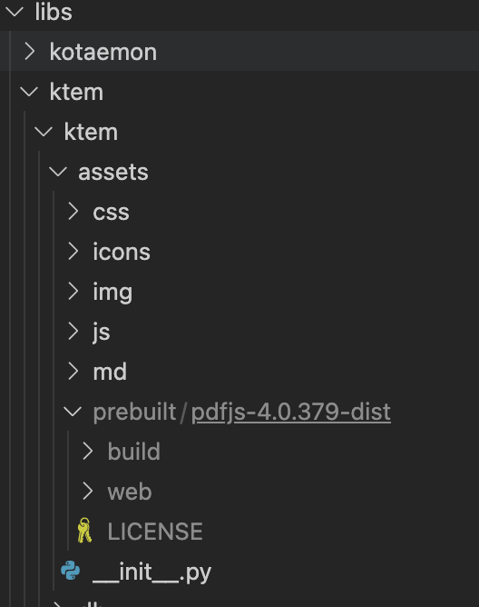
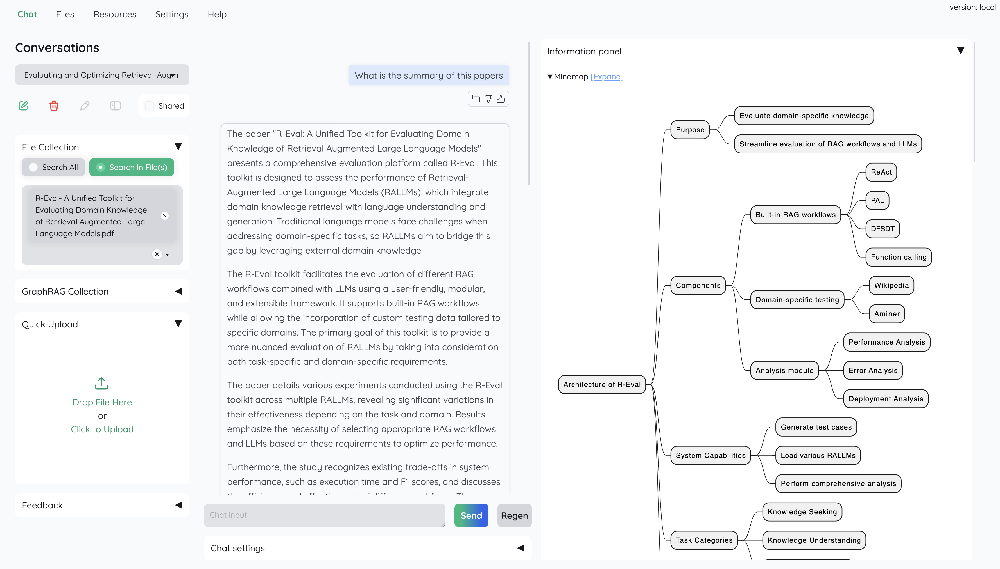
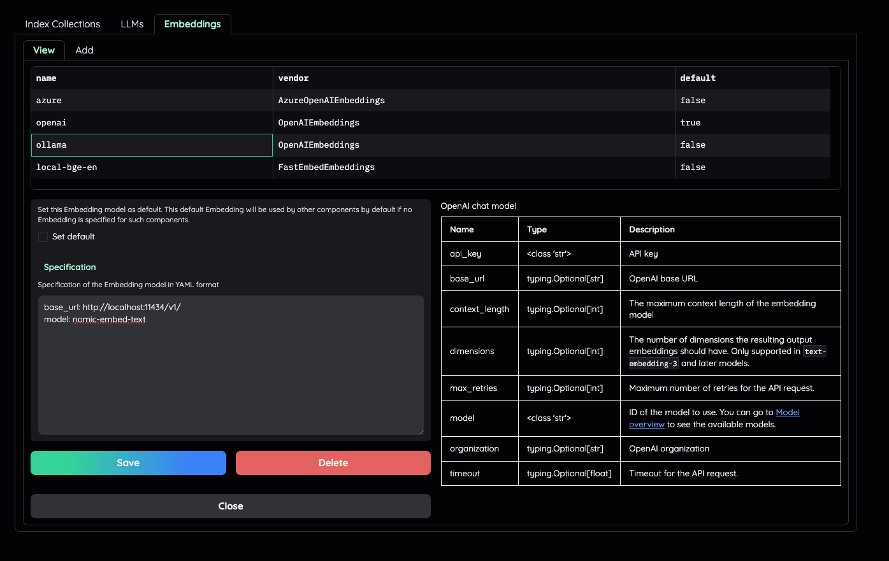

# kotaemon

[https://github.com/Cinnamon/kotaemon](https://github.com/Cinnamon/kotaemon)

[https://github.com/gradio-app/gradio](https://github.com/gradio-app/gradio)

[https://cinnamon.github.io/kotaemon/#download](https://cinnamon.github.io/kotaemon/#download)

### 1.创建虚拟环境
```sql
python -m venv koteamon
```

### 2.激活虚拟环境
```sql
koteamon\Scripts\activate
```

### 3.安装
```plain
# clone this repo
git clone https://github.com/Cinnamon/kotaemon
cd kotaemon

pip install -e "libs/kotaemon[all]"
pip install -e "libs/ktem"
```

```sql
python -m nltk.downloader punkt
pip install nano-graphrag
```

<font style="color:#000000;background-color:#FFFFFF;">一个开源的干净且可自定义的 RAG UI，用于与您的文档进行聊天。在构建时充分考虑了最终用户和开发人员。</font>

## <font style="color:#000000;background-color:#FAFAFA;">介绍</font>
<font style="color:#000000;background-color:#FAFAFA;">该</font><font style="color:#000000;background-color:#FFFFFF;">项目作为一个功能性的 RAG UI，适用于想要对其文档进行 QA 的最终用户和想要构建自己的 RAG 管道的开发人员。</font><font style="color:rgb(240, 246, 252);background-color:rgb(13, 17, 23);">  
</font>

```sql

```

### <font style="color:#000000;background-color:#FFFFFF;">对于最终用户</font>
+ **<font style="color:#000000;background-color:#FFFFFF;">简洁明了的用户界面</font>**<font style="color:#000000;background-color:#FFFFFF;">：基于 RAG 的 QA 的用户友好界面。</font>
+ **<font style="color:#000000;background-color:#FFFFFF;">支持各种 LLM</font>**<font style="color:#000000;background-color:#FFFFFF;">：兼容 LLM API 提供商（OpenAI、AzureOpenAI、Cohere 等）和本地 LLM（通过</font>`<font style="color:#000000;background-color:#FFFFFF;">ollama</font>`<font style="color:#000000;background-color:#FFFFFF;">和</font>`<font style="color:#000000;background-color:#FFFFFF;">llama-cpp-python</font>`<font style="color:#000000;background-color:#FFFFFF;">）。</font>
+ **<font style="color:#000000;background-color:#FFFFFF;">易于安装</font>**<font style="color:#000000;background-color:#FFFFFF;">：简单的脚本可让您快速开始。</font>

### <font style="color:#000000;background-color:#FFFFFF;">对于开发人员</font>
+ **<font style="color:#000000;background-color:#FFFFFF;">RAG 管道框架</font>**<font style="color:#000000;background-color:#FFFFFF;">：用于构建您自己的基于 RAG 的文档 QA 管道的工具。</font>
+ **<font style="color:#000000;background-color:#FFFFFF;">可定制的 UI ：使用</font>**[<font style="color:#000000;background-color:#FFFFFF;">Gradio</font>](https://github.com/gradio-app/gradio)<font style="color:#000000;background-color:#FFFFFF;">构建的 UI 查看 RAG 管道的运行情况</font><font style="color:#000000;background-color:#FFFFFF;">。</font>
+ **<font style="color:#000000;background-color:#FFFFFF;">Gradio 主题</font>**<font style="color:#000000;background-color:#FFFFFF;">：如果您使用 Gradio 进行开发，请查看我们的主题：</font>[<font style="color:#000000;background-color:#FFFFFF;">kotaemon-gradio-theme</font>](https://github.com/lone17/kotaemon-gradio-theme)<font style="color:#000000;background-color:#FFFFFF;">。</font>

## <font style="color:#000000;background-color:#FFFFFF;">主要特点</font>
+ **<font style="color:#000000;background-color:#FFFFFF;">托管您自己的文档 QA（RAG）web-UI</font>**<font style="color:#000000;background-color:#FFFFFF;">：支持多用户登录，在私人/公共收藏中组织您的文件，与他人协作并分享您最喜欢的聊天。</font>
+ **<font style="color:#000000;background-color:#FFFFFF;">组织您的 LLM 和嵌入模型</font>**<font style="color:#000000;background-color:#FFFFFF;">：支持本地 LLM 和流行的 API 提供商（OpenAI、Azure、Ollama、Groq）。</font>
+ **<font style="color:#000000;background-color:#FFFFFF;">混合 RAG 管道</font>**<font style="color:#000000;background-color:#FFFFFF;">：合理的默认 RAG 管道采用混合（全文和矢量）检索器和重新排名，以确保最佳检索质量。</font>
+ **<font style="color:#000000;background-color:#FFFFFF;">多模式问答支持</font>**<font style="color:#000000;background-color:#FFFFFF;">：使用图表和表格对多个文档进行问答。支持多模式文档解析（可在 UI 上选择选项）。</font>
+ **<font style="color:#000000;background-color:#FFFFFF;">带有文档预览的高级引文</font>**<font style="color:#000000;background-color:#FFFFFF;">：默认情况下，系统将提供详细的引文以确保 LLM 答案的正确性。直接在</font>_<font style="color:#000000;background-color:#FFFFFF;">浏览器内置的 PDF 查看器</font>_<font style="color:#000000;background-color:#FFFFFF;">中以高亮显示您的引文（包括相关分数）。当检索管道返回相关性低的文章时会发出警告。</font>
+ **<font style="color:#000000;background-color:#FFFFFF;">支持复杂的推理方法</font>**<font style="color:#000000;background-color:#FFFFFF;">：使用问题分解来回答您的复杂/多跳问题。支持基于代理的推理</font>`<font style="color:#000000;background-color:#FFFFFF;">ReAct</font>`<font style="color:#000000;background-color:#FFFFFF;">，包括</font>`<font style="color:#000000;background-color:#FFFFFF;">ReWOO</font>`<font style="color:#000000;background-color:#FFFFFF;">和其他代理。</font>
+ **<font style="color:#000000;background-color:#FFFFFF;">可配置设置 UI</font>**<font style="color:#000000;background-color:#FFFFFF;">：您可以在 UI 上调整检索和生成过程的最重要方面（包括提示）。</font>
+ **<font style="color:#000000;background-color:#FFFFFF;">可扩展</font>**<font style="color:#000000;background-color:#FFFFFF;">：基于 Gradio 构建，您可以随意自定义或添加任何 UI 元素。此外，我们的目标是支持多种文档索引和检索策略。</font>`<font style="color:#000000;background-color:#FFFFFF;">GraphRAG</font>`<font style="color:#000000;background-color:#FFFFFF;">索引管道作为示例提供。</font>


## <font style="color:#000000;background-color:#FFFFFF;">安装</font>
<font style="color:#000000;background-color:#FFFFFF;">如果您不是开发人员，而只是想使用该应用程序，请查看我们简单易懂的</font>[<font style="color:#000000;background-color:#FFFFFF;">用户指南</font>](https://cinnamon.github.io/kotaemon/)<font style="color:#000000;background-color:#FFFFFF;">。</font>`<font style="color:#000000;background-color:#FFFFFF;">.zip</font>`<font style="color:#000000;background-color:#FFFFFF;">从</font>[<font style="color:#000000;background-color:#FFFFFF;">最新版本</font>](https://github.com/Cinnamon/kotaemon/releases/latest)<font style="color:#000000;background-color:#FFFFFF;">下载文件以获取所有最新功能和错误修复。</font>

### <font style="color:#000000;background-color:#FFFFFF;">系统要求</font>
1. [<font style="color:#000000;background-color:#FFFFFF;">Python</font>](https://www.python.org/downloads/)<font style="color:#000000;background-color:#FFFFFF;"> </font><font style="color:#000000;background-color:#FFFFFF;">>= 3.10</font>
2. [<font style="color:#000000;background-color:#FFFFFF;">Docker</font>](https://www.docker.com/)<font style="color:#000000;background-color:#FFFFFF;">：可选，如果你</font>[<font style="color:#000000;background-color:#FFFFFF;">使用 Docker 安装</font>](https://github.com/Cinnamon/kotaemon#with-docker-recommended)
3. <font style="color:#000000;background-color:#FFFFFF;">如果您要处理除</font>`<font style="color:#000000;background-color:#FFFFFF;">.pdf</font>`<font style="color:#000000;background-color:#FFFFFF;">、</font>`<font style="color:#000000;background-color:#FFFFFF;">.html</font>`<font style="color:#000000;background-color:#FFFFFF;">、</font>`<font style="color:#000000;background-color:#FFFFFF;">.mhtml</font>`<font style="color:#000000;background-color:#FFFFFF;">和文档之外的文件，则为</font>[<font style="color:#000000;background-color:#FFFFFF;">非结构化</font>](https://docs.unstructured.io/open-source/installation/full-installation#full-installation)`<font style="color:#000000;background-color:#FFFFFF;">.xlsx</font>`<font style="color:#000000;background-color:#FFFFFF;">文件。安装步骤因操作系统而异。请访问链接并按照那里提供的具体说明进行操作。</font>

### <font style="color:#000000;background-color:#FFFFFF;">使用 Docker（推荐）</font>
1. <font style="color:#000000;background-color:#FFFFFF;">我们支持</font>`<font style="color:#000000;background-color:#FFFFFF;">lite</font>`<font style="color:#000000;background-color:#FFFFFF;">和</font>`<font style="color:#000000;background-color:#FFFFFF;">full</font>`<font style="color:#000000;background-color:#FFFFFF;">版本的 Docker 镜像。使用，</font><font style="color:#000000;background-color:#FFFFFF;">还将安装 的</font>`<font style="color:#000000;background-color:#FFFFFF;">full</font>`<font style="color:#000000;background-color:#FFFFFF;">额外软件包，它可以支持其他文件类型（</font><font style="color:#000000;background-color:#FFFFFF;"> </font><font style="color:#000000;background-color:#FFFFFF;">、</font><font style="color:#000000;background-color:#FFFFFF;">、...），但代价是 docker 镜像大小更大。对于大多数用户来说，该</font><font style="color:#000000;background-color:#FFFFFF;">镜像在大多数情况下应该可以正常工作。</font>`<font style="color:#000000;background-color:#FFFFFF;">unstructured</font>``<font style="color:#000000;background-color:#FFFFFF;">.doc</font>``<font style="color:#000000;background-color:#FFFFFF;">.docx</font>``<font style="color:#000000;background-color:#FFFFFF;">lite</font>`
    - <font style="color:#000000;background-color:#FFFFFF;">使用该</font>`<font style="color:#000000;background-color:#FFFFFF;">lite</font>`<font style="color:#000000;background-color:#FFFFFF;">版本。</font>

```plain
docker run \
-e GRADIO_SERVER_NAME=0.0.0.0 \
-e GRADIO_SERVER_PORT=7860 \
-p 7860:7860 -it --rm \
ghcr.io/cinnamon/kotaemon:main-lite
```

```plain
docker run \
-e GRADIO_SERVER_NAME=0.0.0.0 \
-e GRADIO_SERVER_PORT=7860 \
-p 7860:7860 -it --rm \
ghcr.io/cinnamon/kotaemon:main-full
```

2. <font style="color:rgb(240, 246, 252);background-color:rgb(13, 17, 23);">我们目前支持并测试两个平台：</font>`<font style="color:rgb(240, 246, 252);background-color:rgb(13, 17, 23);">linux/amd64</font>`<font style="color:rgb(240, 246, 252);background-color:rgb(13, 17, 23);">和（适用于较新的 Mac）。您可以通过</font><font style="color:rgb(240, 246, 252);background-color:rgb(13, 17, 23);">传入命令</font>`<font style="color:rgb(240, 246, 252);background-color:rgb(13, 17, 23);">linux/arm64</font>`<font style="color:rgb(240, 246, 252);background-color:rgb(13, 17, 23);">来指定平台</font><font style="color:rgb(240, 246, 252);background-color:rgb(13, 17, 23);">。例如：</font>`<font style="color:rgb(240, 246, 252);background-color:rgb(13, 17, 23);">--platform</font>``<font style="color:rgb(240, 246, 252);background-color:rgb(13, 17, 23);">docker run</font>`

```plain
# To run docker with platform linux/arm64
docker run \
-e GRADIO_SERVER_NAME=0.0.0.0 \
-e GRADIO_SERVER_PORT=7860 \
-p 7860:7860 -it --rm \
--platform linux/arm64 \
ghcr.io/cinnamon/kotaemon:main-lite
```

3. <font style="color:rgb(240, 246, 252);background-color:rgb(13, 17, 23);">一旦一切设置正确，您就可以</font>`<font style="color:rgb(240, 246, 252);background-color:rgb(13, 17, 23);">http://localhost:7860/</font>`<font style="color:rgb(240, 246, 252);background-color:rgb(13, 17, 23);">访问 WebUI。</font>
4. <font style="color:rgb(240, 246, 252);background-color:rgb(13, 17, 23);">我们使用</font>[<font style="color:rgb(240, 246, 252);background-color:rgb(13, 17, 23);">GHCR</font>](https://docs.github.com/en/packages/working-with-a-github-packages-registry/working-with-the-container-registry)<font style="color:rgb(240, 246, 252);background-color:rgb(13, 17, 23);">来存储 docker 镜像，所有镜像都可以在这里找到</font>[<font style="color:rgb(240, 246, 252);background-color:rgb(13, 17, 23);">。</font>](https://github.com/Cinnamon/kotaemon/pkgs/container/kotaemon)

### <font style="color:rgb(240, 246, 252);background-color:rgb(13, 17, 23);">没有Docker</font>
1. <font style="color:rgb(240, 246, 252);background-color:rgb(13, 17, 23);">在全新的 Python 环境上克隆并安装所需的包。</font>

```plain
# optional (setup env)
conda create -n kotaemon python=3.10
conda activate kotaemon

# clone this repo
git clone https://github.com/Cinnamon/kotaemon
cd kotaemon

pip install -e "libs/kotaemon[all]"
pip install -e "libs/ktem"
```

2. `<font style="color:rgb(240, 246, 252);background-color:rgb(13, 17, 23);">.env</font>`<font style="color:rgb(240, 246, 252);background-color:rgb(13, 17, 23);">在该项目的根目录中</font><font style="color:rgb(240, 246, 252);background-color:rgb(13, 17, 23);">创建一个文件。用作</font>`<font style="color:rgb(240, 246, 252);background-color:rgb(13, 17, 23);">.env.example</font>`<font style="color:rgb(240, 246, 252);background-color:rgb(13, 17, 23);">模板</font>

<font style="color:rgb(240, 246, 252);background-color:rgb(13, 17, 23);">该</font>`<font style="color:rgb(240, 246, 252);background-color:rgb(13, 17, 23);">.env</font>`<font style="color:rgb(240, 246, 252);background-color:rgb(13, 17, 23);">文件用于用户希望在启动应用程序之前预先配置模型的用例（例如在 HF 集线器上部署应用程序）。该文件将仅在首次运行时用于填充数据库一次，在后续运行中将不再使用。</font>

3. <font style="color:rgb(240, 246, 252);background-color:rgb(13, 17, 23);">（可选）要启用浏览器内查看</font>`<font style="color:rgb(240, 246, 252);background-color:rgb(13, 17, 23);">PDF_JS</font>`<font style="color:rgb(240, 246, 252);background-color:rgb(13, 17, 23);">器，请下载</font>[<font style="color:rgb(240, 246, 252);background-color:rgb(13, 17, 23);">PDF_JS_DIST</font>](https://github.com/mozilla/pdf.js/releases/download/v4.0.379/pdfjs-4.0.379-dist.zip)<font style="color:rgb(240, 246, 252);background-color:rgb(13, 17, 23);">，然后将其解压到</font>`<font style="color:rgb(240, 246, 252);background-color:rgb(13, 17, 23);">libs/ktem/ktem/assets/prebuilt</font>`



<font style="color:rgb(240, 246, 252);background-color:rgb(13, 17, 23);">启动 Web 服务器：</font>

1. <font style="color:rgb(240, 246, 252);background-color:rgb(13, 17, 23);">python app.py</font>
    - <font style="color:rgb(240, 246, 252);background-color:rgb(13, 17, 23);">该应用程序将在您的浏览器中自动启动。</font>
    - <font style="color:rgb(240, 246, 252);background-color:rgb(13, 17, 23);">默认用户名和密码均为</font>`<font style="color:rgb(240, 246, 252);background-color:rgb(13, 17, 23);">admin</font>`<font style="color:rgb(240, 246, 252);background-color:rgb(13, 17, 23);">。您可以直接通过 UI 设置其他用户。</font>



2. <font style="color:rgb(240, 246, 252);background-color:rgb(13, 17, 23);">检查</font>`<font style="color:rgb(240, 246, 252);background-color:rgb(13, 17, 23);">Resources</font>`<font style="color:rgb(240, 246, 252);background-color:rgb(13, 17, 23);">选项卡并</font>`<font style="color:rgb(240, 246, 252);background-color:rgb(13, 17, 23);">LLMs and Embeddings</font>`<font style="color:rgb(240, 246, 252);background-color:rgb(13, 17, 23);">确保文件</font>`<font style="color:rgb(240, 246, 252);background-color:rgb(13, 17, 23);">api_key</font>`<font style="color:rgb(240, 246, 252);background-color:rgb(13, 17, 23);">中的值设置正确</font>`<font style="color:rgb(240, 246, 252);background-color:rgb(13, 17, 23);">.env</font>`<font style="color:rgb(240, 246, 252);background-color:rgb(13, 17, 23);">。如果未设置，您可以在此处进行设置。</font>

### <font style="color:rgb(240, 246, 252);background-color:rgb(13, 17, 23);">设置 GraphRAG</font>
<font style="background-color:rgb(13, 17, 23);">笔记</font>

<font style="color:rgb(240, 246, 252);background-color:rgb(13, 17, 23);">官方 MS GraphRAG 索引仅适用于 OpenAI 或 Ollama API。我们建议大多数用户使用 NanoGraphRAG 实现，以便直接与 Kotaemon 集成。</font>

<font style="color:rgb(240, 246, 252);background-color:rgb(13, 17, 23);">设置 Nano GRAPHRAG</font>

<font style="color:rgb(240, 246, 252);background-color:rgb(13, 17, 23);">设置 LIGHTRAG</font>

<font style="color:rgb(240, 246, 252);background-color:rgb(13, 17, 23);">设置 MS GRAPHRAG</font>

### <font style="color:rgb(240, 246, 252);background-color:rgb(13, 17, 23);">设置本地模型（用于本地/私有 RAG）</font>
<font style="color:rgb(240, 246, 252);background-color:rgb(13, 17, 23);">参见</font>[<font style="color:rgb(240, 246, 252);background-color:rgb(13, 17, 23);">本地模型设置</font>](https://github.com/Cinnamon/kotaemon/blob/main/docs/local_model.md)<font style="color:rgb(240, 246, 252);background-color:rgb(13, 17, 23);">。</font>

### <font style="color:rgb(240, 246, 252);background-color:rgb(13, 17, 23);">设置多模式文档解析（OCR、表格解析、图形提取）</font>
<font style="color:rgb(240, 246, 252);background-color:rgb(13, 17, 23);">有以下选项可用：</font>

+ [<font style="color:rgb(240, 246, 252);background-color:rgb(13, 17, 23);">Azure 文档智能 (API)</font>](https://azure.microsoft.com/en-us/products/ai-services/ai-document-intelligence)
+ [<font style="color:rgb(240, 246, 252);background-color:rgb(13, 17, 23);">Adobe PDF 提取 (API)</font>](https://developer.adobe.com/document-services/docs/overview/pdf-extract-api/)
+ [<font style="color:rgb(240, 246, 252);background-color:rgb(13, 17, 23);">Docling（本地，开源）</font>](https://github.com/DS4SD/docling)
    - <font style="color:rgb(240, 246, 252);background-color:rgb(13, 17, 23);">要使用 Docling，首先安装所需的依赖项：</font>`<font style="color:rgb(240, 246, 252);background-color:rgb(13, 17, 23);">pip install docling</font>`

<font style="color:rgb(240, 246, 252);background-color:rgb(13, 17, 23);">在中选择相应的加载器</font>`<font style="color:rgb(240, 246, 252);background-color:rgb(13, 17, 23);">Settings -> Retrieval Settings -> File loader</font>`

### <font style="color:rgb(240, 246, 252);background-color:rgb(13, 17, 23);">自定义您的应用程序</font>
+ <font style="color:rgb(240, 246, 252);background-color:rgb(13, 17, 23);">默认情况下，所有应用程序数据都存储在该</font>`<font style="color:rgb(240, 246, 252);background-color:rgb(13, 17, 23);">./ktem_app_data</font>`<font style="color:rgb(240, 246, 252);background-color:rgb(13, 17, 23);">文件夹中。您可以备份或复制此文件夹以将安装转移到新机器。</font>
+ <font style="color:rgb(240, 246, 252);background-color:rgb(13, 17, 23);">对于高级用户或特定用例，您可以自定义这些文件：</font>
    - `<font style="color:rgb(240, 246, 252);background-color:rgb(13, 17, 23);">flowsettings.py</font>`
    - `<font style="color:rgb(240, 246, 252);background-color:rgb(13, 17, 23);">.env</font>`

#### `<font style="color:rgb(240, 246, 252);background-color:rgb(13, 17, 23);">flowsettings.py</font>`
[<font style="color:rgb(240, 246, 252);background-color:rgb(13, 17, 23);">此文件包含应用程序的配置。您可以使用此处的</font>](https://github.com/Cinnamon/kotaemon/blob/main/flowsettings.py)<font style="color:rgb(240, 246, 252);background-color:rgb(13, 17, 23);">示例</font><font style="color:rgb(240, 246, 252);background-color:rgb(13, 17, 23);"> </font><font style="color:rgb(240, 246, 252);background-color:rgb(13, 17, 23);">作为起点。</font>

<font style="color:rgb(240, 246, 252);background-color:rgb(13, 17, 23);">值得注意的设置</font>

#### `<font style="color:rgb(240, 246, 252);background-color:rgb(13, 17, 23);">.env</font>`
<font style="color:rgb(240, 246, 252);background-color:rgb(13, 17, 23);">该文件提供了另一种配置模型和凭证的方法。</font>

<font style="color:rgb(240, 246, 252);background-color:rgb(13, 17, 23);">通过 .env 文件配置模型</font>

            + 

### <font style="color:rgb(240, 246, 252);background-color:rgb(13, 17, 23);">添加您自己的 RAG 管道</font>
#### <font style="color:rgb(240, 246, 252);background-color:rgb(13, 17, 23);">自定义推理管道</font>
1. [<font style="color:rgb(240, 246, 252);background-color:rgb(13, 17, 23);">在这里</font>](https://github.com/Cinnamon/kotaemon/blob/main/libs/ktem/ktem/reasoning/simple.py)<font style="color:rgb(240, 246, 252);background-color:rgb(13, 17, 23);">查看默认管道的实现</font><font style="color:rgb(240, 246, 252);background-color:rgb(13, 17, 23);">。您可以快速调整默认 QA 管道的工作方式。</font>
2. <font style="color:rgb(240, 246, 252);background-color:rgb(13, 17, 23);">添加新的</font>`<font style="color:rgb(240, 246, 252);background-color:rgb(13, 17, 23);">.py</font>`<font style="color:rgb(240, 246, 252);background-color:rgb(13, 17, 23);">实现</font>`<font style="color:rgb(240, 246, 252);background-color:rgb(13, 17, 23);">libs/ktem/ktem/reasoning/</font>`<font style="color:rgb(240, 246, 252);background-color:rgb(13, 17, 23);">，然后将其包含在内</font>`<font style="color:rgb(240, 246, 252);background-color:rgb(13, 17, 23);">flowssettings</font>`<font style="color:rgb(240, 246, 252);background-color:rgb(13, 17, 23);">以在 UI 上启用它。</font>

#### <font style="color:rgb(240, 246, 252);background-color:rgb(13, 17, 23);">自定义索引管道</font>
+ <font style="color:rgb(240, 246, 252);background-color:rgb(13, 17, 23);">检查示例实施</font>`<font style="color:rgb(240, 246, 252);background-color:rgb(13, 17, 23);">libs/ktem/ktem/index/file/graph</font>`

<font style="background-color:rgb(13, 17, 23);">（更多说明正在进行中）。</font>

## <font style="color:rgb(240, 246, 252);background-color:rgb(13, 17, 23);">引用</font>
<font style="color:rgb(240, 246, 252);background-color:rgb(13, 17, 23);">请引用此项目为</font>

```plain
@misc{kotaemon2024,
    title = {Kotaemon - An open-source RAG-based tool for chatting with any content.},
    author = {The Kotaemon Team},
    year = {2024},
    howpublished = {\url{https://github.com/Cinnamon/kotaemon}},
}
```

## <font style="color:rgb(240, 246, 252);background-color:rgb(13, 17, 23);">星历史</font>


> 更新: 2025-01-12 09:52:24  
> 原文: <https://www.yuque.com/lixinsi/vnere7/luih8ng5ytqm53v2>