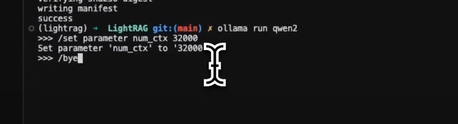
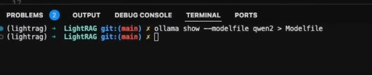
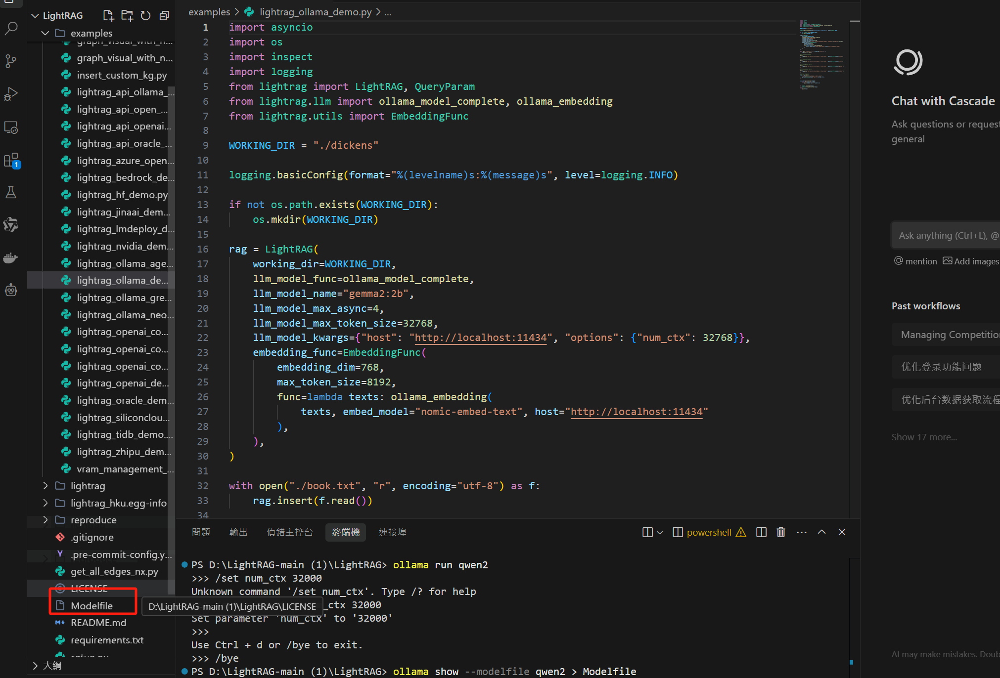
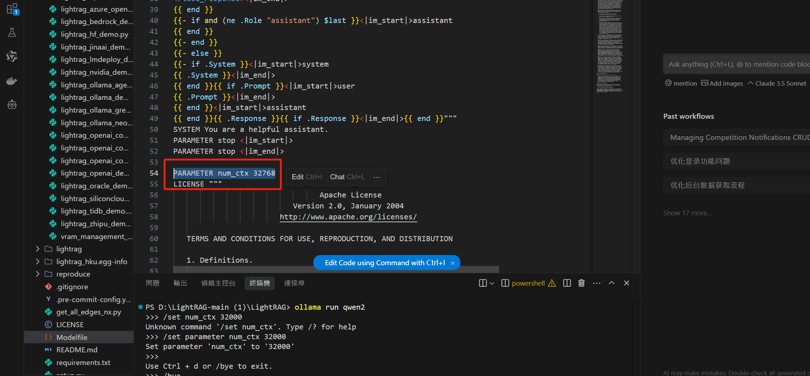
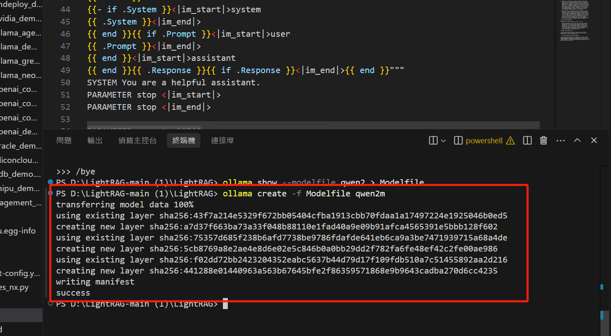
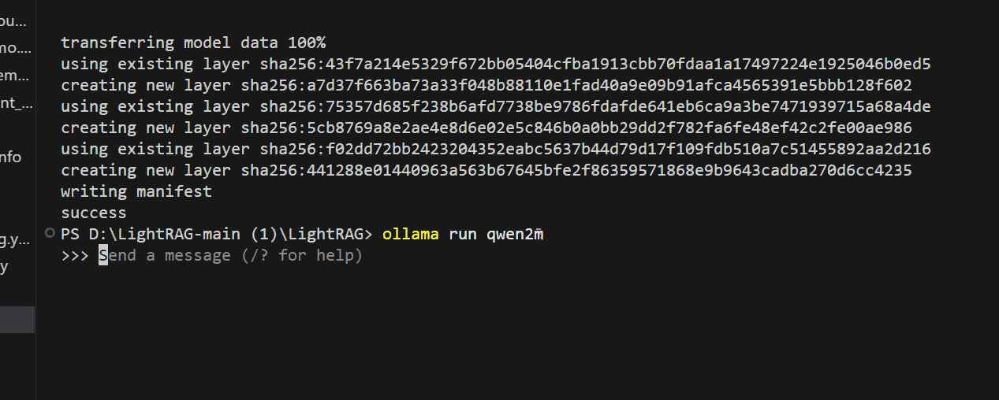
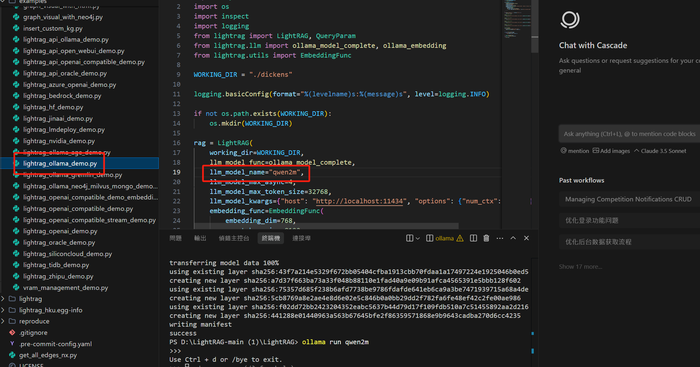
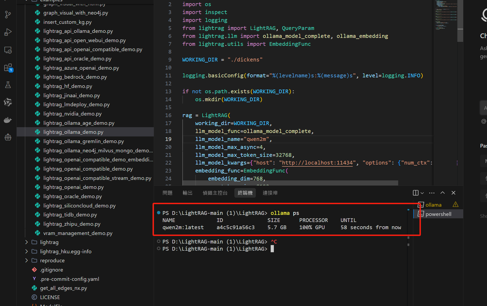

# lightrag问答系统

技术栈neo4j d3.js

### 导出所有模块
```python
pip freeze > requirements.txt
```

1 创建虚拟环境

```python
python -m venv lightrag
```

2.激活虚拟环境

```python
lightrag\Scripts\activate.bat
```

3.安装

```python
cd LightRAG
pip install -e .
```

```python
pip install lightrag-hku
```

```python
ollama pull nomic-embed-text
```

```python
ollama pull qwen2
```

```python
ollama run qwen2
```

```python
ollama run qwen2 >>> /set parameter num_ctx 32000
```

```python
/bye
```



```python
ollama rm llama3
```



```python
 ollama show --modelfile qwen2 > Modelfile
```




Modefile 添加配置

```python
PARAMETER num_ctx 32768
```




```python
 ollama create -f Modelfile qwen2m
```




```python
ollama run qwen2m
```




修改lightrag_ollama_demo 第 19 行




接下来是文本模型配置，进入另外一个终端

```python
 ollama ps
```



ollama 在局域网访问

```python
OLLAMA_HOST=0.0.0.0:11434 ollama serve
```


测试 ollama 在硬件设备上面可以跑什么型号的模型

标准是每秒能出多少 token

```python
ollama run --verbose qwen2m
```

[https://www.youtube.com/watch?v=g21royNJ4fw](https://www.youtube.com/watch?v=g21royNJ4fw)

[https://github.com/h2oai/h2ogpt](https://github.com/h2oai/h2ogpt)

[https://cloud.tencent.com/developer/article/2474817](https://cloud.tencent.com/developer/article/2474817)

[https://github.com/severian42/GraphRAG-Local-UI](https://github.com/severian42/GraphRAG-Local-UI)

[https://github.com/microsoft/graphrag](https://github.com/microsoft/graphrag)

[https://github.com/adoresever](https://github.com/adoresever)

[https://www.53ai.com/news/RAG/2024072729431.html](https://www.53ai.com/news/RAG/2024072729431.html)

[https://github.com/Cinnamon/kotaemon](https://github.com/Cinnamon/kotaemon)  //UI


[https://github.com/spmallick/learnopencv/tree/master/LightRAG-Legal](https://github.com/spmallick/learnopencv/tree/master/LightRAG-Legal)


> 更新: 2025-01-07 10:30:21  
> 原文: <https://www.yuque.com/lixinsi/vnere7/lk4t4r2gggx6wvxa>