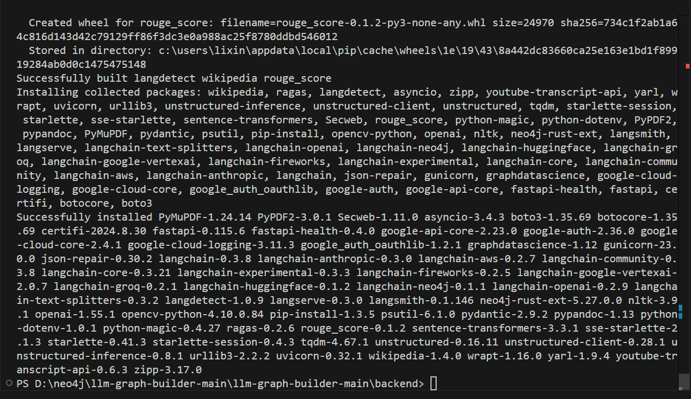
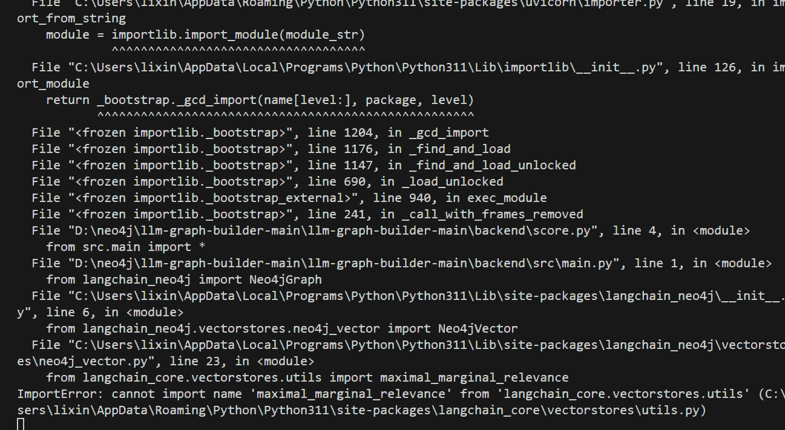
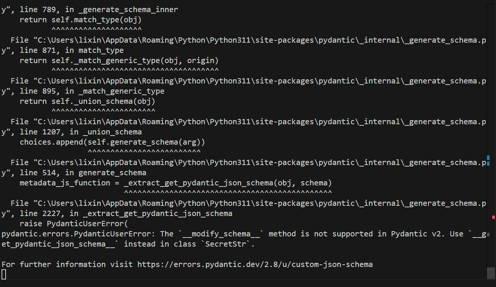

# llm-graph-builder本地部署

### 1. 先创建一个虚拟环境：  
  
d:/neo4j/llm-graph-builder-main/llm-graph-builder-main/backend
```python
python -m venv venv
```

### 2. 激活虚拟环境  
d:/neo4j/llm-graph-builder-main/llm-graph-builder-main/backend
```python
venv\Scripts\activate.bat
uvicorn score:app --reload
```

### 3. 升级pip：  
d:/neo4j/llm-graph-builder-main/llm-graph-builder-main/backend
```python
python -m pip install --upgrade pip
```

### 4.安装每一个包
```python
pip install --no-deps --ignore-installed -r requirements.txt
```




```python
cd backend
python -m venv envName
source envName/bin/activate
pip install -r requirements.txt
uvicorn score:app --reload
```

问题 1 遇到不兼容包



### <font style="color:#000000;background-color:#FFFFFF;">首先卸载所有相关包：</font>
```python
pip uninstall langchain langchain-core langchain-neo4j langchain-community -y
```

### <font style="color:#000000;background-color:#FFFFFF;">安装最新版本的langchain和相关包：</font>
```python
pip install langchain langchain-core langchain-community langchain-neo4j
```

### <font style="color:#000000;background-color:#FFFFFF;">重新运行</font>
```python
uvicorn score:app --reload
```

### 报错二



```plsql
addict==2.4.0
aiofiles==24.1.0
aiohttp @ file:///C:/b/abs_27h_1rpxgd/croot/aiohttp_1707342354614/work
aiosignal @ file:///tmp/build/80754af9/aiosignal_1637843061372/work
aliyun-python-sdk-core==2.16.0
aliyun-python-sdk-kms==2.16.5
annotated-types @ file:///C:/b/abs_0dmaoyhhj3/croot/annotated-types_1709542968311/work
anthropic==0.42.0
antlr4-python3-runtime @ file:///C:/b/abs_c9w97x2r8d/croot/antlr4-python3-runtime_1700663172369/work
anyio==4.3.0
asttokens==3.0.0
async-timeout @ file:///C:/b/abs_c8fgiuixkq/croot/async-timeout_1703097556097/work
asyncio==3.4.3
attrs==23.2.0
backoff @ file:///C:/b/abs_536uqkuxf5/croot/backoff_1693552564304/work
beautifulsoup4 @ file:///C:/b/abs_d5wytg_p0w/croot/beautifulsoup4-split_1718029833749/work
boto3==1.34.140
botocore==1.34.140
Brotli @ file:///C:/b/abs_c415aux9ra/croot/brotli-split_1736182803933/work
cachetools @ file:///C:/b/abs_792zbtc0ua/croot/cachetools_1713977157919/work
certifi @ file:///C:/b/abs_35d7n66oz9/croot/certifi_1707229248467/work/certifi
cffi @ file:///C:/b/abs_78eb1_vq6z/croot/cffi_1714483206096/work
chardet==5.2.0
charset-normalizer @ file:///croot/charset-normalizer_1721748349566/work
click @ file:///C:/b/abs_f9ihnt72pu/croot/click_1698129847492/work
colorama @ file:///C:/b/abs_a9ozq0l032/croot/colorama_1672387194846/work
coloredlogs @ file:///C:/b/abs_5161rq1a7g/croot/coloredlogs_1709248519941/work
contourpy @ file:///C:/b/abs_853rfy8zse/croot/contourpy_1700583617587/work
crcmod==1.7
cryptography @ file:///C:/b/abs_f4do8t8jfs/croot/cryptography_1694444424531/work
cycler @ file:///tmp/build/80754af9/cycler_1637851556182/work
dataclasses-json==0.6.4
dataclasses-json-speakeasy==0.5.11
datasets==2.18.0
decorator==5.1.1
deepdiff==8.1.1
defusedxml==0.7.1
Deprecated==1.2.14
dill==0.3.8
distro @ file:///C:/b/abs_71xr36ua5r/croot/distro_1714488282676/work
dnspython==2.7.0
docstring_parser==0.16
effdet==0.4.1
einops==0.8.0
email_validator==2.2.0
emoji==2.10.1
et_xmlfile==2.0.0
eval_type_backport==0.2.2
exceptiongroup @ file:///C:/b/abs_c5h1o1_b5b/croot/exceptiongroup_1706031441653/work
executing==2.1.0
fastapi==0.111.0
fastapi-cli==0.0.7
fastapi-health==0.4.0
filelock @ file:///C:/b/abs_f2gie28u58/croot/filelock_1700591233643/work
filetype==1.2.0
fireworks-ai==0.15.11
flatbuffers==23.5.26
fonttools==4.49.0
frozenlist==1.4.1
fsspec==2024.2.0
gast==0.6.0
gmpy2 @ file:///C:/ci/gmpy2_1645455782955/work
google-ai-generativelanguage==0.6.6
google-api-core==2.18.0
google-api-python-client==2.157.0
google-auth @ file:///C:/b/abs_059sl2dhu6/croot/google-auth_1715111206543/work
google-auth-httplib2==0.2.0
google-auth-oauthlib==1.2.0
google-cloud-aiplatform==1.58.0
google-cloud-appengine-logging==1.5.0
google-cloud-audit-log==0.3.0
google-cloud-bigquery==3.19.0
google-cloud-core==2.4.1
google-cloud-logging==3.10.0
google-cloud-resource-manager==1.12.3
google-cloud-storage==2.17.0
google-cloud-vision==3.9.0
google-crc32c @ file:///C:/b/abs_f8g37ql__2/croot/google-crc32c_1667946622512/work
google-generativeai==0.7.2
google-resumable-media==2.7.0
googleapis-common-protos==1.63.0
greenlet==3.0.3
groq==0.13.1
grpc-google-iam-v1==0.13.0
grpcio==1.62.1
grpcio-status==1.62.1
gunicorn==22.0.0
h11 @ file:///C:/b/abs_1czwoyexjf/croot/h11_1706652332846/work
httpcore @ file:///C:/b/abs_55n7g233bw/croot/httpcore_1706728507241/work
httplib2==0.22.0
httptools==0.6.4
httpx @ file:///C:/b/abs_43e135shby/croot/httpx_1723474830126/work
httpx-sse==0.4.0
httpx-ws==0.7.1
huggingface-hub==0.27.1
humanfriendly @ file:///C:/b/abs_8ft6yjpkzg/croot/humanfriendly_1668016402880/work
idna==3.6
importlib-resources @ file:///C:/b/abs_d0dmp77t95/croot/importlib_resources-suite_1704281892795/work
importlib_metadata==8.5.0
iopath==0.1.10
ipython==8.18.1
itsdangerous==2.2.0
jedi==0.19.2
Jinja2 @ file:///C:/b/abs_f7x5a8op2h/croot/jinja2_1706733672594/work
jiter==0.8.2
jmespath @ file:///C:/b/abs_59jpuaows7/croot/jmespath_1700144635019/work
joblib==1.3.2
json_repair==0.25.2
jsonpatch @ file:///C:/b/abs_4fdm88t7zi/croot/jsonpatch_1714483974578/work
jsonpath-python==1.0.6
jsonpointer==2.1
jsonschema==4.23.0
jsonschema-specifications==2024.10.1
kiwisolver @ file:///C:/b/abs_88mdhvtahm/croot/kiwisolver_1672387921783/work
langchain==0.2.6
langchain-anthropic==0.1.19
langchain-aws==0.1.9
langchain-community==0.2.6
langchain-core==0.2.10
langchain-experimental==0.0.62
langchain-fireworks==0.1.4
langchain-google-genai==1.0.7
langchain-google-vertexai==1.0.6
langchain-groq==0.1.6
langchain-openai==0.1.14
langchain-text-splitters==0.2.2
langdetect==1.0.9
langserve==0.2.2
langsmith==0.1.83
layoutparser==0.3.4
lxml==5.1.0
Markdown==3.7
markdown-it-py==3.0.0
MarkupSafe @ file:///C:/b/abs_ecfdqh67b_/croot/markupsafe_1704206030535/work
marshmallow==3.20.2
matplotlib @ file:///C:/b/abs_085jhivdha/croot/matplotlib-suite_1693812524572/work
matplotlib-inline==0.1.7
mdurl==0.1.2
mkl-service==2.4.0
mkl_fft @ file:///C:/Users/dev-admin/mkl/mkl_fft_1730823082242/work
mkl_random @ file:///C:/Users/dev-admin/mkl/mkl_random_1730822522280/work
modelscope==1.15.0
mpmath @ file:///C:/b/abs_7833jrbiox/croot/mpmath_1690848321154/work
multidict==6.0.5
multiprocess==0.70.16
mypy-extensions==1.0.0
neo4j==5.27.0
neo4j-rust-ext==5.27.0.0
nest-asyncio==1.6.0
networkx @ file:///C:/b/abs_3bxnu56g9d/croot/networkx_1717597507456/work
nltk @ file:///C:/b/abs_a638z6l1z0/croot/nltk_1688114186909/work
numpy @ file:///C:/b/abs_c1ywpu18ar/croot/numpy_and_numpy_base_1708638681471/work/dist/numpy-1.26.4-cp39-cp39-win_amd64.whl#sha256=f284633067fde4bb078a09085a1c9e99a3218c129f5312b7b3d76c9340442a25
oauthlib==3.2.2
olefile==0.47
omegaconf==2.3.0
onnx==1.17.0
onnxruntime==1.19.2
openai==1.35.10
opencv-python==4.10.0.84
openpyxl==3.1.5
orderly-set==5.2.3
orjson @ file:///C:/b/abs_eauw4es9lp/croot/orjson_1711143111252/work/target/wheels/orjson-3.9.15-cp39-none-win_amd64.whl#sha256=7dd4d100427e1cae775d5a996db8d542767f4a622f6ac348ca2229b88b956a2b
oss2==2.19.1
packaging @ file:///C:/b/abs_cc1h2xfosn/croot/packaging_1710807447479/work
pandas==2.2.0
parso==0.8.4
pdf2image @ file:///C:/b/abs_89krx9_pna/croot/pdf2image_1732736442045/work
pdfminer.six==20221105
pdfplumber==0.10.4
pikepdf==8.11.0
pillow @ file:///C:/b/abs_e22m71t0cb/croot/pillow_1707233126420/work
pillow_heif==0.15.0
platformdirs==4.3.6
ply==3.11
portalocker==2.8.2
prompt_toolkit==3.0.48
propcache @ file:///C:/b/abs_d6o8xbonwb/croot/propcache_1732304003668/work
proto-plus==1.23.0
protobuf==4.23.4
pure_eval==0.2.3
pyarrow==18.1.0
pyarrow-hotfix==0.6
pyasn1 @ file:///Users/ktietz/demo/mc3/conda-bld/pyasn1_1629708007385/work
pyasn1-modules==0.2.8
pycocotools==2.0.8
pycparser @ file:///tmp/build/80754af9/pycparser_1636541352034/work
pycryptodome==3.21.0
pydantic @ file:///C:/b/abs_b7acb4hnl_/croot/pydantic_1725040540545/work
pydantic_core @ file:///C:/b/abs_3ax4s6v28p/croot/pydantic-core_1724790490828/work
Pygments==2.19.1
PyMuPDF==1.24.5
PyMuPDFb==1.24.3
pyOpenSSL @ file:///C:/b/abs_08f38zyck4/croot/pyopenssl_1690225407403/work
pypandoc==1.14
pyparsing @ file:///C:/Users/BUILDE~1/AppData/Local/Temp/abs_7f_7lba6rl/croots/recipe/pyparsing_1661452540662/work
pypdf==4.0.1
PyPDF2 @ file:///C:/b/abs_f4tepei_o0/croot/pypdf2_1733841487756/work
pypdfium2==4.27.0
pyproject-toml==0.0.10
PyQt5==5.15.10
PyQt5-sip @ file:///C:/b/abs_c0pi2mimq3/croot/pyqt-split_1698769125270/work/pyqt_sip
pyreadline3 @ file:///C:/b/abs_fawu2gkl1w/croots/recipe/pyreadline3_1664802149945/work
PySocks @ file:///C:/ci/pysocks_1605307512533/work
pytesseract==0.3.10
python-dateutil @ file:///tmp/build/80754af9/python-dateutil_1626374649649/work
python-docx==1.1.2
python-dotenv==1.0.1
python-iso639==2024.2.7
python-magic==0.4.27
python-multipart @ file:///C:/b/abs_31h4mrhodq/croot/python-multipart_1722930334768/work
python-oxmsg==0.0.1
python-pptx==0.6.23
pytube==15.0.0
pytz @ file:///C:/b/abs_6ap4tsz1ox/croot/pytz_1713974360290/work
pywin32==308
PyYAML==6.0.2
rapidfuzz==3.6.1
referencing==0.35.1
regex==2023.12.25
requests @ file:///C:/b/abs_c3508vg8ez/croot/requests_1731000584867/work
requests-oauthlib==2.0.0
requests-toolbelt==1.0.0
rich==13.9.4
rich-toolkit==0.12.0
rpds-py==0.22.3
rsa @ file:///tmp/build/80754af9/rsa_1614366226499/work
s3transfer @ file:///C:/b/abs_adqguval8n/croot/s3transfer_1714464471685/work
safetensors==0.5.0
scikit-learn==1.6.0
scipy==1.13.1
sentence-transformers==2.7.0
shapely==2.0.3
shellingham==1.5.4
simplejson==3.19.3
sip @ file:///C:/b/abs_edevan3fce/croot/sip_1698675983372/work
six @ file:///tmp/build/80754af9/six_1644875935023/work
sniffio @ file:///C:/b/abs_3akdewudo_/croot/sniffio_1705431337396/work
sortedcontainers==2.4.0
soupsieve @ file:///C:/b/abs_bbsvy9t4pl/croot/soupsieve_1696347611357/work
SQLAlchemy==2.0.28
sse-starlette==2.1.2
stack-data==0.6.3
starlette==0.37.2
starlette-session==0.4.3
sympy @ file:///C:/b/abs_82njkonm7f/croot/sympy_1701397685028/work
tabulate @ file:///C:/b/abs_21rf8iibnh/croot/tabulate_1701354830521/work
tenacity @ file:///C:/b/abs_d2_havtscu/croot/tenacity_1721222514290/work
threadpoolctl==3.5.0
tiktoken==0.7.0
timm==0.9.12
tokenizers==0.19.0
toml==0.10.2
tomli @ file:///C:/Windows/TEMP/abs_ac109f85-a7b3-4b4d-bcfd-52622eceddf0hy332ojo/croots/recipe/tomli_1657175513137/work
torch==2.5.1
torchvision==0.20.1
tornado @ file:///C:/b/abs_7cyu943ybx/croot/tornado_1733960510898/work
tqdm @ file:///C:/b/abs_551q5__bmw/croot/tqdm_1714567744381/work
traitlets==5.14.3
transformers==4.42.3
typer==0.15.1
types-futures @ file:///C:/b/abs_0dwbdx_yll/croot/types-futures_1684266177914/work
types-protobuf @ file:///C:/b/abs_c5dsgk7jx0/croot/types-protobuf_1722521430785/work
types-requests @ file:///C:/b/abs_1dtf6zh_dl/croot/types-requests_1684424597252/work
types-urllib3 @ file:///C:/b/abs_710wd1rn8w/croot/types-urllib3_1684364452261/work
typing-inspect==0.9.0
typing_extensions==4.12.2
tzdata==2024.1
ujson==5.10.0
unicodedata2 @ file:///C:/b/abs_b6apldlg7y/croot/unicodedata2_1713212998255/work
unstructured==0.14.9
unstructured-client==0.23.8
unstructured-inference==0.7.36
unstructured.pytesseract==0.3.12
uritemplate==4.1.1
urllib3 @ file:///C:/b/abs_eeswtzv5iq/croot/urllib3_1718978558630/work
uvicorn==0.30.1
volcengine-python-sdk==1.0.119
watchfiles==1.0.3
wcwidth==0.2.13
websockets==14.1
wikipedia==1.4.0
win-inet-pton @ file:///C:/ci/win_inet_pton_1605306162074/work
wrapt==1.16.0
wsproto==1.2.0
xlrd==2.0.1
XlsxWriter==3.2.0
xxhash==3.5.0
yapf==0.43.0
yarl @ file:///C:/b/abs_281qby2vim/croot/yarl_1732546854547/work
youtube-transcript-api==0.6.2
zipp @ file:///C:/b/abs_b0beoc27oa/croot/zipp_1704206963359/work

```


> 更新: 2025-01-14 17:43:11  
> 原文: <https://www.yuque.com/lixinsi/vnere7/kfrmf7g1sgqyc3sw>