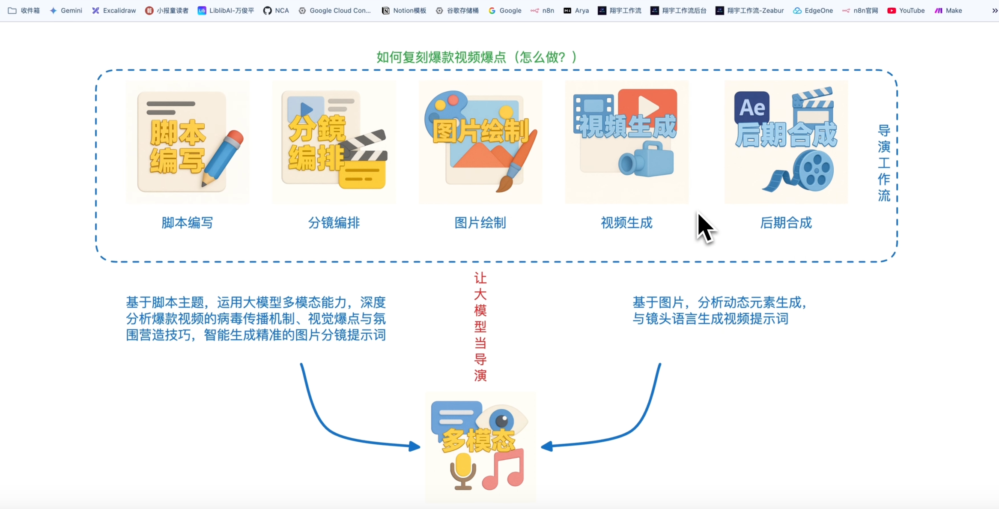
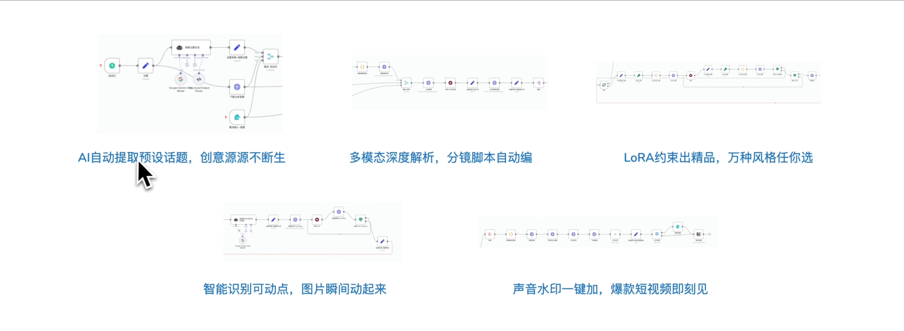
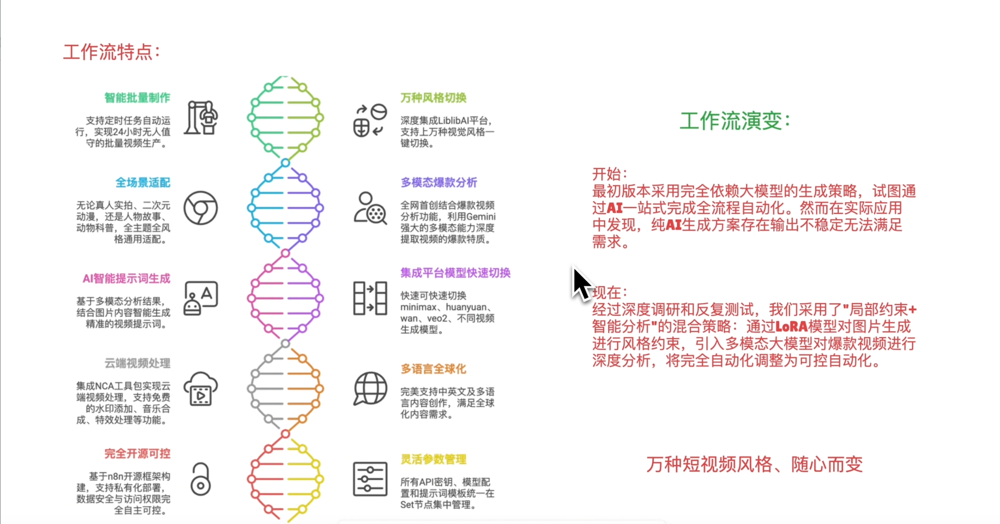

# n8n视频工作流合成

+ 如何复刻爆款视频爆点
+ 脚本编排
+ 分镜制作
+ 图片绘制
+ 视频生成
+ 后期合成
+ 
+ 基于脚本主题,运用大模型多模态能力,深度分析爆款视频的病毒传播机制、视觉爆点与氛围营造技巧，智能生成精准的图片分镜提示词
+ 让大模型当导演
+ 基于图片，分析动态元素生成与镜头语言生成视频提示词

五步法

AI 自动提取预设话题，创意源源不断生

多模态深度解析，分镜脚本自动变

LoRA 约束出精品，万种风格任你选

智能识别可动点，图片瞬间动起来

声音水印一件加，爆款短视频立刻见

+ 万种风格切换，支持上万种视觉风格一键切换
+ 基于图片，分析动态元素生成与镜头语言生成视频提示词
+ [https://www.liblib.art/](https://www.liblib.art/)

+ 利用 gemini 强大的多模态能力深度提取视频的爆款特质
+ 基于图片，分析动态元素生成与镜头语言生成视频提示词
+ [https://aistudio.google.com/gen-media](https://aistudio.google.com/gen-media)

+ 集成平台快速模型切换
+ [https://fal.ai/dashboard](https://fal.ai/dashboard)
+ 
+ 集成 NCA 工具包实现云端视频处理，支持免费水印添加音乐合成，特效处理等
+ [https://github.com/skyconnfig/no-code-architects-toolkit](https://github.com/skyconnfig/no-code-architects-toolkit)

> 更新: 2025-07-16 16:30:48  
> 原文: <https://www.yuque.com/lixinsi/vnere7/niq1g49gxiq0h81r>