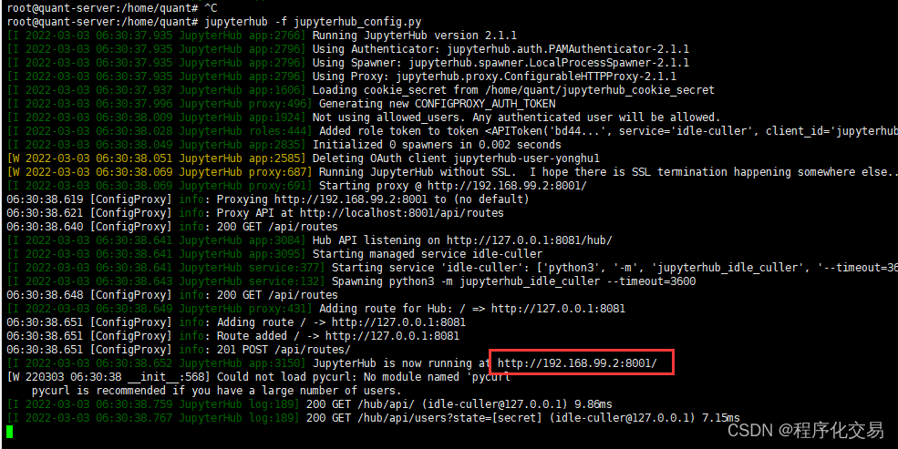
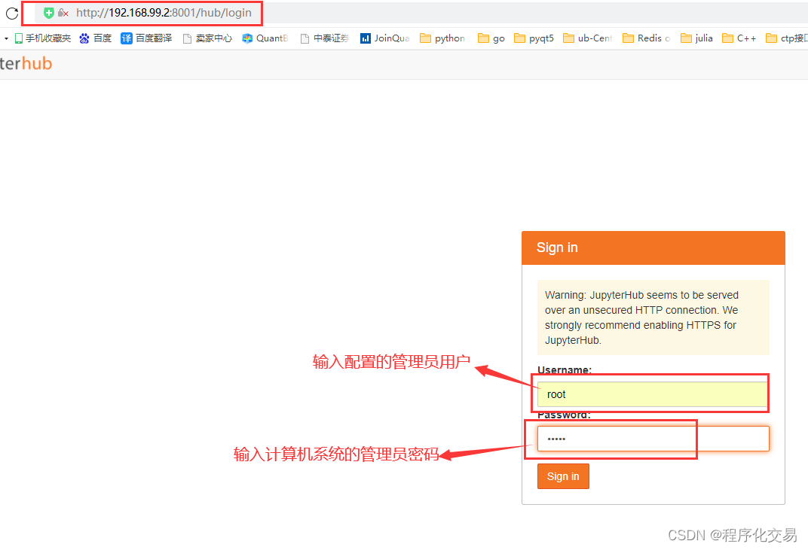
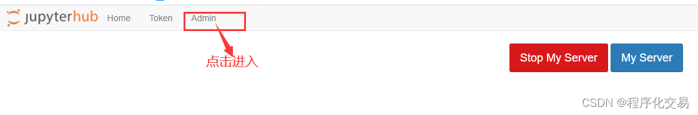
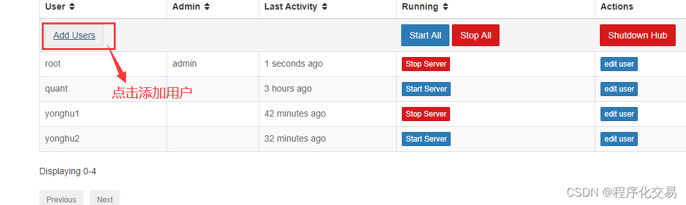
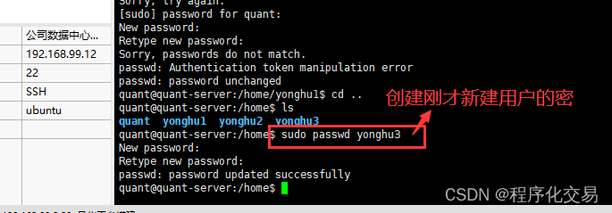
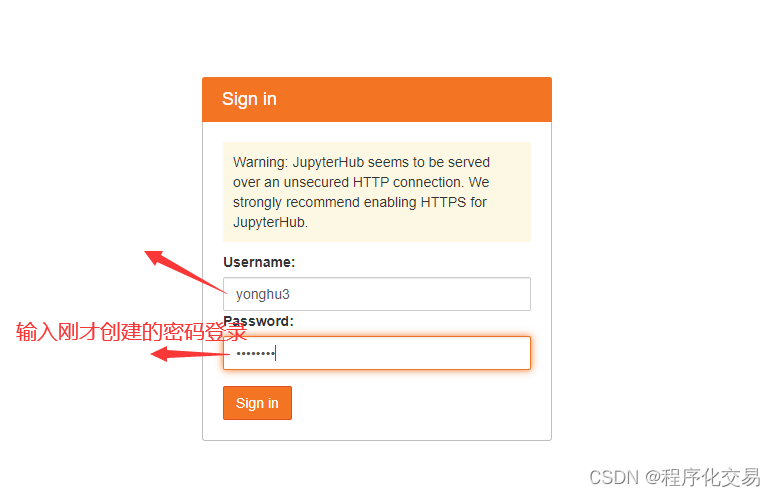

# upyterHub 安装、环境配置、创建多用户和使用经验

## <font style="color:rgb(79, 79, 79);">1、安装</font>

<font style="color:rgb(77, 77, 77);">安装首先打开官网帮助文档，一般安装都是参考官方最新版安装文档。帮助文档地址如下。</font>

[<font style="color:rgb(78, 161, 219);">JupyterHub 官方安装帮助文档</font>](https://jupyterhub.readthedocs.io/en/stable/quickstart.html)

<font style="color:rgb(77, 77, 77);">我安装用的系统: ubuntu20.04</font>

<font style="color:rgb(77, 77, 77);">我的安装经验：安装前先进入管理员权限 命令为su 输入密码即可进入，必须进入管理员，不然安装户使用时会出现权限问题。安装</font>[<font style="color:rgb(252, 85, 49);">python模块</font>](https://so.csdn.net/so/search?q=python%E6%A8%A1%E5%9D%97\&spm=1001.2101.3001.7020)<font style="color:rgb(77, 77, 77);">时速度如果很慢可以用其他镜像源安装，如下这样使用，体验飞一样的速度。</font>

<font style="color:rgb(77, 77, 77);background-color:rgb(238, 255, 204);">python3 -m pip install jupyterhub -i https://pypi.douban.com/simple</font>

***

**<font style="color:rgb(77, 77, 77);">官方安装方法大致如下。</font>**

### <font style="color:rgb(79, 79, 79);">先决条件</font>

<font style="color:rgb(77, 77, 77);">在安装 JupyterHub 之前，您需要：</font>

* <font style="color:rgb(77, 77, 77);">基于</font><font style="color:rgb(77, 77, 77);"> </font><font style="color:rgb(78, 161, 219) !important;">Linux</font><font style="color:rgb(77, 77, 77);">/Unix 的系统</font>
* [<font style="color:rgb(78, 161, 219);">Python</font>](https://www.python.org/downloads/)<font style="color:rgb(77, 77, 77);"> 3.6 或更高版本。了解使用</font>[<font style="color:rgb(78, 161, 219);">pip</font>](https://pip.pypa.io/)<font style="color:rgb(77, 77, 77);">或 </font>[<font style="color:rgb(78, 161, 219);">conda</font>](https://conda.io/docs/get-started.html)<font style="color:rgb(77, 77, 77);">安装 Python 包是有帮助的。</font>
* [<font style="color:rgb(78, 161, 219);">节点/npm</font>](https://www.npmjs.com/)<font style="color:rgb(77, 77, 77);">。使用操作系统的</font><font style="color:rgb(252, 85, 49);">包管理器</font>[<font style="color:rgb(78, 161, 219);">安装 nodejs/npm 。</font>](https://docs.npmjs.com/getting-started/installing-node)
  * <font style="color:rgb(77, 77, 77);">如果您使用</font><code>**<font style="color:rgb(77, 77, 77);">conda</font>**</code><font style="color:rgb(77, 77, 77);">的是，conda 将为您安装 nodejs 和</font><font style="color:rgb(77, 77, 77);"> </font><font style="color:rgb(252, 85, 49);">npm</font><font style="color:rgb(77, 77, 77);"> </font><font style="color:rgb(77, 77, 77);">依赖项。</font>
  * <font style="color:rgb(77, 77, 77);">如果您正在使用</font><code>**<font style="color:rgb(77, 77, 77);">pip</font>**</code><font style="color:rgb(77, 77, 77);">，请安装最新版本的 </font>[<font style="color:rgb(78, 161, 219);">nodejs/npm</font>](https://docs.npmjs.com/getting-started/installing-node)<font style="color:rgb(77, 77, 77);">。例如，使用以下命令在 Linux (Debian/</font><font style="color:rgb(78, 161, 219) !important;">Ubuntu</font><font style="color:rgb(77, 77, 77);">) 上安装它：</font>

```plain
sudo apt-get install nodejs npm
```

<font style="color:rgb(77, 77, 77);">如果您的系统包管理器只有旧版本的</font><font style="color:rgb(77, 77, 77);"> </font><font style="color:rgb(78, 161, 219) !important;">Node.js</font><font style="color:rgb(77, 77, 77);">（例如 10 或更早版本），</font>[<font style="color:rgb(78, 161, 219);">nodesource是获取最新版本的 nodejs 运行时的绝佳资源。</font>](https://github.com/nodesource/distributions#table-of-contents)

* <font style="color:rgb(77, 77, 77);">使用</font>[<font style="color:rgb(78, 161, 219);">默认 Authenticator</font>](https://jupyterhub.readthedocs.io/en/stable/getting-started/authenticators-users-basics.html)<font style="color:rgb(77, 77, 77);">的</font>[<font style="color:rgb(78, 161, 219);">可插入身份验证模块 (PAM)</font>](https://en.wikipedia.org/wiki/Pluggable_authentication_module)<font style="color:rgb(77, 77, 77);">。PAM 通常在大多数发行版上默认可用，如果不是这种情况，可以使用操作系统的包管理器安装它。</font>
* <font style="color:rgb(77, 77, 77);">用于 HTTPS 通信的 TLS 证书和密钥</font>
* <font style="color:rgb(77, 77, 77);">域名</font>

<font style="color:rgb(77, 77, 77);">在运行单用户笔记本服务器（可能与集线器在同一系统上或不在同一系统上）之前，您将需要：</font>

* [<font style="color:rgb(78, 161, 219);">JupyterLab</font>](https://jupyterlab.readthedocs.io/)<font style="color:rgb(77, 77, 77);"> 3 或更高版本，或</font>[<font style="color:rgb(78, 161, 219);">Jupyter Notebook</font>](https://jupyter.readthedocs.io/en/latest/install.html)<font style="color:rgb(77, 77, 77);"> 4 或更高版本。</font>

### <font style="color:rgb(79, 79, 79);">安装</font>

<font style="color:rgb(77, 77, 77);">JupyterHub 可以安装</font><code><font style="color:rgb(77, 77, 77);">pip</font></code><font style="color:rgb(77, 77, 77);">（和代理</font><code><font style="color:rgb(77, 77, 77);">npm</font></code><font style="color:rgb(77, 77, 77);">）或</font><code><font style="color:rgb(77, 77, 77);">conda</font></code><font style="color:rgb(77, 77, 77);">：</font>

**<font style="color:rgb(77, 77, 77);">点，npm：</font>**

```plain
python3 -m pip install jupyterhub
npm install -g configurable-http-proxy
python3 -m pip install jupyterlab notebook  # needed if running the notebook servers in the same environment
```

**<font style="color:rgb(77, 77, 77);">conda</font>**<font style="color:rgb(77, 77, 77);">（一个命令安装 jupyterhub 和代理）：</font>

```plain
conda install -c conda-forge jupyterhub  # installs jupyterhub and proxy
conda install jupyterlab notebook  # needed if running the notebook servers in the same environment
```

<font style="color:rgb(77, 77, 77);">测试您的安装。如果已安装，这些命令应返回包的帮助内容：</font>

```plain
jupyterhub -h
configurable-http-proxy -h
```

### <font style="color:rgb(79, 79, 79);">启动 Hub 服务器</font>

<font style="color:rgb(77, 77, 77);">要启动 Hub 服务器，请运行以下命令：</font>

```plain
jupyterhub
```

<font style="color:rgb(77, 77, 77);">在您的浏览器中访问</font><code><font style="color:rgb(77, 77, 77);">http://localhost:8000</font></code><font style="color:rgb(77, 77, 77);">，并使用您的 Unix 凭据登录。</font>

<font style="color:rgb(77, 77, 77);">要</font>**<font style="color:rgb(77, 77, 77);">允许多个用户登录</font>**<font style="color:rgb(77, 77, 77);">Hub 服务器，您必须 </font><code><font style="color:rgb(77, 77, 77);">jupyterhub</font></code><font style="color:rgb(77, 77, 77);">以</font>*<font style="color:rgb(77, 77, 77);">特权用户</font>*<font style="color:rgb(77, 77, 77);">身份启动，例如 root：</font>

```plain
sudo jupyterhub
```

***

## <font style="color:rgb(79, 79, 79);">2、环境配置</font>

<font style="color:rgb(77, 77, 77);">配置没有太大心得，也是按照官方文档配置的，按照官方配置文档一步一步配置即可。</font>

[<font style="color:rgb(78, 161, 219);">JupyterHub 官方环境配置帮助</font>](https://jupyterhub.readthedocs.io/en/stable/getting-started/index.html)

<font style="color:rgb(77, 77, 77);">我的配置文件如下。</font>

```python
# 设置3-2
# ------------------------------------------------------------------------------
 
# configurable_http_proxy 代理设置
c.ConfigurableHTTPProxy.should_start = True #允许hub启动代理 可以不写，默认的，为False 就需要自己去 启动configurable-http-proxy
c.ConfigurableHTTPProxy.api_url = 'http://localhost:8001' # proxy与hub与代理通讯，这应该是默认值不行也行
 
# 对外登录设置的ip
c.JupyterHub.ip = '192.168.99.2'
c.JupyterHub.port = 8001
c.PAMAuthenticator.encoding = 'utf8'
 
# 用户名单设置，默认身份验证方式PAM与NUIX系统用户管理层一致，root用户可以添加用户test1,test2等等，非root用户，sudo useradd test1/test2 不起作用，目前我不知道sudo useradd 和 root下 useradd本质区别*（没有特意学过linux，一切只靠用时百度）
# c.Authenticator.allowed_users = {'test1', 'test2'}
c.Authenticator.admin_users = {'root'}  # 管理员用户
c.DummyAuthenticator.password = "xs301302"  # 初始密码设置
c.JupyterHub.admin_access = True  # 则管理员有权在各自计算机上以其他用户身份登录，以进行调试
c.LocalAuthenticator.create_system_users=True  # 此选项通常用于 JupyterHub 的托管部署，以避免在启动服务之前手动创建所有用户
 
# 设置每个用户的 book类型 和 工作目录（创建.ipynb文件自动保存的地方）
c.Spawner.notebook_dir = '~'
c.Spawner.default_url = '/lab'
c.Spawner.args = ['--allow-root'] 
 
# 为jupyterhub 添加额外服务，用于处理闲置用户进程。使用时不好使安装一下：pip install jupyterhub-ilde-culler
c.JupyterHub.services = [
    {
        'name': 'idle-culler',
        'command': ['python3', '-m', 'jupyterhub_idle_culler', '--timeout=3600'],
        'admin':True # 1.5.0 需要服务管理员权限，去kill 部分闲置的进程notebook, 2.0版本已经改了，可以只赋给 idel-culler 部分特定权限，roles
    }
]
AI写代码
```

## <font style="color:rgb(79, 79, 79);">3、进入管理员用户和创建新用户</font>

<font style="color:rgb(77, 77, 77);">安装完成在管理员系统下输入</font><font style="color:rgb(77, 77, 77);"> </font><font style="color:rgb(13, 0, 22);background-color:rgb(254, 252, 216);">jupyterhub -f jupyterhub\_config.py</font><font style="color:rgb(255, 217, 0);"> </font><font style="color:rgb(13, 0, 22);">启动</font><font style="color:rgb(13, 0, 22);">。</font>

<font style="color:rgb(13, 0, 22);">如果启动有问题，再多读几遍官方安装和配置文档重新配置或安装。</font>

<font style="color:rgb(77, 77, 77);">启动后再浏览器中输入弹出的配置地址，地址在启动日志中有，也就是自己配置文件中的地址。</font>



<font style="color:rgb(77, 77, 77);"></font>

<font style="color:rgb(77, 77, 77);"></font>


<font style="color:rgb(77, 77, 77);"></font>

<font style="color:rgb(77, 77, 77);"></font>

<font style="color:rgb(77, 77, 77);"></font>

<font style="color:rgb(77, 77, 77);"></font>




> 更新: 2025-04-19 23:55:04  
> 原文: <https://www.yuque.com/lixinsi/vnere7/xdcsf6ebgrglflsd>