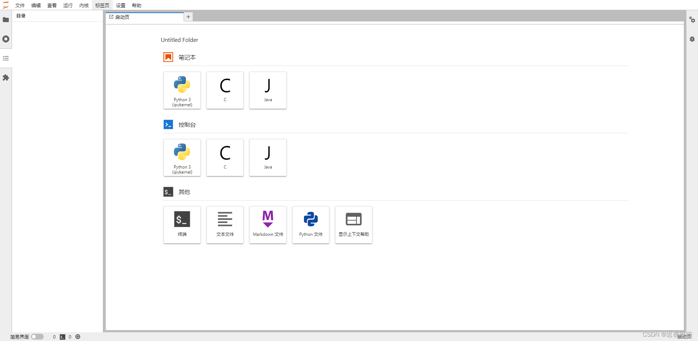
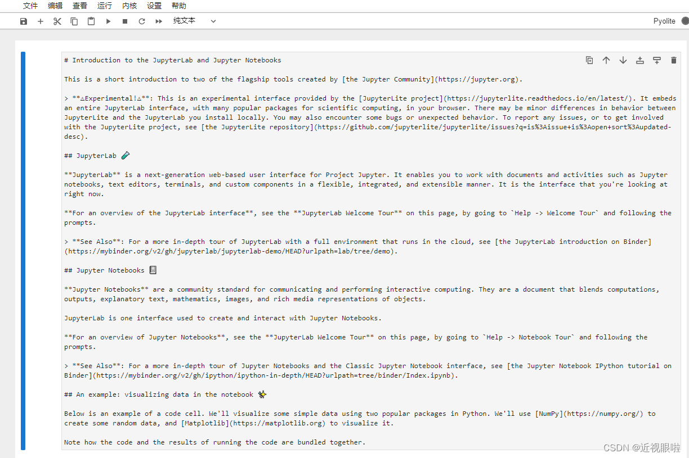
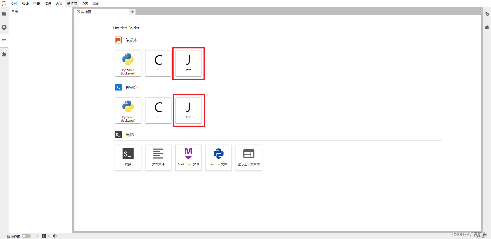
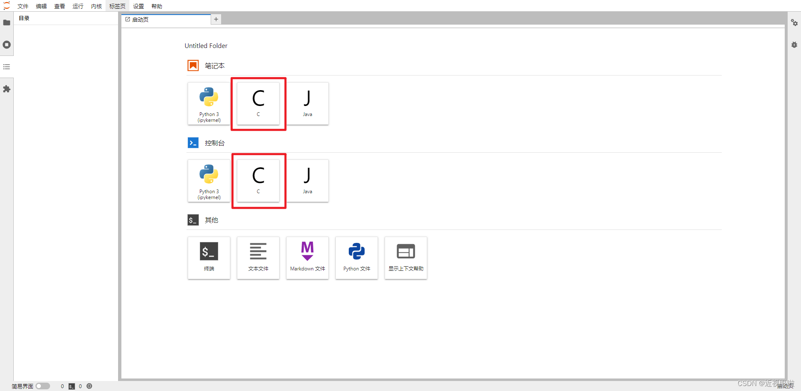

# 使用docker搭建自己的jupyterhub多用户服务器

#### <font style="color:rgb(79, 79, 79);">1 选择基础镜像 这里我们选择jupyterhub的官方镜像</font>

<code><font style="color:rgb(199, 37, 78);background-color:rgb(249, 242, 244);">docker pull jupyterhub/jupyterhub</font></code>

#### <font style="color:rgb(79, 79, 79);">2 启动容器</font>

<code><font style="color:rgb(199, 37, 78);background-color:rgb(249, 242, 244);">docker run -p 8000:8000 -d --name jupyterhub jupyterhub/jupyterhub jupyterhub</font></code>

<font style="color:rgb(77, 77, 77);">此处映射端口可以指定,我使用默认端口映射8000</font>

#### <font style="color:rgb(79, 79, 79);">3 使用浏览器访问 ip:端口 使用root账户登录 如果不知道root密码可以重置密码</font>

##### <font style="color:rgb(79, 79, 79);">然后不出意外会出现这种情况:</font>


<font style="color:rgb(77, 77, 77);">这是因为jupyter禁用了root账户登录,如果需要可以使用</font>

<code><font style="color:rgb(199, 37, 78);background-color:rgb(249, 242, 244);">docker exec -it jupyterhub bash</font></code>

<font style="color:rgb(77, 77, 77);">进入容器内部,会直接进入到work文件夹 里面有一个文件: jupyterhub\_config.py</font>

<code><font style="color:rgb(199, 37, 78);background-color:rgb(249, 242, 244);">vim jupyterhub_config.py</font></code>

<font style="color:rgb(77, 77, 77);">添加配置使用root账户登录,如果加了也不行:</font>

<font style="color:rgb(77, 77, 77);">直接在容器中添加用户</font>

<code><font style="color:rgb(199, 37, 78);background-color:rgb(249, 242, 244);">useradd wzw</font></code>

<font style="color:rgb(77, 77, 77);">密码</font>

<code><font style="color:rgb(199, 37, 78);background-color:rgb(249, 242, 244);">passwd wzw</font></code>

<font style="color:rgb(77, 77, 77);">输入密码 完了之后也是登录不了的 会显示找不到user/用户名的文件目录</font>

<font style="color:rgb(77, 77, 77);">这时候我们新增用户文件夹</font>

<code><font style="color:rgb(199, 37, 78);background-color:rgb(249, 242, 244);">chmod -R 777 home</font></code><font style="color:rgb(77, 77, 77);"> </font><code><font style="color:rgb(199, 37, 78);background-color:rgb(249, 242, 244);"># 给home 权限</font></code>

<code><font style="color:rgb(199, 37, 78);background-color:rgb(249, 242, 244);">cd /home</font></code><font style="color:rgb(77, 77, 77);"> </font><code><font style="color:rgb(199, 37, 78);background-color:rgb(249, 242, 244);"># 进入目录</font></code>

<code><font style="color:rgb(199, 37, 78);background-color:rgb(249, 242, 244);">mkdir wzw`` #创建文件夹</font></code>

<code><font style="color:rgb(199, 37, 78);background-color:rgb(249, 242, 244);">chown wzw:wzw wzw -R</font></code><font style="color:rgb(77, 77, 77);"> </font><code><font style="color:rgb(199, 37, 78);background-color:rgb(249, 242, 244);">#这句话的意思是将wzw文件夹给wzw用户 并开启权限</font></code>

<font style="color:rgb(77, 77, 77);">完事之后添加此用户为管理员用户</font>

<code><font style="color:rgb(199, 37, 78);background-color:rgb(249, 242, 244);">vim jupyterhub_config.py</font></code><font style="color:rgb(77, 77, 77);"> </font><font style="color:rgb(77, 77, 77);">打开配置文件添加</font>

<code><font style="color:rgb(199, 37, 78);background-color:rgb(249, 242, 244);">c.Authenticator.admin_users = {'wzw'}</font></code>

#### <font style="color:rgb(79, 79, 79);">3安装中文界面,并浏览器访问</font>

<code><font style="color:rgb(199, 37, 78);background-color:rgb(249, 242, 244);">pip install jupyterlab-language-pack-zh-CN # 安装中文界面</font></code>

<font style="color:rgb(77, 77, 77);">打开浏览器登录,在Settings里面可以切换语言为简体中文\ </font>

<font style="color:rgb(77, 77, 77);">这是我配置完的界面 实际上你们登录应该是jupyter notebook的界面 就像这样</font>



<font style="color:rgb(77, 77, 77);">如果你想开启jupyterlab 需要安装jupyterlab的包</font>

<code><font style="color:rgb(199, 37, 78);background-color:rgb(249, 242, 244);">pip install jupyterlab</font></code>

<font style="color:rgb(77, 77, 77);">然后修改jupyterhub的默认使用jupyterlab</font>

<code><font style="color:rgb(199, 37, 78);background-color:rgb(249, 242, 244);">vim jupyterhub_config.py 打开配置文件 添加</font></code>

<code><font style="color:rgb(199, 37, 78);background-color:rgb(249, 242, 244);">c.Spawner.default_url = '/lab'</font></code>

<font style="color:rgb(77, 77, 77);">再次打开浏览器 就变成jupyterlab的界面了 jupyterlab其实是jupyternotebook的升级版 包含了jupyternotebook的全部功能 更加强大</font>

<font style="color:rgb(77, 77, 77);">添加java内核 转</font>

<font style="color:rgb(77, 77, 77);">具体步骤：</font>

<font style="color:rgb(77, 77, 77);">一、java 环境配置\ </font><font style="color:rgb(77, 77, 77);">1.下载 jdk （这里从官网下载最新版 11.0.1）</font>

<font style="color:rgb(77, 77, 77);">具体下载链接可以自己从浏览器内点击下载后复制，上述链接有用户参数，可能只能在当时用,就是说要登录甲骨文官网,之后找到jdk11的linux-x64\_bin.tar.gz版本 复制链接 使用wget+链接下载</font>

<font style="color:rgb(77, 77, 77);">2.解压下载好的压缩包\ </font><code><font style="color:rgb(199, 37, 78);background-color:rgb(249, 242, 244);">tar -zxvf jdk-11.0.15.0.tar.gz</font></code>

<font style="color:rgb(77, 77, 77);">名称不对应使用 mv 命令更名即可</font>

<font style="color:rgb(77, 77, 77);">注意tar解压出来版本可能和文档上的不一样</font>

<font style="color:rgb(77, 77, 77);">3.使用 root 权限用户新建 jdk 目录，并且将解压的文件夹移动到新建的目录\ </font><code><font style="color:rgb(199, 37, 78);background-color:rgb(249, 242, 244);">mkdir /usr/lib/jdk</font></code>

<code><font style="color:rgb(199, 37, 78);background-color:rgb(249, 242, 244);">mv jdk-11.0.15.0 /usr/lib/jdk</font></code>

<font style="color:rgb(77, 77, 77);">移动后的目录结构为：</font><code><font style="color:rgb(199, 37, 78);background-color:rgb(249, 242, 244);">/usr/lib/jdk/jdk-11.0.15.0</font></code>

<font style="color:rgb(77, 77, 77);">4.配置环境变量\ </font><code><font style="color:rgb(199, 37, 78);background-color:rgb(249, 242, 244);">vi /etc/profile</font></code>

<font style="color:rgb(77, 77, 77);">在系统环境文件中添加以下语句：</font>

```python
#----------JDK begin
export JAVA_HOME=/usr/lib/jdk/jdk-11.0.15.0

export JRE_HOME=$JAVA_HOME/jre

export CLASSPATH=.:$CLASSPATH:$JAVA_HOME/lib:$JRE_HOME/lib

export PATH=$PATH:$JAVA_HOME/bin:$JRE_HOME/bin
#-------------JDK end

```

<font style="color:rgb(77, 77, 77);">其中 JAVA\_HOME 可以根据具体情况改变</font>

<font style="color:rgb(77, 77, 77);">使用以下命令激活刚配置的环境变量：</font>

<code><font style="color:rgb(199, 37, 78);background-color:rgb(249, 242, 244);">source /etc/profile</font></code>

<font style="color:rgb(77, 77, 77);">5.测试 java 是否安装成功\ </font><code><font style="color:rgb(199, 37, 78);background-color:rgb(249, 242, 244);">java -version</font></code>

<font style="color:rgb(77, 77, 77);">输出 java version “11.0.15.0” 等版本信息即安装成功</font>

<font style="color:rgb(77, 77, 77);">二、java 内核安装\ </font><font style="color:rgb(77, 77, 77);">1.下载 java 内核压缩包\ </font><font style="color:rgb(77, 77, 77);">wget</font><font style="color:rgb(77, 77, 77);"> </font>[<font style="color:rgb(78, 161, 219);">https://github.com/SpencerPark/IJava/releases/download/v1.2.0/ijava-1.2.0.zip</font>](https://github.com/SpencerPark/IJava/releases/download/v1.2.0/ijava-1.2.0.zip)

<font style="color:rgb(77, 77, 77);">2.解压下载得压缩包\ </font><code><font style="color:rgb(199, 37, 78);background-color:rgb(249, 242, 244);">unzip ijava-1.2.0.zip</font></code>

<font style="color:rgb(77, 77, 77);">解压后得到一个 install.py 的文件，和一个 java 文件夹</font>

<font style="color:rgb(77, 77, 77);">3.安装 java 内核\ </font><font style="color:rgb(77, 77, 77);">在第二步解压后的文件夹中，执行以下命令安装：</font>

<code><font style="color:rgb(199, 37, 78);background-color:rgb(249, 242, 244);">python install.py --sys-prefix</font></code>

<font style="color:rgb(77, 77, 77);">确保 python 版本为 3，或者用 python3 执行也可以</font>

<font style="color:rgb(77, 77, 77);">再次打开jupyterhub 会显示java的内核</font>



<font style="color:rgb(77, 77, 77);">切换到java内核无提示说明安装成功!</font>

<font style="color:rgb(77, 77, 77);">安装c内核</font>

<font style="color:rgb(77, 77, 77);">使用pip安装包\ </font><code><font style="color:rgb(199, 37, 78);background-color:rgb(249, 242, 244);">pip install jupyter-c-kernel</font></code>

<font style="color:rgb(77, 77, 77);">运行安装命令\ </font><code><font style="color:rgb(199, 37, 78);background-color:rgb(249, 242, 244);">sudo install_c_kernel</font></code>

<font style="color:rgb(77, 77, 77);">添加c内核到所有用户\ </font><code><font style="color:rgb(199, 37, 78);background-color:rgb(249, 242, 244);">python -m ipykernel install --user --name=kernelname --display-name showname</font></code>

<font style="color:rgb(77, 77, 77);">浏览器打开\ </font>\ <font style="color:rgb(77, 77, 77);">看到c切换到c内核无提示说明安装成功!</font>

<font style="color:rgb(77, 77, 77);">添加用户</font>

<font style="color:rgb(77, 77, 77);">我们使用上面的管理员账户登录 点击文件 点击hub管理界面 点击Admin 就可以看到当前用户界面 可以删除用户 添加用户 暂停用户服务…</font>


> 更新: 2025-04-19 23:18:14  
> 原文: <https://www.yuque.com/lixinsi/vnere7/bbwiyi8ky3kipfuz>