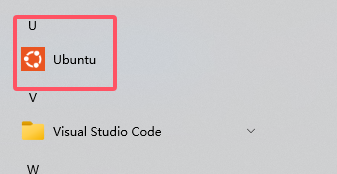
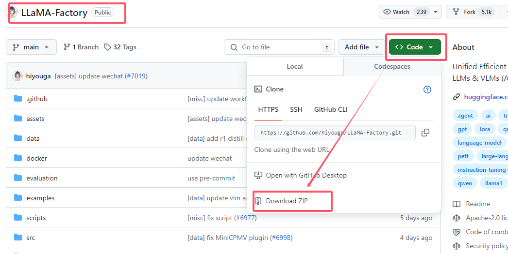
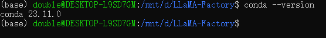
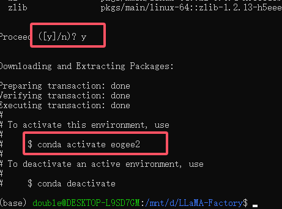
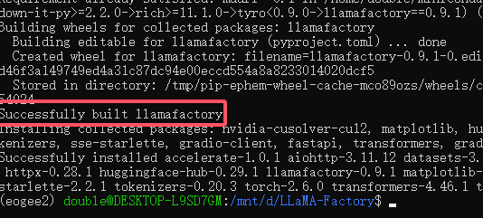
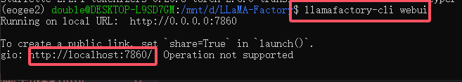
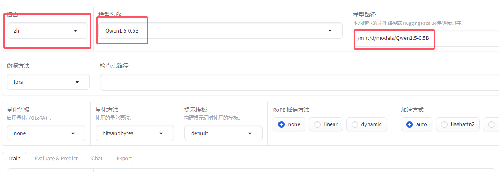
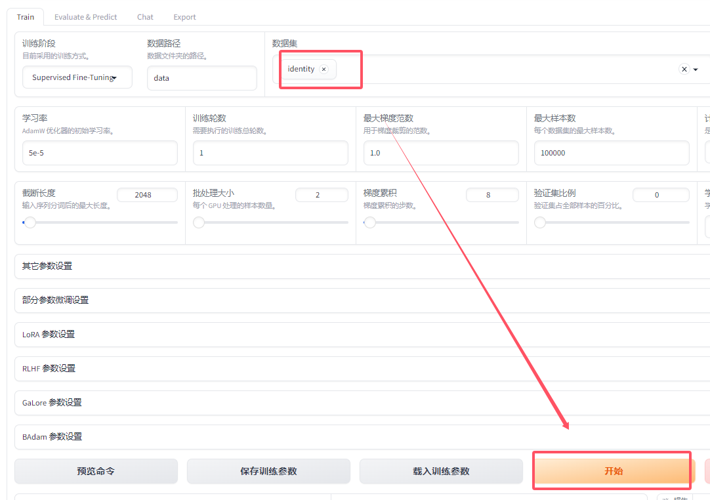
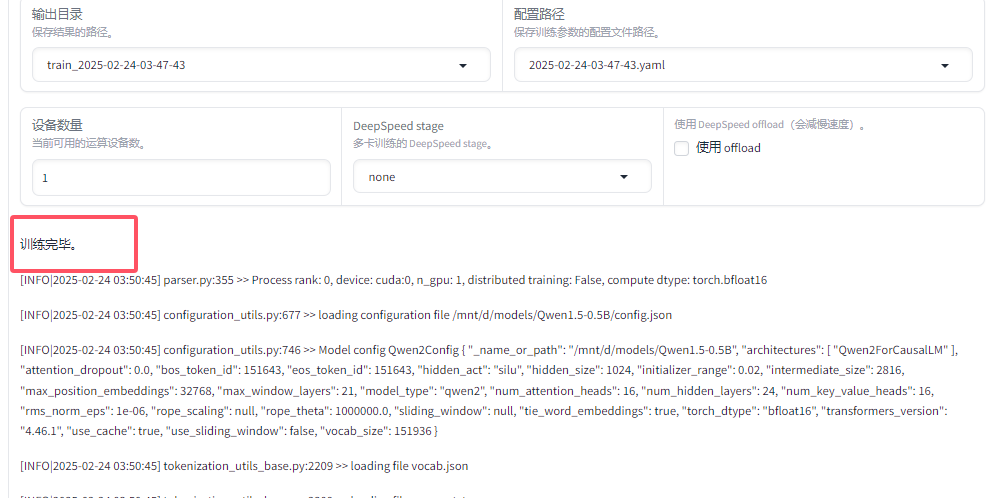

# 使用llamafactory进行模型训练与微调-环境准备与工具部署

## <font style="color:rgb(47, 54, 60);">目的</font>

<font style="color:rgb(51, 51, 51);">本文档介绍如何准备环境，以及如何安装</font><code><font style="color:rgb(51, 51, 51);background-color:rgb(246, 246, 246);">conda</font></code><font style="color:rgb(51, 51, 51);">和</font><code><font style="color:rgb(51, 51, 51);background-color:rgb(246, 246, 246);">llama-factory</font></code><font style="color:rgb(51, 51, 51);">等工具。\ </font><font style="color:rgb(51, 51, 51);">使用</font><code><font style="color:rgb(51, 51, 51);background-color:rgb(246, 246, 246);">llama-factory</font></code><font style="color:rgb(51, 51, 51);">预置的数据集进行模型的简单训练。</font>

## <font style="color:rgb(47, 54, 60);">说明</font>

<font style="color:rgb(51, 51, 51);">本文档中的所有下载的所需资源都可以在</font>[<font style="color:rgb(65, 131, 196);">网盘下载</font>](https://pan.quark.cn/s/c881f12f78e6)<font style="color:rgb(51, 51, 51);">或在右上角的群内容获取。</font>

## <font style="color:rgb(47, 54, 60);">1. wsl环境准备</font>

### <font style="color:rgb(47, 54, 60);">1.1 安装wsl及ubantu</font>

<font style="color:rgb(51, 51, 51);">你可以通过</font>[<font style="color:rgb(65, 131, 196);">这篇文章</font>](https://www.eogee.com/article/detail/15)<font style="color:rgb(51, 51, 51);">的第2部分，在windows系统上安装wsl和ubantu。</font>

<font style="color:rgb(51, 51, 51);">安装完成后，你的应用目录中可以查询到</font><code><font style="color:rgb(51, 51, 51);background-color:rgb(246, 246, 246);">Ubuntu</font></code><font style="color:rgb(51, 51, 51);">图标，点击打开。</font>



## <font style="color:rgb(47, 54, 60);">2. 下载llama-factory</font>

<code><font style="color:rgb(51, 51, 51);background-color:rgb(246, 246, 246);">llama-factory</font></code><font style="color:rgb(51, 51, 51);">是一个零代码大模型训练平台，可以快速搭建模型训练环境，并提供丰富的模型训练功能。</font>

<font style="color:rgb(51, 51, 51);">前往</font>[<font style="color:rgb(65, 131, 196);">github</font>](https://github.com/hiyouga/LLaMA-Factory)<font style="color:rgb(51, 51, 51);">下载</font><code><font style="color:rgb(51, 51, 51);background-color:rgb(246, 246, 246);">llama-factory</font></code><font style="color:rgb(51, 51, 51);">项目的压缩包。</font>

**<font style="color:rgb(51, 51, 51);">网盘压缩包内文件名：llama-factory.zip</font>**



<font style="color:rgb(51, 51, 51);">拿到安装包后，可以将其解压到任意目录，如</font><code><font style="color:rgb(51, 51, 51);background-color:rgb(246, 246, 246);">D:\llama-factory</font></code><font style="color:rgb(51, 51, 51);">。</font>

## <font style="color:rgb(47, 54, 60);">3. 安装conda</font>

<code><font style="color:rgb(51, 51, 51);background-color:rgb(246, 246, 246);">conda</font></code><font style="color:rgb(51, 51, 51);">是</font><code><font style="color:rgb(51, 51, 51);background-color:rgb(246, 246, 246);">Python</font></code><font style="color:rgb(51, 51, 51);">的包管理工具，可以方便地安装、管理</font><code><font style="color:rgb(51, 51, 51);background-color:rgb(246, 246, 246);">Python</font></code><font style="color:rgb(51, 51, 51);">环境。</font>

### <font style="color:rgb(47, 54, 60);">3.1 安装</font>

<font style="color:rgb(51, 51, 51);">在</font><code><font style="color:rgb(51, 51, 51);background-color:rgb(246, 246, 246);">D:\llama-factory</font></code><font style="color:rgb(51, 51, 51);">目录下，linuxshell下打开命令提示符，依次输入以下命令安装</font><code><font style="color:rgb(51, 51, 51);background-color:rgb(246, 246, 246);">conda</font></code><font style="color:rgb(51, 51, 51);">，此处安装</font><code><font style="color:rgb(51, 51, 51);background-color:rgb(246, 246, 246);">miniconda3</font></code><font style="color:rgb(51, 51, 51);">：</font>

```plain
#安装miniconda3
wget https://repo.anaconda.com/miniconda/Miniconda3-latest-Linux-x86_64.sh
#运行安装脚本
bash Miniconda3-latest-Linux-x86_64.sh
#激活
source ~/.bashrc
#验证安装
conda --version
```

<font style="color:rgb(51, 51, 51);">安装过程注意按键盘上的</font><code><font style="color:rgb(51, 51, 51);background-color:rgb(246, 246, 246);">Enter</font></code><font style="color:rgb(51, 51, 51);">键，并在最后输入</font><code><font style="color:rgb(51, 51, 51);background-color:rgb(246, 246, 246);">yes</font></code><font style="color:rgb(51, 51, 51);">确认安装，直到安装完成，过程中你也可以切换安装路径，默认在</font><code><font style="color:rgb(51, 51, 51);background-color:rgb(246, 246, 246);">/home/用户名</font></code><font style="color:rgb(51, 51, 51);">目录下。至最终显示版本号，表示安装成功。</font>



### <font style="color:rgb(47, 54, 60);">3.2 新增python运行环境</font>

<font style="color:rgb(51, 51, 51);">你可以使用</font><code><font style="color:rgb(51, 51, 51);background-color:rgb(246, 246, 246);">conda</font></code><font style="color:rgb(51, 51, 51);">创建多个</font><code><font style="color:rgb(51, 51, 51);background-color:rgb(246, 246, 246);">Python</font></code><font style="color:rgb(51, 51, 51);">运行环境，每个环境可以有不同的</font><code><font style="color:rgb(51, 51, 51);background-color:rgb(246, 246, 246);">Python</font></code><font style="color:rgb(51, 51, 51);">版本、依赖包等。</font>

```plain
conda create -n eogee2 python=3.10
```

<font style="color:rgb(51, 51, 51);">表示创建了一个名为</font><code><font style="color:rgb(51, 51, 51);background-color:rgb(246, 246, 246);">eogee2</font></code><font style="color:rgb(51, 51, 51);">的</font><code><font style="color:rgb(51, 51, 51);background-color:rgb(246, 246, 246);">Python</font></code><font style="color:rgb(51, 51, 51);">运行环境，版本为3.10。</font>

<font style="color:rgb(51, 51, 51);">安装过程较慢，如果发现报错，可以尝试重新运行安装命令。</font>



### <font style="color:rgb(47, 54, 60);">3.3 激活环境</font>

<font style="color:rgb(51, 51, 51);">输入以下命令来激活刚刚创建的环境：</font>

```plain
conda activate eogee2
```

### <font style="color:rgb(47, 54, 60);">3.4 其他python环境命令</font>

```plain
#查看已创建的环境
conda env list
#删除环境
conda remove -n eogee2 --all
```

## <font style="color:rgb(47, 54, 60);">4. 安装llama-factory</font>

### <font style="color:rgb(47, 54, 60);">4.1 安装llama-factory</font>

<font style="color:rgb(51, 51, 51);">在</font><code><font style="color:rgb(51, 51, 51);background-color:rgb(246, 246, 246);">llama-factory</font></code><font style="color:rgb(51, 51, 51);">目录下，linuxshell下打开命令提示符，输入以下命令安装</font><code><font style="color:rgb(51, 51, 51);background-color:rgb(246, 246, 246);">llama-factory</font></code><font style="color:rgb(51, 51, 51);">：</font>

```plain
#安装llama-factory
pip install -e ".[torch,metrics]" -i https://pypi.tuna.tsinghua.edu.cn/simple
```

<font style="color:rgb(51, 51, 51);">注意过程中需要按</font><code><font style="color:rgb(51, 51, 51);background-color:rgb(246, 246, 246);">y</font></code><font style="color:rgb(51, 51, 51);">键确认安装。</font>

* <code><font style="color:rgb(51, 51, 51);background-color:rgb(246, 246, 246);">-e</font></code><font style="color:rgb(51, 51, 51);">表示安装</font><code><font style="color:rgb(51, 51, 51);background-color:rgb(246, 246, 246);">llama-factory</font></code><font style="color:rgb(51, 51, 51);">为开发模式，可以实时更新代码。</font>
* <code><font style="color:rgb(51, 51, 51);background-color:rgb(246, 246, 246);">".[torch,metrics]"</font></code><font style="color:rgb(51, 51, 51);">表示安装</font><code><font style="color:rgb(51, 51, 51);background-color:rgb(246, 246, 246);">llama-factory</font></code><font style="color:rgb(51, 51, 51);">所需的依赖包，包括</font><code><font style="color:rgb(51, 51, 51);background-color:rgb(246, 246, 246);">torch</font></code><font style="color:rgb(51, 51, 51);">和</font><code><font style="color:rgb(51, 51, 51);background-color:rgb(246, 246, 246);">metrics</font></code><font style="color:rgb(51, 51, 51);">两个包。</font>
* <code><font style="color:rgb(51, 51, 51);background-color:rgb(246, 246, 246);">torch</font></code><font style="color:rgb(51, 51, 51);">是</font><code><font style="color:rgb(51, 51, 51);background-color:rgb(246, 246, 246);">Python</font></code><font style="color:rgb(51, 51, 51);">的深度学习框架</font>
* <code><font style="color:rgb(51, 51, 51);background-color:rgb(246, 246, 246);">metrics</font></code><font style="color:rgb(51, 51, 51);">是</font><code><font style="color:rgb(51, 51, 51);background-color:rgb(246, 246, 246);">llama-factory</font></code><font style="color:rgb(51, 51, 51);">的评估指标库。</font>

<font style="color:rgb(51, 51, 51);">如果你是AMD显卡且支持rocm，可以尝试安装</font><code><font style="color:rgb(51, 51, 51);background-color:rgb(246, 246, 246);">llama-factory</font></code><font style="color:rgb(51, 51, 51);">的</font><code><font style="color:rgb(51, 51, 51);background-color:rgb(246, 246, 246);">rocm</font></code><font style="color:rgb(51, 51, 51);">版本：</font>

```plain
pip install -e ".[rocm,metrics]"
```

<code><font style="color:rgb(51, 51, 51);background-color:rgb(246, 246, 246);">-i</font></code><font style="color:rgb(51, 51, 51);">后的内容表示使用过清华镜像，已解决下载安装过程过慢的问题。</font>

<font style="color:rgb(51, 51, 51);">直至最终明确显示</font><code><font style="color:rgb(51, 51, 51);background-color:rgb(246, 246, 246);">successfully built llamafactory</font></code><font style="color:rgb(51, 51, 51);">字样，表示环境安装成功。</font>



## <font style="color:rgb(47, 54, 60);">4.2 启动llama-factory</font>

<font style="color:rgb(51, 51, 51);">执行以下命令启动</font><code><font style="color:rgb(51, 51, 51);background-color:rgb(246, 246, 246);">llama-factory</font></code><font style="color:rgb(51, 51, 51);">：</font>

```plain
llamafactory-cli webui
```

<font style="color:rgb(51, 51, 51);">在浏览器中打开</font><code><font style="color:rgb(51, 51, 51);background-color:rgb(246, 246, 246);">http://localhost:7860</font></code><font style="color:rgb(51, 51, 51);">，进入</font><code><font style="color:rgb(51, 51, 51);background-color:rgb(246, 246, 246);">llama-factory</font></code><font style="color:rgb(51, 51, 51);">的界面。</font>



## <font style="color:rgb(47, 54, 60);">5. 模型训练</font>

### <font style="color:rgb(47, 54, 60);">5.1 选择被训练模型</font>

<font style="color:rgb(51, 51, 51);">你可以提前在</font><code><font style="color:rgb(51, 51, 51);background-color:rgb(246, 246, 246);">hf-mirror</font></code><font style="color:rgb(51, 51, 51);">下载得到</font>[<font style="color:rgb(65, 131, 196);">QWEN1.5-0.5B</font>](https://hf-mirror.com/Qwen/Qwen1.5-0.5B/tree/main)<font style="color:rgb(51, 51, 51);">模型，我们选取已知最小的模型用于测试。\ </font>*<font style="color:rgb(51, 51, 51);">网盘内文件名为：Qwen1.5-0.5B.zip</font>*

<font style="color:rgb(51, 51, 51);">下载完成后，解压压缩包，得到</font><code><font style="color:rgb(51, 51, 51);background-color:rgb(246, 246, 246);">Qwen1.5-0.5B</font></code><font style="color:rgb(51, 51, 51);">文件夹。你可以将其拷贝到</font><code><font style="color:rgb(51, 51, 51);background-color:rgb(246, 246, 246);">D:\models</font></code><font style="color:rgb(51, 51, 51);">目录下。</font>

<font style="color:rgb(51, 51, 51);">由于我们在</font><code><font style="color:rgb(51, 51, 51);background-color:rgb(246, 246, 246);">ubantu</font></code><font style="color:rgb(51, 51, 51);">环境下进行训练，需要在模型路径中填写</font><code><font style="color:rgb(51, 51, 51);background-color:rgb(246, 246, 246);">ubantu</font></code><font style="color:rgb(51, 51, 51);">系统中的相对路径，如：</font>

```plain
/mnt/d/models/Qwen1.5-0.5B
```



<font style="color:rgb(51, 51, 51);">你可以在右上角将语言设置为</font><code><font style="color:rgb(51, 51, 51);background-color:rgb(246, 246, 246);">zh</font></code><font style="color:rgb(51, 51, 51);">中文，以便阅读。</font>

**<font style="color:rgb(51, 51, 51);">注意</font>**<font style="color:rgb(51, 51, 51);">\ </font><font style="color:rgb(51, 51, 51);">如果你载入Qwen3系列模型报transformers的错，表示当前安装的 transformers 库不支持 qwen3 这个模型架构。这通常是因为：你使用的 transformers 版本太旧，不支持这个新模型或者这个模型非常新，还没有被正式版本的 transformers 收录</font>

<font style="color:rgb(51, 51, 51);">解决方案：首先尝试升级 transformers 库\ </font><font style="color:rgb(51, 51, 51);">在你的对应的python环境下，更新transformers：</font>

```plain
pip install --upgrade transformers
```

### <font style="color:rgb(47, 54, 60);">5.2 调整训练参数，选择数据集</font>

<font style="color:rgb(51, 51, 51);">我们在界面下方选择</font><code><font style="color:rgb(51, 51, 51);background-color:rgb(246, 246, 246);">llama-factory</font></code><font style="color:rgb(51, 51, 51);">的自带的数据集</font><code><font style="color:rgb(51, 51, 51);background-color:rgb(246, 246, 246);">identity</font></code><font style="color:rgb(51, 51, 51);">，选择训练轮数为1，选择梯度为1，以加快训练速度（这种训练参数的设置会造成训练效果不好的状况，此处仅作演示）。设置完成后，点击</font><code><font style="color:rgb(51, 51, 51);background-color:rgb(246, 246, 246);">开始训练</font></code><font style="color:rgb(51, 51, 51);">按钮。</font>



<font style="color:rgb(51, 51, 51);">当界面中提示训练完成，即表示我们本次模型训练初体验成功。</font>



## <font style="color:rgb(47, 54, 60);">6. 下节预告</font>

<font style="color:rgb(51, 51, 51);">数据集的准备。</font>


> 更新: 2025-10-04 09:29:08  
> 原文: <https://www.yuque.com/lixinsi/vnere7/zv5fcwrocl3ue9lo>