# 基于Docker的JupyterHub部署运维

### 拉去容器
```python
docker pull ubuntu:20.04
```

### 以特定方式启动容器
```python
docker run -itd -p 8888:8888 --name jupyterhub.test --restart always ubuntu:20.04 bash
```

#### 进入容器
```python
docker run -it ubuntu:20.04 /bin/bash

docker exec -it jupyterhub_test bash
```

### 更新环境
```python
apt update
apt install python3 python3-pip wget vim curl
```

### 下载 nodejs
```python
# 1. 下载Node.js
wget https://nodejs.org/dist/v16.13.0/node-v16.13.0-linux-x64.tar.xz

# 2. 解压文件
tar -xf node-v16.13.0-linux-x64.tar.xz

# 3. 检查解压后的目录
ls -la node-v16.13.0-linux-x64/bin/

# 4. 移动到正确的位置
mv node-v16.13.0-linux-x64 /opt/

# 5. 创建符号链接
ln -sf /opt/node-v16.13.0-linux-x64/bin/node /usr/local/bin/node
ln -sf /opt/node-v16.13.0-linux-x64/bin/npm /usr/local/bin/npm

# 6. 验证安装
node -v
npm -v

# 添加Node.js到PATH
export PATH="/opt/node-v16.13.0-linux-x64/bin:$PATH"

# 验证
node -v
```

### 全局设置清华源
```python
pip3 config set global.index-url https://pypi.tuna.tsinghua.edu.cn/simple

apt install libffi-dev

npm install -g configurable-http-proxy

pip3 install notebook
```

### 删除 node.js 相关文件
```python
# 删除Node.js目录
rm -rf /node-v16.13.0-linux-x64
rm -rf /node-v22.14.0-linux-x64
rm -rf node-v22.14.0-linux-x64  # 如果有的话

# 删除符号链接
rm -f /usr/local/bin/node
rm -f /usr/local/bin/npm
rm -f /usr/local/bin/npx
rm -f /usr/bin/node
rm -f /usr/bin/npm
rm -f /usr/bin/npx

# 检查并删除其他可能的安装位置
rm -rf /opt/node*
rm -rf /usr/local/node*
rm -rf /usr/local/include/node*

# 删除npm全局包
rm -rf /usr/local/lib/node_modules
rm -rf /usr/lib/node_modules
rm -rf ~/.npm

# 删除node相关的tar包或压缩文件
rm -f node-v*.tar.xz
rm -f node-v*.tar.gz

# 清理PATH中的Node.js路径(需要重新登录生效)
# 检查这些文件是否包含Node.js相关PATH
# vim ~/.bashrc
# vim ~/.bash_profile
# vim ~/.profile
# vim /etc/environment
```

### 这个错误是因为 notebook 7.4.0 需要 jupyterlab 4.4.0rc0 或更高版本，但是当前 pip 源中找不到这个版本。让我们通过以下步骤解决：
1. 首先降级安装 notebook 的版本：

```python
pip3 install notebook==7.0.6
```

<font style="color:rgb(216, 222, 233);background-color:rgb(26, 26, 26);">  
</font>

```python
pip3 install jupyterhub

pip3 install --upgrade cython

cd /etc/
mkdir jupyterhub
cd jupyterhub
jupyterhub --generate-config
```


### 增加用户
```python
adduser admin

chmod -R 700 /home/admin
```

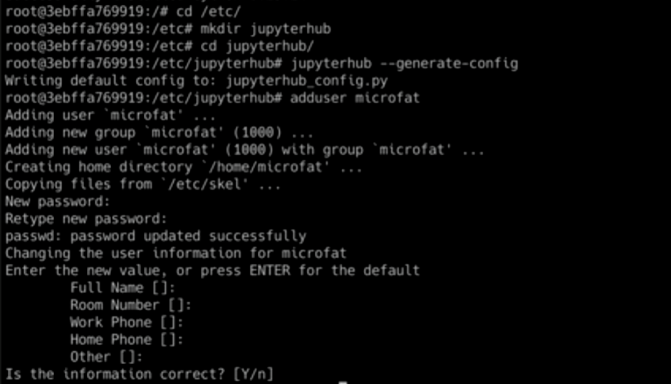


### 运行
```python
jupyterhub --ip 0.0.0.0 --port 8888 -f /etc/jupyterhub/jupyterhub_config.py 

vim /etc/jupyterhub/jupyterhub_config.py
```


### 编辑配置文件
```python
/c.JupyterHub.proxy_cmd
c.JupyterHub.proxy_cmd = ['/node-v16.13.0-linux-x64/bin/configurable-http-proxy']
npm install -g configurable-http-proxy
```

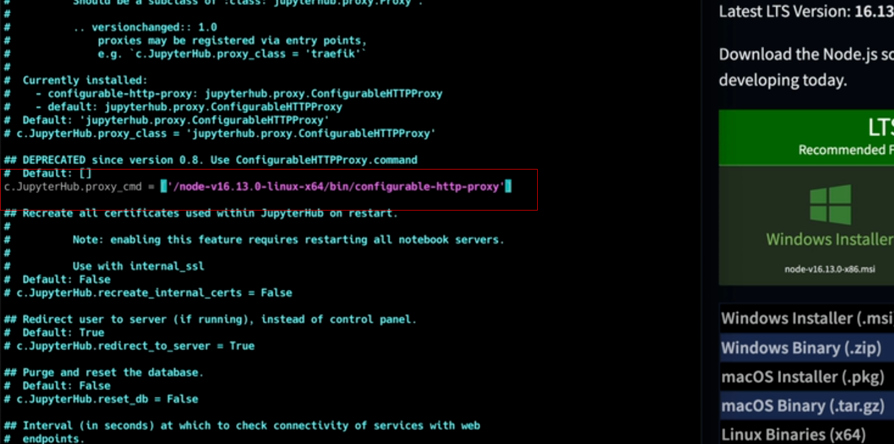

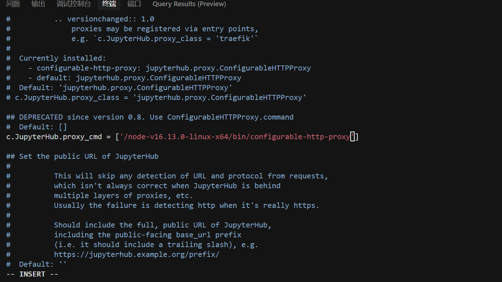

### 编辑配置文件
```python
c.Authenticator.allowed_users = {'admin1'}
```

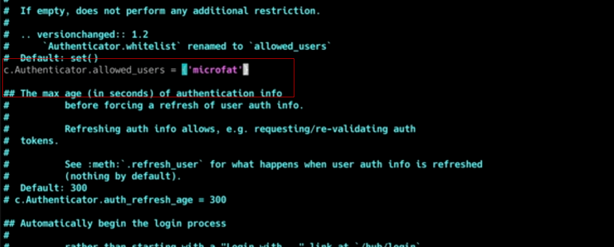

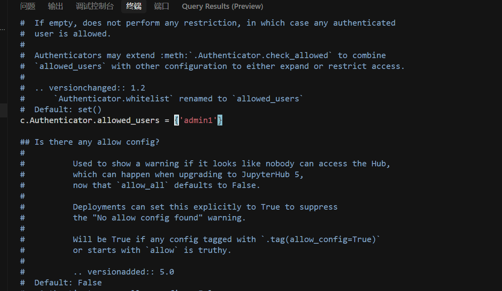

### 编辑配置文件
```python
c.Spawner.notebook_dir = '/home'
```

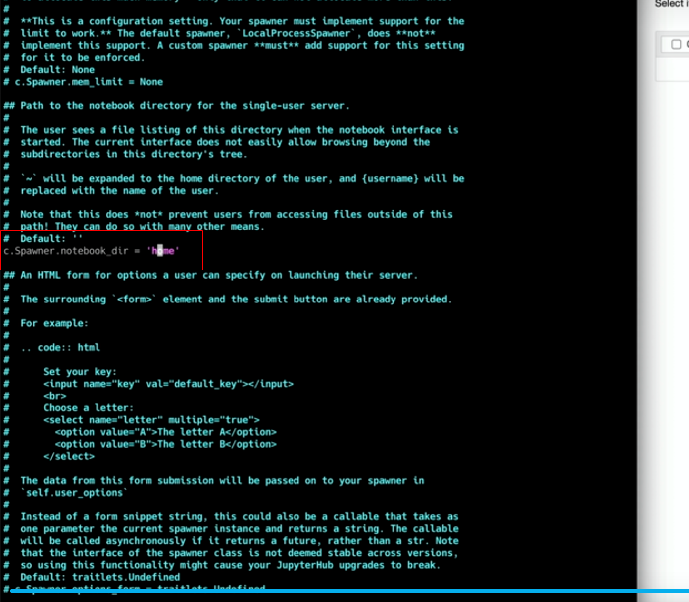

```python
c.JupyterHub.ip = '0.0.0.0'
c.JupyterHub.port = 8888
```

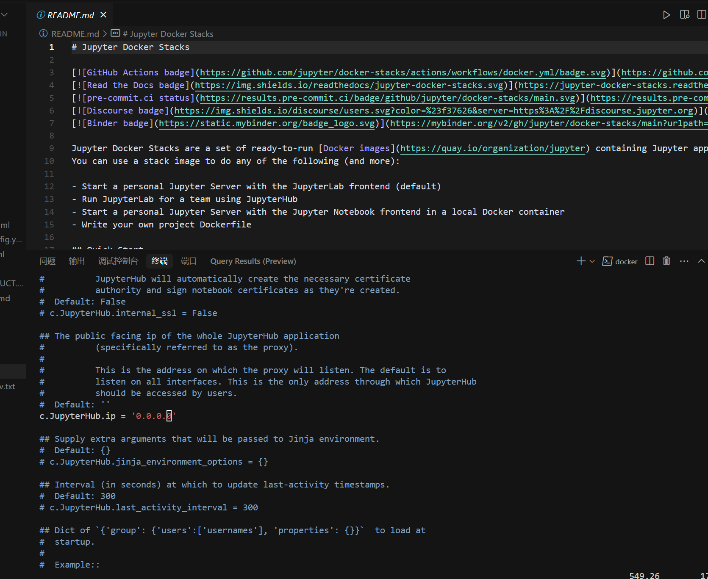

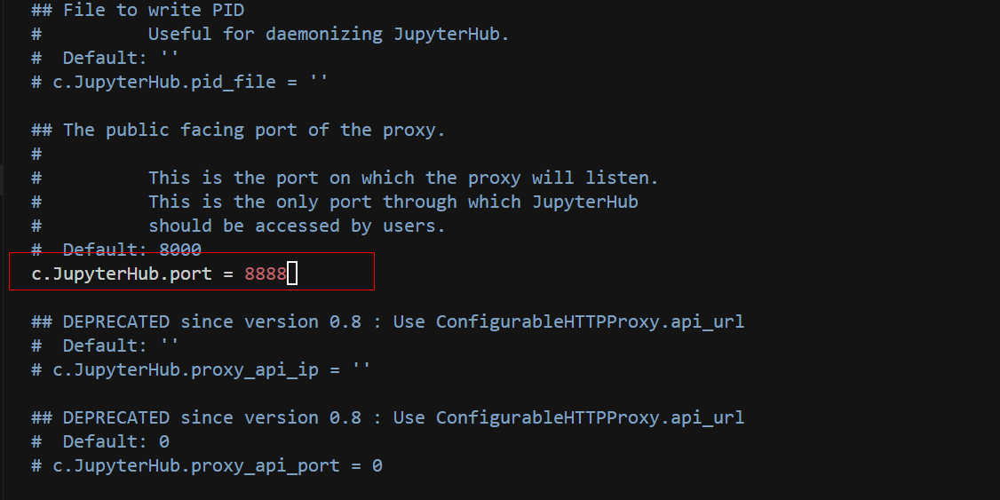

### 设置自启动
```python
vim /etc/init.d/jupyterhub
```

```python
#!/bin/bash
### BEGIN INIT INFO
# Provides:          jupyterhub
# Required-Start:    $remote_fs $syslog
# Required-Stop:     $remote_fs $syslog
# Default-Start:     2 3 4 5
# Default-Stop:      0 1 6
# Short-Description: JupyterHub server
# Description:       Start JupyterHub server
### END INIT INFO

# 设置环境变量
PATH=/sbin:/usr/sbin:/bin:/usr/bin
DESC="JupyterHub Server"
NAME=jupyterhub
DAEMON=/usr/local/bin/$NAME
DAEMON_ARGS="--config=/etc/jupyterhub/jupyterhub_config.py"
PIDFILE=/var/run/$NAME.pid
SCRIPTNAME=/etc/init.d/$NAME
VERBOSE=yes

# 检查守护进程是否存在
[ -x "$DAEMON" ] || exit 0

# 定义日志函数
log_daemon_msg() { echo "$@"; }
log_end_msg() { [ $1 -eq 0 ] && echo "OK" || echo "FAIL"; }

# 启动函数
do_start() {
    # 检查是否已经运行
    start-stop-daemon --start --quiet --pidfile $PIDFILE --exec $DAEMON --test > /dev/null \
        || return 1
    # 启动服务
    start-stop-daemon --start --quiet --pidfile $PIDFILE --exec $DAEMON -- \
        $DAEMON_ARGS \
        || return 2
}

# 停止函数
do_stop() {
    # 停止服务
    start-stop-daemon --stop --quiet --retry=TERM/30/KILL/5 --pidfile $PIDFILE --name $NAME
    RETVAL="$?"
    [ "$RETVAL" = 2 ] && return 2
    # 等待进程完全停止
    start-stop-daemon --stop --quiet --oknodo --retry=0/30/KILL/5 --exec $DAEMON
    [ "$?" = 2 ] && return 2
    # 删除PID文件
    rm -f $PIDFILE
    return "$RETVAL"
}

# 获取状态
status_of_proc() {
    if [ -f $PIDFILE ]; then
        if kill -0 $(cat $PIDFILE) > /dev/null 2>&1; then
            echo "$DESC is running"
            return 0
        else
            echo "$DESC is not running but pid file exists"
            return 1
        fi
    else
        echo "$DESC is not running"
        return 3
    fi
}

case "$1" in
    start)
        [ "$VERBOSE" != no ] && log_daemon_msg "Starting $DESC" "$NAME"
        do_start
        case "$?" in
            0|1) [ "$VERBOSE" != no ] && log_end_msg 0 ;;
            2) [ "$VERBOSE" != no ] && log_end_msg 1 ;;
        esac
        ;;
    stop)
        [ "$VERBOSE" != no ] && log_daemon_msg "Stopping $DESC" "$NAME"
        do_stop
        case "$?" in
            0|1) [ "$VERBOSE" != no ] && log_end_msg 0 ;;
            2) [ "$VERBOSE" != no ] && log_end_msg 1 ;;
        esac
        ;;
    status)
        status_of_proc "$DAEMON" "$NAME" && exit 0 || exit $?
        ;;
    restart|force-reload)
        log_daemon_msg "Restarting $DESC" "$NAME"
        do_stop
        case "$?" in
            0|1)
                do_start
                case "$?" in
                    0) log_end_msg 0 ;;
                    1) log_end_msg 1 ;; # Old process is still running
                    *) log_end_msg 1 ;; # Failed to start
                esac
                ;;
            *)
                # Failed to stop
                log_end_msg 1
                ;;
        esac
        ;;
    *)
        echo "Usage: $SCRIPTNAME {start|stop|status|restart|force-reload}" >&2
        exit 3
        ;;
esac

exit 0
```

```python
chmod +x /etc/init.d/jupyterehub
service  jupyterhub start
```


### 配置文件
```python
/c.JupyterHub.ip='0.0.0.0'

/c.JupyterHub.port='8888'
```

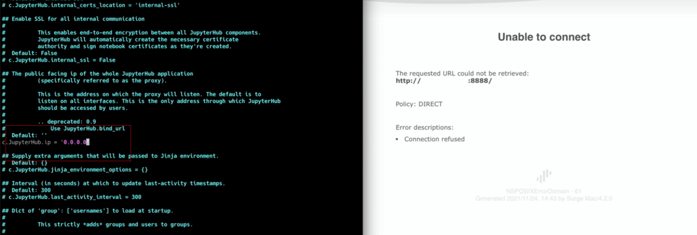


```python
pip3 install jupyterlab
jupyter labextension install @jupyterlab/hub-extension
jupyter serverextension enable --py jupyterlab --sys-prefix
```

### 编辑配置文件
```python
/.default_url
```

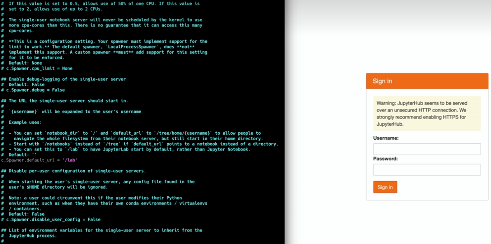

### 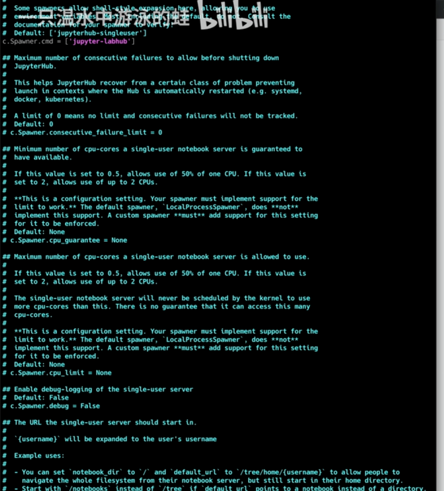
```python
c.Spawner.default_url = '/lab'

c.Spawner.cmd = ['jupyter-labhub']
```

### 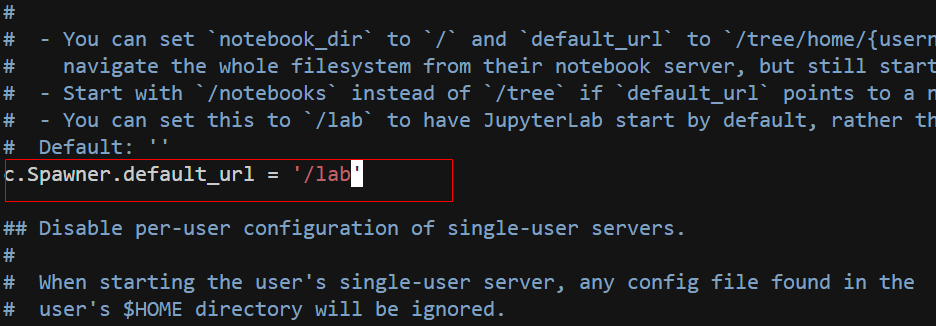
### 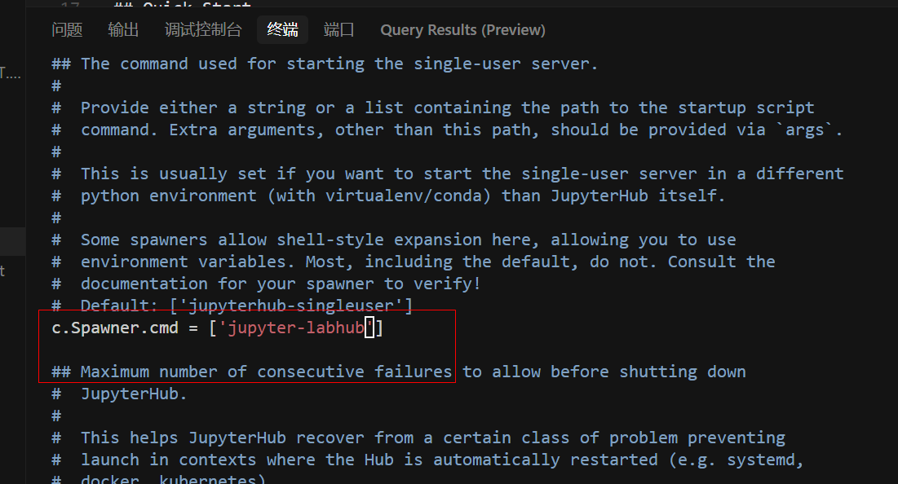  
重启服务
```python
service jupyterhub restart
```

### 安装插件
```python
pip install jupyterlab-latex
pip install jupyterlab-language-pack-zh-CN
pip install jupyterlab-git
pip install jupyter-dash
pip install ipywidgets
pip install jupyter-resource-usage
# Git集成
pip install jupyterlab-git

# 变量查看器
pip install jupyterlab-variableinspector

# 代码格式化
pip install jupyterlab-code-formatter
pip install black isort

# LSP 支持（代码补全、语法检查）
pip install jupyterlab-lsp python-lsp-server
# 交互式图表支持
pip install ipywidgets

# 绘图工具
pip install jupyterlab-drawio

# 高级可视化
pip install plotly
pip install jupyter-dash

# 表格增强
pip install jupyterlab-tabular-data-editor
# 系统资源监控
pip install jupyter-resource-usage

# TOC（目录）
pip install jupyterlab-toc

# 执行时间
pip install jupyter_contrib_nbextensions
jupyter contrib nbextension install --user
# 主题
pip install jupyterlab_theme_solarized_dark
pip install jupyterlab_theme_material_darker

# 文件树增强
pip install jupyterlab-filetree
# Markdown预览增强
pip install jupyterlab_markup

# LaTeX支持
pip install jupyterlab-latex
# 数据库连接
pip install jupyterlab-sql

# CSV文件增强预览
pip install jupyterlab-spreadsheet-editor
```


> 更新: 2025-04-19 23:32:48  
> 原文: <https://www.yuque.com/lixinsi/vnere7/svf8flvllhla3nc5>