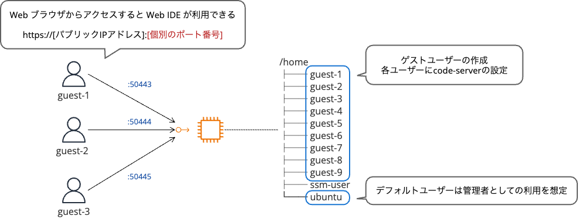
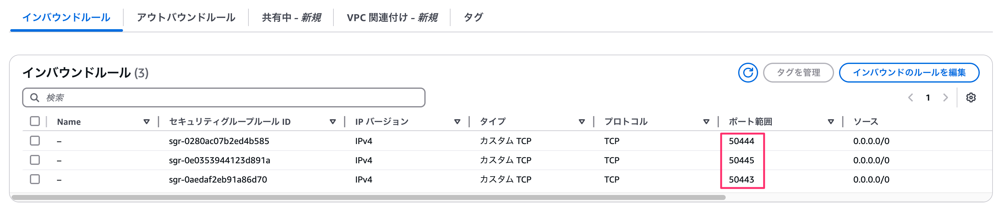
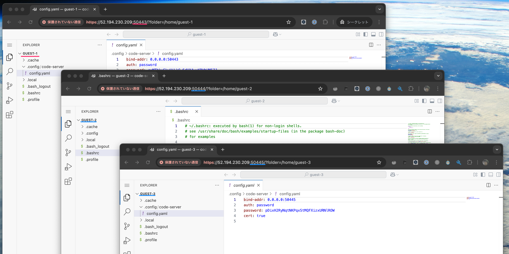
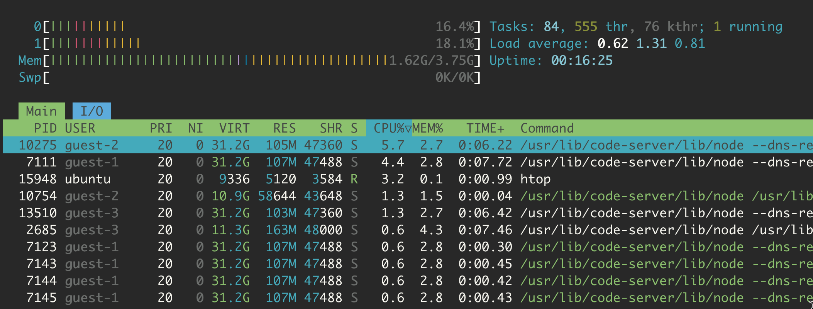

# 多用户ide


# <font style="color:rgb(0, 0, 0);">我尝试使用代码服务器在单个 EC2 机器上创建一个可供多个用户使用的 Web IDE 环境。</font>

[#亚马逊 EC2](https://dev.classmethod.jp/tags/amazon-ec2/)

[#AWS](https://dev.classmethod.jp/tags/aws/)

[#代码服务器](https://dev.classmethod.jp/tags/code-server/)

[大村康隆](https://dev.classmethod.jp/author/ohmura-yasutaka/)


2025.03.14

## <font style="color:rgb(0, 0, 0);">介绍</font>

<font style="color:rgb(0, 0, 0);">在某些情况下，您希望为实践培训或讲座的所有参与者提供相同的执行环境。然而，准备单独的服务器成本很高，并且使用参与者的电脑可能会根据环境而引起各种问题。</font>

<font style="color:rgb(0, 0, 0);">在我们之前的文章“</font>[<font style="color:rgb(15, 131, 253);">我调查了 code-server 是否可以在单个 EC2 服务器上创建一个可供多个用户使用的 Web IDE 环境</font>](https://dev.classmethod.jp/articles/code-server-multi-user-ec2-review/)<font style="color:rgb(0, 0, 0);">”中，我们确认 code-server 官方并不推荐多用户环境。虽然不推荐，但我尝试看看它是否在技术上可以用作多用户环境。</font>

<font style="color:rgb(0, 0, 0);">在本文中，我们将向您展示如何设置一个 Web IDE 环境，允许多个用户在单个 EC2 实例上使用代码服务器。</font>



## <font style="color:rgb(0, 0, 0);">结论</font>

**<font style="color:rgb(255, 255, 255);background-color:rgb(255, 184, 76);">！</font>**

<font style="color:rgba(0, 0, 0, 0.7);background-color:rgb(255, 246, 228);">虽然技术上可行，但官方立场是不推荐使用多租户配置。</font>

<font style="color:rgb(0, 0, 0);">需要以下设置来使用代码服务器创建多用户环境。</font>

* <font style="color:rgb(0, 0, 0);">为每个用户创建自定义配置文件</font>
  * <font style="color:rgb(0, 0, 0);">为每个用户分配不同的端口号</font>
* <font style="color:rgb(0, 0, 0);">使用 systemd 为每个用户单独管理服务</font>

<font style="color:rgb(0, 0, 0);">通过满足这些条件，多个用户可以在单个 EC2 实例上使用代码服务器。</font>

## <font style="color:rgb(0, 0, 0);">如何创建多用户环境</font>

### <font style="color:rgb(0, 0, 0);">1. 先决条件</font>

* <font style="color:rgb(0, 0, 0);">Ubuntu 24.04 LTS 的 EC2 实例</font>
* <font style="color:rgb(0, 0, 0);">建议不要使用此</font><font style="color:rgb(0, 0, 0);">实例类型</font><code><font style="color:rgb(0, 0, 0);">t3.micro</font></code><font style="color:rgb(0, 0, 0);">，因为它会导致内存不足。</font><code><font style="color:rgb(0, 0, 0);">t3.medium</font></code>
* <font style="color:rgb(0, 0, 0);">打开具有所需端口范围（本例中为 50443-50462）的安全组</font>



### <font style="color:rgb(0, 0, 0);">2. 自动安装脚本</font>

<font style="color:rgb(0, 0, 0);">以下脚本将自动创建20个用户帐户和一个代码服务器环境。</font>

<font style="color:rgba(255, 255, 255, 0.9);background-color:rgb(50, 62, 82);">安装代码服务器.sh</font>

```bash
#!/bin/bash
set -e  # エラー時に実行を停止

# 必要なパッケージのインストール
sudo apt update
sudo apt install -y pwgen jq curl

# GitHubのAPIを使用して最新バージョンを取得
CODER_VERSION=$(curl -s https://api.github.com/repos/coder/code-server/releases/latest | jq -r .tag_name | sed 's/v//')

# ダウンロードURLを組み立て
DOWNLOAD_URL="https://github.com/coder/code-server/releases/download/v${CODER_VERSION}/code-server_${CODER_VERSION}_amd64.deb"

# ダウンロード&インストール
if [ ! -f "/usr/bin/code-server" ]; then
    echo "code-server ${CODER_VERSION} をダウンロードしています..."
    curl -fOL ${DOWNLOAD_URL}
    apt install -y ./code-server_${CODER_VERSION}_amd64.deb
    rm -f code-server_${CODER_VERSION}_amd64.deb
else
    echo "code-server はすでにインストールされています"
fi

# ベースポート番号（50443から開始）
BASE_PORT=50443

# ユーザーログイン情報出力ファイル
CSV_FILE="/home/ubuntu/code-server-users.csv"

# CSV ヘッダーを作成
echo "username,user_password,access_url,code_server_password" > $CSV_FILE

# EC2 のパブリック IPv4 アドレスの取得
SERVER_IP=$(curl -s -4 ifconfig.me || hostname -I | awk '{print $1}')

# ユーザーごとの設定
for i in $(seq 1 20); do
    USERNAME="guest-$i"
    USER_HOME="/home/$USERNAME"
    PORT=$((BASE_PORT + i - 1))

    # ユーザーが存在しない場合は作成
    if ! id -u "$USERNAME" &>/dev/null; then
        echo "ユーザー $USERNAME を作成しています..."
        useradd -m -s /bin/bash "$USERNAME"
        USER_PASSWORD=$(pwgen -s -n -c 16 1)
        echo "$USERNAME:$USER_PASSWORD" | chpasswd
    else
        echo "ユーザー $USERNAME はすでに存在します"
    fi

    # code-server の設定ディレクトリを作成
    mkdir -p "$USER_HOME/.config/code-server/"

    # code-serve 用パスワードを生成
    CS_PASSWORD=$(pwgen -s -n -c 32 1)

    # 設定ファイルを作成
    cat > "$USER_HOME/.config/code-server/config.yaml" << EOF
bind-addr: 0.0.0.0:$PORT
auth: password
password: $CS_PASSWORD
cert: true
EOF

    # 所有権を設定
    chown -R "$USERNAME:$USERNAME" "$USER_HOME/.config"

    # systemd サービスファイルを作成
    cat > "/etc/systemd/system/code-server@$USERNAME.service" << EOF
[Unit]
Description=code-server for $USERNAME
After=network.target

[Service]
Type=simple
User=$USERNAME
ExecStart=/usr/bin/code-server
Restart=always
WorkingDirectory=$USER_HOME

[Install]
WantedBy=multi-user.target
EOF

    # サービスを有効化して開始
    systemctl daemon-reload
    systemctl enable --now "code-server@$USERNAME"

    # アクセスURLを作成
    ACCESS_URL="https://$SERVER_IP:$PORT"

    # CSVファイルに情報を追加
    echo "$USERNAME,$USER_PASSWORD,$ACCESS_URL,$CS_PASSWORD" >> $CSV_FILE
done

# 権限設定
chown ubuntu:ubuntu $CSV_FILE
chmod 600 $CSV_FILE

# サマリーを表示
echo "--- 実行結果 ---"
echo "各ユーザーのアクセス情報は以下のファイルに保存されています。"
echo "$CSV_FILE"
```

### <font style="color:rgb(0, 0, 0);">3.脚本执行流程</font>

<font style="color:rgb(0, 0, 0);">使用会话管理器或 SSH 连接到您的 EC2 实例并运行脚本。</font>

```bash
sudo chmod +x setup-code-server.sh
sudo ./setup-code-server.sh
```

<font style="color:rgb(0, 0, 0);">一旦执行完成，</font><code><font style="color:rgb(0, 0, 0);">/home/ubuntu/code-server-users.csv</font></code><font style="color:rgb(0, 0, 0);">访问信息将被保存。</font>

### <font style="color:rgb(0, 0, 0);">4. 检查您的访问信息</font>

<font style="color:rgb(0, 0, 0);">运行脚本后，将生成如下所示的 CSV 文件。</font>

<font style="color:rgba(255, 255, 255, 0.9);background-color:rgb(50, 62, 82);">代码服务器用户.csv</font>

```plain
username,user_password,access_url,code_server_password
guest-1,mPvVI48GxQA7yFLk,https://203.0.113.1:50443,cxMThkySkyHjLk6w5dVX4yxKBWbUM57J
guest-2,jdDiOIIwnICTy3b2,https://203.0.113.1:50444,KXmImwIy5cl98byq7FJp1urP2jLwxiY8
guest-3,ai5RSr9vu4gCyzr9,https://203.0.113.1:50445,pDixH2RyNqtNKPqxStMQFXizxURNlROW
...
```

<font style="color:rgb(0, 0, 0);">CSV 文件包含以下信息：您这次需要的是代码服务器编号 3 和 4 的访问信息。</font>

1. <font style="color:rgb(0, 0, 0);">用户名</font>
2. <font style="color:rgb(0, 0, 0);">密码</font>
3. **<font style="color:rgb(0, 0, 0);">代码服务器访问URL（含端口号）</font>**
4. **<font style="color:rgb(0, 0, 0);">代码服务器登录密码</font>**

## <font style="color:rgb(0, 0, 0);">操作验证</font>

### <font style="color:rgb(0, 0, 0);">多个用户可以同时连接</font>

<font style="color:rgb(0, 0, 0);">我们有三个用户同时访问代码服务器。</font>



<font style="color:rgb(0, 0, 0);">每个用户都可以访问独立的代码服务器，并且可以登录到自己的主目录，而不会干扰其他用户的工作。</font>

### <font style="color:rgb(0, 0, 0);">检查系统资源</font>

<font style="color:rgb(0, 0, 0);">使用htop命令检查三个用户连接时的系统资源使用情况。</font>



<font style="color:rgb(0, 0, 0);">可以看到每个用户的代码服务器进程都是独立运行的。每个活跃用户消耗大约 300MB 的内存。随着登录用户数量的增加，内存使用量也会增加，因此在选择实例大小时需要小心。</font>

### <font style="color:rgb(0, 0, 0);">查看活跃用户</font>

<font style="color:rgb(0, 0, 0);">您无法使用标准 who 命令查看谁登录了代码服务器。</font>

```bash
$ who
ssm-user pts/1        2025-03-13 23:30
```

<font style="color:rgb(0, 0, 0);">检查活动代码服务器会话的一个有用方法是检查进程列表。</font>

```bash
$ ps aux | grep extensionHost | grep -v grep
guest-1    20174  3.4  2.4 32788644 96852 ?      Sl   00:17   0:14 /usr/lib/code-server/lib/node --dns-result-order=ipv4first /usr/lib/code-server/lib/vscode/out/bootstrap-fork --type=extensionHost --transformURIs --useHostProxy=false
guest-2    23919 27.7  2.8 32819596 111944 ?     Sl   00:24   0:02 /usr/lib/code-server/lib/node --dns-result-order=ipv4first /usr/lib/code-server/lib/vscode/out/bootstrap-fork --type=extensionHost --transformURIs --useHostProxy=false
```

<font style="color:rgb(0, 0, 0);">在上面的例子中，我们可以看到用户guest-1和guest-2正在使用code-server。</font>

## <font style="color:rgb(0, 0, 0);">注意事项和限制</font>

### <font style="color:rgb(0, 0, 0);">弃用</font>

<font style="color:rgb(0, 0, 0);">官方代码服务器文档不推荐多租户环境。请注意，虽然本文描述的方法在技术上是可行的，但不建议这样做。</font>

<font style="color:rgb(101, 113, 123);">“多租户可能吗？”</font><font style="color:rgb(101, 113, 123);">\ </font><font style="color:rgb(101, 113, 123);">如果您想在共享基础架构上运行多个代码服务器，我们建议使用虚拟机（每个用户提供一台虚拟机）。</font><font style="color:rgb(101, 113, 123);">\ </font>[<font style="color:rgb(15, 131, 253);">https://coder.com/docs/code-server/FAQ#is-multi-tenancy-possible</font>](https://coder.com/docs/code-server/FAQ#is-multi-tenancy-possible)

### <font style="color:rgb(0, 0, 0);">资源限制</font>

<font style="color:rgb(0, 0, 0);">随着用户数量的增加，系统资源（CPU、内存）的消耗也随之增加。您应该特别注意内存的使用情况。粗略地讲，每个用户至少消耗 300MB 内存。</font>

### <font style="color:rgb(0, 0, 0);">SSL 证书警告</font>

<font style="color:rgb(0, 0, 0);">由于使用了自签名证书，您的浏览器中将显示一条警告消息。</font>

## <font style="color:rgb(0, 0, 0);">概括</font>

<font style="color:rgb(0, 0, 0);">code-server 官方不推荐多租户环境。从技术上讲，可以在单个 EC2 实例上创建一个可供多个用户使用的环境。</font>

## <font style="color:rgb(0, 0, 0);">结论</font>

<font style="color:rgb(0, 0, 0);">我正在寻找一个易于为 Linux/Unix 初学者提供实践培训，但又不难管理的 Web IDE 环境。接下来我们计划测试一下Open OnDemand的实用性。</font>

<font style="color:rgb(0, 0, 0);">分享这篇文章</font>


## <font style="color:rgb(0, 0, 0);">相关文章</font>

[我尝试在 EC2 上构建并使用 AI 视频生成应用程序“FramePack”](https://dev.classmethod.jp/articles/ai-framepack-ec2/)

[索拉](https://dev.classmethod.jp/author/sato-ryuki/)

2025.04.21

[我可以使用应用程序迁移服务 (MGN) 从单个源服务器启动多个实例吗？](https://dev.classmethod.jp/articles/can-mgn-launch-multiple-instances-from-single-source-server/)

[M. Shimizu](https://dev.classmethod.jp/author/shimizu-mitsuaki/)

2025.04.18

[Amazon EC2 数据传输费用汇总](https://dev.classmethod.jp/articles/ec2-datatransfer-cost/)

[中村佑太郎](https://dev.classmethod.jp/author/nakamura-yutaro/)

2025.04.16

[自动扩展 EC2 EC2 EBS EBS](https://dev.classmethod.jp/articles/jw-set-ebs-volumes-for-ec2-instances-belonging-to-auto-scaling-groups-respectively/)

[金材昱](https://dev.classmethod.jp/author/kim-jaewook/)

2025.04.15


© Classmethod, Inc. 保留所有权利。


> 更新: 2025-04-22 08:37:55  
> 原文: <https://www.yuque.com/lixinsi/vnere7/adr1si7edekzta1g>