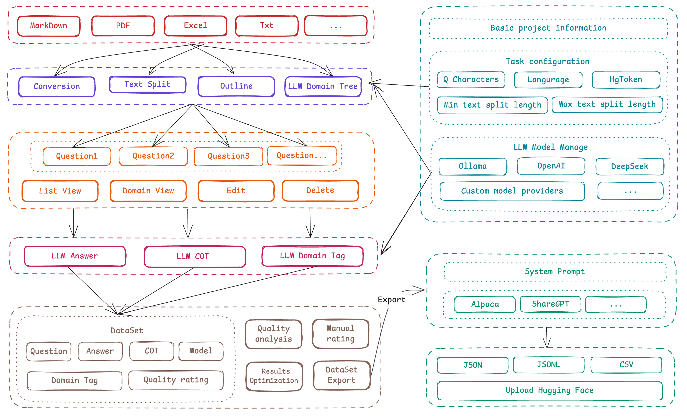

# 学习微调蒸馏整理数据集

[https://rncg5jvpme.feishu.cn/wiki/U9rYwRHQoil6vBkitY8cbh5tnL9](https://rncg5jvpme.feishu.cn/wiki/U9rYwRHQoil6vBkitY8cbh5tnL9)

[https://github.com/ConardLi/easy-dataset/releases/tag/1.2.2](https://github.com/ConardLi/easy-dataset/releases/tag/1.2.2)

### Easy Dataset
**一个强大的大型语言模型微调数据集创建工具：****https://github.com/ConardLi/easy-dataset**

使用文档：[Easy Dataset - 使用文档](https://rncg5jvpme.feishu.cn/wiki/NT7aw7rBfi8HwukHaUTcvrQIn6f?fromScene=spaceOverview)

**辛苦留个 Star 支持下呀 ****❤️**

> 更新: 2025-03-29 21:59:35  
> 原文: <https://www.yuque.com/lixinsi/vnere7/qvfb9dg7vori3mzn>