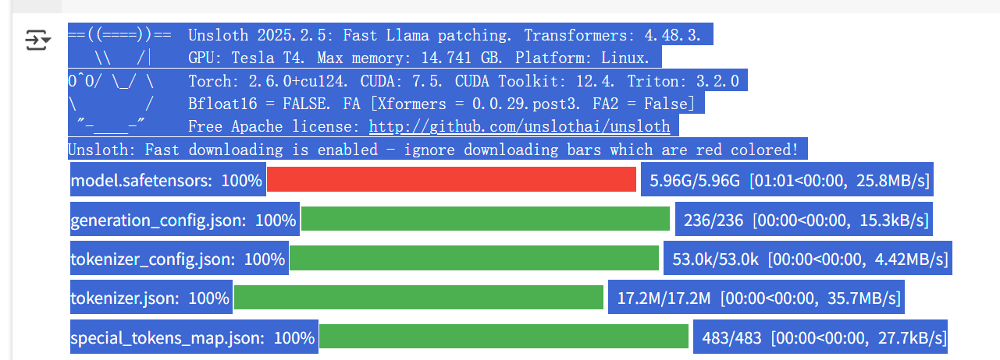
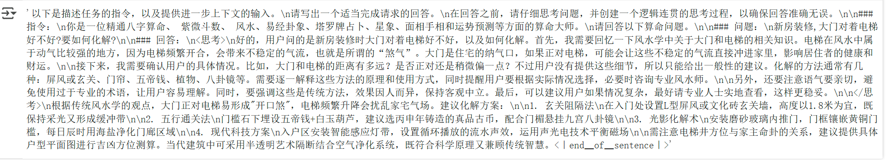
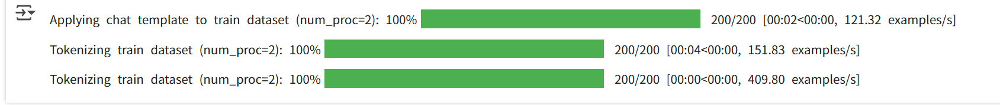
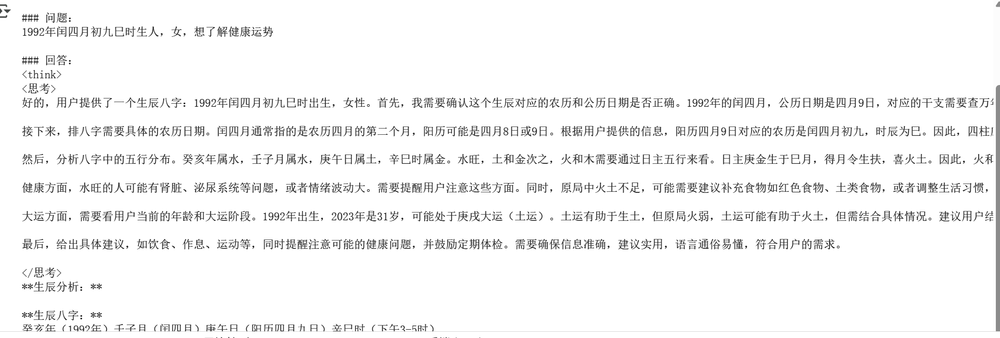
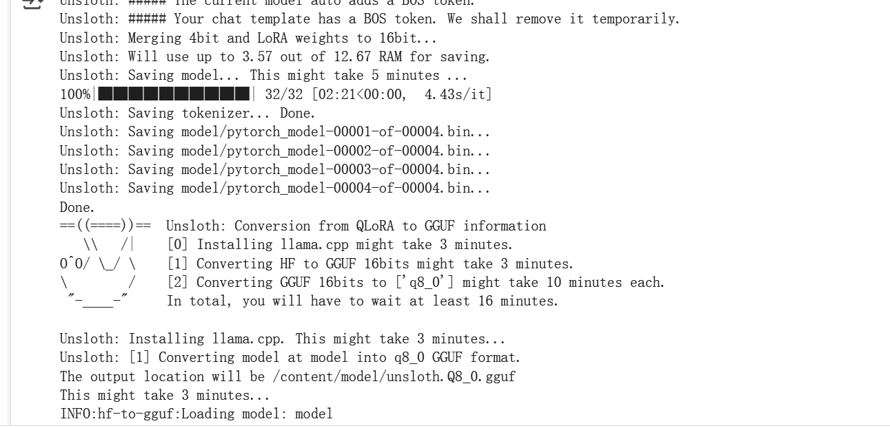
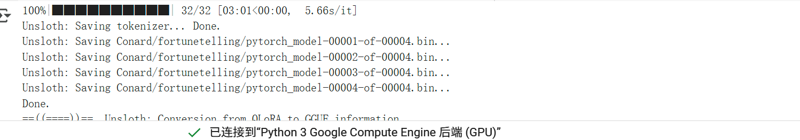

# 微调实战算命大模型

[https://colab.research.google.com/drive/1B4nS1L5_GuGHU4U8l-qI-Ej7EqeBNHg6](https://colab.research.google.com/drive/1B4nS1L5_GuGHU4U8l-qI-Ej7EqeBNHg6)

## <font style="color:rgb(31, 31, 31);">第一步：安装依赖</font>
```python
%%capture  # 这是一个 Jupyter Notebook 的魔法命令，用于隐藏命令的输出，让笔记本界面更整洁。

# 安装 unsloth 包。unsloth 是一个用于微调大型语言模型（LLM）的工具，可以让模型运行更快、占用更少内存。
!pip install unsloth

# 卸载当前已安装的 unsloth 包（如果已安装），然后从 GitHub 的源代码安装最新版本。
# 这样可以确保我们使用的是最新功能和修复。
!pip uninstall unsloth -y && pip install --upgrade --no-cache-dir --no-deps git+https://github.com/unslothai/unsloth.git

# 安装 bitsandbytes 和 unsloth_zoo 包。
# bitsandbytes 是一个用于量化和优化模型的库，可以帮助减少模型占用的内存。
# unsloth_zoo 可能包含了一些预训练模型或其他工具，方便我们使用。
!pip install bitsandbytes unsloth_zoo
```

## <font style="color:rgb(31, 31, 31);">第二步：加载预训练模型</font>
```python
from unsloth import FastLanguageModel  # 导入FastLanguageModel类，用来加载和使用模型
import torch  # 导入torch工具，用于处理模型的数学运算

max_seq_length = 2048  # 设置模型处理文本的最大长度，相当于给模型设置一个“最大容量”
dtype = None  # 设置数据类型，让模型自动选择最适合的精度
load_in_4bit = True  # 使用4位量化来节省内存，就像把大箱子压缩成小箱子

# 加载预训练模型，并获取tokenizer工具
model, tokenizer = FastLanguageModel.from_pretrained(
    model_name="unsloth/DeepSeek-R1-Distill-Llama-8B",  # 指定要加载的模型名称
    max_seq_length=max_seq_length,  # 使用前面设置的最大长度
    dtype=dtype,  # 使用前面设置的数据类型
    load_in_4bit=load_in_4bit,  # 使用4位量化
    # token="hf_...",  # 如果需要访问授权模型，可以在这里填入密钥
)
```



## <font style="color:rgb(31, 31, 31);">第三步：微调前测试</font>
```python
prompt_style = """以下是描述任务的指令，以及提供进一步上下文的输入。
请写出一个适当完成请求的回答。
在回答之前，请仔细思考问题，并创建一个逻辑连贯的思考过程，以确保回答准确无误。

### 指令：
你是一位精通卜卦、星象和运势预测的算命大师。
请回答以下算命问题。

### 问题：
{}

### 回答：
<think>{}"""
# 定义提示风格的字符串模板，用于格式化问题

question = "1992年闰四月初九巳时生人，女，想了解健康运势"
# 定义具体的算命问题
```

```python
FastLanguageModel.for_inference(model)
# 准备模型以进行推理

inputs = tokenizer([prompt_style.format(question, "")], return_tensors="pt").to("cuda")
# 使用 tokenizer 对格式化后的问题进行编码，并移动到 GPU

outputs = model.generate(
    input_ids=inputs.input_ids,
    attention_mask=inputs.attention_mask,
    max_new_tokens=1200,
    use_cache=True,
)
# 使用模型生成回答

response = tokenizer.batch_decode(outputs)
# 解码模型生成的输出为可读文本

print(response[0])
# 打印生成的回答部分
```

```python
<｜begin▁of▁sentence｜>以下是描述任务的指令，以及提供进一步上下文的输入。
请写出一个适当完成请求的回答。
在回答之前，请仔细思考问题，并创建一个逻辑连贯的思考过程，以确保回答准确无误。

### 指令：
请回答以下问题。

### 问题：
1992年闰四月初九巳时生人，女，想了解健康运势

### 回答：
<think>
<思考>
好的，用户提供的信息是：1992年闰四月初九巳时生人，女性，想了解健康运势。首先，我需要确认这个农历日期对应的公历日期，因为闰四月在中国传统历中属于二月，1992年的闰四月初九对应的公历日期应该是1992年4月29日。巳时是下午1点到下午3点的时间段。

接下来，根据生肖和八字来分析健康运势。1992年是壬申年，生肖属猴。女命的话，五行属火，需要结合年柱、月柱、日柱、时柱来分析。闰四月属于二月，天干为壬水，地支为申金。时柱巳火为用神。需要结合这些元素来看健康运势。

女性健康运势通常涉及内在五行、情绪状态、生活习惯等方面。需要注意可能的健康问题，比如水火相克导致的消化问题、情绪波动等。同时，分析用神是否得力，比如巳火是否能生扶身体，或者是否有煞星影响健康。

另外，用户可能关心的是当前一年或近期的健康运势，需要结合当前的
```

## <font style="color:rgb(31, 31, 31);">第四步：加载数据集</font>
```python
# 定义一个用于格式化提示的多行字符串模板
train_prompt_style = """以下是描述任务的指令，以及提供进一步上下文的输入。
请写出一个适当完成请求的回答。
在回答之前，请仔细思考问题，并创建一个逻辑连贯的思考过程，以确保回答准确无误。

### 指令：
你是一位精通八字算命、 紫微斗数、 风水、易经卦象、塔罗牌占卜、星象、面相手相和运势预测等方面的算命大师。
请回答以下算命问题。

### 问题：
{}

### 回答：
<思考>
{}
</思考>
{}"""
```

```python
# 定义结束标记（EOS_TOKEN），用于指示文本的结束
EOS_TOKEN = tokenizer.eos_token  # 必须添加结束标记

# 导入数据集加载函数
from datasets import load_dataset
# 加载指定的数据集，选择中文语言和训练集的前500条记录
dataset = load_dataset("Conard/fortune-telling", 'default', split = "train[0:200]", trust_remote_code=True)
# 打印数据集的列名，查看数据集中有哪些字段
print(dataset.column_names)
```


```python
# 定义一个函数，用于格式化数据集中的每条记录
def formatting_prompts_func(examples):
    # 从数据集中提取问题、复杂思考过程和回答
    inputs = examples["Question"]
    cots = examples["Complex_CoT"]
    outputs = examples["Response"]
    texts = []  # 用于存储格式化后的文本
    # 遍历每个问题、思考过程和回答，进行格式化
    for input, cot, output in zip(inputs, cots, outputs):
        # 使用字符串模板插入数据，并加上结束标记
        text = train_prompt_style.format(input, cot, output) + EOS_TOKEN
        texts.append(text)  # 将格式化后的文本添加到列表中
    return {
        "text": texts,  # 返回包含所有格式化文本的字典
    }

dataset = dataset.map(formatting_prompts_func, batched = True)
dataset["text"][0]
```



## <font style="color:rgb(31, 31, 31);">第五步：执行微调</font>
```python
FastLanguageModel.for_training(model)

model = FastLanguageModel.get_peft_model(
    model,  # 传入已经加载好的预训练模型
    r = 16,  # 设置 LoRA 的秩，决定添加的可训练参数数量
    target_modules = ["q_proj", "k_proj", "v_proj", "o_proj",  # 指定模型中需要微调的关键模块
                      "gate_proj", "up_proj", "down_proj"],
    lora_alpha = 16,  # 设置 LoRA 的超参数，影响可训练参数的训练方式
    lora_dropout = 0,  # 设置防止过拟合的参数，这里设置为 0 表示不丢弃任何参数
    bias = "none",    # 设置是否添加偏置项，这里设置为 "none" 表示不添加
    use_gradient_checkpointing = "unsloth",  # 使用优化技术节省显存并支持更大的批量大小
    random_state = 3407,  # 设置随机种子，确保每次运行代码时模型的初始化方式相同
    use_rslora = False,  # 设置是否使用 Rank Stabilized LoRA 技术，这里设置为 False 表示不使用
    loftq_config = None,  # 设置是否使用 LoftQ 技术，这里设置为 None 表示不使用
)
```


```python
from trl import SFTTrainer  # 导入 SFTTrainer，用于监督式微调
from transformers import TrainingArguments  # 导入 TrainingArguments，用于设置训练参数
from unsloth import is_bfloat16_supported  # 导入函数，检查是否支持 bfloat16 数据格式

trainer = SFTTrainer(  # 创建一个 SFTTrainer 实例
    model=model,  # 传入要微调的模型
    tokenizer=tokenizer,  # 传入 tokenizer，用于处理文本数据
    train_dataset=dataset,  # 传入训练数据集
    dataset_text_field="text",  # 指定数据集中文本字段的名称
    max_seq_length=max_seq_length,  # 设置最大序列长度
    dataset_num_proc=2,  # 设置数据处理的并行进程数
    packing=False,  # 是否启用打包功能（这里设置为 False，打包可以让训练更快，但可能影响效果）
    args=TrainingArguments(  # 定义训练参数
        per_device_train_batch_size=2,  # 每个设备（如 GPU）上的批量大小
        gradient_accumulation_steps=4,  # 梯度累积步数，用于模拟大批次训练
        warmup_steps=5,  # 预热步数，训练开始时学习率逐渐增加的步数
        max_steps=75,  # 最大训练步数
        learning_rate=2e-4,  # 学习率，模型学习新知识的速度
        fp16=not is_bfloat16_supported(),  # 是否使用 fp16 格式加速训练（如果环境不支持 bfloat16）
        bf16=is_bfloat16_supported(),  # 是否使用 bfloat16 格式加速训练（如果环境支持）
        logging_steps=1,  # 每隔多少步记录一次训练日志
        optim="adamw_8bit",  # 使用的优化器，用于调整模型参数
        weight_decay=0.01,  # 权重衰减，防止模型过拟合
        lr_scheduler_type="linear",  # 学习率调度器类型，控制学习率的变化方式
        seed=3407,  # 随机种子，确保训练结果可复现
        output_dir="outputs",  # 训练结果保存的目录
        report_to="none",  # 是否将训练结果报告到外部工具（如 WandB），这里设置为不报告
    ),
)
```



```python
trainer_stats = trainer.train()
```

```python
==((====))==  Unsloth - 2x faster free finetuning | Num GPUs = 1
   \\   /|    Num examples = 200 | Num Epochs = 3
O^O/ \_/ \    Batch size per device = 2 | Gradient Accumulation steps = 4
\        /    Total batch size = 8 | Total steps = 75
 "-____-"     Number of trainable parameters = 41,943,040
 [75/75 33:17, Epoch 3/3]
Step	Training Loss
1	1.100600
2	1.150300
3	1.178300
4	1.129200
5	1.081000
6	1.221900
7	1.159500
8	1.159400
9	1.139200
10	1.215800
11	1.215000
12	1.235800
13	1.159500
14	1.181800
15	1.084300
16	1.124400
17	1.139700
18	1.077200
19	1.084900
20	1.114400
21	1.081500
22	1.067300
23	1.243800
24	0.970000
25	1.002700
26	0.969900
27	0.809700
28	0.907700
29	0.892400
30	0.853600
31	0.887800
32	0.911100
33	0.800700
34	0.820800
35	0.801000
36	0.861300
37	0.808400
38	0.840700
39	0.728800
40	0.898300
41	0.844300
42	0.734000
43	0.890800
44	0.865800
45	0.747900
46	0.776400
47	0.740800
48	0.910900
49	1.033900
50	0.893700
51	0.651400
52	0.634500
53	0.580400
54	0.616100
55	0.662600
56	0.661900
57	0.627100
58	0.627000
59	0.615800
60	0.634600
61	0.580500
62	0.682000
63	0.703400
64	0.648300
65	0.629400
66	0.777200
67	0.578600
68	0.600700
69	0.661200
70	0.599500
71	0.597800
72	0.702700
73	0.584300
74	0.581900
75	0.603100
```

## <font style="color:rgb(31, 31, 31);">第七步：微调后测试</font>
```python
print(question) # 打印前面的问题
```


```python
# 将模型切换到推理模式，准备回答问题
FastLanguageModel.for_inference(model)

# 将问题转换成模型能理解的格式，并发送到 GPU 上
inputs = tokenizer([prompt_style.format(question, "")], return_tensors="pt").to("cuda")

# 让模型根据问题生成回答，最多生成 4000 个新词
outputs = model.generate(
    input_ids=inputs.input_ids,  # 输入的数字序列
    attention_mask=inputs.attention_mask,  # 注意力遮罩，帮助模型理解哪些部分重要
    max_new_tokens=4000,  # 最多生成 4000 个新词
    use_cache=True,  # 使用缓存加速生成
)

# 将生成的回答从数字转换回文字
response = tokenizer.batch_decode(outputs)

# 打印回答
print(response[0])
```



## <font style="color:rgb(31, 31, 31);">第八步：将微调后的模型保存为 GGUF 格式</font>
```python
# 导入 Google Colab 的 userdata 模块，用于访问用户数据
from google.colab import userdata

# 从 Google Colab 用户数据中获取 Hugging Face 的 API 令牌
HUGGINGFACE_TOKEN = userdata.get('HUGGINGFACE_TOKEN')

# 将模型保存为 8 位量化格式（Q8_0）
# 这种格式文件小且运行快，适合部署到资源受限的设备
if True: model.save_pretrained_gguf("model", tokenizer,)

# 将模型保存为 16 位量化格式（f16）
# 16 位量化精度更高，但文件稍大
if False: model.save_pretrained_gguf("model_f16", tokenizer, quantization_method = "f16")

# 将模型保存为 4 位量化格式（q4_k_m）
# 4 位量化文件最小，但精度可能稍低
if False: model.save_pretrained_gguf("model", tokenizer, quantization_method = "q4_k_m")
```



### <font style="color:rgb(31, 31, 31);">第九步：将微调后的模型上传到 HuggingFace</font>
```python
# 导入 Hugging Face Hub 的 create_repo 函数，用于创建一个新的模型仓库
from huggingface_hub import create_repo

# 在 Hugging Face Hub 上创建一个新的模型仓库
create_repo("Conard/fortunetelling", token=HUGGINGFACE_TOKEN, exist_ok=True)

# 将模型和分词器上传到 Hugging Face Hub 上的仓库
model.push_to_hub_gguf("Conard/fortunetelling", tokenizer, token=HUGGINGFACE_TOKEN)
```




> 更新: 2025-03-29 21:54:16  
> 原文: <https://www.yuque.com/lixinsi/vnere7/baakpi6l5pwh0th5>