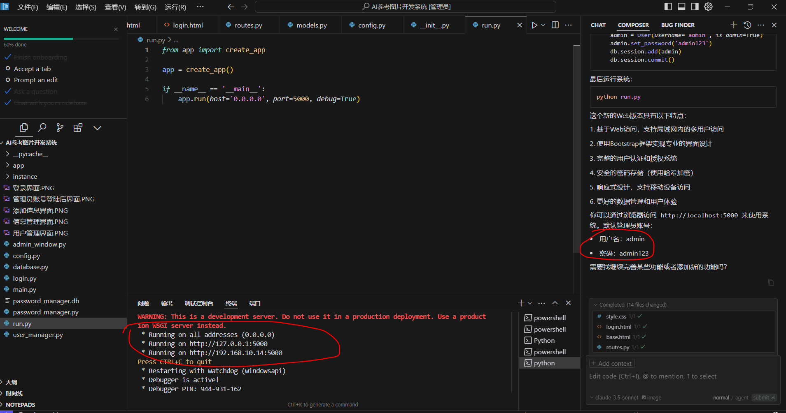
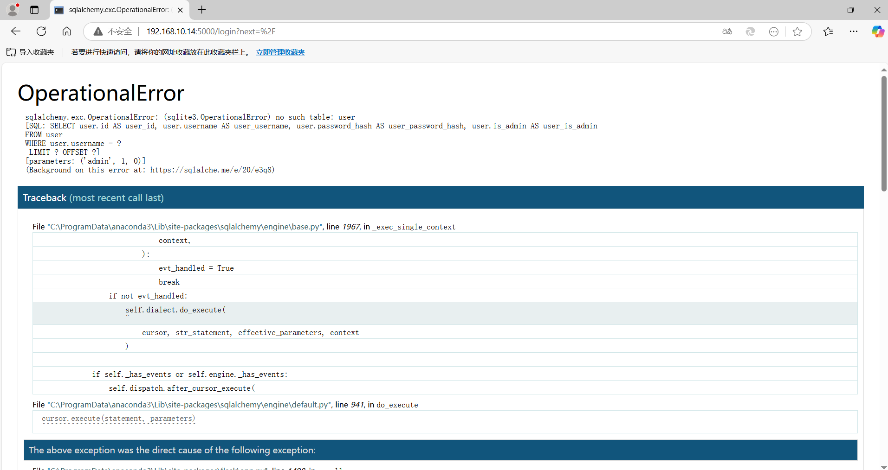
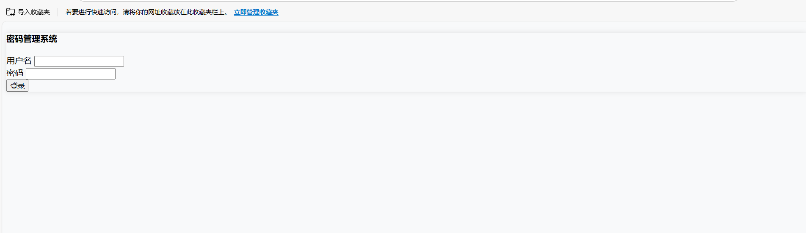
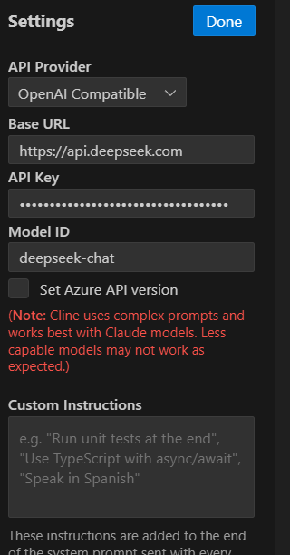
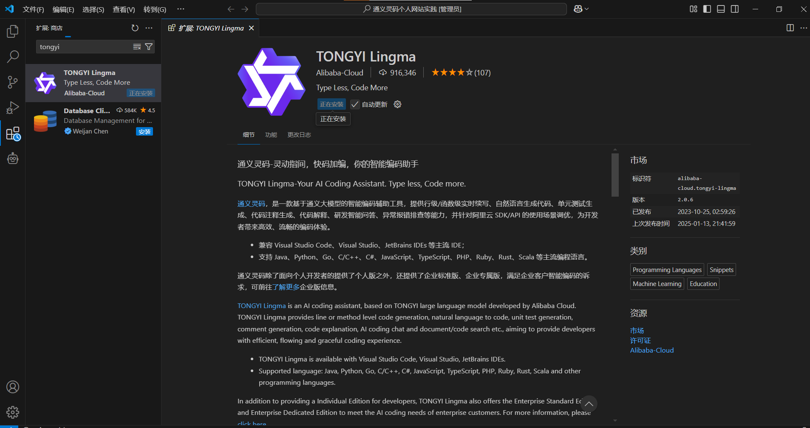
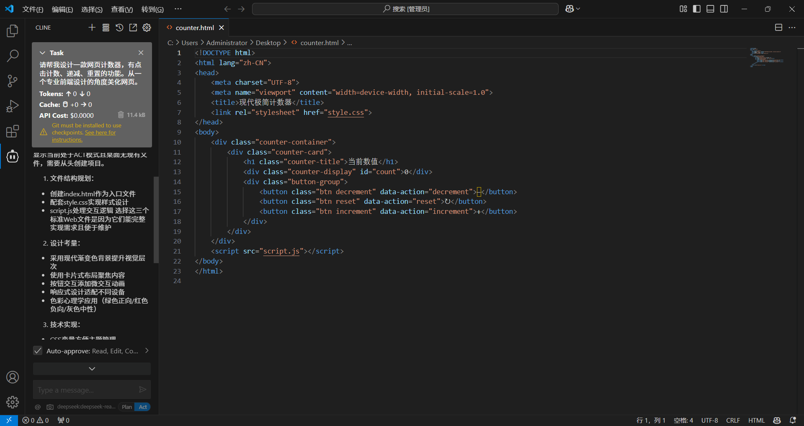
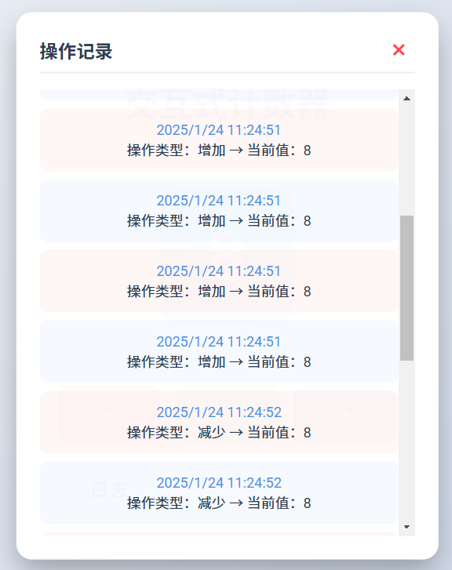

# 数字人制作

cursor、windsurf、deepseek、通义灵码系统开发笔记---小白也能开发系统

# 第一章 cursor的尝试（免费1周时间体验）
## 第一次尝试---学生管理系统
这个平台真的是太厉害了，我一个没有任何开发经验的人一个小时就能做出来一个有基本功能的系统，大家接下来看一下我给大家的演示。这个系统是我昨天吃完饭之后花了半个小时和下午下班之后再花了半个小时做出来的一个系统是一个基本的学生管理系统，它包含的功能有登录，注册进去之后呢，学生可以填写自己的个人信息，自己的获奖情况，老师端登录之后可以查看学生的登记的信息，还可以一键下载，把它下载成excel表格。而这些功能的实现都是我通过自然语言在这个界面的右下角跟这个编程的平台去沟通，他去帮我完善，完善完了之后呢点结束，结束完了之后点运行系统就出来了。后面的我也会持续的去完善我第一个开发的这个系统，下期呢？给他上的功能是让老师只能看到自己班里的学生，把班级和学生的对应关系，我给他提前准备一张表，让他的这个账号的创建啊从表格里面去读取数据，自动创建账户。一开始呢老师和学生用自己的默认账号登录，等到呃登录的时候再让他去修改密码。今天呢给大家演示一个简单的啊，我们通过简单的两张图片，通过一段话让他帮你做一个网页，那我就不演示我自己的那个系统了，因为也是坏了的话，后面还得耽搁时间，我给大家演示一下，自己做一个自己的网页，嗯，后面的我也会持续的去更新我自己做的这个系统的升级和开发，看到最后能不能把这个系统打造成可应用的级别。

## 二、第二次尝试---账号密码管理系统
这是一个密码管理系统，将密码登记在系统中。为什么做这个系统呢，因为在实际工作中，管理的账号密码很多，如果用传统的表格，会存在云文档、电脑联网被窃取的风险，所以我就想着做一个账号密码管理系统。这是我花了2个小时做的。

## 三、第三次尝试---AI学习别人的系统截图，开发系统。
### 新建一个文件夹，同时把参考的图片放在文件夹中

### 打开cursor，选择打开这个文件夹
操作：点击文件---打开文件夹

### ctrl+i，调出交互界面

### 右键图片，复制相对路径，粘贴给对话框，并给出提示词

提示词：图片是一个密码管理系统的页面截图，请根据系统截图的信息，帮我用python语音开发一个同样的系统。

注意：这里不止能用python，其他语音都可以

### 提交后，生成框架和代码，直接点击应用全部，提示安装python包，右边直接点运行。

### 运行系统

点击main.py,点击右上角的三角运行

你可以通过运行main.py来启动系统。默认管理员账号：

+ 用户名：admin
+ 密码：admin123

### bug修复

乱码信息选中，直接选择添加到对话框，告诉他“请处理”，根据提示信息，点击应用，然后在运行。

### 进入系统界面

admin---admin123登录测试

发现，不是我想要的网页登录的方式，继续跟他交互

### 继续优化

提示词：请把系统帮我设计成在网页登录访问的形式，能满足同局域网其他用户登录。我刚才测试，现在的系统信息登记的功能无法正常使用。请在设计系统的同时，帮我进行专业的美化。

### 调试，乱码复制到对话框，让他处理（全程都是跟他交流，因为我也不懂开发）

至此，系统基本成型。当你再有问题和需求需要优化的时候，用问题提示，或者系统截图去描述表达需求，就能继续完善自己的系统了。

## 四、第四次尝试

提示词：请帮我美化系统的所有页面，创建一个初始的管理员账号和密码

# 第二章 deepseek尝试
## 一、注册配置
### 访问网址[https://www.deepseek.com/](https://www.deepseek.com/)
点击API，注册账号。注意不要点击聊天模式。

### 手机注册，创建APIkey
注意，一定要保存好自己的key

API Key：sk-9407fb9eb1b1436a9d3792cfdcd81bc5jm8880（使用自己创建的Key）

Base URl：[https://api.deepseek.com](https://api.deepseek.com/)

Model ID：deepseek-chat

### 在vscode安装cline，配置key

### 开始使用
+ 做个人网站提示词
    - 提示词：请用中文跟我沟通。请帮我用python语言写一个个人网站。我是一名学生，要求网站内容丰富，设计优美，能体现大学生的青春活力。

对话框中文交互即可，不用写一行代码，完成开发任务。

# 第三章 VScode+通义灵码

# 零基础开发案例
## 开发网页计数器
prompt：请帮我设计一款网页计数器，有点击计数、递减、重置的功能。从一个专业前端设计的角度美化网页。

优化提示词：请给网页增加一个记录日志的按钮，点击之后能够看到每次计数的具体操作时间

**更多AI技巧分享，欢迎关注抖音“一名郝老师”**

> 更新: 2025-03-18 12:36:03  
> 原文: <https://www.yuque.com/lixinsi/vnere7/yb8bav0xorpcfzva>