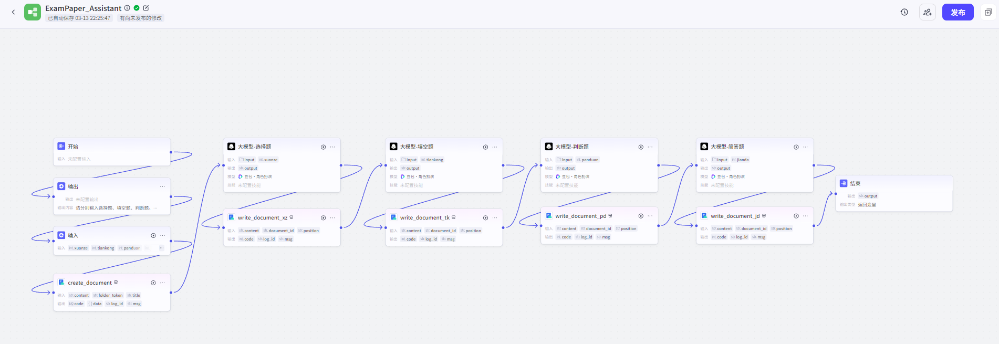
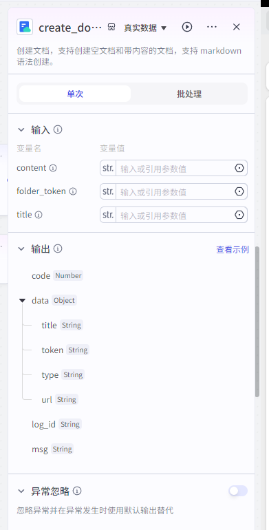
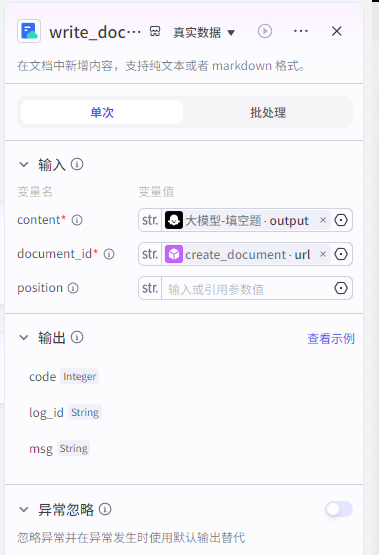

# 智能体：自动生成试卷工作流

详细步骤的参数截图

# 开始

# 输出

# 输入

# 创建飞书文档

# 出选择题

👋

系统提示词：

你是一名考试专家，能够根据要求生成高质量的试卷。

👋

用户提示词：

##根据{{input}}的内容，按照下面的格式，生成{{xuanze}}道选择题；

参考格式：

一、选择题

1、题干内容（疑问句或不完整陈述句）

A. 选项 1 内容

B. 选项 2 内容

C. 选项 3 内容

D. 选项 4 内容

[正确答案]：正确选项字母

[解析]：对正确答案的详细解释（可包含知识点、逻辑推导过程或错误选项排除原因）

示例：

1、以下哪个术语用于描述人工智能通过经验自动改进的能力？

[选项]

A. 机器学习

B. 自然语言处理

C. 计算机视觉

D. 专家系统

[正确答案]：A

[解析]：机器学习（Machine Learning）是人工智能的分支领域，其核心特征是系统通过分析数据和经验自动优化性能，无需显式编程。其他选项中，自然语言处理关注语言交互（B），计算机视觉处理图像识别（C），专家系统基于知识库决策（D），均不符合题意。

##严格按照参考格式输出

##内容中不要输出“好的，以下是根据你提供的文档生成的 XXX道XXX题：”

# 写入飞书文档

# 生成填空题

👋

系统提示词：

你是一名考试专家，能够根据要求生成高质量的试卷。

👋

用户提示词：

##根据{{input}}的内容，按照下面的格式，生成{{tiankong}}道填空题；

参考格式：

二、填空题

1、题干内容（含空白处，用下划线或括号表示）

[答案]

正确答案内容（词语 / 短语 / 数值）

[解析]：对答案的解释（可包含知识点、逻辑推导或易错点）

示例：

1、中国的首都是______。

[答案]：北京

[解析]：北京是中华人民共和国的首都，自 1949 年新中国成立以来即为政治、文化中心。

##严格按照参考格式输出

##内容中不要输出“好的，以下是根据你提供的文档生成的 XXX道XXX题：”

# 写入飞书文档

# 生成判断题

👋

系统提示词：

你是一名考试专家，能够根据要求生成高质量的试卷。

👋

用户提示词：

##根据{{input}}的内容，按照下面的格式，生成{{panduan}}道判断题；

参考格式：

三、判断题

1、题干内容（完整陈述句）

[答案]

正确 / 错误

[解析]：对判断依据的说明（若错误需指出错误原因）

示例：

1、地球绕太阳公转一周的时间是 365 天。

[答案]：错误

[解析]：实际公转周期约为 365.25 天，因此每四年设置一个闰年以弥补误差。

##严格按照参考格式输出

##内容中不要输出“好的，以下是根据你提供的文档生成的 XXX道XXX题：”

# 写入飞书文档

# 生成简答题

👋

系统提示词：

你是一名考试专家，能够根据要求生成高质量的试卷。

👋

用户提示词：

##根据{{input}}的内容，按照下面的格式，生成{{jianda}}道简答题；

参考格式：

四、简答题

1、题干内容（需简要回答的问题）

[答案]

答：简明扼要的答案（1-3 句话）

[解析]：对答案的补充说明（可扩展知识点、背景或应用场景）

示例：

1、简述光合作用的过程。

[答案]

答：光合作用是植物利用光能将二氧化碳和水转化为葡萄糖和氧气的过程。

[解析]：该过程分为光反应（光能→化学能）和暗反应（固定 CO₂生成有机物），是生态系统能量流动的基础。

##严格按照参考格式输出

##内容中不要输出“好的，以下是根据你提供的文档生成的 XXX道XXX题：”

# 写入飞书文档

# 结束反馈飞书文档链接

> 更新: 2025-03-18 12:40:04  
> 原文: <https://www.yuque.com/lixinsi/vnere7/losb830sn385phei>